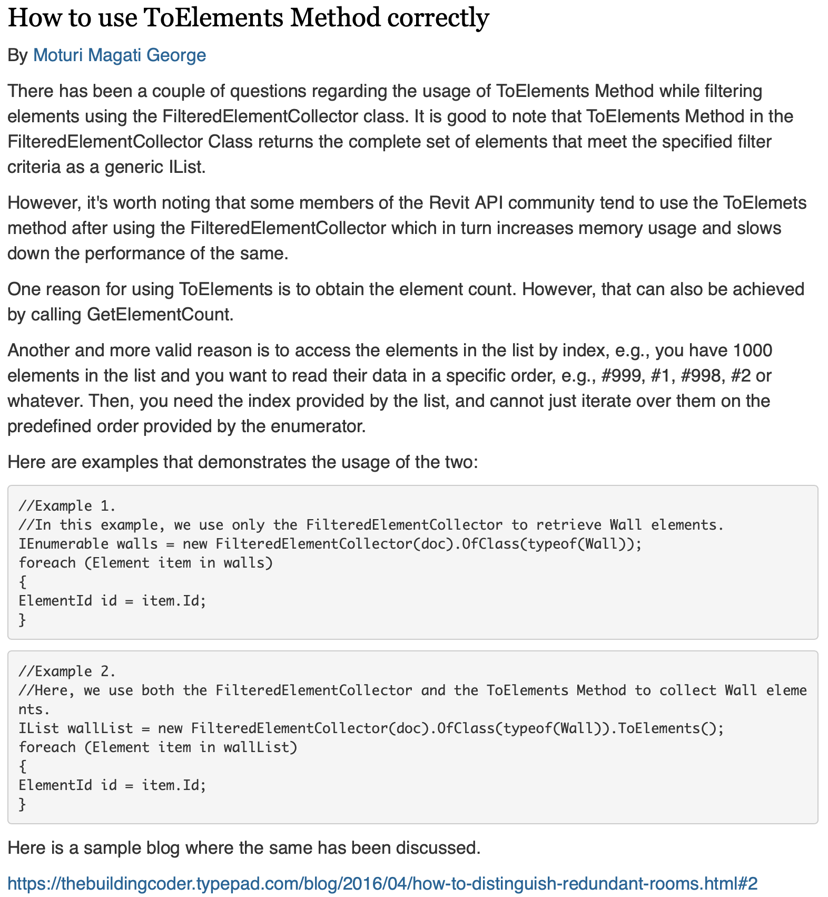

<head>
<meta http-equiv="Content-Type" content="text/html; charset=utf-8">
<link rel="stylesheet" type="text/css" href="bc.css">

</head>

<!---

- pernickety blogging

twitter:

Important, less important and absolutely pernickety recommendations on perfecting API-related blog posts for the @AutodeskAPS @AutodeskRevit #RevitAPI #BIM @DynamoBIM @AutodeskAPS https://autode.sk/pernickety

Some important, some less important and some absolutely pernickety recommendations on perfecting API-related blog posts...

&ndash; ...

linkedin:

Important, less important and absolutely pernickety recommendations on perfecting API-related blog posts for the #RevitAPI

https://autode.sk/pernickety

#BIM #DynamoBIM #AutodeskAPS #Revit #API #IFC #SDK #Autodesk #AEC #adsk

the [Revit API discussion forum](http://forums.autodesk.com/t5/revit-api-forum/bd-p/160) thread

-->

### Pernickety Blogging

I am still in hospital, convalescent with 9 fractured ribs and the right broken hip screwed back together again front and back.
The main screw is 7.3 mm x 180 mm.
They would have preferred to use 190 mm length but didn't have any available.
I have big bones.

My friend Madlee has a nice saying in her smartphone email footer:

- Alles isch gued; wenn's no nid gued isch denn isch es au no nid am End aacho!
&ndash;  [Alemannic](https://en.wikipedia.org/wiki/Alemannic_German) saying
&ndash; All is well; if it's not well, it's not over yet

That applies to my broken hip, basically to all of life, and also to every blog post.

My colleague George published his first Revit-API-related blog post last week,
[How to use ToElements Method correctly](https://adndevblog.typepad.com/aec/2023/10/how-to-use-toelements-method-correctly.html).

Congratulations on that, George, and many thanks for your work and contributions!
It is perfect in every way.
And yet, it also provides an opportunity for me to share one slightly crazy aspect of my personality: exaggerated perfectionism.

Before getting to the exaggerated perfectionism, let me point out
the more important [blogging tips and tricks](https://thebuildingcoder.typepad.com/blog/2014/07/wishlist-blogging-smartgeometry-dynamo-and-formit.html) that
I listed for earlier colleagues getting started with this.

I checked the post in advance before publication and gave it my OK.
However, to me, it makes a total difference checking it in advance or actually seeing it in print, in its final published version.
The effect of that difference on my perception is tremendous and astounding.
I use this effect myself writing my own blog posts, correcting, previewing, checking, fixing, twiddling and often making a huge number of minute corrections and improvements in the final stages of publication, just before hitting the ultimate publish button.

In this case, I noticed a typo to correct.
When I was about to tell George, I noticed another little detail to improve, and another.
I was astounded by the number and irrelevance of the improvement possibilities that struck my eye.

Except for the two typos, all my suggestions can be ignored.
And yet, re-reading them, I decided to share them both with George and Carol, who is also just starting to blog, and with you, dear reader, to ponder; please also feel perfectly free to ignore, refute, reject and ridicule:

The post currently looks like this:

 <!-- Pixel Height: 1,702 Pixel Width: 1,572 -->

<!--

Still, I made a note of one or two things to improve, e.g., the typo in one of the repetitions of the methos name.
Once I'd started, I fiound it hard to stop. One thing added to another, and I ended up with an absolutely shocking list of possible enhancement.
Since I want to praise George and not criticise in any way whatsoever, I pondered my options and ended up deciding that I am crazy and willing to share the fact including this list of suggestions for pernickety blogging:
-->

Here are my pernickety suggestions for enhancement:

- Title case in title, Capital U and C: How to Use ToElements Method Correctly
- Plural 'couple of questions': There *have* been a couple of questions
- Missing 'the'
- `ToElements` is code, so should be noted as such typographically, e.g., using a monospace font such as Courier
- In HTML, code is normally tagged using `pre` or `code`;
  in [Markdown](https://en.wikipedia.org/wiki/Markdown), you can use a backtick, i.e., <code>&grave;ToElements&grave;</code>
- The word 'method' is lowercase: usage of `ToElements` Method
- The word 'class' is lowercase: `FilteredElementCollector` class
- Typo, missing 'n': ToElemets
- Typo, 'examples' is plural: examples that demonstrate
- Code indentation: leading spaces inside the loops
- Code colourisation: C# syntax and keywords in different colours
- Avoid long lines in sample code; add line breaks to improve readability
- Readable link, not just the naked raw URL

My corrected version ends up looking like this:

#### How to Use ToElements Method Correctly

There have been a couple of questions regarding the usage of the `ToElements` method while filtering elements using the `FilteredElementCollector` class.
The `ToElements` method in the `FilteredElementCollector` class returns the complete set of elements that meet the specified filter criteria as a generic `IList`.

However, it's also worth noting that some members of the Revit API community tend to use the ToElemets method after using the FilteredElementCollector which in turn increases memory usage and slows down the performance of the same.

One reason for using ToElements is to obtain the element count. However, that can also be achieved by calling GetElementCount.

Another more valid reason is to access the elements in the list by index, e.g., you have 1000 elements in the list and you want to read their data in a specific order, e.g., #999, #1, #998, #2 or whatever. Then, you need the index provided by the list, and cannot just iterate over them on the predefined order provided by the enumerator.

Here are examples that demonstrate the usage of the two:

Example 1, using FilteredElementCollector alone to iterate over all Wall elements:

<pre class="prettyprint">
  IEnumerable walls
    = new FilteredElementCollector(doc)
      .OfClass(typeof(Wall));

  foreach (Element item in walls)
  {
    ElementId id = item.Id;
  }
</pre>

Example 2, using both FilteredElementCollector and ToElements to iterate over all Wall elements:

<pre class="prettyprint">
  IList wallList
    = new FilteredElementCollector(doc)
      .OfClass(typeof(Wall))
        .ToElements();

  foreach (Element item in wallList)
  {
    ElementId id = item.Id;
  }
</pre>

More details and links to further related discussions are provided in the analysis of
the [performance](https://thebuildingcoder.typepad.com/blog/2016/04/how-to-distinguish-redundant-rooms.html#2)
in [how to distinguish redundant rooms](https://thebuildingcoder.typepad.com/blog/2016/04/how-to-distinguish-redundant-rooms.html).

Here is a link to the markdown source code for this blog post,
[2013_pernickety.md](https://github.com/jeremytammik/tbc/blob/gh-pages/a/2013_pernickety.md),
where you can see the Markdown text I edited to produce this.

I have used a variety
of [tools for C&#35;, Python and VB code colourisation](https://thebuildingcoder.typepad.com/blog/about-the-author.html#5.36) in
the past.

In this post, I just employed the [Google JavaScript code prettifier `code-prettify`](https://github.com/googlearchive/code-prettify) instead.

However, this tool is no longer being maintained, so it is actually time to switch to yet another solution...

Another reason to replace it would be that it requires me to manually replace `<` and `>` signs with their HTML escape characters `&lt;` and `&gt;`.

So, to wrap up:

Please excuse me for being pernickety, George and Carol.
It seems to be my nature, so best accept it and let it be...
Does this extra work have any advantages?
Is it worth the effort?
Up to each and every person to decide for herself, I would say...

[Jonathon Broughton adds](https://www.linkedin.com/feed/update/urn:li:activity:7124104311315279872?commentUrn=urn%3Ali%3Acomment%3A%28activity%3A7124104311315279872%2C7124255520466554880%29&dashCommentUrn=urn%3Ali%3Afsd_comment%3A%287124255520466554880%2Curn%3Ali%3Aactivity%3A7124104311315279872%29):

The second paragraph of your corrected version contains a typo.
`ToElemets` should be `ToElements`.

It takes a persnickety practitioner to know one 😎

*Response:* Great.
I wonder should I leave it for other practitioners to pick up as well?
I think it would be appreciated...
I'll add your correction to the post and out myself (yet again) as a pernickety failure.

