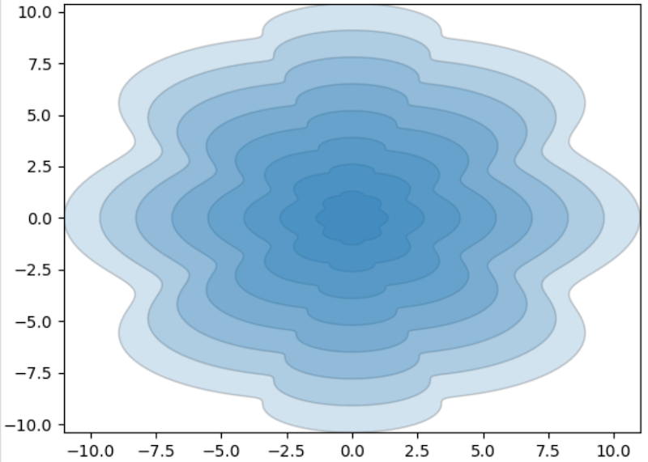

<head>
<meta http-equiv="Content-Type" content="text/html; charset=utf-8">
<link rel="stylesheet" type="text/css" href="bc.css">

</head>

<!---

- Revit Batch Processor project
Jan Christel <jan.r.christel@gmail.com>
I’ve been following your website for a number of years by know and would like to say thank you for your posts and insights. They are a really great help when getting started with the Revit API.
For the last 3 years I’ve been developing code using the Revit API in context of the Revit Batch Processor project which you are familiar with. The library has now grown to reasonable size and might be useful for others too. It focusses mainly on reporting / modifying element data and families. It show cases how to start a number of batch processor sessions concurrently using either .bat or power shell to process a large number of files.
A link to the GitHub repo: https://github.com/jchristel/SampleCodeRevitBatchProcessor and the pypi package: https://pypi.org/project/DuHast/

- https://neal.fun/internet-artifacts/

- shapely dynamo
Durmuş Cesur (Bayryam)
Hi Jeremy,  I read your article about "Shapely Geometry" in the last weeks, I was very happy to see it because in April I released a package called "Shapely" for Dynamo, so that users can easily work with "Shapely Geometries". I am a BIM Manager, the Shapely package plays an incredible role in our daily work and in the plug-in of the office. Here you can find the contents of the package. Github : https://github.com/DurmusCesur/Shapely.git Linkednl : https://www.linkedin.com/pulse/shapely-dynamo-durmu%25C5%259F-cesur-bayryam-/?trackingId=9aYP9eQpR8%2Be%2B7CCRqldtw%3D%3D  I care a lot about this package because apart from manipulating geometries, it is now integrated with Machine Learning. In the following days, I will release the "1.1.1.1" version of the package and users will now be able to use their scenarios with Machine Learning training models via Shapely, and as a Dynamo user for many years, I am very excited. I just published an article about the Shapely-Machine Learning relationship on linkednl. You can access it here: Linkednl : https://www.linkedin.com/pulse/machine-learning-dynamo-durmu%25C5%259F-cesur-bayryam--m9xoe/?trackingId=9aYP9eQpR8%2Be%2B7CCRqldtw%3D%3D  What are you thinking? I would really like to chat with you about this.  Best regards, Durmus
Jeremy Tammik (Sir)  4:04 AM
Dear Durmuş, thank you for letting me know. I will add a note of that to the blog as well, if you like. Cheers, Jeremy.
Durmuş Cesur(Bayryam)  6:02 AM
Hi Jeremy,  That would be great, thank you very much.  Best Durmus
Durmuş Cesur(Bayryam)  9:25 AM
Hi Jeremy,  Whatever you need for that, you can tell me. I can do it for you

twitter:

Powerful tools and solutions for RFA and RVT batch processing, 2D geometric analysis with Shapely for Dynamo, machine learning in Dynamo, retrieving Toposolid contour lines with the @AutodeskAPS @AutodeskRevit #RevitAPI #BIM @DynamoBIM @AutodeskAPS https://autode.sk/dynamoshapely

Powerful tools and solutions for batch processing, 2D geometric analysis and toposolids
&ndash; Revit batch processor sample code
&ndash; Shapely for Dynamo
&ndash; Retrieve Toposolid contour lines
&ndash; Internet artifacts...

linkedin:

Powerful tools and solutions for RFA and RVT batch processing, 2D geometric analysis with Shapely for Dynamo, machine learning in Dynamo, retrieving Toposolid contour lines with the #RevitAPI

https://autode.sk/dynamoshapely

- Revit batch processor sample code
- Shapely for Dynamo
- Retrieve Toposolid contour lines
- Internet artifacts...

#BIM #DynamoBIM #AutodeskAPS #Revit #API #IFC #SDK #Autodesk #AEC #adsk

the [Revit API discussion forum](http://forums.autodesk.com/t5/revit-api-forum/bd-p/160) thread

-->

### Contour Lines, Batch Processor and Dynamo Shapely

Powerful tools and solutions for batch processing, 2D geometric analysis and toposolids:

- [Revit batch processor sample code](#2)
- [Shapely for Dynamo](#3)
- [Machine learning in Dynamo](#3.1)
- [Retrieve Toposolid contour lines](#4)
- [Internet artifacts](#5)

#### Revit Batch Processor Sample Code

Several  years ago, we pointed out the
powerful [Revit Batch Processor (RBP)](https://thebuildingcoder.typepad.com/blog/2019/11/the-revit-batch-processor-rbp.html).

[Jan Christel](https://github.com/jchristel) has implemented and shared
a number of Python code samples making use of it in
his [code samples for the Revit Batch Processor](https://github.com/jchristel/SampleCodeRevitBatchProcessor),
explaining:

> I’ve been following your website for a number of years by know and would like to say thank you for your posts and insights.
They are a really great help when getting started with the Revit API.
For the last 3 years I’ve been developing code using the Revit API in context of the Revit Batch Processor project which you are familiar with.
The library has now grown to reasonable size and might be useful for others too. It focusses mainly on reporting and modifying element data and families.
It showcases how to start a number of batch processor sessions concurrently using either `.bat` or PowerShell to process a large number of files.
Here are links to the [SampleCodeRevitBatchProcessor GitHub repo](https://github.com/jchristel/SampleCodeRevitBatchProcessor) and
the [DuHast PyPI package](https://pypi.org/project/DuHast/).

Many thanks to Jan for sharing these.

#### Shapely for Dynamo

We recently discussed
the [Shapely Python 2D geometry library](https://thebuildingcoder.typepad.com/blog/2023/09/element-diff-compare-shapely-and-rdbe.html#4) and
how it can be used
to [find and fix a hole](https://thebuildingcoder.typepad.com/blog/2023/09/element-diff-compare-shapely-and-rdbe.html#4.1).

Durmuş Cesur (Bayryam) of [BPA Architecture](https://bpa.archi/) announced an associated Dynamo package to wrap it and provide access to its functionality:

- [Github DurmusCesur/Shapely](https://github.com/DurmusCesur/Shapely)

Durmuş adds:

> I read your article about Shapely Geometry in the last weeks. I was very happy to see it, because in April I released a package called Shapely for Dynamo, so that users can easily work with Shapely Geometries.
I am a BIM Manager, the Shapely package plays an incredible role in our daily work and in the plug-in of the office.
I care a lot about this package because apart from manipulating geometries, it is now integrated with Machine Learning. In the following days, I will release the "1.1.1.1" version of the package and users will be able to use their scenarios with Machine Learning training models via Shapely, and as a Dynamo user for many years, I am very excited.
I just published an article about
the [Shapely Machine Learning relationship in Dynamo](https://www.linkedin.com/pulse/machine-learning-dynamo-durmu%C5%9F-cesur-bayryam--m9xoe) on LinkedIn.

Shapely is a great Python library that helps us analyse and manipulate geometries.
We think it is important to include this library in Dynamo.
Shapely uses its own geometry language.
Therefore, transformations must be made between each other without losing data. In this package you will find a Dynamo version of Shapely geometry.
I made a tutorial for you on the Github page; you can use it to get a feel for the polygons and let me know if you have any questions or corrections.
The package is completely open source.
I am one of those people who think open source is important!

Here are some examples:

- ShapelytoDynamo &ndash; It converts a dynamo geometry into a "Shapely" geometry without any data loss.
  There is also a transformation of the shapely geometry obtained in a similar way to the dynamo geometry.
- DynamotoShapely &ndash; It converts a shapely geometry into a dynamo geometry without any data loss.
- ShapelyBuffer &ndash; Using a dynamo geometry (polygon, polycurve), it creates a new geometry by looking at the user’s offset distance in the same line of the units that make up the geometry. The user can decide the sharpness of the edges of the created geometry.
- ShapelyDifference &ndash; It allows us to analyse the relationship between 2 geometries. It subtracts one geometry from the other and returns a new closed geometry containing the remaining geometry.
- Shapelyİntersection &ndash; Allows us to analyse the relationship between 2 geometries. It extracts 2 geometries from each other and returns a new closed geometry. The result is always a polygon, polycurve and a list of points that make up the geometry.
- ShapelyUnion &ndash; Allows us to analyse the relationship between 2 geometries. It combines 2 geometries and returns a closed new geometry. The result is always a polygon, polycurve and a list of points that make up the geometry.
- ShapelySnap &ndash; It allows us to analyse the relationship between 2 geometries. It returns a new closed geometry that adapts to the contours of the geometry approaching the distance specified by the user. The result is always a polygon, polycurve and a list of points that make up that geometry.
- ShapelyConvexHull &ndash; Dynamo uses the points to create the outermost polygon that the points will form. The result is always a polygon, polycurve and a list of points that form that geometry.
- ShapelyRotateSkew &ndash; Using a 2D dynamo geometry (polygon), it rotates the geometry in the ground plane in the X and Y axes as if it were a 3D geometry and creates a new geometry.
- ShapelyOffset &ndash; Using a dynamo geometry (polygon, polycurve), it creates a new geometry by looking at the user’s offset distance in the same line of the units that make up the geometry. The generated geometry is always meaningful and stable. The user can decide the sharpness of the edges of the generated geometry.
- ShapelySetPrecision &ndash; Using a dynamo geometry (polygon, polycurve), it allows the user to specify the points that make up the geometry and returns a new geometry. This geometry differs from the parent geometry because the position of the vertices that make up the geometry has changed.
- ShapelyTouchesDistance &ndash; Using a dynamo geometry (polygon, polycurve) allows us to analyse geometries within a distance specified by the user. For this purpose, it finds the points at right angles of all geometries around it and analyses the distance between the main geometry and returns "True" and "False".

Many thanks to Durmuş for implementing and sharing this powerful tool!

#### Machine Learning in Dynamo

Durmuş adds: A few days ago I wrote an article about Machine Learning on DynamoBlog.
Today a copy of this article was published somewhere at NASA.
This is incredible news.
I wanted to share it with you.
You can find it here:
[Machine Learning in Dynamo](https://dynamobim.org/machine-learning-in-dynamo/):

> With advancing technology, we see the widespread use of Machine Learning in almost all industries.
But can a vector-based numerical design program work with ML?
The answer to this question is a definite “Yes, it can.”
The “Shapely geometry” package not only allows users to manipulate 2D geometries but also integrates seamlessly with ML.
In other words, the “Shapely” package comes equipped with ML capabilities, making it more functional and significantly expanding its processing capacity.

#### Retrieve Toposolid Contour Lines

Ning Zhou raised the question
on [how to get contour lines from toposolid](https://forums.autodesk.com/t5/revit-api-forum/how-to-get-contour-lines-from-toposolid/m-p/12315476) and
subsequently discovered, tested and shared the solution.

The gist of it is that the contour lines are view dependent, so you need to be specific about which view to use to retrieve the toposolid geometry.

My colleague Carol Gitonga picked up this thread to publish her first Revit API blog post,
also titled [how to get contour lines from Toposolid](https://adndevblog.typepad.com/aec/2023/11/how-to-get-contour-lines-from-toposolid.html).

Congratulations, Ning, on solving the issue!

Congratulations, Carol, on a very nice blogging debut!

Thank you both for your work and sharing the results!

#### Internet Artifacts

Finally, let's close with an entertaining look back in time through a collection
of [internet artifacts](https://neal.fun/internet-artifacts/) by Neal.fun.

