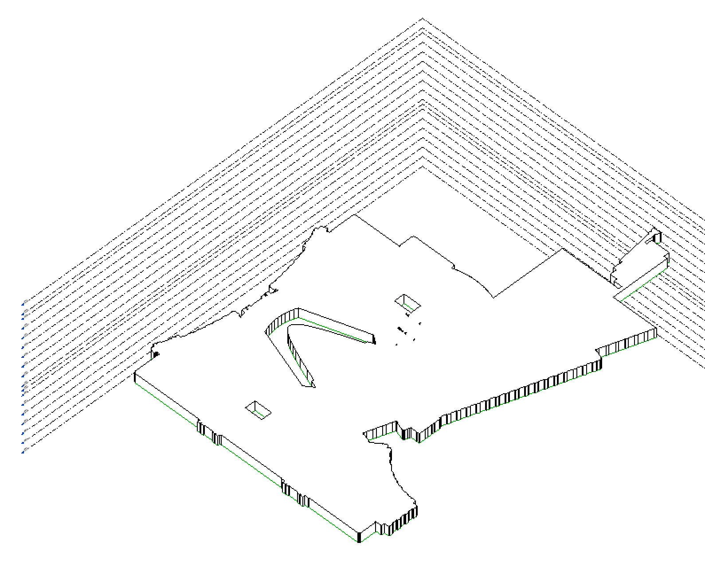

<head>
<meta http-equiv="Content-Type" content="text/html; charset=utf-8">
<link rel="stylesheet" type="text/css" href="bc.css">

</head>

<!---

- Boost Your BIM by Harry Mattison
  Journal File Magic & Exporting Groups to File (the grand finale)
  https://boostyourbim.wordpress.com/2023/11/03/journal-file-magic-exporting-groups-to-file-the-grand-finale/
  Journal File Magic & Exporting Groups to File (part 2)
  https://boostyourbim.wordpress.com/2023/11/02/journal-file-magic-exporting-groups-to-file-part-2/
  Journal File Magic & Exporting Groups to File (part 1)
  https://boostyourbim.wordpress.com/2023/11/01/journal-file-magic-exporting-groups-to-file-part-1/

- replacing [Revit 2024 'Other' Parameter Group] or BuiltInParameterGroup.INVALID
  Revit 2024 'Other' Parameter Group
  https://forums.autodesk.com/t5/revit-api-forum/revit-2024-other-parameter-group/td-p/12086226

twitter:

Journal file magic, closed contiguous room boundary loop, challenges identifying adjacent rooms and ForgeTypeId for 'Other' parameter group with the @AutodeskAPS @AutodeskRevit #RevitAPI #BIM @DynamoBIM @AutodeskAPS https://autode.sk/roomboundary

Taking a look at journal files, room boundaries, adjacent rooms, a ForgeTypeId question and where AI might lead
&ndash; Harry's journal file magic
&ndash; Closed contiguous room boundary loop
&ndash; Challenges identifying adjacent rooms
&ndash; ForgeTypeId for 'Other' parameter group
&ndash; AI may obsolete all apps...

linkedin:

Journal file magic, closed contiguous room boundary loop, challenges identifying adjacent rooms and ForgeTypeId for 'Other' parameter group with the #RevitAPI

https://autode.sk/roomboundary

- Harry's journal file magic
- Closed contiguous room boundary loop
- Challenges identifying adjacent rooms
- ForgeTypeId for 'Other' parameter group
- AI may obsolete all apps...

#BIM #DynamoBIM #AutodeskAPS #Revit #API #IFC #SDK #Autodesk #AEC #adsk

the [Revit API discussion forum](http://forums.autodesk.com/t5/revit-api-forum/bd-p/160) thread

-->

### Journal Magic, Adjacent Rooms and Room Boundary

Taking a look at journal files, room boundaries, adjacent rooms, a ForgeTypeId question and one view of where AI might lead:

- [Harry's journal file magic](#2)
- [Closed contiguous room boundary loop](#3)
- [Challenges identifying adjacent rooms](#4)
- [ForgeTypeId for 'Other' parameter group](#5)
- [AI may obsolete all apps](#6)

#### Harry's Journal File Magic

Boost Your BIM by Harry Mattison published a nice series
on [journal file magic and exporting groups to file](https://boostyourbim.wordpress.com/2023/11/03/journal-file-magic-exporting-groups-to-file-the-grand-finale/).
To be precise, it consists of three instalments:

- [Journal File Magic &amp; Exporting Groups to File (part 1)](https://boostyourbim.wordpress.com/2023/11/01/journal-file-magic-exporting-groups-to-file-part-1/)
- [Journal File Magic &amp; Exporting Groups to File (part 2)](https://boostyourbim.wordpress.com/2023/11/02/journal-file-magic-exporting-groups-to-file-part-2/)
- [Journal File Magic &amp; Exporting Groups to File (grand finale)](https://boostyourbim.wordpress.com/2023/11/03/journal-file-magic-exporting-groups-to-file-the-grand-finale/)

Many thanks to Harry for implementing and sharing this useful and educational solution.

#### Closed Contiguous Room Boundary Loop

Loren Routh of [GSA](https://www.gsa.gov) presents a quick and easy method to reliably retrieve a closed contiguous boundary loop for a room using `GetRoomBoundaryAsCurveLoopArray` from the `ExporterIFC` module in his answer
to [creating a generic model from area boundaries](https://forums.autodesk.com/t5/revit-api-forum/creating-a-generic-model-from-area-boundaries/m-p/12371317#M75201):

> This just in:
I tried the `GetRoomBoundaryAsCurveLoopArray` method, and it totally worked!
You need to import the `ExporterIFC` module, etc.
This method eliminated a chunk of code, no sorting or extracting the curves.
It let me create an extrusion (manually) with no errors at all!
As you can see by the pic below, this was not a rectangle.
Definitely has my vote to be included in the regular Revit API.
Now to make it work with Generic Models...

<pre class="prettyprint">
  import clr
  clr.AddReferenceToFileAndPath(r'C:\Program Files\Autodesk\Revit 2023\AddIns\IFCExporterUI\Autodesk.IFC.Export.UI.dll')
  clr.AddReference("RevitAPIIFC")
  from Autodesk.Revit.DB.IFC import ExporterIFC
  from Autodesk.Revit.DB.IFC import ExporterIFCUtils

  opt = DB.SpatialElementBoundaryOptions()

  curve_loop = ExporterIFCUtils.GetRoomBoundaryAsCurveLoopArray(selected_area, opt, True)

  with DB.Transaction(doc, "Create Model Lines") as tx:
    tx.Start()

    sketch_plane = DB.SketchPlane.Create(doc,selected_area.LevelId)

    for loop in curve_loop:
      for line in loop:
        crv = doc_create.NewModelCurve(line, sketch_plane)

    tx.Commit()
</pre>

 <!-- Pixel Height: 1,278 Pixel Width: 1,590 -->

Many thanks to Loren for sharing this valuable hint.

#### Challenges Identifying Adjacent Rooms

Ilia Krachkovskii [shared](https://www.linkedin.com/posts/ilia-krachkovskii_im-currently-working-on-a-so-called-spatial-activity-7125803558834167808-NXwt?utm_source=share&utm_medium=member_desktop) some
thoughts and challenges identifying adjacent rooms

> I'm currently working on a so-called "Spatial Breakdown System" that identifies location and generates corresponding location code for each element in Revit model. It will allow architects at Marco Casamonti & Partners / Archea Associati to create very flexible schedules and will help with data management inside the projects.

> I have been working with Revit API for quite some time, and just recently started to understand all the complaints one can find on countless threads: so far I have 15 different methods for calculating the room (or the nearest room) for various types of elements. Here are some of them:

> - non-bounding walls: place points on wall curve every X meters using Evaluate() method, check room on each point using GetRoomAtPoint() method.
- bounding walls: same, but for each point I calculate the normal to the curve (using ComputeDerivatives() method) and check the points on a specified distance from wall curve.
- roofs: usually they cover lots of rooms, so it's just excessive.
- furniture: LocationPoint and LocationCurve don't always work, so the backup plan is just checking the centerpoint of a BoundingBox.
- door and windows: fairly easy, since they have a built-in FromRoom and ToRoom property.
- floors and ceilings: along with walls, one of the most tricky, but more precise method that features cross-referencing. Find all rooms that contain BoundingBox of a floor, get LocationPoint of each room, and shoot a checking ray from each point using ReferenceIntersector up or down, depending on the element class. If there is an intersection - boom, there's a room that contains your floor or ceiling. Pretty fascinating approach that deserves its own article.
- stair runs and landings are harder to collect, since they act as a part of the Stair. Getting location can be done with GetRoomAtPoint() method using a BoundingBox centerpoint, however, it may be more reliable to calculate run curve midpoint using GetStairsPath().
- model in place is the most atrocious piece to work with. They don't have built-in level parameters or anything else that easily identifies them in space. They have only geometry, so the easiest approach, again, would be simply checking the bounding box points - which has many accuracy issues.
- curtain wall panels and mullions: one could get the location from the host wall, but they usually cover several rooms. My approach: take BoundingBox, enlarge X and Y dimensions by K meters and check for intersection with any rooms in the project.

> Code sample below is used to calculate all the rooms that are formed by (or those that are very near to) a particular wall:

 <!-- Pixel Height: 1,530 Pixel Width: 1,656 -->

#### ForgeTypeId for 'Other' Parameter Group

Kevin Fielding shared a quick, easy and effective solution for replacing the `Other` parameter group or the `BuiltInParameterGroup` `INVALID` in his thread
on [Revit 2024 'Other' parameter group](https://forums.autodesk.com/t5/revit-api-forum/revit-2024-other-parameter-group/td-p/12086226):

With the changeover to `ForgeTypeId` and `GroupTypeId` in Revit 2024 instead of the `BuiltInParameterGroup` enumerations, I just wanted to share how to define the 'Other' group for parameters, as it doesn't appear to be documented.

Whereas previously you would use

<pre class="prettyprint">
  BuiltInParameterGroup.INVALID
</pre>

In 2024 and beyond you need to use

<pre class="prettyprint">
  new ForgeTypeId(string.Empty)
</pre>

Other groups can be found using the `GroupTypeId` class, like `GroupTypeId.Data`.

Hope this helps others searching for this.

In fact, the same question came up again in the question
on [Revit 2024 GroupTypeId missing ParameterGroup Other (Invalid)](https://forums.autodesk.com/t5/revit-api-forum/revit-2024-grouptypeid-missing-parametergroup-other-invalid/m-p/12288651/highlight/false#M74502).

Thanks, Kevin, for clarifying this!

#### AI May Obsolete All Apps

Bill Gates presents an interesting vision of the future of personal computing
in [The future of agents &ndash; AI is about to completely change how you use computers &ndash; and upend the software industry](https://www.gatesnotes.com/AI-agents).

