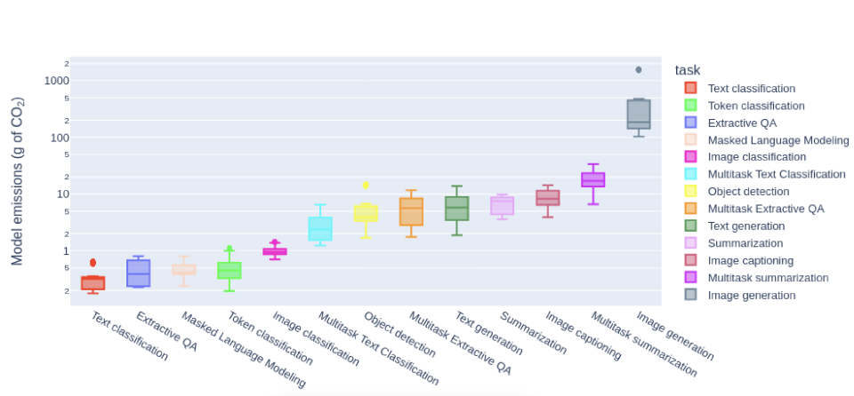
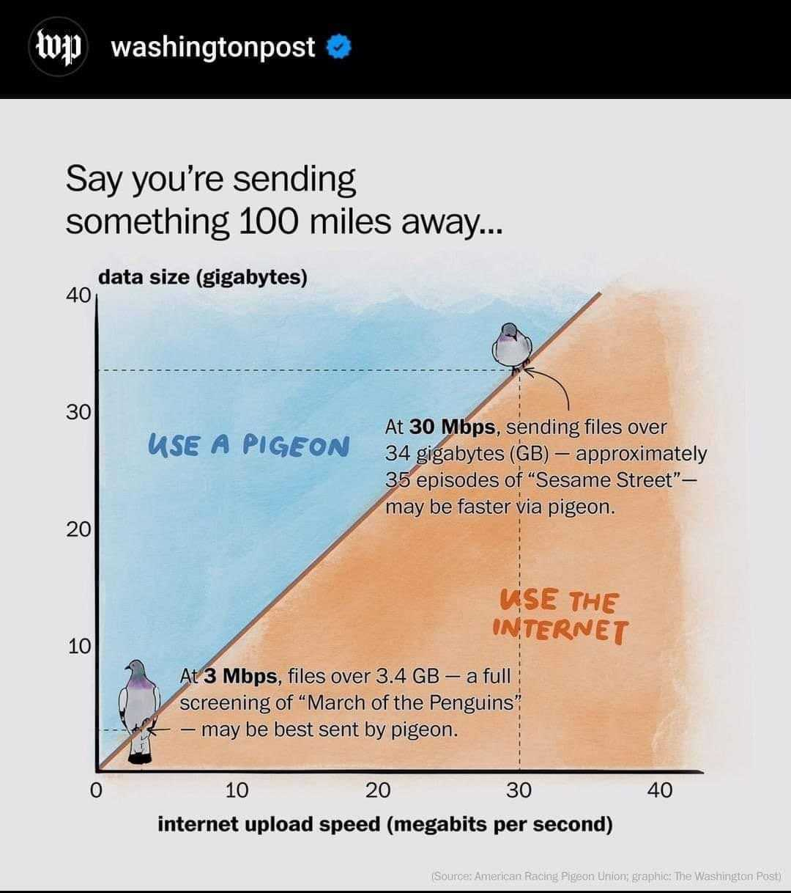

<head>
<meta http-equiv="Content-Type" content="text/html; charset=utf-8">
<link rel="stylesheet" type="text/css" href="bc.css">
<!--  -->
<!-- https://highlightjs.org/#usage -->
<link rel="stylesheet" href="https://cdnjs.cloudflare.com/ajax/libs/highlight.js/11.9.0/styles/default.min.css">

</head>

<!---

- https://github.com/jeremytammik/RevitLookup/releases/tag/2024.0.10
  General
  Introducing a brand new feature: Restore window size! Now, effortlessly you will open RevitLookup with your preferred window dimensions with a simple click
  Improvements
  Add MEPSystem.GetSectionByIndex support by @SergeyNefyodov in #189
  Add MEPSystem.GetSectionByNumber support by @SergeyNefyodov in #189
  Add MEPSection.GetElementIds support by @SergeyNefyodov in #192
  Add MEPSection.GetCoefficient support by @SergeyNefyodov in #192
  Add MEPSection.GetPressureDrop support by @SergeyNefyodov in #192
  Add MEPSection.GetSegmentLength support by @SergeyNefyodov in #192
  Add MEPSection.IsMain support
  Add show System.Object option (named Root hierarchy) by @SergeyNefyodov in #193
  Add generic types support for the help button
  Minor tooltip changes
  Bugs
  Fixed search that worked in the main thread

- Calling Revit command from chromium browser
  https://forums.autodesk.com/t5/revit-api-forum/calling-revit-command-from-chromium-browser/td-p/12413281

- determine element location
  how can the coordinates for a revit fabricationpart be obtained with the revit api
  https://stackoverflow.com/questions/77556660/how-can-the-coordinates-for-a-revit-fabricationpart-be-obtained-with-the-revit-a

- Create a 3D view showing only #Revit wall structural layers
  https://boostyourbim.wordpress.com/2023/12/04/create-a-3d-view-showing-only-revit-wall-structural-layers/
  - Create new 3D isometric view
  - Set parts visibility PartsVisibility.ShowPartsOnly
  - Create parts from all walls
  - For each part, retrieve its built-in parameter DPART_LAYER_INDEX
  - Convert from string to wall compound structure layer index
  - Hide part if its compound structure layer function differs from MaterialFunctionAssignment.Structure

- Dynamo: Curved Sections By Line (Part 1)
  https://youtu.be/Fic5BD-s3A8
  Anna Baranova
  More articles of mine
  https://www.linkedin.com/in/baranovaanna/
  private message
  https://www.linkedin.com/feed/?msgControlName=view_message_button&msgConversationId=2-NDQ2ZDYwYmYtYzY2Yy00MjJlLTgyNTUtM2E4YzA0NTk5MzJhXzAxMg%3D%3D&msgOverlay=true&trk=false

- Researchers quantify the carbon footprint of generating AI images
  Creating a photograph using artificial intelligence is like charging your phone.
  https://www.engadget.com/researchers-quantify-the-carbon-footprint-of-generating-ai-images-173538174.html
  img/ai_image_carbon_footprint.png

- send_data_by_pigeon.jpeg
  https://autodesk.slack.com/archives/C02NW42JP/p1701262599629959
  George Langham
  send_data_by_pigeon.jpeg
  Jean-Philippe Brault
  There is a RFC for that https://datatracker.ietf.org/doc/html/rfc1149
  IETF DatatrackerIETF Datatracker
  RFC 1149: Standard for the transmission of IP datagrams on avian carriers
  This memo describes an experimental method for the encapsulation of IP datagrams in avian carriers. This specification is primarily useful in Metropolitan Area Networks. This is an experimental, not recommended standard.
  1 Apr 1990
  Feisal Ahmad
  Never underestimate the bandwidth of a station wagon full of tapes hurtling down the highway.
  Wikipedia Sneakernet
  Sneakernet, also called sneaker net, is an informal term for the transfer of electronic information by physically moving media such as magnetic tape, floppy disks, optical discs, USB flash drives or external hard drives between computers, rather than transmitting it over a computer network. The term, a tongue-in-cheek play on net(work) as in Internet or Ethernet, refers to walking in sneakers as the transport mechanism. Alternative terms may be floppy net, train net, or pigeon net.
  https://en.wikipedia.org/wiki/Sneakernet
  Ryan Robinson
  I am reminded of this thread from 2012 - https://superuser.com/questions/419070/transatlantic-ping-faster-than-sending-a-pixel-to-the-screen
  (John Carmack rolls in to explain himself as the top answer)
  Super UserSuper User
  Transatlantic ping faster than sending a pixel to the screen?
  John Carmack tweeted,
  I can send an IP packet to Europe faster than I can send a pixel to the screen. How f’d up is that?
  And if this weren’t John Carmack, I’d file it under “the interwebs being

- hope for the future
  Drone Tour of Permaculture Farm
  https://youtu.be/TPxJtKob7Js
  five-minute
  > In this video I narrate a drone tour of our entire 250 acre farm showcasing some of the swale,
  dam, dugout, aquaculture, livestock food forest, cover cropping and other permaculture
  systems we have on our regenerative farm.
  https://www.coenfarm.ca
  > We are literally eating ourselves & our planet to death. Our mission is to provide nutrient-dense food, feed, & permaculture education to regenerate the planet & its people.

twitter:

Round-trip interaction between your own browser instance and @AutodeskRevit #RevitAPI external command, BIM element location, creating a structural 3D view, and a curved section view in @DynamoBIM @AutodeskAPS #BIM https://autode.sk/browserroundtrip

RevitLookup update, roundtrip interaction between your own browser instance and external command, BIM element location, structural 3D view, curved section view
&ndash; RevitLookup 2024.0.10
&ndash; Calling Revit command from Chromium browser
&ndash; Chromium browser Js round trip callback
&ndash; Element location
&ndash; Create a structural-only 3D view
&ndash; Creating a curved section in Dynamo
&ndash; Carbon footprint of AI
&ndash; Sending data by pigeon
&ndash; Permaculture farm
&ndash; The Valley of Code...

linkedin:

Round-trip interaction between your own browser instance and #RevitAPI external command, BIM element location, creating a structural 3D view, and a curved section view in #DynamoBIM

https://autode.sk/browserroundtrip

- RevitLookup 2024.0.10
- Calling Revit command from Chromium browser
- Chromium browser Js round trip callback
- Element location
- Create a structural-only 3D view
- Creating a curved section in Dynamo
- Carbon footprint of AI
- Sending data by pigeon
- Permaculture farm
- The Valley of Code...

#BIM #DynamoBIM #AutodeskAPS #Revit #API #IFC #SDK #Autodesk #AEC #adsk

the [Revit API discussion forum](http://forums.autodesk.com/t5/revit-api-forum/bd-p/160) thread

-->

### 3D View, Curved Section and Browser Round-Trip

Yet another RevitLookup update, full roundtrip interaction between your own instance of the built-in Revit CefSharp Chromium browser and your Revit API add-in external command, different ways to locate a BIM element, pure structural 3D view and curved section view creation, and more:

- [RevitLookup 2024.0.10](#2)
- [Calling Revit command from Chromium browser](#3)
- [Chromium browser Js round trip callback](#4)
- [Determine element location](#5)
- [Create a structural-only 3D view](#6)
- [Creating a curved section in Dynamo](#7)
- [Carbon footprint of AI image generation](#8)
- [Sending data by pigeon](#9)
- [Permaculture farm regenerates natural habitat](#10)
- [The Valley of Code](#11)

#### RevitLookup 2024.0.10

[RevitLookup 2024.0.10](https://github.com/jeremytammik/RevitLookup/releases/tag/2024.0.10) is now available with the following enhancements:

- Introducing a brand new feature: Restore window size!
  Now, effortlessly you will open RevitLookup with your preferred window dimensions with a simple click
- Add `MEPSystem` and `MEPSection` support for GetSectionByIndex, GetSectionByNumber, GetElementIds,
  GetCoefficient, GetPressureDrop,  GetSegmentLength and IsMain
- Show System.Object option (named Root hierarchy)
- Add generic type support for the help button
- Minor tooltip changes
- Fixed search that worked in the main thread

#### Calling Revit Command from Chromium Browser

Last week, Andrej Licanin of [Bimexperts](https://bimexperts.com/sr/home) shared
a nice solution demonstrating [how to use the Revit built-in CefSharp browser in WPF](https://thebuildingcoder.typepad.com/blog/2023/11/camera-target-and-toposolid-subdivision-material.html#2).

This week he expanded on that in his contribution
on [calling Revit command from Chromium browser](https://forums.autodesk.com/t5/revit-api-forum/calling-revit-command-from-chromium-browser/td-p/12413281):

This is another guide on Chromium browser using CefSharp, a continuation
of the [simple WPF with a Chromium browser guide](https://forums.autodesk.com/t5/revit-api-forum/simple-wpf-with-a-chromium-browser-guide/td-p/12396552).
Hope someone finds it useful.

Basically, what I wanted was for a button in the browser (on a webpage) to trigger a command in Revit.
This works by "binding" a JavaScript method to a C# object and its method.
In the Javascript we `await` for the object and call its function.

So, let's make a dummy object for binding and a method in it.
In order to call a Revit method it will need a reference to an external event handler and its event:

<pre><code>
   public class BoundObject
   {
     public int Add(int a, int b)
     {
       ExtApp.handler.a = a;
       ExtApp.handler.b = b;
       ExtApp.testEvent.Raise();

       return a+b;
     }
   }
</code></pre>

The event and its handler are saved in the external app as `static` for ease of access:

<pre><code>
  internal class ExtApp : IExternalApplication
  {
    public static IExternalApplication MyApp;
    public static ChromiumWebBrowser browser;
    public static ExternalEvent testEvent;
    public static MyEvent handler;
    public Result OnShutdown(UIControlledApplication application)
    {
      // Cef.Shutdown();
      return Result.Succeeded;
    }

    public Result OnStartup(UIControlledApplication application)
    {
      MyApp = this;
      //code for making a button

      handler = new MyEvent();
      testEvent= ExternalEvent.Create(handler);

      return Result.Succeeded;
    }
  }
</code></pre>

In the WPF control, the browser is embedded like this:

<pre><code>
  &lt;Window x:Class="RevitTestProject.TestWindow"
    xmlns="http://schemas.microsoft.com/winfx/2006/xaml/presentation"
    xmlns:x="http://schemas.microsoft.com/winfx/2006/xaml"
    xmlns:mc="http://schemas.openxmlformats.org/markup-compatibility/2006"
    xmlns:d="http://schemas.microsoft.com/expression/blend/2008"
    xmlns:local="clr-namespace:RevitTestProject"
    xmlns:cef="clr-namespace:CefSharp.Wpf;assembly=CefSharp.Wpf"
    mc:Ignorable="d"
    Width="1000" Height="500"&gt;
    &lt;Grid Background="PapayaWhip"&gt;
      &lt;cef:ChromiumWebBrowser Name="ChromiumBrowser" Address="http://www.google.com" Width="900" Height="450"  /&gt;
    &lt;/Grid&gt;
  &lt;/Window&gt;
</code></pre>

Here is the code behind the window:

<pre><code>
    public TestWindow()
    {
      InitializeComponent();
      ChromiumBrowser.Address = "https://www.google.com";
      ChromiumBrowser.Address = "C:\\Users\\XXX\\Desktop\\index.html";
      BoundObject bo = new BoundObject();
      ChromiumBrowser.JavascriptObjectRepository.Register("boundAsync", bo, true, BindingOptions.DefaultBinder);
    }

    public void Dispose()
    {
      this.Dispose();
    }
</code></pre>

So, to use it, make an `index.html` and submit the path to it in the browser address.

The Test webpage look like this:

<pre><code>
&lt;html&gt;
&lt;head&gt;
  &lt;title&gt;Bridge Test&lt;/title&gt;
  &lt;!-- &lt;script src="script.js"&gt;&lt;/script&gt; --&gt;
  &lt;script type="text/javascript"&gt;
    async function callCSharpAction() {
      await CefSharp.BindObjectAsync("boundAsync");
      boundAsync.add(16, 2);
    }
  &lt;/script&gt;
&lt;/head&gt;
&lt;body&gt;
  &lt;button id="action1" onclick="callCSharpAction()"&gt;Action 1&lt;/button&gt;
  &lt;button id="action2" onclick="alert('Button is working')"&gt;Action 2&lt;/button&gt;
  &lt;button id="action3"&gt;Action 3&lt;/button&gt;
&lt;/body&gt;
&lt;/html&gt;
</code></pre>

The handler code:

<pre><code>
  internal class MyEvent : IExternalEventHandler
  {
    public int a;
    public int b;
    public void Execute(UIApplication app)
    {
      TaskDialog.Show( "yoyoy",
        "data is " + a.ToString()
        + " and " + b.ToString() + ".");
    }

    public string GetName()
    {
      return "YOYOOY";
    }
  }
</code></pre>

#### Chromium Browser Js Round Trip Callback

Next step: round-trip callback:
To make a callback from C# function to the browser, you just need an instance of the browser, and a function in the javascript code that will be called.
Here is an edited index.html with such a function to call:

<pre><code>
&lt;html&gt;
&lt;head&gt;
  &lt;title&gt;Bridge Test&lt;/title&gt;
  &lt;!-- &lt;script src="script.js"&gt;&lt;/script&gt; --&gt;
  &lt;script type="text/javascript"&gt;
    async function callCSharpAction() {
      await CefSharp.BindObjectAsync("boundAsync");
      boundAsync.add(16, 2);
    }

    function showAlert(arg1) {
      // Your JavaScript logic here
      alert("Function called with arguments: " + arg1);
      return;
    }
  &lt;/script&gt;
&lt;/head&gt;
&lt;body&gt;
  &lt;button id="action1" onclick="callCSharpAction()"&gt;Action 1&lt;/button&gt;
  &lt;button id="action2" onclick="alert('Button is working')"&gt;Action 2&lt;/button&gt;
  &lt;button id="action3"&gt;Action 3&lt;/button&gt;
&lt;/body&gt;
&lt;/html&gt;
</code></pre>

In our bound class, we save a instance to the browser so we can use it on command:

<pre><code>
  public class BoundObject
  {
    public int aS;
    public int bS;
    internal ChromiumWebBrowser browser;

    public void CallCSharpMethod()
    {
      MessageBox.Show("C# method called!");
      // Add more code here as needed
    }
    public int Add(int a, int b)
    {
      ExtApp.handler.a = a;
      ExtApp.handler.b = b;
      ExtApp.testEvent.Raise();

      return a+b;
    }

    public int SendSomeDataFromLocal(int a)
    {
      browser.ExecuteScriptAsync("showAlert("+a.ToString()+")");
      return a;
    }
  }
</code></pre>

Pass it in when creating the browser in the window codebehind:

<pre><code>
  public TestWindow()
  {
    InitializeComponent();
    ChromiumBrowser.Address = "https://www.google.com";
    ChromiumBrowser.Address = "C:\\Users\\XXX\\Desktop\\index.html";
    BoundObject bo = new BoundObject();
    //ExtApp.boundObj = bo;
    bo.browser = ChromiumBrowser;
    ChromiumBrowser.JavascriptObjectRepository.Register(
      "boundAsync", bo, true, BindingOptions.DefaultBinder);
  }
</code></pre>

Finally, now, you can call it from Revit:

<pre><code>
  public Result Execute(
    ExternalCommandData commandData,
    ref string message,
    ElementSet elements)
  {
    ExtApp.boundObj.SendSomeDataFromLocal(999);
    return Result.Succeeded;
  }
</code></pre>

This concludes a round trip from the browser and back.
I hope anyone reading this finds it useful.

#### Determine Element Location

We put together a nice little overview on various methods to determine the location of a BIM element discussing
[how can the coordinates for a Revit fabrication part be obtained with the Revit API](https://stackoverflow.com/questions/77556660/how-can-the-coordinates-for-a-revit-fabricationpart-be-obtained-with-the-revit-a)?

**Question:** I need to obtain the coordinates for Revit MEP FabricationParts.
All of the elements I get have a `Location` property, but not all of them have either a `LocationPoint` or a `LocationCurve`.
More specifically, I am only able to get `XYZ` values through the `LocationCurve` for `Pipe` elements.
Elements such as Threadolet, Elbow, Weld and Fishmouth don't have either a `LocationPoint` or a `LocationCurve`.

**Answer:** Three options that can be used on almost all BIM elements are:

- Use the `Location` property
- Retrieve the element [`Geometry` property](https://www.revitapidocs.com/2024/d8a55a5b-2a69-d5ab-3e1f-6cf1ee43c8ec.htm), e.g., calculate the centroid of all the vertices
- Use the element [`BoundingBox` property](https://www.revitapidocs.com/2024/def2f9f2-b23a-bcea-43a3-e6de41b014c8.htm), e.g., calculate its midpoint

However, for these types of `FabricationParts` specifically,
[egeer](https://stackoverflow.com/users/15534202/egeer)
and [bootsch](https://stackoverflow.com/users/21999391/bootsch) suggest
using the element's connector locations instead:

For OLets and ThreadOLets, you can use the connector that connects to the main pipe as its insertion point, since that is technically where the element was inserted:

<pre><code>
    Connector insertionPointConnector = OLet.ConnectorManager
        .Connectors
        .OfType&lt;Connector&gt;()
        .FirstOrDefault(x =&gt; x.ConnectorType == ConnectorType.Curve);

    XYZ insertionPoint = insertionPointConnector?.Origin;
</code></pre>

Since their connectors are atypical in that they do not connect to another connector, but instead a curve, you need to get the one that is `ConnectorType.Curve`.

For welds, elbows and other inline elements, you can similarly use the connectors and get their origins.
If you want the center of the element, you can use vector math to calculate that using the connector's direction and location.
The direction that the connector points is the `BasisZ` property of the Connector's `CoordinateSystem`.

<pre><code>
    XYZ connectorDirection = insertionPointConnector?.CoordinateSystem.BasisZ;
</code></pre>

The solution I end up with is a bit different from the answer given by egeer above:
I ended up getting a Connector for each element (the ones without a `LocationCurve` or `LocationPoint`).
Here's the code in VB:

<pre><code>
    Dim insertionPointConnector As Connector = CType(e, FabricationPart).ConnectorManager.Connectors.OfType(Of Connector).FirstOrDefault()
    Dim elementOrigin as XYZ = Connector.insertionPointConnector.Origin
</code></pre>

`e` is of type Element.

Many thanks to egeer and bootsch for jumping in with these good solutions!

#### Create a Structural-Only 3D View

Harry Mattison continues his AU solution spree presenting a nice code sample demonstrating how
to [create a 3D view showing only Revit wall structural layers](https://boostyourbim.wordpress.com/2023/12/04/create-a-3d-view-showing-only-revit-wall-structural-layers/)
which is discussed in further depth in
the [Revit API discussion forum](http://forums.autodesk.com/t5/revit-api-forum/bd-p/160) thread
on how to [create new View3D that just displays wall layers of "Structure" function](https://forums.autodesk.com/t5/revit-api-forum/create-new-view3d-that-just-displays-wall-layers-of-quot/td-p/12344156).
Harry's sample code performs the following steps:

- Create new 3D isometric view
- Set view parts visibility `PartsVisibility.ShowPartsOnly`
- Create parts from all walls
- For each part, retrieve its built-in parameter `DPART_LAYER_INDEX`
- Convert from string to wall compound structure layer index
- Hide part if its compound structure layer function differs from `MaterialFunctionAssignment.Structure`

Many thanks to Harry for addressing this need!

#### Creating a Curved Section in Dynamo

I have heard several requests for a curved section view, e.g., Alex Vila in 2019:
[Create curved sections!](https://forums.autodesk.com/t5/revit-api-forum/create-curved-sections/m-p/8931972)

Finally, the cavalry comes to the rescue in the shape
of [Anna Baranova](https://www.linkedin.com/in/baranovaanna/), presenting a 22-minute video tutorial
on [Dynamo: Curved Sections By Line (Part 1)](https://youtu.be/Fic5BD-s3A8):

<iframe width="480" height="270" src="https://www.youtube.com/embed/Fic5BD-s3A8?si=bjREzyZh7uCyrZoZ" title="YouTube video player" frameborder="0" allow="accelerometer; autoplay; clipboard-write; encrypted-media; gyroscope; picture-in-picture; web-share" allowfullscreen></iframe>

Many thanks to Anna for this nice piece of work!

#### Carbon Footprint of AI Image Generation

Researchers quantify the carbon footprint of generating AI images:
[creating a photograph using artificial intelligence is like charging your phone](https://www.engadget.com/researchers-quantify-the-carbon-footprint-of-generating-ai-images-173538174.html):

#### Sending Data by Pigeon

Talking about carbon footprint and the cost and efficiency of digital data transmission, there is obviously a point at which transmission of large data can be speeded up by putting it on a storage device and moving that around rather physically than squeezing it through the limited bandwidth of the Internet:

 <!-- Pixel Height: 1,218 Pixel Width: 1,080 -->

- There is even an RFC 1149 for this concept,
the [Standard for the Transmission of IP Datagrams on Avian Carriers](https://datatracker.ietf.org/doc/html/rfc1149).
> This memo describes an experimental method for the encapsulation of IP datagrams in avian carriers.
This specification is primarily useful in Metropolitan Area Networks.
This is an experimental, not recommended standard.
- Never underestimate the bandwidth of a station wagon full of tapes hurtling down the highway,
cf. [Wikipedia on Sneakernet](https://en.wikipedia.org/wiki/Sneakernet).
- Reminds of this thread from 2012
about [transatlantic ping faster than sending a pixel to the screen](https://superuser.com/questions/419070/transatlantic-ping-faster-than-sending-a-pixel-to-the-screen)...

#### Permaculture Farm Regenerates Natural Habitat

Hope for the future from a five-minute video [drone tour of permaculture farm](https://youtu.be/TPxJtKob7Js):

<iframe width="480" height="270" src="https://www.youtube.com/embed/TPxJtKob7Js?si=QoImAfogIIMdU5Sp" title="YouTube video player" frameborder="0" allow="accelerometer; autoplay; clipboard-write; encrypted-media; gyroscope; picture-in-picture; web-share" allowfullscreen></iframe>

> In this video I narrate a drone tour of our entire 250-acre farm showcasing some of the swale,
dam, dugout, aquaculture, livestock food forest, cover cropping and other permaculture
systems we have on our regenerative farm.

Presented by the [Coen Farm](https://www.coenfarm.ca), who say:

> We are literally eating ourselves and our planet to death.
Our mission is to provide nutrient-dense food, feed, and permaculture education to regenerate the planet and its people.

Personally, I was very touched watching and listening to it.

#### The Valley of Code

Quick return to digital before I end for today.
If you have friends or others wanting to quickly learn to code for the web, here is a great site to get them started:

- [The Valley of Code](https://thevalleyofcode.com/)

> Welcome to The Valley of Code.
Your journey in Web Development starts here.
In the fundamentals section you'll learn the basic building blocks of the Internet, the Web and how its fundamental protocol (HTTP) works.

Toc:

- Fundamentals
- HTML and CSS
- Tools
- Deployment
- JavaScript
- TypeScript
- More CSS
- More JavaScript
- DOM and Events
- Networking
- Server Runtimes
- HTTP Servers
- Forms
- Databases
- UI libraries
- Frameworks

