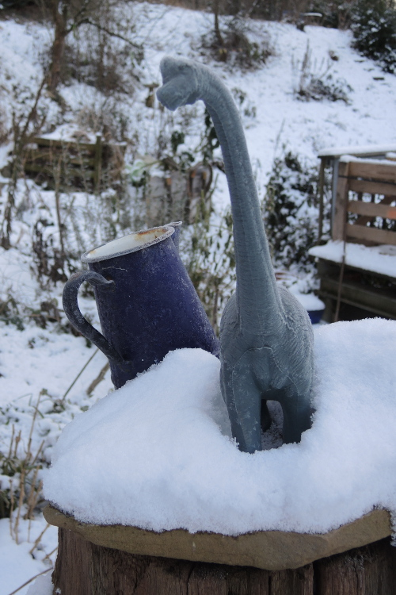

<head>
<meta http-equiv="Content-Type" content="text/html; charset=utf-8">
<link rel="stylesheet" type="text/css" href="bc.css">
<!--  -->
<!-- https://highlightjs.org/#usage -->
<link rel="stylesheet" href="https://cdnjs.cloudflare.com/ajax/libs/highlight.js/11.9.0/styles/default.min.css">

</head>

<!---

- Autodesk Desktop API Updates: .NET Core Migration Webinar
  https://aps.autodesk.com/blog/autodesk-desktop-api-updates-net-core-migration-webinar

- Adding Parameters with a specific GUID
  https://forums.autodesk.com/t5/revit-api-forum/adding-parameters-with-a-specific-guid/m-p/12455887#M76040

- parameter service:
  How to enable the Autodesk Parameter Service
  https://goto.archi/blog/post/how-to-enable-the-autodesk-parameter-service
  How to use the Autodesk Parameter Service in Revit
  https://goto.archi/blog/post/how-to-use-the-autodesk-parameter-service-in-revit
  How to migrate Revit parameters into the Parameter Service
  https://goto.archi/blog/post/how-to-migrate-revit-parameters-into-the-parameter-service

twitter:

To end the year, a reminder of the upcoming shift to .NET Core and some notes on @AutodeskRevit parameters: adding a parameter with a specific GUID in the #RevitAPI and getting started with the parameter service... Happy holidays! @AutodeskAPS #BIM @DynamoBIM https://autode.sk/dotnetcorewebinar

Let's end this year with some notes on parameters and a reminder of the upcoming shift to .NET Core
&ndash; .NET Core migration webinar
&ndash; Adding a parameter with a specific GUID
&ndash; Getting started with the parameter service
&ndash; Happy holidays! ...

linkedin:

To end the year, a reminder of the upcoming shift to .NET Core and some notes on #Revit parameters: adding a parameter with a specific GUID in the #RevitAPI and getting started with the parameter service:

https://autode.sk/dotnetcorewebinar

- .NET Core migration webinar
- Adding a parameter with a specific GUID
- Getting started with the parameter service
- Happy holidays! ...

#BIM #DynamoBIM #AutodeskAPS #Revit #API #IFC #SDK #Autodesk #AEC #adsk

the [Revit API discussion forum](http://forums.autodesk.com/t5/revit-api-forum/bd-p/160) thread

-->

### Parameters and .NET Core Webinar

Let's end this year with some notes on parameters and a reminder of the upcoming shift to .NET Core:

- [.NET Core migration webinar](#2)
- [Adding a parameter with a specific GUID](#3)
- [Getting started with the parameter service](#4)
- [Happy holidays!](#5)

#### .NET Core Migration Webinar

Before we end for the year, let's recapitulate the announcement of
the [Autodesk Desktop API Updates: .NET Core Migration Webinar](https://aps.autodesk.com/blog/autodesk-desktop-api-updates-net-core-migration-webinar) end of next month:

Do you have an application running on one of the Autodesk desktop products or on Design Automation, such as AutoCAD/Revit/Inventor?
If so, please join the upcoming webinar where we will discuss next major releases of hero desktop product APIs moving to .NET Core.

- Title: Autodesk Desktop API Updates: .NET Core Migration
- Date: Tuesday, January 30, 2024
- Time: 8AM PST / 11AM EST / 5PM CET
- Duration: approx. 40 min

Tentative Agenda:

- General overview of .NET Core
- Product specifics
    - AutoCAD + verticals
    - Revit
    - Inventor
    - Others
- Q&amp;A

To join this webinar, you will need to agree to a non-disclosure agreement NDA.
To do so, please sign up through one of feedback portal projects for the respective products or the ADN extranet:

- [AutoCAD feedback portal](https://feedback.autodesk.com/project/forum/thread.html?cap=e7f9d0d1828b48b9b0fa1eb608dc91b5&forid=%7Baf68f836-722f-4e0a-a1cd-dcaee47b96d2%7D&topid=%7B518782FF-39F1-4349-9CCF-E7DDE8809FD0%7D&j=518782ff39f143499ccfe7dde8809fd0)
- [Revit Preview feedback portal](https://feedback.autodesk.com/project/forum/thread.html?cap=e7f9d0d1828b48b9b0fa1eb608dc91b5&forid=%7Baf68f836-722f-4e0a-a1cd-dcaee47b96d2%7D&topid=%7B518782FF-39F1-4349-9CCF-E7DDE8809FD0%7D&j=518782ff39f143499ccfe7dde8809fd0)
- [Inventor feedback portal](https://feedback.autodesk.com/project/forum/thread.html?cap=fb14413735ee42c99624e3793b19a0b2&forid=%7bdeb2224c-a845-44a8-a857-a54f58c97618%7d&topid=%7bB1A00199-A0E0-44B7-83E2-1DD98CCC649B%7d)
- [ADN extranet](https://adn.autodesk.io/index.php?r=custom_pages%2Fview&id=312)

If you haven't already, please join the feedback projects now, and start testing your application against the preview/beta releases.

Reminder: ADN members can join the feedback portal through the ADN extranet by selecting SOFTWARE &gt;&gt; "Beta Portal."
This will take you to the [Autodesk feedback portal](https://feedback.autodesk.com), Autodesk Developer Network Beta Program.
Go to "Product Beta Access" and join the AutoCAD, Revit, or Inventor feedback project there.

#### Adding a Parameter with a Specific GUID

Adrian Crisan of [Studio A International, LLC](http://www.studio-a-int.com) shared a very nice solution in both Python and C#
for [adding parameters with a specific GUID](https://forums.autodesk.com/t5/revit-api-forum/adding-parameters-with-a-specific-guid/m-p/12455887):

**Question:** I have a requirement to add parameters and bind them to most if not all elements in a model (and one parameter to be bound to a type instead; the blog was most helpful with that), but I'm running into a few issues.

Currently, my code creates a shared parameter file if not found, creates a group, and then adds the parameters to it. The problem comes as follows:

- Sometimes the parameters are "duplicated" because I can't seem to specify a GUID for the parameter; I can only search for it by name - and the shared parameter file was not sent to me for testing, only the Revit File. Revit GUIDs seem to be type 4, which is frustrating because those are fully random and that means I can't predict them at all, which means I can't really test for a specific GUID.
- If the file is already created (because I was using another Revit document) the parameters "exist" in the document but aren't bound to anything, which frustrates the dupe checks because the parameter exists by name; however an insert/reinsert rebinding will work.
- I can determine via code right now if I have to write the file from scratch, but I haven't yet run into the situation where the customer has a parameter file and I just need to add to it (which I'm sure happens all the time).
- If the file does exist, I would rather be able to set a specific GUID instead of clobbering the user's file with our own (that seems the only way to set a particular GUID is to write a shared parameter file with the GUID and then tell Revit to use that file).
- The goal here is that the user can click one button and our parameters are set up to facilitate two-way data binding between our system and the Revit Model.

Am I missing something in the API that allows me to specify a GUID? What are the best practices around this? Does the Revit API have some way to modify the shared parameter file or only the binding functions?

I found a related issue
on [editing SharedParameterFile/deleting shared parameter entry](https://stackoverflow.com/questions/77652588/editing-sharedparameterfile-deleting-shared-parameter-entry);
however, it does not answer nor is it exactly my problem.

**Answer:** Is this what you are looking for?

- [ExternalDefinitionCreationOptions.GUID Property](https://www.revitapidocs.com/2024/c86d0033-8200-15ee-070c-d0a606ed3b2a.htm) &rarr; C# <code>public Guid GUID { get; set; }</code>

> The GUID to use for this parameter definition.
If not explicitly set, a random GUID is used.

We use this day in / day out for our new shared parameters.

You can use either the Visual Studio Tools `Create GUID` or the Python code below to generate the GUID:

<pre><code>
import uuid
yourGuid = str(uuid.uuid4())
# Your GUID will be like 8-4-4-4-12
yourGuid = "xxxxxxxx-xxxx-xxxx-xxxx-xxxxxxxxxxxx"
</code></pre>

We do not recommend, but of course if you want to change the GUID as you want, make the changes.

Keep in mind the algorithms to create global unique id are developed to prevent as much as possible duplicates in large dynamic systems.

Then you can use the following Python code to create a new Shared Parameter definition with your own GUID:

<pre><code>
app = DocumentManager.Instance.CurrentUIApplication.Application
yourSharedParamDefFile = r"yourDefinitionFile.txt"
app.SharedParametersFilename = yourSharedParamDefFile
sharedParametersFileName = app.OpenSharedParameterFile().Filename
paraGroup = app.OpenSharedParameterFile().Groups.get_Item("YourParameterGroup") # verify in your Definition File the name of the Group under which you want to create the Shared Parameter
newParaOptions = ExternalDefinitionCreationOptions("yourSharedParaName", ParameterType.Text) # Text, Integer, Number, Length, Area, Volume, etc. - look at the API for Parameter Type enumerations
newParaOptions.UserModifiable = False # Users cannot modify it, only Revit API
newParaOptions.Visible = False # Users cannot see it in the properties, but the parameter appears in schedules, etc.
newParaOptions.GUID = Guid(yourGuid) # set the Guid
createYourNewParameter = paraGroup.Definitions.Create(newParaOptions)
</code></pre>

Here is the agnostic method in C#.

<pre><code>
public void createSharedParameterDefinition()
{
  // Code provided courtesy of:
  // Studio A International, LLC
  // http://www.studio-a-int.com
  // The below code creates a new Shared Parameter in an existing Definition File
  // If a Shared Parameter with the same name is already in the Definition File,
  // the execution code will end with an error
  // You can generate your own GUID to assign it to the Shared Parameter
  // Use either Visual Studio Tools -&gt; Create GUID
  // Or Python code to generate the GUID
  // import uuid
  // yourGuid = str(uuid.uuid4())
  // or other programming tools of your choice
  System.Guid yourGuid = new Guid("2778bb70-c715-4a9d-bdc1-76add223f228");
  // Shared Parameters Definition file
  string yourSharedParamDefFile = @"YourDrive\YourSharedParametersDefinitionFile.txt";
  // Shared Parameter name
  string yourSharedParaName = "NewSharedParaNameUnitTesting";
  // Initialize a StringBuilder to collect execution results/errors.
  StringBuilder sbCreateSharedParameterDefinition = new StringBuilder();
  try
  {
    Autodesk.Revit.DB.Document activeDoc = CreateSharedParameterDefinitionCommand.doc;
    Autodesk.Revit.ApplicationServices.Application app = activeDoc.Application;
    app.SharedParametersFilename = yourSharedParamDefFile;
    // Open the Shared Parameters File
    Autodesk.Revit.DB.DefinitionFile sharedParametersFile = app.OpenSharedParameterFile();
    string sharedParametersFileName = app.OpenSharedParameterFile().Filename;
    // Select under which Definition Group the new Shared Parameter will be placed
    DefinitionGroup paraGroup = app.OpenSharedParameterFile().Groups.get_Item("YOURGROUP");
    // Create new Options for the Shared Parameter
    // older APIs uses below method
    // Autodesk.Revit.DB.ExternalDefinitionCreationOptions newParaOptions = new ExternalDefinitionCreationOptions(yourSharedParaName, ParameterType.Text); // # Text, Integer, Number, Length, Area, Volume, etc. - look at the API for Parameter Type enumerations
    // newer APIs uses below method
    Autodesk.Revit.DB.ExternalDefinitionCreationOptions newParaOptions = new ExternalDefinitionCreationOptions(yourSharedParaName, SpecTypeId.String.Text);
    newParaOptions.UserModifiable = false; // Users cannot modify it, only Revit API can modify this parameter
    newParaOptions.Visible = false; // Users cannot see it in the properties, but the parameter appears in schedules, etc.
    newParaOptions.GUID = yourGuid; // set the above GUID to this new Shared Parameter
    paraGroup.Definitions.Create(newParaOptions);
  }
  catch (Exception ex)
  {
    sbCreateSharedParameterDefinition.AppendLine(ex.Message.ToString());
  }
  if (sbCreateSharedParameterDefinition.Length &lt; 1)
  {
    System.Windows.Forms.MessageBox.Show("Shared Parameter Definition:" +
    "\r\n" +
    "\r\n" + " " + yourSharedParaName +
    "\r\n" +
    "\r\n" + "was created.", "Task complete");
  }
  else if (sbCreateSharedParameterDefinition.Length &gt; 0)
  {
    System.Windows.Forms.MessageBox.Show("Shared Parameter Definition was not created because:" +
    "\r\n" +
    "\r\n" + " " + sbCreateSharedParameterDefinition.ToString(), "Error");
  }
}
</code></pre>

Thank you very much, Adrian, for kindly implementing and sharing this solution!

#### Getting Started with the Parameter Service

[Archi](https://goto.archi/) shared a nice series of articles describing step by step how get started with the parameter service:

> ... a much anticipated cloud service from Autodesk that spreads across the entire ecosystem,
not just Revit, and comes to improve parameter management and collaboration for teams.
For BIM managers with access to the Autodesk Construction Cloud, you can now say goodbye
to the old shared parameter txt files, and instead use a centralized cloud service that
allows bulk operation, tagging and search capabilities.

- [How to enable the Autodesk Parameter Service](https://goto.archi/blog/post/how-to-enable-the-autodesk-parameter-service)
- [How to use the Autodesk Parameter Service in Revit](https://goto.archi/blog/post/how-to-use-the-autodesk-parameter-service-in-revit)
- [How to migrate Revit parameters into the Parameter Service](https://goto.archi/blog/post/how-to-migrate-revit-parameters-into-the-parameter-service)

Many thanks to Archi for putting together this comprehensive tutorial!

#### Happy Holidays!

I wish you a peaceful end of the year,
calm [twelve nights](https://en.wikipedia.org/wiki/Twelfth_Night_(holiday)) and
restful holidays!

