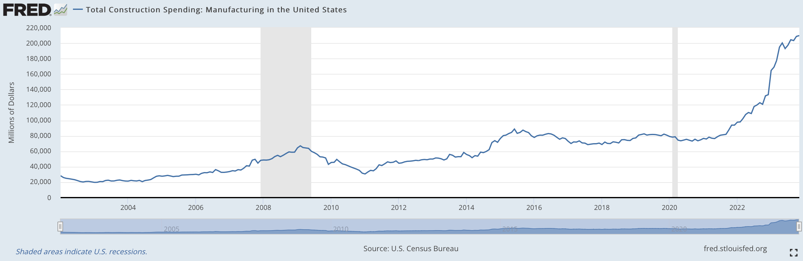

<head>
<meta http-equiv="Content-Type" content="text/html; charset=utf-8">
<link rel="stylesheet" type="text/css" href="bc.css">
<!--  -->
<!-- https://highlightjs.org/#usage -->
<link rel="stylesheet" href="https://cdnjs.cloudflare.com/ajax/libs/highlight.js/11.9.0/styles/default.min.css">

</head>

<!---

- AU 2023 classes -- https://www.autodesk.com/autodesk-university/search?fields.year=2023

- Dependency Injection for Revit API
  https://forums.autodesk.com/t5/revit-api-forum/dependency-injection-for-revit-api/td-p/12467760

- model checker api:
  https://forums.autodesk.com/t5/revit-api-forum/setting-up-iprebuiltoptionsservice-options-for-checkset-in-ait/td-p/12455815

- Maestro AI for Revit scripting
  https://maestro.bltsmrt.com/
  https://www.linkedin.com/posts/christopher-wiesen-b9693b67_maestroforrevit-aectech-automation-activity-7143312975838232576-gLEv?utm_source=share&utm_medium=member_desktop
  Christopher Wiesen, President, BLT SMRT LLC, Las Vegas, Nevada, United States

- Total Construction Spending: Manufacturing in the United States (TLMFGCONS)
  https://fred.stlouisfed.org/series/TLMFGCONS#0

- most interesting philosophical discussion i have seen for a long tim:
  Dennett vs Sapolsky on free will: A clash over different claims?
  https://philosophy.stackexchange.com/questions/106926/dennett-vs-sapolsky-on-free-will-a-clash-over-different-claims?utm_source=iterable&utm_medium=email&utm_campaign=the-overflow-newsletter
  comparing a boulder crashing down a mountain and a skier who skis down the mountain

twitter:

on @AutodeskRevit  the #RevitAPI  Happy  @AutodeskAPS #BIM @DynamoBIM

&ndash;  ...

linkedin:

#BIM #DynamoBIM #AutodeskAPS #Revit #API #IFC #SDK #Autodesk #AEC #adsk

the [Revit API discussion forum](http://forums.autodesk.com/t5/revit-api-forum/bd-p/160) thread

-->

### Model Checker API, Fuzz and DI

Happy New Year!

Lets begin gently with the following notes on topics that caught my eye and interest:

- [AU 2023 classes](#2)
- [Dependency injection for Revit API](#3)
- [Model checker API docs](#4)
- [ChatGPT and Maestro AI for Revit scripting](#5)
- [Construction spending rising in the US](#6)
- [Free Will](#7)

#### AU 2023 Classes

Did you miss an interesting class at AU?
Check out the entire collection
of [Autodesk University 2023 classes online](https://www.autodesk.com/autodesk-university/search?fields.year=2023).

#### Dependency Injection for Revit API

Between Christmas and New Year,
Luiz Henrique [@ricaun](https://ricaun.com/) Cassettari implemented, documented and shared a complete solution
for [dependency injection for Revit API](https://forums.autodesk.com/t5/revit-api-forum/dependency-injection-for-revit-api/td-p/12467760),
saying:

> I created a library to help create a container for Dependency Injection, designed to work with Revit API.
It is open-source and has a package in the Nuget:

> - [github.com/ricaun-io/ricaun.Revit.DI](https://github.com/ricaun-io/ricaun.Revit.DI)
- [www.nuget.org/packages/ricaun.Revit.DI](https://www.nuget.org/packages/ricaun.Revit.DI)

> I created this [22-minute video](https://youtu.be/Q_greabHlUQ) on how to add the package and a simple example with an `ICommand` implementation:

> - [github.com/ricaun-io/RevitAddin.DI.Example](https://github.com/ricaun-io/RevitAddin.DI.Example)

<iframe width="480" height="270" src="https://www.youtube.com/embed/Q_greabHlUQ?si=7pyYCcqMuyy3XL-J" title="YouTube video player" frameborder="0" allow="accelerometer; autoplay; clipboard-write; encrypted-media; gyroscope; picture-in-picture; web-share" allowfullscreen></iframe>

> That's it for the year 2023; Happy New Year with best regards!

Hapy New Year to you too, <i>ricaun</i>, and to the entire community from me as well!

#### Model Checker API Docs

<i>Shrey_shahE5SN4</i> very kindly points out
the [Model Checker API documentation](https://help.autodesk.com/view/AIT4RVT/ENU/?guid=InteroperabilityToolsForRevit_040mcxr_0404mcxr_html) in
his question
on [setting up `IPreBuiltOptionsService` options for CheckSet in AIT](https://forums.autodesk.com/t5/revit-api-forum/setting-up-iprebuiltoptionsservice-options-for-checkset-in-ait/td-p/12455815):

> I am... building an add-in button.
When clicked, it will execute the Model Checker from Autodesk Interoperability Tools.
Following the provided guidelines, I am progressing through the necessary steps:

> [Model Checker API](https://help.autodesk.com/view/AIT4RVT/ENU/?guid=InteroperabilityToolsForRevit_040mcxr_0404mcxr_html)

Thank you for that hint, Shrey_shahE5SN4.

#### ChatGPT and Maestro AI for Revit Scripting

AI programming assistants are boosting developer effectivity in many areas.
Here is one dedicated to Revit customisation:
[Maestro AI for Revit scripting](https://maestro.bltsmrt.com/).
Looking forward to hearing how it shapes out.

Eric Boehlke of [Truevis](https://truevis.com) has been attempting to focus LLMs to work better with programming Revit nd pointed out:

> My latest attempt: https://chat.openai.com/g/g-7gcy5wueV-bim-coding-coach and
its repository https://github.com/truevis/BIM-Coding-Coach.
I haven't tested it with C&#35; yet, but it is working well with Python and DesignScript.

#### Construction Spending Rising in the US

Good news for the AEC industry: an impressive positive jump
in [total construction spending: manufacturing in the United States (TLMFGCONS)](https://fred.stlouisfed.org/series/TLMFGCONS#0):

 <!-- Pixel Height: 848 Pixel Width: 2,598 -->

#### Free Will

As a scientifically and technically minded person, I often find philosophical pondering rather vague.
I was therefore very pleased to read the interesting and very precise analytical philosophical discussion
on [Dennett vs Sapolsky on free will: A clash over different claims?](https://philosophy.stackexchange.com/questions/106926/dennett-vs-sapolsky-on-free-will-a-clash-over-different-claims?utm_source=iterable&utm_medium=email&utm_campaign=the-overflow-newsletter),
comparing the volition and predetermination of a boulder crashing down a mountain and a skier who skis down the mountain, including the possible influence of quantum mechanical effects.

