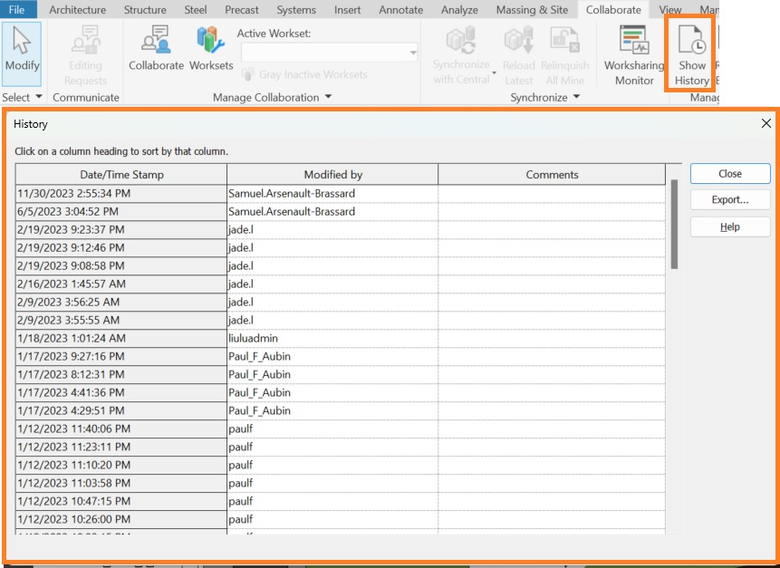
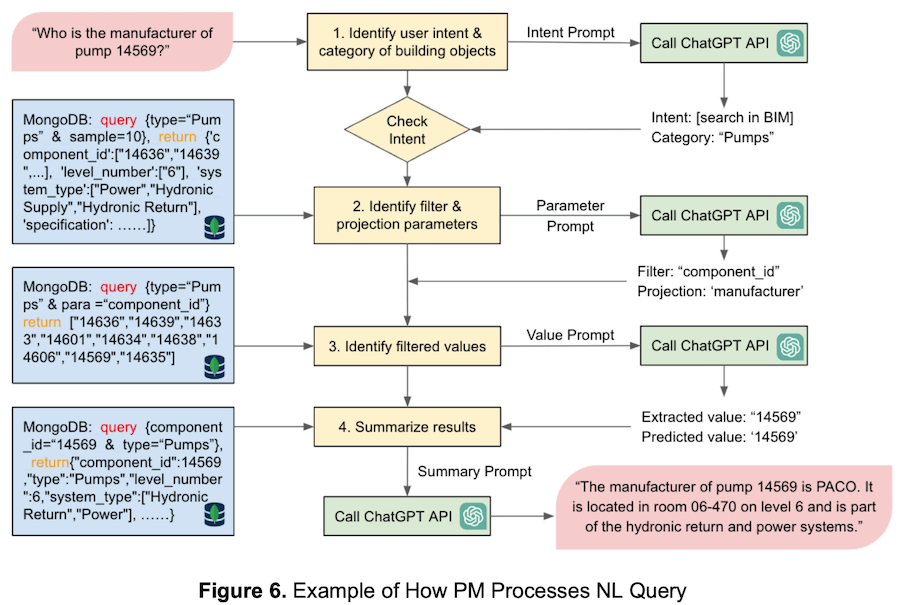

<head>
<meta http-equiv="Content-Type" content="text/html; charset=utf-8">
<link rel="stylesheet" type="text/css" href="bc.css">
<!--  -->
<!-- https://highlightjs.org/#usage -->
<link rel="stylesheet" href="https://cdnjs.cloudflare.com/ajax/libs/highlight.js/11.9.0/styles/default.min.css">

</head>

<!---

- logging:
  21768403 [Assistance Required with Revit Journal Files]
  https://forums.autodesk.com/t5/revit-api-forum/api-access-to-user-history-quot-show-history-quot/m-p/12472116
  AdWindows -- https://forums.autodesk.com/t5/revit-api-forum/intercepting-commands-executed-by-keyboard-shortcuts/td-p/12457597
  https://forums.autodesk.com/t5/revit-api-forum/the-syntax-and-structure-of-the-journal-file-in-revit/m-p/12490089

- aec greenwashing -- https://www.linkedin.com/pulse/can-construction-refrain-from-greenwashing-aarni-heiskanen-dqfuf/?midToken=AQFbSE8RCQ2a5g&midSig=3AqoWZGBDAwH41&trk=eml-email_series_follow_newsletter_01-newsletter_hero_banner-0-open_on_linkedin_cta&trkEmail=eml-email_series_follow_newsletter_01-newsletter_hero_banner-0-open_on_linkedin_cta-null-7371t~lr3k4lr6~ie-null-null&eid=7371t-lr3k4lr6-ie

- https://climpact.ch
  developed at [EPFL](https://www.epfl.ch), the École Polytechnique Fédérale de Lausanne,
  > Our actions have an impact on the climate.
  Is our perception accurate?
  Take our quiz to develop an intuition about how to reduce your carbon footprint, and to help us understand how people perceive the impact of their actions.

- interesting AI motivation: ensure it goes well:
  Tristan Hume https://thume.ca/
  All my favorite tracing tools: eBPF, QEMU, Perfetto, new ones I built and more
  https://thume.ca/2023/12/02/tracing-methods/
  > AI now is still missing a lot, but progress is incredibly fast. It’s hard for me to say the coming decade of progress won’t lead to AI as good as us at nearly all jobs, which would be the biggest event in history. Anthropic is unusually full of people who joined because they really care about ensuring this goes well. I think we have the world’s best alignment, interpretability research, and AI policy teams, and I personally work on performance optimization here because I think it’s the best way to leverage my comparative advantage to help the rest of our efforts succeed at steering towards AI going well for the world in the event it keeps up this pace.

- sublime text
  https://thume.ca/2017/03/04/my-text-editor-journey-vim-spacemacs-atom-and-sublime-text/

- Can anyone share a working implementation of WPF progress bar with abort button?
  https://forums.autodesk.com/t5/revit-api-forum/can-anyone-share-a-working-implementation-of-wpf-progress-bar/m-p/12427800#M75752
  already blogged about:
  https://github.com/SpeedCAD/SCADtools.Revit.UI.ProgressMeter

- BIM-GPT: a Prompt-Based Virtual Assistant Framework for BIM Information Retrieval
  https://arxiv.org/abs/2304.09333
  > Efficient information retrieval (IR) from building information models (BIMs) poses significant challenges due to the necessity for deep BIM knowledge or extensive engineering efforts for automation. We introduce BIM-GPT, a prompt-based virtual assistant (VA) framework integrating BIM and generative pre-trained transformer (GPT) technologies to support NL-based IR. A prompt manager and dynamic template generate prompts for GPT models, enabling interpretation of NL queries, summarization of retrieved information, and answering BIM-related questions. In tests on a BIM IR dataset, our approach achieved 83.5% and 99.5% accuracy rates for classifying NL queries with no data and 2% data incorporated in prompts, respectively. Additionally, we validated the functionality of BIM-GPT through a VA prototype for a hospital building. This research contributes to the development of effective and versatile VAs for BIM IR in the construction industry, significantly enhancing BIM accessibility and reducing engineering efforts and training data requirements for processing NL queries.
  bim_gpt_prompt_manager_nl_processing.png

twitter:

Accountability, logging, journals, a WPF progress bar with abort button, AI, AEC, #BIM, CO2 and sustainability topics with @AutodeskRevit #RevitAPI @AutodeskAPS @DynamoBIM https://autode.sk/logging

A nice new collection of Revit API, AI and AEC related topics
&ndash; Accountability, Logging and Journals
&ndash; WPF progress bar with abort button
&ndash; Sublime text
&ndash; Interesting AI motivation: ensure it goes well
&ndash; Now you see it, now you don't
&ndash; BIM-GPT AI BIM information retrieval
&ndash; AEC greenwashing
&ndash; IKEA life at home report
&ndash; Climpact carbon footprint action comparison...

linkedin:

Accountability, logging, journals, a WPF progress bar with abort button, AI, AEC, #BIM, CO2 and sustainability topics with #RevitAPI

https://autode.sk/logging

- Accountability, Logging and Journals
- WPF progress bar with abort button
- Sublime text
- Interesting AI motivation: ensure it goes well
- Now you see it, now you don't
- BIM-GPT AI BIM information retrieval
- AEC greenwashing
- IKEA life at home report
- Climpact carbon footprint action comparison...

#BIM #DynamoBIM #AutodeskAPS #Revit #API #IFC #SDK #Autodesk #AEC #adsk

the [Revit API discussion forum](http://forums.autodesk.com/t5/revit-api-forum/bd-p/160) thread

-->

### Journals, Logging, Progress Bar, AEC, AI and CO2

A nice new collection of Revit API, AI and AEC related topics:

- [Accountability, Logging and Journals](#2)
- [WPF progress bar with abort button](#3)
- [Sublime text](#4)
- [Interesting AI motivation: ensure it goes well](#5)
- [Now you see it, now you don't](#6)
- [BIM-GPT AI BIM information retrieval](#7)
- [AEC greenwashing](#8)
- [IKEA life at home report](#9)
- [Climpact carbon footprint action comparison](#10)

#### Accountability, Logging and Journals

**Question:** I want to analyse the usage of Revit by our staff.
Our goal is to evaluate the patterns of Revit usage and propose actionable insights based on these findings.
We have chosen to use Revit Journal Files as our primary data source since they do not impede Revit's performance.

Challenge: we find it hard to extract relevant data from the Journal Files.
The complexity arises from the extensive amount of data within these files, which combines user activity with computer and hardware information.
This has been a stumbling block in progressing with our project.

We are particularly interested in deciphering user commands executed within Revit, such as zooming in/out, changing views, inserting elements, modifying parameters, etc.
Despite efforts to utilize Regular Expressions (Regex) for parsing the Journal Files, we have not been successful. The format and volume of the data have proven to be challenging.

How can we interpret Journal Files effectively?

**Answer:** As you may know, Autodesk provides no official support for any use whatsoever of journal files, so you are basically on you own there.
In spite of that, The Building Coder has occasionally performed some research in this area and also shared numerous results from other developers in the [category *Journal*](https://thebuildingcoder.typepad.com/blog/journal/).

Possibly, the most complete documentation for interpreting journals is provided by
the [Journalysis project](https://github.com/andydandy74/Journalysis/wiki), cf.
The Building Coder not on [Journal File Analysis](https://thebuildingcoder.typepad.com/blog/2022/05/analysis-of-macros-journals-and-add-in-manager.html#4).

I would like to point out the possible use
of [`SLOG` files for monitoring purposes](https://thebuildingcoder.typepad.com/blog/2021/12/logging-and-monitoring-deleted-data.html),
so it might be interesting to take a look at those also.

A related question was raised
by Samuel Arsenault-Brassard of [VIM AEC](https://www.vimaec.com/) in
the [Revit API discussion forum](http://forums.autodesk.com/t5/revit-api-forum/bd-p/160) thread
on [API Access to user history? "Show History"](https://forums.autodesk.com/t5/revit-api-forum/api-access-to-user-history-quot-show-history-quot/m-p/12472116):

**Question:** The data in the "Show History" button is extremely useful to analyse the work done on a file or detect plagiarism:

 <!-- Pixel Height: 627 Pixel Width: 861 -->

Is it possible to obtain this data through the API?
If not, is it possible to obtain it though BIM 360/ACC?
We want to obtain the name of the users and when they saved or interacted with the project.

**Answer:** I suspect no Revit API access.
I also suspect that if no Revit API access, then even less so in more removed environments such as BIM 360 or ACC.
However, you can certainly obtain the required information in various ways without any explicit API access to this specific functionality.

A pretty direct approach might be to
use [`PostCommand`](https://thebuildingcoder.typepad.com/blog/about-the-author.html#5.3) to
launch the built-in `Show History` command and then use the Windows API to harvest the data displayed in the UI form that you show in the screen snapshot.

You can certainly also scrape the required into from the journal or SLOG files, if you prefer, cf. above.

The development team adds:

A: This "history" is the list of synchronizations if I am not mistaken.
While journals can catch this, you can also pull it from the SLOG associated to the model and that catches all users instead of one by one (which is what the journal would return).
There is a limit to the length of that history though (not sure how it compares with the history of the .rvt itself).

B: Yes, it is the list of Syncs. I don’t think there is any Revit API to query this list.
There is/are APS DM APIs that query ACC/BIM 360 model history, but it is the history of the publishes that push the versions from RCM to ACC/BIM 360, so it doesn’t include info for all syncs.

C: Thinking outside of the box here… I removed the slog and all the associated files and the history was still extracted… Is there any chance that list of syncs is taken from the \global\history portion of the structured storage? Can that data be extracted easily?

If so a stand-alone app that exposes the username/time/synch number for a list of .rvt files could likely be quite valuable for a good amount of companies and educational institutions…

B: Right, the source for the data on Show History dialog is a stream in the RVT model, rather than the slog file. I agree it should be valuable to expose the data of sync history outside Revit, but afaik it is not feasible, as the data is binary, require Revit for the deserialization.

D: When writing Revit data into AEC data model during sync is available in the future, I think the history of cloud models can be filtered and queried in the AECDM.

As for file-based and server-based worksharing, we don't have backlog item on such request. SLOG file would be an incomplete workaround.  In my opinion, we may not invest the efforts on file-based and server-based worksharing workflow only. Cloud worksharing might be higher priority than the other two.

By the way, the development team would be interested to learn about what you would like to achieve and what kind of insights you hope to get from this.
What is the business value in this for you?

**Response:** Teachers use it to see if students copied each other's work.
I've detected firms that farmed their work to other firms without telling their clients.
I've found users who worked at 3AM, showing a lack of time management (their Revit work was also pathetic).

Often, engineering firms don't work on models for months.
The engineers don't know Revit, refuse to learn it and don't hire enough "Revit technicians" to do the work as specified in the contract.
Meanwhile, the architects are stuck doing the 3D work of the engineers.
Or, a firm will say they have 10 employees working on the project, but it's really 1-2 underpaid employees doing all the work.

I've also seen projects to major clients where all the users are interns that work for 2-3 months on the project and disappear.
Then the client is surprised by the low quality of the Revit work and wonders why it's not following the BIM Execution plan.

Sometimes a malicious or disgruntled user will go in and mess up a file on purpose or they are just bad and deny their actions.

So, it's for accountability.
To inspect all the warts and mould of the industry that pumps out students who don't know Revit into the workforce year after year.

**Answer:** Thank you very much for your clarification and very sorry to hear of this dismal state of affairs. Where is the world getting to, one asks? Can we be saved? Will AI make it better? Or much, much worse? Interesting times...

**Response:** When owners/clients understand the value/potential of their BIM, give clear BIM instructions (instead of minimal bid contract with no clear BIM requirements) and are able to easily check for compliance, the industry will be "fixed".

Until then, owners don't know that they are receiving subpar BIM, have no vision about the (lost) potential of their BIM models and are unable to judge if what they paid for is good. Designers are not encouraged to deliver anything of value to get profit from the minimal bid contracts and so the cycle of no accountability, no effort & no skills continues.

**Answer:** So, there is hope, and your tool can help &nbsp; :-)

**Response:** Oh yes!
Our tool will be a scalable accountability monster for those who know what they want and for deep BIM auditing in general.

<!--  Pixel Height: 999 Pixel Width: 999 -->

 <!-- Pixel Height: 1,024 Pixel Width: 1,024 -->

**Answer:** Wow, great picture! DALL-E? Brilliant.
None of my attempts have turned out that well.
I guess I need to learn better prompting.

**Response:** DALL-E prompt: "Can you make me an image of a BIM manager who is having the time of his life with a dashboard of data showing accountability. He's in a kind of puppet master moment, happy with all the power of the data, able to see where there are deficiencies, gains and issues throughout all his BIM models of complex architectural projects."

Ricaun shared another useful pointer on journals in his answer
to [the syntax and structure of the Journal file in Revit](https://forums.autodesk.com/t5/revit-api-forum/the-syntax-and-structure-of-the-journal-file-in-revit/m-p/12490089):

> Journal is used by Autodesk internally to replicate the same steps to make sure the Revit does not break in development.
If you want to know more, there is a great AU class from AU 2023 by Brian Mackey and Zach Kron about Revit Journal:

> - [Revit Journal Files: They Aren’t Just for Autodesk Support](https://www.autodesk.com/autodesk-university/class/Revit-Journal-Files-They-Arent-Just-Autodesk-Support-2018#video)

Finally, to round this off, looking at journal file entries is also mentioned as an alternative to `AdWindows`
for [intercepting commands executed by keyboard shortcuts](https://forums.autodesk.com/t5/revit-api-forum/intercepting-commands-executed-by-keyboard-shortcuts/td-p/12457597).

#### WPF Progress Bar with Abort Button

Various solutions are discussed in the question
on [a working implementation of WPF progress bar with abort button](https://forums.autodesk.com/t5/revit-api-forum/can-anyone-share-a-working-implementation-of-wpf-progress-bar/m-p/12427800).
A promising one is provided by
the [SpeedCAD ProgressMeter](https://github.com/SpeedCAD/SCADtools.Revit.UI.ProgressMeter)
that [we recently discussed](https://thebuildingcoder.typepad.com/blog/2023/11/net-core-preview-and-open-source-add-in-projects.html#7).

Ricaun adds: I created
the package [ricaun.Revit.UI.StatusBar](https://www.nuget.org/packages/ricaun.Revit.UI.StatusBar) last year
to add a progress bar similar to the default Revit progress bar.
Its theme is automatically selected depending on the Revit version and theme your plugin is running.
Here is a 17-minute [video with an example](https://youtu.be/oxD2XDxGL2U):

- [ricaun-io/RevitAddin.ProgressBar.Example](https://github.com/ricaun-io/RevitAddin.ProgressBar.Example)

#### Sublime Text

I mentioned a year ago that I switched to
the [Sublime Text](https://thebuildingcoder.typepad.com/blog/2023/02/pyramid-builder-commandloader-et-al.html#8) editor.

I am still using it and am perfectly satisfied with my choice.
It was nice to note that I am in the good company of [Tristan Hume](https://thume.ca/),
who documented his own experiences
in [my text editor journey: Vim, Spacemacs, Atom and Sublime Text](https://thume.ca/2017/03/04/my-text-editor-journey-vim-spacemacs-atom-and-sublime-text/).

#### Interesting AI Motivation: Ensure It Goes Well

I browsed Tristan's very interesting web site and was impressed by the compelling motivation to get involved with AI development that he expresses in his discussion
of tracing methods,
[all my favorite tracing tools: eBPF, QEMU, Perfetto, new ones I built and more](https://thume.ca/2023/12/02/tracing-methods/):

> AI now is still missing a lot, but progress is incredibly fast.
It’s hard for me to say the coming decade of progress won’t lead to AI as good as us at nearly all jobs, which would be the biggest event in history.
Anthropic is unusually full of people who joined because they really care about ensuring this goes well.
I think we have the world’s best alignment, interpretability research, and AI policy teams, and I personally work on performance optimization here because I think it’s the best way to leverage my comparative advantage to help the rest of our efforts succeed at steering towards AI going well for the world in the event it keeps up this pace.

#### Now You See It, Now You Don't

Talking about AI, an interesting note on human perception of pattern recognition and adversarial images to prevent it showing that we subconsciously notice subtle details that we are completely unaware of and
that [images altered to trick machine vision can influence humans too](https://deepmind.google/discover/blog/images-altered-to-trick-machine-vision-can-influence-humans-too/).

#### BIM-GPT AI BIM Information Retrieval

Getting back to AEC related aspects, to ensure that things go well in the BIM domain, AI-assisted information retrieval might help; maybe something
like [BIM-GPT, a prompt-based virtual assistant framework for BIM information retrieval](https://arxiv.org/abs/2304.09333):

> Efficient information retrieval (IR) from building information models (BIMs) poses significant challenges due to the necessity for deep BIM knowledge or extensive engineering efforts for automation. We introduce BIM-GPT, a prompt-based virtual assistant (VA) framework integrating BIM and generative pre-trained transformer (GPT) technologies to support NL-based IR. A prompt manager and dynamic template generate prompts for GPT models, enabling interpretation of NL queries, summarization of retrieved information, and answering BIM-related questions. In tests on a BIM IR dataset, our approach achieved 83.5% and 99.5% accuracy rates for classifying NL queries with no data and 2% data incorporated in prompts, respectively. Additionally, we validated the functionality of BIM-GPT through a VA prototype for a hospital building. This research contributes to the development of effective and versatile VAs for BIM IR in the construction industry, significantly enhancing BIM accessibility and reducing engineering efforts and training data requirements for processing NL queries.

 <!-- Pixel Height: 605 Pixel Width: 900 -->

#### AEC Greenwashing

Aarni Heiskanen shared an interesting article on the imminent danger
of [AEC greenwashing](https://www.linkedin.com/pulse/can-construction-refrain-from-greenwashing-aarni-heiskanen-dqfuf/).

#### IKEA Life at Home Report

Talking about AEC and sustainability, let's also think about the occupants, their thoughts and wishes.

IKEA asked them, in large numbers, worldwide, compiled the results and hazarded some projections into the future as well:

- [IKEA Life at Home Report 2023](https://lifeathome.ikea.com/the-2023-report/)
- [Life at Home Report 2023 PDF](https://lifeathome.ikea.com/wp-content/uploads/2024/01/Life-at-Home-Report-2023.pdf)
- Fast Company article
  on [Algae wallpaper, pod homes, and mushroom furniture: Ikea’s predictions for life in 2030 are semi-apocalyptic](https://www.fastcompany.com/91006861/algae-wallpaper-pod-housing-and-mushroom-furniture-ikeas-predictions-for-life-in-2030-are-semi-apocalyptic)
  > Ikea explores how our idea of home might evolve in a scarce future

#### Climpact Carbon Footprint Action Comparison

A great possibility to test your carbon footprint understanding or learn more about the sometimes surprising emissions produced by various actions and behaviour is provided by
the [Climpact](https://climpact.ch) tool,
developed at [EPFL](https://www.epfl.ch),
the École Polytechnique Fédérale de Lausanne, one of the main Swiss technical universities.

> Our actions have an impact on the climate.
Is our perception accurate?
Take our quiz to develop an intuition about how to reduce your carbon footprint, and to help us understand how people perceive the impact of their actions.

