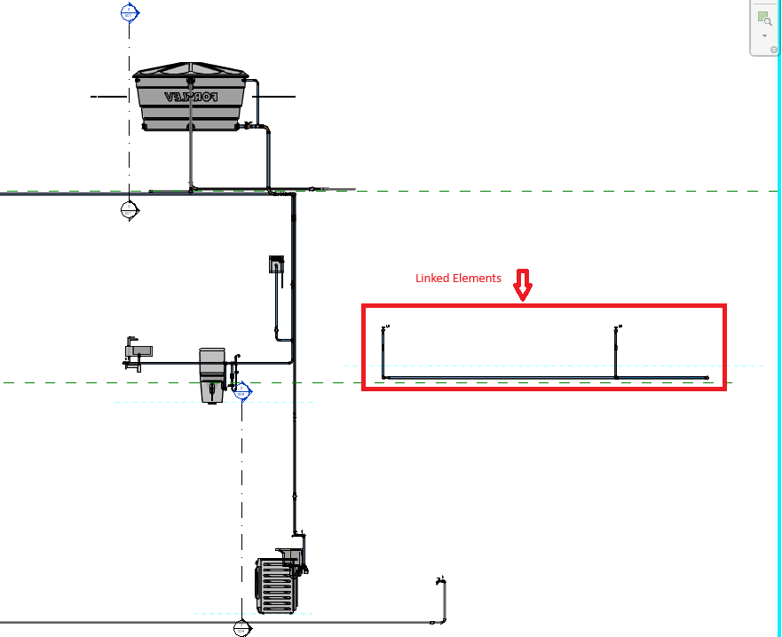

<head>
<meta http-equiv="Content-Type" content="text/html; charset=utf-8">
<link rel="stylesheet" type="text/css" href="bc.css">
<!--  -->
<!-- https://highlightjs.org/#usage -->
<link rel="stylesheet" href="https://cdnjs.cloudflare.com/ajax/libs/highlight.js/11.9.0/styles/default.min.css">

</head>

<!---

- Revit ID Compilation
  Revit IDs
  https://forums.autodesk.com/t5/revit-api-forum/revit-ids/td-p/12418195
  >>>>Element Id
  0344:Newly Created Element Retrieval Based on Monotonously Increasing Element Id Values
  0344:Enhanced Parameter Filter for Greater Element Id Values
  0544:Comparing Element Id for Equality
  0948:Element Ids in Extensible Storage
  1144:Element Id &ndash; Export, Unique, Navisworks and Other Ids
  1144:Negative Element Ids and Element Property Drop-down List Enumerations
  1182:How to Trigger a Dynamic Model Updater by Specific Element Ids
  1353:Family Category, Element Ids, Transaction and Updates
  1396:<"#6">WPF Element Id Converter
  1577:<"#3">Access Revit BIM Data and Element Ids from BIM360
  1628:Retrieving Newly Created Element Ids
  1628:<"#3">Consecutive Element Ids
  1634:<"#2">Search and Snoop by Element Id or Unique Id
  1762:Element Identifiers in RVT, IFC, NW and Forge
  1762:<"#3"> Revit Element Ids in Forge via Navisworks and IFC
  1959:<"#2"> Immutable UniqueId, Mutable Element Id
  1974:64-Bit Element Ids, Maybe?
  1974:<"#2"> 64-Bit Element Ids
  1992:<"#9"> Consuming Huge Numbers of Element Ids
  1995:<"#4"> Backward Compatible 64 Bit Element Id
  >>>>0344 0544 0948 1144 1182 1353 1396 1577 1628 1634 1762 1959 1974 1992 1995
  >>>>Unique Id
  0104:UniqueId versus DWF and IFC GUID
  0104:GUID and UniqueId
  0104:UniqueId to GUID Encoding
  0104:IFC GUID and UniqueId Encoder and Decoder
  0737:Retrieving Unique Geometry Vertices
  0787:Geometry Traversal to Retrieve Unique Vertices
  0819:IFC GUID Generation and Uniqueness
  0943:Solving the Non-unique Unique Id Problem
  1144:Element Id &ndash; Export, Unique, Navisworks and Other Ids
  1144:Unique Id versus ElementId to Store in External Database
  1144:Local Uniqueness of the Revit Unique Id
  1144:Navisworks versus Revit Object Unique Ids
  1144:Revit Id and UniqueId Lost On Reimporting Revised Model
  1209:Unique Names and the NamingUtils Class
  1277:Understanding the Use of the UniqueId
  1304:Extracting Unique Building Element Geometry Vertices
  1459:Consistency of IFC GUID and UniqueId
  1577:<"#4">Unique IDs for Forge Viewer Elements
  1634:RevitLookup Search by Element and Unique Id
  1634:<"#2">Search and Snoop by Element Id or Unique Id
  1949:Unique Id and IFC GUID Parameter
  1949:<"#4"> You Cannot Control the Unique Id
  1959:Immutable UniqueId and Revit Database Explorer
  1959:<"#2"> Immutable UniqueId, Mutable Element Id
  >>>> 0104 0737 0787 0819 0943 1144 1209 1277 1304 1459 1577 1634 1949 1959

- https://forums.autodesk.com/t5/revit-api-forum/are-references-unique-across-documents/td-p/12381420

- DirectContext3D: API for Displaying External Graphics in Revit
  by Alex Pytel
  https://www.autodesk.com/autodesk-university/class/DirectContext3D-API-Displaying-External-Graphics-Revit-2017#video

- a novel method using tagging to
  Determine linked elements present in a section
  https://forums.autodesk.com/t5/revit-api-forum/determine-linked-elements-present-in-a-section/td-p/12488150

twitter:

Revit element id compilation, unique cross-document reference, DirectContext3D and determining elements present in section view with the @AutodeskRevit #RevitAPI #BIM @AutodeskAPS @DynamoBIM https://autode.sk/elementids

Revit element id compilation, unique cross-document reference, AU class on <code>DirectContext3D</code> and determining elements present in section view...

&ndash;  ...

linkedin:

Revit element id compilation, unique cross-document reference, DirectContext3D and determining elements present in section view with the #RevitAPI #BIM @AutodeskAPS @DynamoBIM

https://autode.sk/elementids

#BIM #DynamoBIM #AutodeskAPS #Revit #API #IFC #SDK #Autodesk #AEC #adsk

the [Revit API discussion forum](http://forums.autodesk.com/t5/revit-api-forum/bd-p/160) thread

-->

### DirectContext3D, Ids and Linked Section Elements

Here are some of the topics that came up this week:

- [Revit element id compilation](#2)
- [Unique cross-document reference](#3)
- [AU class on `DirectContext3D`](#4)
- [Determining elements present in section view](#5)

#### Revit Element Id Compilation

Michael Pescht shared a nice overview of the different Revit BIM element identifiers in
his [Revit API discussion forum](http://forums.autodesk.com/t5/revit-api-forum/bd-p/160) thread
on [Revit IDs](https://forums.autodesk.com/t5/revit-api-forum/revit-ids/td-p/12418195):

**Post:**
There are several explanations available for the IDs used in Revit.
Unfortunately, I have not found a complete definition of all IDs in a single document / post.
Therefore, I would like to have my compilation checked here in the forum.
Thanks in advance.

- Element Id, or just "Id":
the unique identification for an element within a single project.
Example decimal: 895976; example hexadecimal: 000dabe8
- EpisodeId:
the first part of the `UniqueId`, including the characters of the sequence 8-4-4-4-12, referring to the project and the session, e.g.,
626f5187-9a17-4713-98b7-532ca3cc31b1
- UniqueId:
a stable unique identifier for an element, globally unique across all documents, returned by the API as a string, e.g.,
"626f5187-9a17-4713-98b7-532ca3cc31b1-000dabe8".
It is a hexadecimal sequence of 8-4-4-4-12-8 characters, consisting of two parts:
EpisodeId (8-4-4-4-12) + Hexadecimal(Element Id) (8)
- DWF GUID (Export GUID):
a hexadecimal version of the IfcGuid
Hex(IfcGuid) = DWF GUID
Example: 626f5187-9a17-4713-98b7-532ca3c19a59
- IfcGuid:
a 22-character code (string) using the 64-character base which includes numbers, upper and lower case letters and some special characters. Although it looks completely different from other GUIDs, the IFC GUID is completely identical to the DWF GUID, but is expressed with a different encoding to make it shorter and easier to understand.
Compressed version of the DWF GUID.
Hex(IfcGuid) = DWF GUID.
Example: compress(626f5187-9a17-4713-98b7-532ca3c19a59)
- ExternalId:
The external ID of a geometry object.
Example: 626f5187-9a17-4713-98b7-532ca3c19a59-000dabe8;
ExternalId = DwfGUID + "-" + Hex(ElementId)

Many thanks to Michael for his compilation.
Here is a list of existing information on element ids and unique ids from The Building Coder:

- Element Id
    - [Retrieving Newly Created Elements in Revit 2011](http://thebuildingcoder.typepad.com/blog/2010/04/retrieving-newly-created-elements-in-revit-2011.html)
    - [Comparing Element Id for Equality](http://thebuildingcoder.typepad.com/blog/2011/02/comparing-element-id-for-equality.html)
    - [DWG Issues and Various Other Updates](http://thebuildingcoder.typepad.com/blog/2013/05/dwg-issues-and-various-other-updates.html)
    - [Element Id &ndash; Export, Unique, Navisworks and Other Ids](http://thebuildingcoder.typepad.com/blog/2014/04/element-id-export-unique-navisworks-and-other-ids.html)
    - [CreateLinkReference Sample Code](http://thebuildingcoder.typepad.com/blog/2014/07/createlinkreference-sample-code.html)
    - [Family Category, Element Ids, Transaction Undo and Updates](http://thebuildingcoder.typepad.com/blog/2015/09/family-category-element-ids-transaction-undo-and-updates.html)
    - [DevDay Conference in Munich and WPF DoEvents](http://thebuildingcoder.typepad.com/blog/2016/01/devday-conference-in-munich-and-wpf-doevents.html)
    - [Revit versus Forge, Ids and Add-In Installation](http://thebuildingcoder.typepad.com/blog/2017/08/revit-versus-forge-ids-and-add-in-installation.html)
    - [Retrieving Newly Created Element Ids](http://thebuildingcoder.typepad.com/blog/2018/02/retrieving-newly-created-element-ids.html)
    - [RevitLookup Search by Element and Unique Id](http://thebuildingcoder.typepad.com/blog/2018/03/revitlookup-search-and-snoop-by-element-and-unique-id.html)
    - [Element Identifiers in RVT, IFC, NW and Forge](https://thebuildingcoder.typepad.com/blog/2019/07/element-identifiers-in-rvt-ifc-nw-and-forge.html)
    - [Immutable UniqueId and Revit Database Explorer](https://thebuildingcoder.typepad.com/blog/2022/07/immutable-uniqueid-and-revit-database-explorer.html)
    - [64-Bit Element Ids, Maybe?](https://thebuildingcoder.typepad.com/blog/2022/11/64-bit-element-ids-maybe.html)
    - [Configuring RvtSamples 2024 and Big Numbers](https://thebuildingcoder.typepad.com/blog/2023/04/configuring-rvtsamples-2024.html)
    - [64 Bit Ids, Revit and RevitLookup Updates](https://thebuildingcoder.typepad.com/blog/2023/05/64-bit-ids-revit-and-revitlookup-updates.html)
- UniqueId
    - [UniqueId, DWF and IFC GUID](http://thebuildingcoder.typepad.com/blog/2009/02/uniqueid-dwf-and-ifc-guid.html)
    - [Melbourne Day Two](http://thebuildingcoder.typepad.com/blog/2012/03/melbourne-day-two.html)
    - [Real-World Concrete Corner Coordinates](http://thebuildingcoder.typepad.com/blog/2012/06/real-world-concrete-corner-coordinates.html)
    - [IFC GUID Generation and Uniqueness](http://thebuildingcoder.typepad.com/blog/2012/09/ifc-guid-generation-and-uniqueness.html)
    - [Copy and Paste API Applications and Modeless Assertion](http://thebuildingcoder.typepad.com/blog/2013/05/copy-and-paste-api-applications-and-modeless-assertion.html)
    - [Element Id &ndash; Export, Unique, Navisworks and Other Ids](http://thebuildingcoder.typepad.com/blog/2014/04/element-id-export-unique-navisworks-and-other-ids.html)
    - [Unique Names and the NamingUtils Class](http://thebuildingcoder.typepad.com/blog/2014/09/unique-names-and-the-namingutils-class.html)
    - [Understanding the Use of the UniqueId](http://thebuildingcoder.typepad.com/blog/2015/02/understanding-the-use-of-the-uniqueid.html)
    - [Back from Easter Holidays and Various Revit API Issues](http://thebuildingcoder.typepad.com/blog/2015/04/back-from-easter-holidays-and-various-revit-api-issues.html)
    - [Consistency of IFC GUID and UniqueId](http://thebuildingcoder.typepad.com/blog/2016/08/consistency-of-ifc-guid-and-uniqueid.html)
    - [Revit versus Forge, Ids and Add-In Installation](http://thebuildingcoder.typepad.com/blog/2017/08/revit-versus-forge-ids-and-add-in-installation.html)
    - [RevitLookup Search by Element and Unique Id](http://thebuildingcoder.typepad.com/blog/2018/03/revitlookup-search-and-snoop-by-element-and-unique-id.html)
    - [Unique Id and IFC GUID Parameter](https://thebuildingcoder.typepad.com/blog/2022/04/unique-id-and-ifc-guid.html)
    - [Immutable UniqueId and Revit Database Explorer](https://thebuildingcoder.typepad.com/blog/2022/07/immutable-uniqueid-and-revit-database-explorer.html)

#### Unique Cross-Document Reference

In a related vein, *grubdex* and *ricaun* pondered:
[are references unique across documents?](https://forums.autodesk.com/t5/revit-api-forum/are-references-unique-across-documents/td-p/12381420)

**Question:** Are `Reference` objects unique across documents in my project?
I know that UniqueIDs are and IDs are not.

**Answer:** Probably yes; the `Reference` has the `UniqueId` embedded in the stable representation.
Using a `UniqueId` of the element with `Reference.ParseFromStableRepresentation` will return the `Reference` of the element:

<pre><code>
  Reference reference
    = Reference.ParseFromStableRepresentation(
      document, element.UniqueId);
</code></pre>

Thank you both for this.

#### AU Class on DirectContext3D

Here is a go-to source of information for `DirectContext3D` that you should be aware of when dealing with this topic,
an Autodesk University 2023 class by Alex Pytel:

- [DirectContext3D: API for Displaying External Graphics in Revit](https://www.autodesk.com/autodesk-university/class/DirectContext3D-API-Displaying-External-Graphics-Revit-2017#video)

#### Determining Elements Present in Section View

Faced with the task of determining which elements are present in a given section view, Wallas Santana and I stumbled across a novel solution using tagging in
the [Revit API discussion forum](http://forums.autodesk.com/t5/revit-api-forum/bd-p/160) thread on
how to [determine linked elements present in a section](https://forums.autodesk.com/t5/revit-api-forum/determine-linked-elements-present-in-a-section/td-p/12488150):

**Question:** I have a section with some project elements and a linked file loaded with some other elements in a section view, as shown here:

 <!-- Pixel Height: 718 Pixel Width: 881 -->

I need to check which elements of the linked file are present in this section, but I'm having difficulties.
I tried to check whether the elements are inside the view's BoundingBox, but without success.
Then, I tried to apply another solution
to [check if a point is inside bounding box](https://forums.autodesk.com/t5/revit-api-forum/check-to-see-if-a-point-is-inside-bounding-box/td-p/4354446).

However, it seems that the position returned in BoundingBox is outside of view.

I use this solution to apply tags to linked elements without any problems:

<pre><code>
Reference refe = new Reference(itemconex)
  .CreateLinkReference(docsVinculados);

IndependentTag tagConexao = IndependentTag.Create(
  Doc.Document, TagConexSelecionada.Id, Doc.ActiveView.Id,
  refe, true, TagOrientation.Horizontal, PosicaoFinal);
</code></pre>

**Answer:** The biggest challenge is probably the transformation.
One possible approach would be to read and understand in depth all the transformations involved.
Another possible approach, in case your tendency is stronger to hack and do rather than study and ponder, might be: create a very simple linked file with just an element or two, e.g., model lines.
Host it.
Analyse the resulting geometry in the host file.
Reproduce the model lines in the host file until their appearance matches the original ones in the linked file.
Basically, you just need to determine where a given bounding box in the linked file will end up on the host, don't you?

Since you mention that you can successfully and automatically create tags for the linked elements, another idea comes to mind: before creating the tags, subscribe to the `DocumentChanged` method to be notified of the added elements.
Then, you can query the tags for their locations.
That will presumably approximate the host project locations of the linked elements.

**Response:** Hi Jeremy, thank you for your reply, you opened my mind to a possible solution!
I just add a new `IndependentTag` then check if it's `BoundingBox` is valid:

<pre><code>
IndependentTag tagConexao = IndependentTag.Create(
  Config.doc, Config.doc.ActiveView.Id, refe, true,
  TagMode.TM_ADDBY_CATEGORY, TagOrientation.Horizontal,
  PosicaoFinal);

if (null != tagConexao.get_BoundingBox(Config.doc.ActiveView))
{
  // The element is in the view
}
</code></pre>

Then, I collect the id's I need and RollBack the transaction in the final, it's working.
Btw I'll study how transformations works when I have linked elements in some view.
Thank you.

Thank you, Wallas, for raising this issue and confirming.

