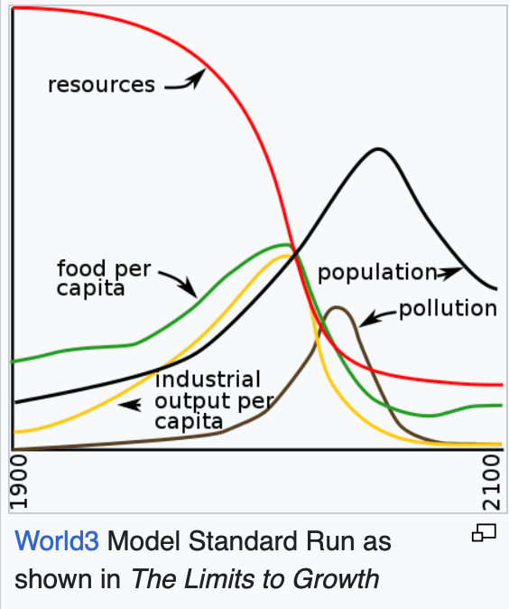

<head>
<meta http-equiv="Content-Type" content="text/html; charset=utf-8">
<link rel="stylesheet" type="text/css" href="bc.css">
<!--  -->
<!-- https://highlightjs.org/#usage -->
<link rel="stylesheet" href="https://cdnjs.cloudflare.com/ajax/libs/highlight.js/11.9.0/styles/default.min.css">

</head>

<!---

- valid api context
  https://autodesk.slack.com/archives/C0SR6NAP8/p1705566333752629
  Jeff Hotchkiss
  what is the correct & efficient way to validate one's execution of code is in a Revit API context? I can see in the internal C++ code of Revit that Revit API objects perform checks - how does one do this equivalent check in C#? Background in :thread:
  Answers by Dimitar Venkov

- Extensible Storage in APS
  https://autodesk.slack.com/archives/C04R1THN78V/p1705949479594829
  João Martins
  Is Revit Extensible Storage supported by SVF ?
  Petr Broz
  Revit Extensible Storage Sounds like some kind of feature that lets you store custom data inside Revit elements.
  Jeremy Tammik

twitter:

Valid #RevitAPI context, extensible storage in @AutodeskAPS, AI large language model course, token-free selective state space model, l'humanité en péril and the limits to growth with @AutodeskRevit #BIM @DynamoBIM https://autode.sk/apicontext

Revit API, climate, and AI
&ndash; Valid Revit API context
&ndash; Extensible storage in APS
&ndash; Large language model course
&ndash; Token-free selective state space model
&ndash; L'humanité en péril
&ndash; The limits to growth...

linkedin:

Revit API, climate, and AI news:

https://autode.sk/apicontext

- Valid Revit API context
- Extensible storage in APS
- Large language model course
- Token-free selective state space model
- L'humanité en péril
- The limits to growth...

#BIM #DynamoBIM #AutodeskAPS #Revit #API #IFC #SDK #Autodesk #AEC #adsk

the [Revit API discussion forum](http://forums.autodesk.com/t5/revit-api-forum/bd-p/160) thread

-->

### Valid Revit API Context, LLM and LTG

We continue our exciting exploration of the Revit API and observations on where the world development in general
&ndash; and climate, and AI, in particular &ndash; are leading:

- [Valid Revit API context](#2)
- [Extensible storage in APS](#3)
- [Large language model course](#4)
- [Token-free selective state space model](#5)
- [L'humanité en péril](#6)
- [The limits to growth](#7)
- [Discussing the limits to growth](#7.2)

#### Valid Revit API Context

The Revit API is almost completely event driven.
Every event can be processed by an event handler.
The best-known event is the external command `Execute` that is triggered by an end user launching the command by clicking the corresponding ribbon button.
Within the event handler, Revit provides a valid Revit API context.
Most Revit API methods can only be used within such a context, and nowhere else, cf.:

- [Use of the Revit API requires a valid context](http://thebuildingcoder.typepad.com/blog/2015/12/external-event-and-10-year-forum-anniversary.html#2)
- [Revit API context summary](https://thebuildingcoder.typepad.com/blog/2015/08/revit-api-context-and-form-creation-errors.html#2)
- [Valid Revit API context and external events](https://thebuildingcoder.typepad.com/blog/2020/11/document-session-id-api-context-and-external-events.html#3)

When automating Revit, one often wishes to trigger some action in the BIM from outside.
This can be achieved by implementing an external event that can be raised from a non-modal context.
This are has been discussed in depth by The Building Coder, cf. the topic group
on [`Idling` and external events for modeless access and driving Revit from outside](https://thebuildingcoder.typepad.com/blog/about-the-author.html#5.28).

Here are some other aspects of this theme, from an internal Revit developers point of view:

**Question:** What is the correct and efficient way to validate one's execution of code is in a Revit API context?
I can see in the internal C++ code of Revit that Revit API objects perform checks &ndash; how does one do this equivalent check in C#?

Background: we have a lot of complex multi-threaded app code for Revit.
The most common class of errors here fall into three cases outside of just not knowing about some Revit corner cases:

- Calling Revit from the wrong thread
- Calling Revit outside the API context
- Persisting & misusing Revit objects beyond their lifetime

This often goes awry when mixed in with modern coding practices like DI, async, etc.
I'm in the process of extending our low-level libraries for using the Revit API to provide effectively Revit safe zones
&ndash; if you're in one of these, you can call Revit, if not, you need to marshal into one.
For example, a UI call might need to alter Revit and it's not immediately obvious if it's safe to do so without marshalling into an External Event.
The wrong thread is easy to detect.
Persisting Revit objects can be a mix of better defensive coding and PR review, but I've already got patterns that make it much harder to accidentally drop Revit objects into long-lived objects.
Detecting incorrect context looks to be a bit harder.

**Answer:** Any and all Revit API code will always be executed in an API context.
However, only the main execution thread can modify the Revit database.
You could probably use something along the lines of this to check if you are running in it:
[how to tell if a thread is the main thread in C#](https://stackoverflow.com/questions/2374451/how-to-tell-if-a-thread-is-the-main-thread-in-c-sharp)

All Revit elements have an `IsValidObject` property that can check if it's still connected to a native object.

**Response:**
Can you clarify why 'any and all C# code will always be executed in an API context'?
If I spin up a modeless UI in a Revit pane, the WPF context does not appear to be guaranteed safe to call Revit objects in.

**Answer:**
There are best practices like using an `IExternalEventHandler` for any multi-threaded code.
It's also best not to store Revit elements directly, but instead only their ElementIds or UniqueIds.
UniqueIds are strings, which are value objects.
`ElementId` is a class but is serializable.
Both can safely be used between threads.

[Revit.Async](https://github.com/KennanChan/Revit.Async/blob/master/README.md)
provides a really nice and in-depth explanation of this:

> Use Task-based asynchronous pattern (TAP) to run Revit API code from any execution context.

> If you have ever encountered a Revit API exception saying, "Cannot execute Revit API outside of Revit API context",
typically when you want to execute Revit API code from a modeless window, you may need this library to save your life.
A common solution for this exception is to wrap the Revit API code using `IExternalEventHandler` and
register the handler instance to Revit ahead of time to get a trigger (`ExternalEvent`).
To execute the handler, just raise the trigger from anywhere to queue the handler to the Revit command loop.
But there comes another problem...

**Response:**
Thanks &ndash; I am aware of all of these; our library uses similar techniques to `Revit.Async`, appreciated for the reinforcement, but perhaps an example will help.
Lets' say I subscribe to a Revit event, and hook that to some piece of internal logic.
That internal logic calls reentrantly into some other piece of code that needs to perform Revit functionality, e.g., altering the UI.
That same piece of code might also be called from outside a Revit event (external or internal), and therefore, as I understand it, would need to move to an external event.
As it stands, the developer has to follow that call stack for any time they connect these events up and hope they know whether they're inside Revit at the start or not.
What I'd like is a low-level dispatch that would be something like:

<pre><code>if(InRevitContext)
   // Run code inline for efficiency
else
   // Not safe, must wrap code in external event and wait for it
</code></pre>

At a minimum a debug check to validate early and say, 'no, your code is wrong, you will get Revit failures', would be good.

**Answer:**
Not sure if such a check exists, sorry.
Getting the main thread's id inside your `IExternalAppication.OnStartup` might help with that.
But I'd recommend you always stick to the `ExternalEvent.Raise` pattern whenever you have non-modal windows or panels and not call the event handler directly.

**Response:**
Understood.
The challenge we have at the moment is that this yields sometimes a lot of small External Event Raises, that are running and queued independently.
My limited understanding is that in the current implementation of `Raise`, Revit runs all of these in idle time, which means in theory other addin code or other user interactions could alter state between the executions.
There's been concern raised that ideally they'd chain together so that we can be confident Revit state hasn't changed between them (since writing each event in a fashion that says 'check we're e.g. still on the same view we were in the last event' is non-trivial).
Maybe there's a workaround &ndash; if I have an UIApplication &ndash; is there something cheap I can call that will do that 'Cannot execute Revit API outside of Revit API context check'?
Will `IsValidObject` perform it with some level of guarantee?
(I have found that I can write 'be careful with your state, always use external events' in big bold letters in architectural guidelines as much as I like, junior devs or contractors will regularly write code, test the path, it works, ship it, and then later a different path executes it and it crashes..)

**Answer:**
What do you mean by "change state"?
No other plugin should be able to change the state of your plugin's objects.
If you mean, change the state of the Revit document and its elements, that is always a possibility and must be accounted for.
You cannot expect that the end user will only run your plugin, nor can you account for every possible combination of plugins and scripts that they might use.
What you can be sure of, is that when the execution of your plugin' starts, you can go through all the element ids that you stored and check each to make sure that an element with that ID still exists.
If it has been deleted, you can skip it and move on to the next one.
If you need more fine-grained control than this, look at the `IUpdater` interface instead.
Most of the time Revit crashes because of unhandled exceptions.
Try to execute all entry points in a try-catch context and log all exceptions.

**Response:**
Agreed; I'll see what I can do to further reinforce these patterns.
Always helpful to have these needs confirmed too!

Many thanks to Jeff Hotchkiss and Dimitar Venkov for this illuminating discussion.

#### Extensible Storage in APS

**Question:** Is Extensible Storage supported by `SVF`?

**Answer:** SVF is an efficient compressed representation of the BIM geometry and selected metadata resulting from a translation of the original BIM CAD seed file for
the [Autodesk Platform Services APS](https://aps.autodesk.com/) environment.

Revit [Extensible Storage](https://thebuildingcoder.typepad.com/blog/about-the-author.html#5.23) is
a feature that lets add-ins store custom data inside Revit elements.

The extensible storage data is only accessible to the add-in that creates it.
Therefore, the Revit translation process has no access to it, so it cannot be translated to SVF.

So, the answer is generally no.

#### Large Language Model Course

Moving away from the Revit API to the ever-exciting topic of AI and LLMs, here is
a [Large Language Model Course](https://github.com/mlabonne/llm-course).

> It is divided into three parts:

> - LLM Fundamentals covers essential knowledge about mathematics, Python, and neural networks.
- The LLM Scientist focuses on building the best possible LLMs using the latest techniques.
- The LLM Engineer focuses on creating LLM-based applications and deploying them.

#### Token-free Selective State Space Model

On the topic of LLMs, is the lo#ng LLM tokenisatio#n night#m#are possibly near#ing it#s end?

[MambaByte: Token-free Selective State Space Model](https://arxiv.org/html/2401.13660v1) reports:

> Token-free language models learn directly from raw bytes and remove the bias of subword tokenization. Operating on bytes, however, results in significantly longer sequences
... experiments indicate the computational efficiency of MambaByte compared to other byte-level models.
... findings establish the viability of MambaByte in enabling token-free language modeling.

#### L'Humanité en Péril

One of my favourite authors, Fred Vargas, took a break from detective stories and wrote whole book on climate change instead,
[L'humanité en péril](https://editions.flammarion.com/lhumanite-en-peril/9782081490864).
I just read it and agree to a large extent.
The biggest takeaway:
we need to take matters into our own hands;
we cannot trust or wait for politicians, who are subservient to lobbies;
eat less meat;
avoid consuming mass agricultural industry products.

#### The Limits to Growth

Vargas also points out [The Limits to Growth or LTG](https://en.wikipedia.org/wiki/The_Limits_to_Growth),
a 1972 report that discusses the possibility of exponential economic and population growth
with finite supply of resources, studied by computer simulation.
The study uses a computer model to simulate the consequence of interactions between the Earth and human systems.
After reviewing their computer simulations, the research team came to the following conclusions:

- If the present growth trends in world population, industrialization, pollution, food production, and resource depletion continue unchanged, the limits to growth on this planet will be reached sometime within the next one hundred years. The most probable result will be a rather sudden and uncontrollable decline in both population and industrial capacity.
- It is possible to alter these growth trends and to establish a condition of ecological and economic stability that is sustainable far into the future. The state of global equilibrium could be designed so that the basic material needs of each person on earth are satisfied and each person has an equal opportunity to realize his individual human potential.
- If the world's people decide to strive for this second outcome rather than the first, the sooner they begin working to attain it, the greater will be their chances of success.

In 2008, some researchers concluded that, "its approach remains useful and that its conclusions are still surprisingly valid...
unfortunately, the report has been largely dismissed by critics as a doomsday prophecy that has not held up to scrutiny."

In 2023, the parameters of the simulation model were recalibrated using empirical data up to 2022.
This improved parameter set results in a simulation that shows the same overshoot and collapse mode in the coming decade as the original business-as-usual scenario of the Limits to Growth standard run.
The main effect of the recalibration update is to raise the peaks of most variables and move them a few years into the future.

 <!-- Pixel Height: 674 Pixel Width: 564 -->

#### Discussing the Limits to Growth

Darren Young [commented](https://www.linkedin.com/feed/update/urn:li:activity:7156650982192398336?commentUrn=urn%3Ali%3Acomment%3A%28activity%3A7156650982192398336%2C7156889623992922112%29&dashCommentUrn=urn%3Ali%3Afsd_comment%3A%287156889623992922112%2Curn%3Ali%3Aactivity%3A7156650982192398336%29):

Recalibrating the parameters and showing the same result is meaningless if the model is using the wrong, incomplete or flawed parameters.

The world is more complicated than 6 inputs.

The world was also at 3 billion people when we were told we’d run out of food to feed everybody. Yet today, aside from political reasons and political unrest, there was a no food starvation as a result of food shortages.

The volume of food wasted is tremendous despite feeding 8 billion people.

Human inginuity and innovation, political will, science and fiscal policy/investment are not parameters in that model.

**Answer:** Absolutely right you are.
I am still impressed that such a simplified model holds up so well after 50 years (!).
Please point out one single other example that does equally well or better.
Let's talk again in 2072 :-)

**Response:** 2072? I hope I'm not around by then.
I'm already over half a century under my belt. That's plenty. I'm really to go anytime. :-)

I would tend to think the simpler the model, the more stable over time. What it lacks in parameters I suspect helps stability.

I would be interested in seeing their methodology and data. (Ok, maybe not enough to research it myself).

The chart suggests the population has far outpaced resources. Depending on the perspective, you could argue with reasonable utility that this has already happened long ago equally as well as that it's not even remotely true.

That makes me question their methodology and measures.

It could very well be a very stable long term incorrect model. The long term stability is interesting however.

**Response:** I have not looked at the research in detail either, just read
the [Wikipedia entry](https://en.wikipedia.org/wiki/The_Limits_to_Growth) summarising it.
The authors back then did differentiate between different scenarios, mainly "business as usual" and "try to do something".
So far, after fifty years of discussion, we remain very close indeed to the "business as usual" predictions.
It seems that industry, including agricultural industry, and thus lobbies, and thus politics, are all still in favour of "business a usual" (for obvious reasons).
So, it becomes the responsibility of the remaining part of humanity to take responsibility and do something, e.g., change patterns of consumption.

