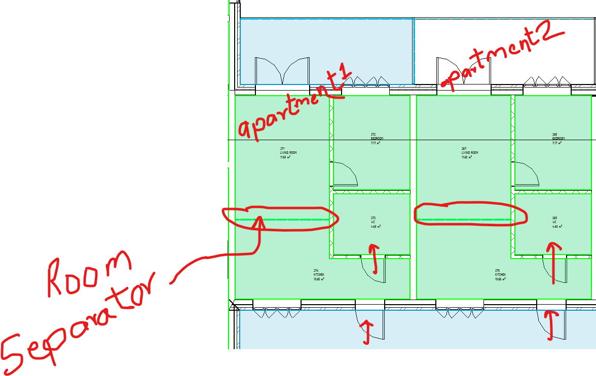

<head>
<meta http-equiv="Content-Type" content="text/html; charset=utf-8">
<link rel="stylesheet" type="text/css" href="bc.css">
<!-- https://highlightjs.org/#usage -->
<link rel="stylesheet" href="https://cdnjs.cloudflare.com/ajax/libs/highlight.js/11.9.0/styles/default.min.css">

</head>

<!---

- schema builder crash
  https://autodesk.slack.com/archives/C0SR6NAP8/p1706598868934699
  https://forums.autodesk.com/t5/revit-api-forum/extensiblestorage-schemabuilder-addsimplefield-causes-quot/m-p/12529666

- get rooms
  https://autodesk.slack.com/archives/C0SR6NAP8/p1706701084426099
  Want to collect the every room in apartment...

- Embed Gif in ToolTip
  https://forums.autodesk.com/t5/revit-api-forum/embed-gif-in-tooltip/m-p/12532476

- Draw order of detail items
  https://forums.autodesk.com/t5/revit-api-forum/draw-order-of-detail-items/m-p/12531008
  very briefly mentioned in [Handy Utility Classes](https://thebuildingcoder.typepad.com/blog/2013/04/handy-utility-classes.html) and in the what's new notes for 2013, 2014 and 2024, but never tested

twitter:

 #RevitAPI  @AutodeskRevit #BIM @DynamoBIM

&ndash; ...

linkedin:

#BIM #DynamoBIM #AutodeskAPS #Revit #API #IFC #SDK #Autodesk #AEC #adsk

the [Revit API discussion forum](http://forums.autodesk.com/t5/revit-api-forum/bd-p/160) thread

-->

### Retrieve Rooms and Building a Schema

#### Schema Builder Limitation

A couple of interesting aspects of using the `SchemaBuilder` came up in
the [Revit API discussion forum](http://forums.autodesk.com/t5/revit-api-forum/bd-p/160) thread
on [`AddSimpleField` causes `ArchiveException 106`](https://forums.autodesk.com/t5/revit-api-forum/extensiblestorage-schemabuilder-addsimplefield-causes-quot/m-p/12529666):

**Question:** How can we fix an `InternalException` with `ArchiveException 106`, please? It is triggered by a third party plugin calling `SchemaBuilder.AddSimpleField`. The issue only occurs for 1 user; many users at the company are using the plugin and multiple users using the plugin are working in the same projects as the user having the issue. The user has 2 Autodesk accounts; the issue only occurs when they are using 1 of the accounts. The issue does not occur when they are on the other account. The issue occurs in all projects the user opens. The journal file entry reads:

<pre><code>
An ArchiveException 106 is raised at line 661 of E:\Ship\2023_px64\Source\Foundation\Utility\Archive\DataDict.cpp
</code></pre>

The plugin debug log lists this:

<pre><code>
Autodesk.Revit.Exceptions.InternalException: A managed exception was thrown by Revit or by one of its external applications.
  at Autodesk.Revit.DB.ExtensibleStorage.SchemaBuilder.AddSimpleField(String fieldName, Type fieldType)
</code></pre>

Troubleshooting steps tried so far:

- Deleting the extensible storage objects created by the plugin. The thought is perhaps the objects became corrupted so deleting them and allowing the plugin to recreate new ones may resolve the issue, this did not work.
- Audit the model
- Disabling the plugin. This resolves the issue but the problem to solve is having the plugin not causing the issue for this user, this issue does not and has never occurred for any other user of the plugin.
- Switching to a different Autodesk account. This does resolve the issue but project requirements require the user to use the specific account that has the issue.

What can we do to resolve this issue, please? -- https://forums.autodesk.com/t5/revit-api-forum/extensiblesotrage-schemabuilder-addsimplefield-causes-quot/td-p/12527389

**Answer:** There is a known improvement logged in REVIT-156791.
The issue is "the `fieldName` is too long".
The current limitation in Revit is we only accept the field name with length less than 63.
Why does the issue only happen on one specific user account?
Please ask the user to check with the plugin owner about the `fieldName`.
It is possible that this `fieldName` is generated based on the current user name.

Another issue that can occur: given the following code to set up 3 simple fields for the schema and set the documentation for those fields:

<pre><code>
FieldBuilder theVersion = schemaBuilder.AddSimpleField(VERSIONFIELD, typeof (int)); // create a field to store the version number
FieldBuilder theData = schemaBuilder.AddSimpleField(DATAFIELD, typeof (string)); // create a field to store the data
FieldBuilder isZipped = schemaBuilder.AddSimpleField(ZIPFIELD, typeof (bool)); // create a field to store the data
theVersion.SetDocumentation("The version number of the schema of the stored data.");
theData.SetDocumentation("The data as XML serialized, possibly zipped and base64 coded string.");
isZipped.SetDocumentation("Whether or not the stored data has been zipped.");
</code></pre>

he first `SetDocumentation` call may fail.
The issue has to do with the way fields get added on each call to `AddSimpleField`.
Internally, the fields are stored in a dynamic array and the return value of `AddSimpleField` is a pointer to the entry inside that array.
Subsequent calls to `AddSimpleField` will add new entries into this array and return pointers to those.
The problem is that each "add" is going to trigger the array to be "resized".
This means that it is essentially reallocated and all entries moved to the new allocation.
Thus, any reference pointers at that point are now pointing to the wrong/deleted thing.
That can cause a crash as that memory has been written over to catch this case; release builds may seemingly work, but the memory is not the write (right) memory to place the string in.

In general, when working with schemaBuilder and adding fields, it seems best to add the field, set its properties, then continue onto the next field etc.
The code above can be fixed as follows:

<pre><code>
// create a field to store the version number
schemaBuilder.AddSimpleField(VERSIONFIELD, typeof (int)).SetDocumentation("The version number of the schema of the stored data.");
// create a field to store the data
schemaBuilder.AddSimpleField(DATAFIELD, typeof (string)).SetDocumentation("The data as XML serialized, possibly zipped and base64 coded string.");
// create a field to store the data
schemaBuilder.AddSimpleField(ZIPFIELD, typeof (bool)).SetDocumentation("Whether or not the stored data has been zipped.");
</code></pre>

#### Get All Apartment Rooms

**Question:** I want to collect all room in a given apartment.
The user just selects one external door.
So far, I have implemented this collection of rooms in the apartment using the properties `FromRoom` and `ToRoom`.
Now, I encountered a case where rooms are not separated by a door but by a room separator:

 <!-- Pixel Height: 743 Pixel Width: 1,176 -->

In this case, the logic above fails.
How can I handle this case?

**Answer:**
You have to do both the doors and the room separations.
So, after you pull the doors from the room, pull it's boundary segments using
the [GetBoundarySegments method](https://www.revitapidocs.com/2024/8e0919af-6172-9d16-26d2-268e42f7e936.htm).
Then, for each segment, check if the bounding element type is a room separation.
If so, evaluate a point at the middle of the curve, and translate it just inside and just outside the curve.
Pull the room at those points and you get the one room which is your active room, and one room which is the adjacent one.
Add the adjacent one to your list of rooms to process, and the list of 'included' rooms.

Some supplementary thoughts: there might be some complicated cases where one room separation line is the boundary of more than two rooms:

 <!-- Pixel Height: 269 Pixel Width: 377 -->

One way to handle this is to record the boundary information in a `Dictionary&lt;ElementId, List&lt;ElementId&gt;&gt;`, where the key is the element id of the boundary segment, and the value is the elements that are bounded by that segment.
You can loop through all rooms to construct the dictionary.

Possibly, though, the `GetBoundarySegments` call on room three returns a segment for the boundary to room one and a separate segment for the boundary to room 2, so there shouldn’t be much of a concern with tracking.
Worth checking though.
Then, GetBoundarySegments should be enough for this request.

There are many solutions to this.
So, it’s up to you.

#### Embed GIF in ToolTip

Mauricio [SpeedCAD](https://github.com/SpeedCAD) Jorquera shared a nice solution
to [Embed GIF in ToolTip](https://forums.autodesk.com/t5/revit-api-forum/embed-gif-in-tooltip/m-p/12532476):

Before creating this custom class, I searched everywhere for an example of how to embed an animated gif in a tooltip for a button in Revit.
I looked at the [video animated ribbon item tooltip](http://thebuildingcoder.typepad.com/blog/2012/09/video-animated-ribbon-item-tooltip.html) from 2012,
but it seems that using a GIF is not possible, and I don't like the idea of hosting a video at a URL.
Anyway, if anyone has found any examples, please let me know.

For this reason, I developed a small DLL that allows adding a static image or an animated GIF to a tooltip.
If anyone is interested in using or testing this class, you can download the DLL from the following link to the GitHub repository:

- [SCADtools.Revit.UI.RibbonItemToolTip](https://github.com/SpeedCAD/SCADtools.Revit.UI.RibbonItemToolTip)

I hope this tool is useful!

Many thanks to Mauricio for implementing sharing this!
