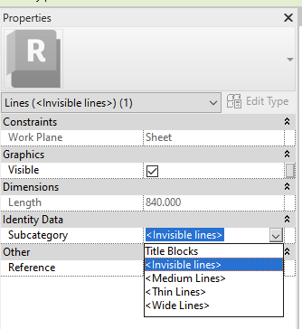

<head>
<meta http-equiv="Content-Type" content="text/html; charset=utf-8">
<link rel="stylesheet" type="text/css" href="bc.css">
<!-- https://highlightjs.org/#usage -->
<link rel="stylesheet" href="https://cdnjs.cloudflare.com/ajax/libs/highlight.js/11.9.0/styles/default.min.css">

</head>

<!---

- .net core migration webinar recording
  Recording from the webinar is posted in the feedback portal:
  https://feedback.autodesk.com/project/article/item.html?cap=cb0fd5af18bb49b791dfa3f5efc47a72&arttypeid={16363613-34f6-4dfa-9b97-3857dbbe9ade}&

- programmatic access to [make the "Publish settings" tool functions available in the API](https://forums.autodesk.com/t5/revit-ideas/make-the-quot-publish-settings-quot-tool-functions-available-in/idc-p/12538103)

- https://github.com/jowsy/bim-net-interactive
  email Saury Waldheim, Joel <joel.saury@sweco.se>

- Don't Show the Revit Python Users this C# Visual Studio Trick
  Taking a look at the hot reload feature in Visual Studio 2022 and how it works with Dynamo and Revit to instantaneously update a live RVT model
  https://youtu.be/Xcjlh3D7ieU

twitter:

 the #RevitAPI @AutodeskRevit #BIM @DynamoBIM

&ndash; ...

linkedin:

the [Revit API discussion forum](http://forums.autodesk.com/t5/revit-api-forum/bd-p/160) thread

-->

###

####

**Question:**

**Answer:**

 <!-- Pixel Height: 743 Pixel Width: 1,176 -->

#### .NET Core Migration Webinar Recording

We repeatedly discussed how to use .NET Core with the Revit API, both in
the [discussion forum](http://forums.autodesk.com/t5/revit-api-forum/bd-p/160) and
here in the blog, e.g.:

- [.NET 5 and Core](https://thebuildingcoder.typepad.com/blog/2021/01/face-triangulation-lod-net-5-and-core.html#2)
- [.NET Core](https://thebuildingcoder.typepad.com/blog/2023/08/15-years-polygon-areas-and-net-core.html#3)
- [.NET Core Preview and Open Source Add-In Projects](https://thebuildingcoder.typepad.com/blog/2023/11/net-core-preview-and-open-source-add-in-projects.html)

Roman [Nice3point](https://github.com/Nice3point) Karpovich
of [atomatiq](https://www.linkedin.com/company/atomatiq/), aka Роман Карпович, even presented
a [solution using IPC to connect components using different .NET frameworks](https://thebuildingcoder.typepad.com/blog/2023/10/dll-paradise-and-a-fall.html).

The development team is working on upgrading the Revit API to .NET Core and held
the [.NET Core webinar](https://thebuildingcoder.typepad.com/blog/2023/12/parameters-and-net-core-webinar.html#2) to
discuss the current state of things and migration issues.

The [.NET Core migration webinar recording](https://feedback.autodesk.com/project/article/item.html?cap=cb0fd5af18bb49b791dfa3f5efc47a72&arttypeid={16363613-34f6-4dfa-9b97-3857dbbe9ade}&)
has now been posted to the feedback portal.
Note that an ADN or feedback portal membership is required to access that link.

#### API Access to Publish Settings

[How to Export Multiple 3D Views For View and Data API](https://adndevblog.typepad.com/cloud_and_mobile/2015/09/how-to-export-multiple-3d-views-for-view-and-data-api.html)
[Selecting RVT 3D Views for Forge Translation](https://thebuildingcoder.typepad.com/blog/2016/07/selecting-views-for-forge-translation.html)
[Select Rooms and Views to Publish to the Cloud](https://thebuildingcoder.typepad.com/blog/2017/09/revit-20181-nuget-packages-rooms-and-views-in-forge.html#2)

- publish views and sheets to the cloud
  https://forums.autodesk.com/t5/revit-api-forum/how-to-add-views-to-a-publishing-set/m-p/12396874/highlight/false#M75477
  views_for_a360.png
  c4r_views_for_a360.png
  collaborate_publish_settings.png
  collaborate_publish_settings2.png
  collaborate_publish_settings3_rvt_views_to_cloud.png
  https://help.autodesk.com/view/RVT/2023/ENU/?guid=GUID-A2444193-FCE8-4219-A590-62CA2B8B5C5D

1876_da4r_save_c4r.md

programmatic access to [make the "Publish settings" tool functions available in the API](https://forums.autodesk.com/t5/revit-ideas/make-the-quot-publish-settings-quot-tool-functions-available-in/idc-p/12538103)

#### Revit Polyglot Notebook

Joel Waldheim Saury, BIM Developer at [Sweco](https://www.sweco.se/) shares
his interactive .NET BIM [Revit Polyglot Notebook project](https://github.com/jowsy/bim-net-interactive), saying:

Thanks for a great blog!
I’ve read it for many years and I’ve been at Autodesk University couple of times!

Reading your latest post
about [valid Revit API context](https://thebuildingcoder.typepad.com/blog/2024/01/valid-revit-api-context-llm-and-ltg.html#2) inspired
me to share a personal project I’ve been working on that touches this topic.

I have been experimenting
with [VS Code Polyglot Notebook](https://duckduckgo.com/?q=VS+Code+Polyglot+Notebook) extensions,
how to run live Revit C# scripts, and tried to implement a NET interactive kernel embedded in Revit.

Here is the result:

- [Revit Polyglot Notebook project](https://github.com/jowsy/bim-net-interactive)

The background is that I’ve been using ChatGPT to write some Revit API code for me and just wanted a fast way to test it in Revit.
I also wanted to experiment with some open-source libraries and the variable sharing capabilities in .NET Interactive enables you to send values between Revit and for example a Python kernel running in Jupyter Notebook!

So this tool was born.

Hope you find it interesting!

I also looked at the [hot-reload trick mentioned below](#5); it looks really useful.
It’s somewhat related actually, and you could probably use my project as an IDE I guess.
However, it has no debug.

Every code cell is compiled into a small assembly and is loaded in runtime, similar to RevitAddinManager.
The C# script is rewritten to full C# class by Roslyn and the notebook and Revit exchange data about variables to support referenceing between code cells.

Taking a step back and trying to explain this from a less experienced user perspective, here is what I came up with:

> This project aims to create documents or notebooks containing live Revit C#-scripts, visualizations, and narrative text.
A simple way to document and demonstrate automations or simply experiment with code.
This allows for cell-to-cell execution of Revit API code in any order where results can be shared by reference between "code cells" in a notebook.
The solution consists of an extension to VS Code Polyglot Notebooks and an addin to Autodesk Revit that acts as a data environment where variables are stored in memory during an interactive session.

The most difficult part is probably the inter-process communication between the notebook (.NET 8) and Revit; I have handed that over to NET Interactive.

Many thanks to Joel for sharing this exciting approach!

#### Hot Reloading in Visual Studio With Dynamo and Revit

John Pierson demonstrates another interactive trick in his three-minute video
[don't show the Revit Python users this C# Visual Studio trick](https://youtu.be/Xcjlh3D7ieU):

> Taking a look at the hot reload feature in Visual Studio 2022 and how it works with Dynamo and Revit to instantaneously update a live RVT model

<iframe width="480" height="270" src="https://www.youtube.com/embed/Xcjlh3D7ieU?si=w8TFFRObf0-OQe6T" title="YouTube video player" frameborder="0" allow="accelerometer; autoplay; clipboard-write; encrypted-media; gyroscope; picture-in-picture; web-share" allowfullscreen></iframe>

#### Assigning Invisible Graphics Linestyle

Back to a 'normal' non-interactive Revity API question,
[Evan Geer](https://evangeer.github.io/) explains
[how to assign category / graphics style `<Invisible lines>` to edges of titleblock via API](https://stackoverflow.com/questions/77942445/how-to-assign-category-graphics-style-invisible-lines-to-edges-of-titleblo):

I'm defining a titleblock family programmatically and I'm trying to make the edges of the sheet included in the titleblock family templates invisible. I want the edges to stay invisible when the sheet is exported to DWG format.

I found that I can achieve this by editing the titleblock family manually and assigning the category `<Invisible lines>` to the edges of the sheet, but I can't manage to do this programmatically.

 <!-- Pixel Height: 364 Pixel Width: 334 -->

I'm creating a Document object from a titleblock family template and retrieving its first ViewSheet object as follows:

<pre><code>
Document = Application.uiApplication.Application.NewFamilyDocument(TITLEBLOCK_FAMILY_TEMPLATE);
ViewSheet = new FilteredElementCollector(tbFamilyDoc)
  .OfClass(typeof(ViewSheet))
  .Cast<ViewSheet>()
  .First();
</code></pre>

I tried to set the `LineStyle` property of the relevant lines like this, but lack the `GraphicsStyle` object that I can't manage to obtain:

<pre><code>
var lines = new FilteredElementCollector(Document, ViewSheet.Id)
  .WhereElementIsNotElementType()
  .OfClass(typeof(CurveElement))
  .Cast<CurveElement>()
  .ToList()
  .ForEach(line => line.LineStyle = graphicsStyleInvisibleLines)
</code></pre>

I think this object is supposed to be retrieved using the method `GetGraphicsStyle` of the class `Category`.
I used RevitLookup to view the data of the corresponding category, which appears to also be called `<Invisible lines>` and to have the `Id` -2000064.
The `BuiltInCategory` enumeration contains the value `OST_InvisibleLines` that has an integer value equal to the ID above, but when I run the following, it returns null:

<pre><code>
Category invisibleLinesCat = Document.Settings.Categories.get_Item(BuiltInCategory.OST_InvisibleLines);
</code></pre>

RevitLookup also showed me that the parent category has the name `Internal Object Styles` and has the ID -2000059.
I found again a `BuiltInCategory` value with a matching name and integer value `OST_IOS`.
I tried fetching this parent category to then navigate to the desired subcategory with the line below, but it also returns null.

<pre><code>
Category internalCat = Document.Settings.Categories.get_Item(BuiltInCategory.OST_IOS);
</code></pre>

How can I obtain a reference to this category or to its GraphicsStyle object?

**Answer:**
You should be able to query those line styles the same you query for the line.
The following worked for me:

<pre><code>
var graphicsStyles = new FilteredElementCollector(Document)
    .WhereElementIsNotElementType()
    .OfClass(typeof(GraphicsStyle))
    .Cast<GraphicsStyle>()
    .ToList();

var lineStyle = graphicsStyles.FirstOrDefault(x => x.Name == "<Invisible lines>");

if (lineStyle != null)
{
    using (var t = new Transaction(Document, "update line type"))
    {
        t.Start();
        lines.ForEach(line => line.LineStyle = lineStyle);
        t.Commit();
    }
}
</code></pre>

Many thanks to Evan for the helpful answer!
