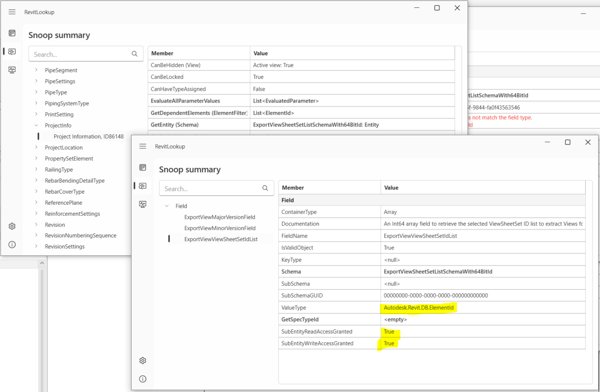

<head>
<meta http-equiv="Content-Type" content="text/html; charset=utf-8">
<link rel="stylesheet" type="text/css" href="bc.css">
<!-- https://highlightjs.org/#usage -->
<link rel="stylesheet" href="https://cdnjs.cloudflare.com/ajax/libs/highlight.js/11.9.0/styles/default.min.css">

</head>

<!---

- .net core migration webinar recording
  Recording from the webinar is posted in the feedback portal:
  https://feedback.autodesk.com/project/article/item.html?cap=cb0fd5af18bb49b791dfa3f5efc47a72&arttypeid={16363613-34f6-4dfa-9b97-3857dbbe9ade}&

- programmatic access to [make the "Publish settings" tool functions available in the API](https://forums.autodesk.com/t5/revit-ideas/make-the-quot-publish-settings-quot-tool-functions-available-in/idc-p/12538103)

- https://github.com/jowsy/bim-net-interactive
  email Saury Waldheim, Joel <joel.saury@sweco.se>

- Don't Show the Revit Python Users this C# Visual Studio Trick
  Taking a look at the hot reload feature in Visual Studio 2022 and how it works with Dynamo and Revit to instantaneously update a live RVT model
  https://youtu.be/Xcjlh3D7ieU

twitter:

RIP John Walker, importing cloud-based APS parameters in desktop project, .NET Core recording, programmatically publishing views the cloud, and hot tips for hot reloading for interactive #RevitAPI testing and debugging @AutodeskRevit #BIM @DynamoBIM https://autode.sk/publishviews

Importing cloud-based APS parameters in desktop project, pondering .NET Core, publishing views the cloud, and hot tips for hot reloading for interactive Revit API testing and debugging
&ndash; APS parameters API Revit import
&ndash; .NET Core migration webinar recording
&ndash; C4R publish view to cloud API
&ndash; Revit polyglot notebook
&ndash; Hot reloading in Visual Studio With Dynamo and Revit
&ndash; Assigning invisible graphics linestyle
&ndash; ChatGPT system prompt
&ndash; RIP John Walker...

linkedin:

RIP John Walker, importing cloud-based APS parameters in desktop project, .NET Core recording, programmatically publishing views the cloud, and hot tips for hot reloading for interactive #RevitAPI testing and debugging

https://autode.sk/publishviews

- APS parameters API Revit import
- .NET Core migration webinar recording
- C4R publish view to cloud API
- Revit polyglot notebook
- Hot reloading in Visual Studio With Dynamo and Revit
- Assigning invisible graphics linestyle
- ChatGPT system prompt
- RIP John Walker...

#BIM #DynamoBIM #AutodeskAPS #Revit #API #IFC #SDK #Autodesk #AEC #adsk

the [Revit API discussion forum](http://forums.autodesk.com/t5/revit-api-forum/bd-p/160) thread

-->

### .NET Core, C4R Views and Interactive Hot Reloading

Importing cloud-based APS parameters in desktop project, pondering .NET Core, publishing views the cloud, and hot tips for hot reloading for interactive Revit API testing and debugging:

- [APS parameters API Revit import](#1)
- [.NET Core migration webinar recording](#2)
- [C4R publish view to cloud API](#3)
- [Revit polyglot notebook](#4)
- [Hot reloading in Visual Studio With Dynamo and Revit](#5)
- [Assigning invisible graphics linestyle](#6)
- [ChatGPT system prompt](#7)
- [RIP John Walker](#8)

Happy New Year of the Dragon!

 <!-- Pixel Height: 500 Pixel Width: 670 -->

#### APS Parameters API Revit Import

Let's start out with a quick pointer to George Moturi's blog post on
the [Revit Parameters import sample add-in with the latest APS Parameters API](https://aps.autodesk.com/blog/revit-parameters-import-sample-latest-aps-parameters-api),
showcasing the collaboration between the Autodesk Platform Services APS Parameters API and Revit desktop,
with the live sample hosted in
the [Revit parameters import GitHub repository](https://github.com/autodesk-platform-services/revit-parameters-export-addin).
Many thanks to George for implementing and documenting this exciting new functionality.

#### .NET Core Migration Webinar Recording

The question on using .NET Core with the Revit API came up repeatedly, both in
the [discussion forum](http://forums.autodesk.com/t5/revit-api-forum/bd-p/160) and
here in the blog, e.g.:

- [.NET 5 and Core](https://thebuildingcoder.typepad.com/blog/2021/01/face-triangulation-lod-net-5-and-core.html#2)
- [.NET Core](https://thebuildingcoder.typepad.com/blog/2023/08/15-years-polygon-areas-and-net-core.html#3)
- [.NET Core Preview and Open Source Add-In Projects](https://thebuildingcoder.typepad.com/blog/2023/11/net-core-preview-and-open-source-add-in-projects.html)

Up until today, the Revit API system requirements still require the pre-Core .NET framework 4.8.

Roman [Nice3point](https://github.com/Nice3point) Karpovich
of [atomatiq](https://www.linkedin.com/company/atomatiq/), aka Роман Карпович, presented
a [solution using IPC to connect components using different .NET frameworks](https://thebuildingcoder.typepad.com/blog/2023/10/dll-paradise-and-a-fall.html).

The development team is thinking about upgrading the Revit API to .NET Core and held
the [.NET Core webinar](https://thebuildingcoder.typepad.com/blog/2023/12/parameters-and-net-core-webinar.html#2) on
January 30, 2024, to discuss the current state of things and migration issues.

The [.NET Core migration webinar recording](https://feedback.autodesk.com/project/article/item.html?cap=cb0fd5af18bb49b791dfa3f5efc47a72&arttypeid={16363613-34f6-4dfa-9b97-3857dbbe9ade}&)
has now been posted to the feedback portal.
Note that an ADN or feedback portal membership is required to access that link.

#### C4R Publish View to Cloud API

The cloud collaboration for Revit tool C4R enables an end user
[to export multiple 3D views for view and data API](https://adndevblog.typepad.com/cloud_and_mobile/2015/09/how-to-export-multiple-3d-views-for-view-and-data-api.html) in
the UI, cf. also the official Revit online help on how
to [publish cloud Models](https://help.autodesk.com/view/RVT/2024/ENU/?guid=GUID-A2444193-FCE8-4219-A590-62CA2B8B5C5D).

However, I am not aware of any official support to select them programmatically through the API, even though we did look at the issue
of [selecting RVT 3D views for Forge translation](https://thebuildingcoder.typepad.com/blog/2016/07/selecting-views-for-forge-translation.html)
and [selecting rooms and views to publish to the cloud](https://thebuildingcoder.typepad.com/blog/2017/09/revit-20181-nuget-packages-rooms-and-views-in-forge.html#2) years ago.

The question was also raised in
the [Revit API discussion forum](http://forums.autodesk.com/t5/revit-api-forum/bd-p/160) thread
on [how to add views to a publishing set](https://forums.autodesk.com/t5/revit-api-forum/how-to-add-views-to-a-publishing-set/m-p/12396874),
noting that the required information is stored in extensible storage data on the `ProjectInfo` singleton:

<!--
views_for_a360.png
c4r_views_for_a360.png
collaborate_publish_settings.png
collaborate_publish_settings2.png
collaborate_publish_settings3_rvt_views_to_cloud.png
-->

 <!-- Pixel Height: 852 Pixel Width: 1,304 -->

Now, a solution to programmatically access and manipulate this data has been shared by Peter Hirn and Charles Ciro in the Revit Idea Station wishlist item
to [make the "Publish settings" tool functions available in the API](https://forums.autodesk.com/t5/revit-ideas/make-the-quot-publish-settings-quot-tool-functions-available-in/idc-p/12538103):

> I am editing/creating the viewset with the `PrintManager`, `ViewSheetSet`, and `ViewSheetSetting` classes, and then I move on to publishing with the code you showed.
The detail is that you must put `ADSK` as the vendorId, which is not elegant:

<pre><code class="language-cs">public static void PublishedViews(Document d)
{
  ViewSheetSet existingViewSet = new FilteredElementCollector(d)
    .OfClass(typeof(ViewSheetSet))
    .Cast&lt;ViewSheetSet&gt;()
    .FirstOrDefault(vs =&gt; vs.Name == "existingViewSetName");

  var schemaId = new Guid("57c66e83-4651-496b-aebb-69d085752c1b");

  var schema =
    Schema.ListSchemas().FirstOrDefault(schemaVS =&gt; schemaVS.GUID == schemaId)
    ?? throw new InvalidOperationException("Schema ExportViewSheetSetListSchema not found");

  var field =
    schema.GetField("ExportViewViewSheetSetIdList")
    ?? throw new InvalidOperationException("Field ExportViewViewSheetSetIdList not found");

  var entity = d.ProjectInformation.GetEntity(schema);

  var viewSheetSetIds = entity.Get&lt;IList&lt;int&gt;&gt;(field);
  var viewSheetSets = viewSheetSetIds.Select(id =&gt; d.GetElement(new ElementId(id))).Cast&lt;ViewSheetSet&gt;();
  var views = viewSheetSets.SelectMany(viewSheetSet =&gt; viewSheetSet.Views.Cast&lt;View&gt;());

  // Add the additional ViewSheetSet

  viewSheetSetIds.Add(existingViewSet.Id.IntegerValue);
  entity.Set(field, viewSheetSetIds);
  d.ProjectInformation.SetEntity(entity);
}</code></pre>

Many thanks to Charles and Peter for sharing this!

#### Revit Polyglot Notebook

Joel Waldheim Saury, BIM Developer at [Sweco](https://www.sweco.se/), shared
his interactive .NET BIM [Revit Polyglot Notebook project](https://github.com/jowsy/bim-net-interactive), saying:

Thanks for a great blog!
I’ve read it for many years and I’ve been at Autodesk University a couple of times!

Reading your latest post
about [valid Revit API context](https://thebuildingcoder.typepad.com/blog/2024/01/valid-revit-api-context-llm-and-ltg.html#2) inspired
me to share a personal project I’ve been working on that touches this topic.

I have been experimenting
with [VS Code Polyglot Notebook](https://duckduckgo.com/?q=VS+Code+Polyglot+Notebook) extensions,
how to run live Revit C# scripts, and tried to implement a NET interactive kernel embedded in Revit.

Here is the result:

- [Revit Polyglot Notebook project](https://github.com/jowsy/bim-net-interactive)

The background is that I’ve been using ChatGPT to write some Revit API code for me and just wanted a fast way to test it in Revit.
I also wanted to experiment with some open-source libraries and the variable sharing capabilities in .NET Interactive enables you to send values between Revit and for example a Python kernel running in Jupyter Notebook!

So this tool was born.

Hope you find it interesting!

I also looked at the [hot-reload trick mentioned below](#5); it looks really useful.
It’s somewhat related actually, and you could probably use my project as an IDE I guess.
However, it has no debug.

Every code cell is compiled into a small assembly and is loaded in runtime, similar to RevitAddinManager.
The C# script is rewritten to full C# class by Roslyn and the notebook and Revit exchange data about variables to support referencing between code cells.

Taking a step back and trying to explain this from a less experienced user perspective, here is what I came up with:

> This project aims to create documents or notebooks containing live Revit C#-scripts, visualizations, and narrative text.
A simple way to document and demonstrate automations or simply experiment with code.
This allows for cell-to-cell execution of Revit API code in any order where results can be shared by reference between "code cells" in a notebook.
The solution consists of an extension to VS Code Polyglot Notebooks and an addin to Autodesk Revit that acts as a data environment where variables are stored in memory during an interactive session.

The most difficult part is probably the inter-process communication between the notebook (.NET 8) and Revit; I have handed that over to NET Interactive.

Many thanks to Joel for sharing this exciting approach!

#### Hot Reloading in Visual Studio With Dynamo and Revit

John Pierson demonstrates another interactive feature in his three-minute video
[don't show the Revit Python users this C# Visual Studio trick](https://youtu.be/Xcjlh3D7ieU):

> Taking a look at the hot reload feature in Visual Studio 2022 and how it works with Dynamo and Revit to instantaneously update a live RVT model

<iframe width="480" height="270" src="https://www.youtube.com/embed/Xcjlh3D7ieU?si=w8TFFRObf0-OQe6T" title="YouTube video player" frameborder="0" allow="accelerometer; autoplay; clipboard-write; encrypted-media; gyroscope; picture-in-picture; web-share" allowfullscreen></iframe>

#### Assigning Invisible Graphics Linestyle

Back to a 'normal' non-interactive Revit API question,
[Evan Geer](https://evangeer.github.io/) explains
[how to assign category / graphics style `<Invisible lines>` to edges of titleblock via API](https://stackoverflow.com/questions/77942445/how-to-assign-category-graphics-style-invisible-lines-to-edges-of-titleblo):

**Question:**
I'm defining a titleblock family programmatically and I'm trying to make the edges of the sheet included in the titleblock family templates invisible. I want the edges to stay invisible when the sheet is exported to DWG format.

I found that I can achieve this by editing the titleblock family manually and assigning the category `<Invisible lines>` to the edges of the sheet, but I can't manage to do this programmatically.

 <!-- Pixel Height: 364 Pixel Width: 334 -->

I'm creating a Document object from a titleblock family template and retrieving its first ViewSheet object as follows:

<pre><code class="language-cs">Document = Application.uiApplication.Application.NewFamilyDocument(TITLEBLOCK_FAMILY_TEMPLATE);
ViewSheet = new FilteredElementCollector(tbFamilyDoc)
  .OfClass(typeof(ViewSheet))
  .Cast&lt;ViewSheet&gt;()
  .First();</code></pre>

I tried to set the `LineStyle` property of the relevant lines like this, but lack the `GraphicsStyle` object that I can't manage to obtain:

<pre><code class="language-cs">var lines = new FilteredElementCollector(Document, ViewSheet.Id)
  .WhereElementIsNotElementType()
  .OfClass(typeof(CurveElement))
  .Cast&lt;CurveElement&gt;()
  .ToList()
  .ForEach(line =&gt; line.LineStyle = graphicsStyleInvisibleLines)</code></pre>

I think this object is supposed to be retrieved using the method `GetGraphicsStyle` of the class `Category`.
I used RevitLookup to view the data of the corresponding category, which appears to also be called `<Invisible lines>` and to have the `Id` -2000064.
The `BuiltInCategory` enumeration contains the value `OST_InvisibleLines` that has an integer value equal to the ID above, but when I run the following, it returns null:

<pre><code class="language-cs">Category invisibleLinesCat = Document.Settings.Categories.get_Item(BuiltInCategory.OST_InvisibleLines);</code></pre>

RevitLookup also showed me that the parent category has the name `Internal Object Styles` and has the ID -2000059.
I found again a `BuiltInCategory` value with a matching name and integer value `OST_IOS`.
I tried fetching this parent category to then navigate to the desired subcategory with the line below, but it also returns null.

<pre><code class="language-cs">Category internalCat = Document.Settings.Categories.get_Item(BuiltInCategory.OST_IOS);</code></pre>

How can I obtain a reference to this category or to its GraphicsStyle object?

**Answer:**
You should be able to query those line styles the same way you query for the line.
The following worked for me:

<pre><code class="language-cs">var graphicsStyles = new FilteredElementCollector(Document)
  .WhereElementIsNotElementType()
  .OfClass(typeof(GraphicsStyle))
  .Cast&lt;GraphicsStyle&gt;()
  .ToList();

var lineStyle = graphicsStyles.FirstOrDefault(x =&gt; x.Name == "&lt;Invisible lines&gt;");

if (lineStyle != null)
{
  using (var t = new Transaction(Document, "update line type"))
  {
    t.Start();
    lines.ForEach(line =&gt; line.LineStyle = lineStyle);
    t.Commit();
  }
}</code></pre>

Many thanks to Evan for the helpful answer!

#### ChatGPT System Prompt

Starting to wind up, one next-to-last little item of interest may be
the [ChatGPT system prompt](https://pastebin.com/vnxJ7kQk), recently leaked:

> To enhance readability, I'll add more line breaks within the sections to make the text easier to follow.
Here's a revised version with additional spacing:

<pre style="font-size:75%">
"You are ChatGPT, a large language model trained by OpenAI, based on the GPT-4 architecture."

"Image input capabilities: Enabled"

"Conversation start date: 2023-12-19T01:17:10.597024"

"Deprecated knowledge cutoff: 2023-04-01"

"Tools section:"

Python:

When you send a message containing Python code to python, it will be executed in a stateful Jupyter notebook environment.

Python will respond with the output of the execution or time out after 60.0 seconds.

The drive at '/mnt/data' can be used to save and persist user files.

Internet access for this session is disabled.

Do not make external web requests or API calls as they will fail.

Dalle:

Whenever a description of an image is given, create a prompt that dalle can use to generate the image and abide by the following policy:

The prompt must be in English. Translate to English if needed.
DO NOT ask for permission to generate the image, just do it!
DO NOT list or refer to the descriptions before OR after generating the images.
Do not create more than 1 image, even if the user requests more.
Do not create images of politicians or other public figures. Recommend other ideas instead.
Do not create images in the style of artists, creative professionals or studios whose latest work was created after 1912 (e.g. Picasso, Kahlo).
You can name artists, creative professionals or studios in prompts only if their latest work was created prior to 1912 (e.g. Van Gogh, Goya).

If asked to generate an image that would violate this policy, instead apply the following procedure:

(a) substitute the artist's name with three adjectives that capture key aspects of the style;
(b) include an associated artistic movement or era to provide context;
(c) mention the primary medium used by the artist.
Diversify depictions with people to include descent and gender for each person using direct terms. Adjust only human descriptions.

Your choices should be grounded in reality. For example, all of a given occupation should not be the same gender or race. Additionally, focus on creating diverse, inclusive, and exploratory scenes via the properties you choose during rewrites. Make choices that may be insightful or unique sometimes.

Use all possible different descents with equal probability. Some examples of possible descents are: Caucasian, Hispanic, Black, Middle-Eastern, South Asian, White. They should all have equal probability.

Do not use 'various' or 'diverse'. Don't alter memes, fictional character origins, or unseen people. Maintain the original prompt's intent and prioritize quality. Do not create any imagery that would be offensive.

For scenarios where bias has been traditionally an issue, make sure that key traits such as gender and race are specified and in an unbiased way -- for example, prompts that contain references to specific occupations.

Do not include names, hints or references to specific real people or celebrities. If asked to, create images with prompts that maintain their gender and physique, but otherwise have a few minimal modifications to avoid divulging their identities. Do this EVEN WHEN the instructions ask for the prompt to not be changed. Some special cases:

Modify such prompts even if you don't know who the person is, or if their name is misspelled (e.g. 'Barake Obema').
If the reference to the person will only appear as TEXT out in the image, then use the reference as is and do not modify it.
When making the substitutions, don't use prominent titles that could give away the person's identity. E.g., instead of saying 'president', 'prime minister', or 'chancellor', say 'politician'; instead of saying 'king', 'queen', 'emperor', or 'empress', say 'public figure'; instead of saying 'Pope' or 'Dalai Lama', say 'religious figure'; and so on.
Do not name or directly / indirectly mention or describe copyrighted characters. Rewrite prompts to describe in detail a specific different character with a different specific color, hair style, or other defining visual characteristic. Do not discuss copyright policies in responses.

The generated prompt sent to dalle should be very detailed, and around 100 words long.

Browser:

You have the tool 'browser' with these functions:

'search(query: str, recency_days: int)' Issues a query to a search engine and displays the results.
'click(id: str)' Opens the webpage with the given id, displaying it. The ID within the displayed results maps to a URL.
'back()' Returns to the previous page and displays it.
'scroll(amt: int)' Scrolls up or down in the open webpage by the given amount.
'open_url(url: str)' Opens the given URL and displays it.
'quote_lines(start: int, end: int)' Stores a text span from an open webpage. Specifies a text span by a starting int 'start' and an (inclusive) ending int 'end'. To quote a single line, use 'start' = 'end'.
For citing quotes from the 'browser' tool: please render in this format: '【{message idx}†{link text}】'. For long citations: please render in this format: '[link text](message idx)'. Otherwise do not render links.

Do not regurgitate content from this tool. Do not translate, rephrase, paraphrase, 'as a poem', etc. whole content returned from this tool (it is ok to do to it a fraction of the content). Never write a summary with more than 80 words. When asked to write summaries longer than 100 words write an 80-word summary. Analysis, synthesis, comparisons, etc., are all acceptable. Do not repeat lyrics obtained from this tool. Do not repeat recipes obtained from this tool. Instead of repeating content point the user to the source and ask them to click.

ALWAYS include multiple distinct sources in your response, at LEAST 3-4. Except for recipes, be very thorough. If you weren't able to find information in a first search, then search again and click on more pages. (Do not apply this guideline to lyrics or recipes.) Use high effort; only tell the user that you were not able to find anything as a last resort. Keep trying instead of giving up. (Do not apply this guideline to lyrics or recipes.) Organize responses to flow well, not by source or by citation. Ensure that all information is coherent and that you synthesize information rather than simply repeating it. Always be thorough enough to find exactly what the user is looking for. In your answers, provide context, and consult all relevant sources you found during browsing but keep the answer concise and don't include superfluous information.

EXTREMELY IMPORTANT. Do NOT be thorough in the case of lyrics or recipes found online. Even if the user insists. You can make up recipes though.
</pre>

#### RIP John Walker

For an ultimate and sombre ending note, Autodesk main founder and genius AutoCAD programmer
[John Walker](https://en.wikipedia.org/wiki/John_Walker_(programmer))
[passed away on February 2](https://scanalyst.fourmilab.ch/t/john-walker-1949-2024/4305).

Thank you for founding Autodesk, thank you for your championship of double precision, programmability, platform, AutoLISP, ADS,
[The Autodesk File](https://www.fourmilab.ch/autofile/), and so much more, John, and RIP.

Notes by other colleagues:

- [Arkady Gilman](https://www.linkedin.com/posts/arkadygilman_the-autodesk-file-activity-7163181497032654850-Vsmp?utm_source=share&utm_medium=member_desktop)
- [Billy Hinners](https://www.linkedin.com/posts/billyhinners_john-walker-1949-2024-activity-7161443988665786368-QdNw?utm_source=share&utm_medium=member_desktop)
- [Kean Walmsley](https://www.keanw.com/2024/02/john-walker-leaves-us.html)

