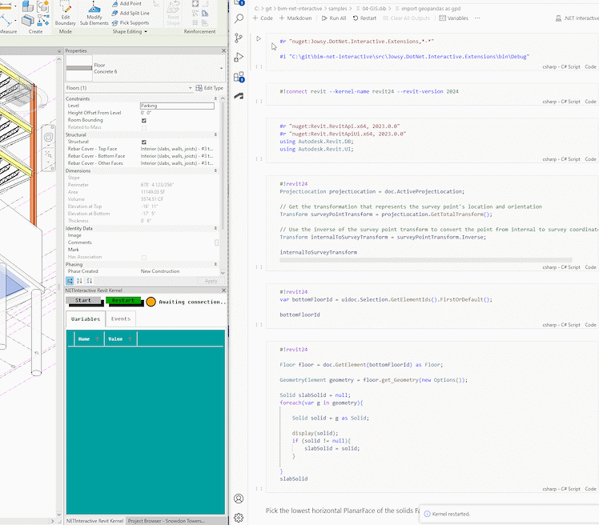
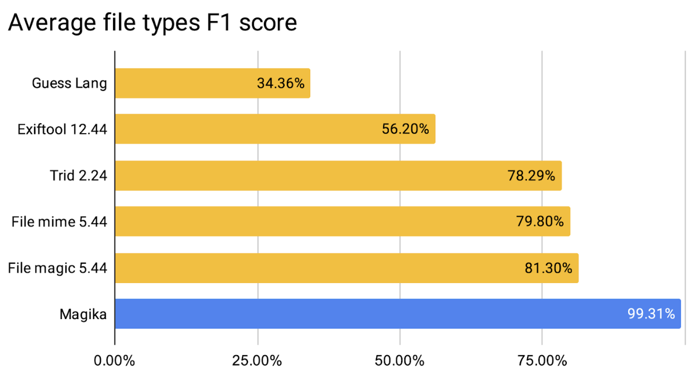

<head>
<meta http-equiv="Content-Type" content="text/html; charset=utf-8">
<link rel="stylesheet" type="text/css" href="bc.css">
<!-- https://highlightjs.org/#usage -->
<link rel="stylesheet" href="https://cdnjs.cloudflare.com/ajax/libs/highlight.js/11.9.0/styles/default.min.css">

</head>

<!---

- BIM Interactive Notebooks
  Chuong Ho
  https://chuongmep.com/
  https://www.linkedin.com/posts/chuongmep_opensource-ai-dataanalysis-activity-7164531381107183616-TYNP?utm_source=share&utm_medium=member_desktop
  I'm thrilled to share an open-source project that I believe holds immense potential.
  It enables you to integrate and analyze Revit model data in various ways using Jupyter Notebook use mutiple progaming language under Interactive .NET.
  The project has been brought to fruition, and it's truly gratifying to see its development, as it opens up significant opportunities with AI and data analysis.
  Check out the GitHub repository to explore more:
  https://lnkd.in/gWSsWppG
  /Users/jta/a/doc/revit/tbc/git/a/img/ch_jupyter.gif

- NotebookLM
  https://notebooklm.google/
  > NotebookLM gives you a personalized AI, grounded in the information you trust.
  NotebookLM is only available in the U.S. for users 18 and up

- TemporaryGraphicsManager in Action
  https://forums.autodesk.com/t5/revit-api-forum/temporarygraphicsmanager-in-action/td-p/12566892
  W7k Revit API Experiments - TemporaryGraphicsManager
  https://youtu.be/Q7aKEocvRtk
  LinkedIn BIM Experts -- https://www.linkedin.com/feed/update/urn:li:activity:7164217836867895296?utm_source=share&utm_medium=member_desktop
  Julian Wandzilak
  Today, I would like to share a recent discovery I made while working with Revit API. As many of you know, creating new graphical elements within Revit can be quite challenging and limited. However, I stumbled upon a little-known class called TemporaryGraphicsManager.
  The TemporaryGraphicsManager allows us to add temporary graphical elements directly to the model or drawing space. These graphics are not subject to undo actions and are not permanently saved anywhere. While they won’t clutter up your project, they provide a powerful way to enhance your user experience.
  Surprisingly, I haven’t seen this class widely used in other plugins or extensions. So, when I first encountered it, I knew I had to put it to the test.
  In the initial part of my video, I demonstrate how to align title lines to previously saved points. With a simple click, you can create temporary graphics that will guide your design process and allow you to snap your title lines to them!
  In the second part of the video, I collect points and save them to an external file for future reference. The TemporaryGraphicsManager conveniently marks their locations, eliminating the need to remember which points I’ve already saved.
  Is this the easiest method of controlling title lines? Perhaps not. In an upcoming update to my Drafter tool (to which I added recently 30 days of trial), I’ll introduce further automations in this area. But one thing is certain: I’ll continue to leverage the power of TemporaryGraphicsManage.

- classify line styles built-in versus user defined
  https://forums.autodesk.com/t5/revit-api-forum/finding-user-line-styles/m-p/12566994#M76897

- The curious case of JavaScript
  https://www.linkedin.com/pulse/curious-case-javascript-sandip-jadhav-ebobf

- LLM tokenisation 2:13:35 video
  Let's build the GPT Tokenizer
  https://youtu.be/zduSFxRajkE
  <iframe width="560" height="315" src="https://www.youtube.com/embed/zduSFxRajkE?si=H0TaI7Ro1ZOpmv0i" title="YouTube video player" frameborder="0" allow="accelerometer; autoplay; clipboard-write; encrypted-media; gyroscope; picture-in-picture; web-share" allowfullscreen></iframe>

- World Model on Million-Length Video and Language with RingAttention
  https://largeworldmodel.github.io/
  > The ability to correctly answer questions about an hour-long video is pretty impressive

- Air Canada must honor refund policy invented by airline’s chatbot
  https://arstechnica.com/tech-policy/2024/02/air-canada-must-honor-refund-policy-invented-by-airlines-chatbot/

- https://diataxis.fr/
  Diátaxis
  A systematic approach to technical documentation authoring.

- amara's law -- ubunbtu

- John Burn-Murdoch of the Financial Times
  Is the west talking itself into decline?

twitter:

Amara's law, progress versus risk, AI-based utilities, BIM interactive notebooks, classifying line styles, and TemporaryGraphicsManager in action  with the #RevitAPI @AutodeskRevit #BIM @DynamoBIM https://autode.sk/bimnotebook

Interactivity and AI keeps growing
&ndash; BIM interactive notebooks
&ndash; TemporaryGraphicsManager in action
&ndash; Classify line styles built-in vs user
&ndash; The curious case of JavaScript
&ndash; Magika AI-based file type classification
&ndash; NotebookLM
&ndash; AI understands videos better
&ndash; Airline chatbot invented a refund policy
&ndash; LLM tokenisation
&ndash; Diátaxis systematic technical documentation
&ndash; Amara's law
&ndash; Talking about progress versus risk...

linkedin:

Amara's law, progress versus risk, AI-based utilities, BIM interactive notebooks, classifying line styles, and TemporaryGraphicsManager in action  with the #RevitAPI

https://autode.sk/bimnotebook

- BIM interactive notebooks
- TemporaryGraphicsManager in action
- Classify line styles built-in vs user
- The curious case of JavaScript
- Magika AI-based file type classification
- NotebookLM
- AI understands videos better
- Airline chatbot invented a refund policy
- LLM tokenisation
- Diátaxis systematic technical documentation
- Amara's law
- Talking about progress versus risk...

#BIM #DynamoBIM #AutodeskAPS #Revit #API #IFC #SDK #Autodesk #AEC #adsk

the [Revit API discussion forum](http://forums.autodesk.com/t5/revit-api-forum/bd-p/160) thread

-->

### Interactive BIM Notebook, Temporary Graphics and AI

The amount of news items related to interactivity and AI keeps growing:

- [BIM interactive notebooks](#2)
- [TemporaryGraphicsManager in action](#3)
- [Classify line styles built-in vs user](#4)
- [The curious case of JavaScript](#5)
- [Magika AI-based file type classification](#6)
- [NotebookLM](#7)
- [AI understands videos better](#8)
- [Airline chatbot invented a refund policy](#9)
- [LLM tokenisation](#10)
- [Diátaxis systematic technical documentation](#11)
- [Amara's law](#12)
- [Talking about progress versus risk](#13)

#### BIM Interactive Notebooks

Hot on the foot of
Joel Waldheim Saury's [interactive .NET Revit BIM Polyglot Notebook](https://thebuildingcoder.typepad.com/blog/2024/02/net-core-c4r-views-and-interactive-hot-reload.html#4),
[Chuong Ho](https://chuongmep.com/) shares
his [BIM Interactive Notebooks](https://www.linkedin.com/posts/chuongmep_opensource-ai-dataanalysis-activity-7164531381107183616-TYNP?utm_source=share&utm_medium=member_desktop):

> I'm thrilled to share an open-source project that I believe holds immense potential.
It enables you to integrate and analyze Revit model data in various ways using Jupyter Notebook with multiple programming languages under Interactive .NET.
The project has been brought to fruition, and it's truly gratifying to see its development, as it opens up significant opportunities with AI and data analysis.
Explore further in the

> - [BIM Interactive Notebooks GitHub repository](https://github.com/jowsy/bim-net-interactive)

 <!-- Pixel Height: 656 Pixel Width: 748 -->

Many thanks to Chuong Ho for this!

#### TemporaryGraphicsManager in Action

[Julian Wandzilak](https://www.linkedin.com/in/wandzilak/) of [W7k](https://w7k.pl/) presents
the [`TemporaryGraphicsManager` in action](https://forums.autodesk.com/t5/revit-api-forum/temporarygraphicsmanager-in-action/td-p/12566892),
including a 45-second YouTube video [W7k Revit API Experiments - TemporaryGraphicsManager](https://youtu.be/Q7aKEocvRtk):

<iframe width="560" height="315" src="https://www.youtube.com/embed/Q7aKEocvRtk?si=ZYffG0lLTLgtXXRG" title="YouTube video player" frameborder="0" allow="accelerometer; autoplay; clipboard-write; encrypted-media; gyroscope; picture-in-picture; web-share" allowfullscreen></iframe>

> Today, I would like to share a recent discovery I made while working with Revit API. As many of you know, creating new graphical elements within Revit can be quite challenging and limited. However, I stumbled upon a little-known class called `TemporaryGraphicsManager`.
The TemporaryGraphicsManager allows us to add temporary graphical elements directly to the model or drawing space. These graphics are not subject to undo actions and are not permanently saved anywhere. While they won’t clutter up your project, they provide a powerful way to enhance your user experience.
Surprisingly, I haven’t seen this class widely used in other plugins or extensions. So, when I first encountered it, I knew I had to put it to the test.
In the initial part of my video, I demonstrate how to align title lines to previously saved points. With a simple click, you can create temporary graphics that will guide your design process and allow you to snap your title lines to them!
In the second part of the video, I collect points and save them to an external file for future reference. The TemporaryGraphicsManager conveniently marks their locations, eliminating the need to remember which points I’ve already saved.
Is this the easiest method of controlling title lines? Perhaps not. In an upcoming update to my Drafter tool (to which I added recently 30 days of trial), I’ll introduce further automations in this area. But one thing is certain: I’ll continue to leverage the power of TemporaryGraphicsManager.

Thank you for the heads-up, Julian!

#### Classify Line Styles Built-In vs User

An interesting example of several completely different possible approaches to
classify line styles in built-in versus user defined was finally solved
by Frank [@Fair59](https://forums.autodesk.com/t5/user/viewprofilepage/user-id/2083518) Aarssen in
the [Revit API discussion forum](http://forums.autodesk.com/t5/revit-api-forum/bd-p/160) thread
on [finding user line styles](https://forums.autodesk.com/t5/revit-api-forum/finding-user-line-styles/m-p/12566994):

**Question:**
I’m writing an addon that changes all the line styles of Detail Lines, Model Lines and the borders of Filled Regions to a certain line style.
But I'm having issues with distinguishing user built line styles from system / inbuilt ones.

To get all the lines styles and including the user and system ones, I use a FilteredElementCollector to find class GraphicsStyle:

<pre>
  IList&lt;Element&gt; getgs = new FilteredElementCollector(doc)
    .OfClass(typeof(GraphicsStyle))
    .ToElements();
</pre>

This works but returns a lot of styles some unrelated to lines, but I can use the `GraphicStyleCategory`, then Parent, then Name to find styles with the parent name “Lines”:

<pre>
  if (mystyle.GraphicsStyleCategory.Parent.Name == "Lines")
</pre>

So, now I have all the line styles, but I want to remove the system ones, which I thought were lines styles within &lt; and &gt;, such as &lt;Thin Lines&gt; or &lt;Wide Lines&gt;.

But, looking at the names that are returned, some have &lt;&gt;, some have only a &gt; at the end and others don't have anything to distinguish them.
These are the names returned:

<pre>
  &lt;Room Separation&gt;
  &lt;Insulation Batting Lines&gt;
  &lt;Sketch&gt;
  &lt;Lines&gt;
  &lt;Thin Lines&gt;
  &lt;Medium Lines&gt;
  &lt;Wide Lines&gt;
  &lt;Overhead&gt;
  &lt;Hidden&gt;
  &lt;Demolished&gt;
  &lt;Beyond&gt;
  Boundary&gt;
  Riser&gt;
  Run&gt;
  Landing Center&gt;
  &lt;Area Boundary&gt;
  &lt;Hidden Lines&gt;
  &lt;Space Separation&gt;
  &lt;Lines&gt;
  &lt;Lines&gt;
  &lt;Lines&gt;
  Stair Path&gt;
  &lt;Fabric Envelope&gt;
  &lt;Fabric Sheets&gt;
  Railing Rail Path Lines
  Railing Rail Path Extension Lines
  &lt;Centerline&gt;
  &lt;Axis of Rotation&gt;
  &lt;Path of Travel Lines&gt;
  &lt;Load Area Separation&gt;
  MyStyle
</pre>

Seems a little inconsistent to me...
Is there any good way to pick out the 'system' line styles so that I can only find ones the user has created?

**Answer:**
One possible approach that might work is to look at their element ids. These objects are elements, stored in the BIM db, hence equipped with element ids, aren't they? The element ids are assigned one by one as things get added to the database. Hence, higher element ids are added later. They are also incremented consecutively as work progresses. While this behaviour is undocumented and not officially supported or guaranteed in any way whatsoever, it has been working like that forever, afaik. Therefore, if you determine the highest element id in your project right now, you know that everything with a higher id has been added later. Therefore, you know that all line styles with an id higher than the highest one when you started initial work on your BIM are user generated in one way or another, and all lower ones are built-in. Does this help?

**Response:**
Thanks for your response.

I think I've found another way which better does what I'm doing for. After reading more I found that I can collect all CurveElements from the project with this:

<pre>
  List&lt;CurveElement&gt; AllCurves
    = new List&lt;CurveElement&gt;(
      new FilteredElementCollector(doc)
        .OfClass(typeof(CurveElement))
        .ToElements()
        .Cast&lt;CurveElement&gt;());
</pre>

Iterate through them and use the `GetLineStyleIds` method to get their `GraphicsStyles`... luckily, these appear to be named correctly with &lt;&gt; denoting 'System' line styles.

**Answer:**
A category has the property `BuiltInCategory`.
The graphicalStyleCategory of a user-defined line has a built-in category value of `Invalid`:

<pre>
  StringBuilder sb = new StringBuilder();
  Category LinesCat = Category.GetCategory(doc,
    BuiltInCategory.OST_Lines);
  IEnumerable&lt;GraphicsStyle&gt; getgs
    = new FilteredElementCollector(doc)
      .OfClass(typeof(GraphicsStyle))
      .Cast&lt;GraphicsStyle>();
  foreach(GraphicsStyle gs in getgs)
  {
    Category cat = gs.GraphicsStyleCategory;
    if(cat==null || cat.Parent==null)
      continue;
    if(cat.Parent.Id.IntegerValue != LinesCat.Id.IntegerValue)
      continue;
    if(cat.BuiltInCategory == BuiltInCategory.INVALID)
    {
      sb.AppendLine(string.Format(
        "User defined Line: {0}",cat.Name));
    }
    else
    {
      sb.AppendLine(string.Format(
        "System defined Line {0} / {1}",
        cat.BuiltInCategory, cat.Name));
    }
  }
  TaskDialog.Show("debug",sb.ToString());
</pre>

Thank you for this discussion and solution, Kevin and Frank.

#### The Curious Case of JavaScript

Moving away from pure Revit API topics,
for an interesting overview of the evolution and power of JavaScript, Sandip Jadhav describes his personal exploration
in [The curious case of JavaScript](https://www.linkedin.com/pulse/curious-case-javascript-sandip-jadhav-ebobf).

#### Magika AI-Based File Type Classification

Unrelated to BIM, determining the type of data contained in a computer file can be surprisingly tricky.
One important utility to address that need was provided in 1973 by
the [Unix `file` command](https://en.wikipedia.org/wiki/File_(command)).
50 years later, Google just open-sourced [Magika](https://google.github.io/magika/),
an AI-based approach to this task with higher performance:

- [Magika blog post](https://opensource.googleblog.com/2024/02/magika-ai-powered-fast-and-efficient-file-type-identification.html)
- [Magika GitHub repository](https://github.com/google/magika/)

 <!-- Pixel Height: 720 Pixel Width: 1,328 -->

#### NotebookLM

Google also introduced
the [NotebookLM experiment](https://notebooklm.google/) touting
an interface that lets you easily shift between reading a text, asking questions about it and writing with built-in AI support that can
also transform your set of notes into an outline, blog post, business plan, and more:

> NotebookLM gives you a personalized AI, grounded in the information you trust.
NotebookLM is only available in the U.S. for users 18 and up.

#### AI understands videos better

On the topic of AI, the research
on a [world model on million-length video and language with RingAttention](https://largeworldmodel.github.io/) now
enables the pretty impressive ability to correctly answer questions about an hour-long video.

#### Airline Chatbot Invented a Refund Policy

AIs still are prone to mistakes as well, though,
and [Air Canada must honor refund policy invented by airline’s chatbot](https://arstechnica.com/tech-policy/2024/02/air-canada-must-honor-refund-policy-invented-by-airlines-chatbot/).

#### LLM Tokenisation

One fundamental and tricky aspect of large language models is discussed in full depth in the two-and-a-quarter hour video
on [LLM tokenisation &ndash; let's build the GPT tokenizer](https://youtu.be/zduSFxRajkE):

<iframe width="560" height="315" src="https://www.youtube.com/embed/zduSFxRajkE?si=H0TaI7Ro1ZOpmv0i" title="YouTube video player" frameborder="0" allow="accelerometer; autoplay; clipboard-write; encrypted-media; gyroscope; picture-in-picture; web-share" allowfullscreen></iframe>

That might help better understand some of the occasional AI weirdness.

#### Diátaxis Systematic Technical Documentation

Unrelated to both Revit and AI, a colleague pointed out [Diátaxis](https://diataxis.fr/):

> A systematic approach to technical documentation authoring.

It is of interest to me and our entire team, since it applies to most of the work I do, including my writing right now.

#### Amara's Law

Finally, for a fundamental aspect of our human nature that applies to almost everything we do,
Roy Amara formulated [Amara's law](https://en.wikipedia.org/wiki/Roy_Amara#Amara's_law) in the 1960s:

We tend to overestimate the effects of a technology in the short run and underestimate them in the long run.

His observation was not only about technology, but human behaviour in general: we are curious and impatient.
We get excited about new things and are quickly disappointed when they don't immediately perform as expected.
Especially from technologies, we expect too much too quickly and have little patience with the need for innovation to develop with time.
AI is a good example: the initial mixture of euphoria and panic has rapidly faded.
Another example, our health behaviour: we often initially overestimate behavioural changes &ndash; a new training method, meditation, or diet &ndash; and enthusiastically view them as a panacea, underestimating long-term benefits.
Often, people don't stick with a behaviour long enough to see its true benefits and returns.
Or, other people ([Sartre's hell](https://duckduckgo.com/?q=sartre+hell)): we get to know a person, like her, fall in love.
Reality sets in, initially exciting aspects irritate.
Get through that phase and realise that the other person is not perfect (but neither are we), and the tide turns.
So, again, we tend to overestimate people in the short term and underestimate them in the long term.

#### Talking About Progress versus Risk

Continuing to wax philosophical, with an eye to the interesting times we are living in and actively creating today, every day,
John Burn-Murdoch of the Financial Times recently asked,
[is the west talking itself into decline?](https://duckduckgo.com/?q=Is+the+west+talking+itself+into+decline%3F)

A recent [scientific paper](https://docs.iza.org/dp16674.pdf) used textual analysis of 173,031 works printed in England between 1500 and 1900 and found significant correlation between vocabulary and culture.

> Extending the same analysis to the present, a striking picture emerges:
over the past 60 years, the west has begun to shift away from the culture of progress, and towards one of caution, worry and risk-aversion, with economic growth slowing over the same period.
The frequency of terms related to progress, improvement and the future has dropped by about 25 per cent since the 1960s, while those related to threats, risks and worries have become several times more common.

So: don't worry, be happy!

Take a risk and innovate!

