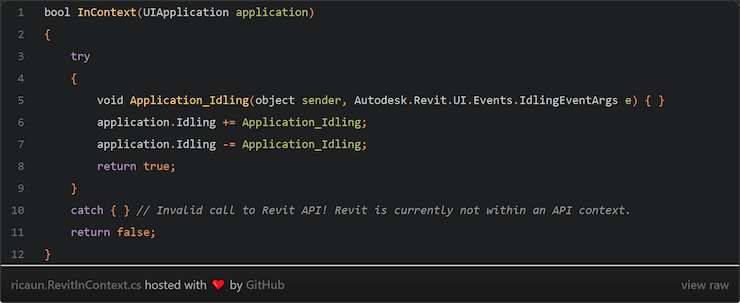

<head>
<meta http-equiv="Content-Type" content="text/html; charset=utf-8">
<link rel="stylesheet" type="text/css" href="bc.css">
<!-- https://highlightjs.org/#usage
<link rel="stylesheet" href="https://cdnjs.cloudflare.com/ajax/libs/highlight.js/11.9.0/styles/default.min.css">

-->

<!-- https://prismjs.com -->
<link href="https://cdn.jsdelivr.net/npm/prismjs@1.29.0/themes/prism.min.css" rel="stylesheet" />

</head>

<!---

- How to know if Revit API is in Context
  https://forums.autodesk.com/t5/revit-api-forum/how-to-know-if-revit-api-is-in-context/td-p/12574320
  finally cracked!

- Detecting Revit User Input State in Real-Time via Revit API
  https://forums.autodesk.com/t5/revit-api-forum/detecting-revit-user-input-state-in-real-time-via-revit-api/td-p/12610444

- Easy Revit API
  https://easyrevitapi.com/

- https://www.linkedin.com/posts/chuongmep_ai-bim-aps-activity-7167851379355533313-hs3r?utm_source=share&utm_medium=member_desktop
  Chuong HoChuong Ho
  Computational Design Researcher | Autodesk Expert Elite | ConsultantComputational Design Researcher | Autodesk Expert Elite | Consultant
  https://chuongmep.com/
  I am excited to announce a significant development in data interaction and retrieval processes using Autodesk Platform Services from Autodesk. Today, I am officially releasing the first version of a toolkit designed to facilitate data access, aiming to support AI processes, Data Analysts, LLM, and explore the boundaries where APS may fall short in providing for end-users.
  This toolkit is open-source, ensuring accessibility to all engineers, BIM developers, and data scientists. I am actively working on refining it further. Please feel free to provide any feedback in the comments below this post, and I will consider all suggestions.
  Open Source: https://lnkd.in/ghkv_BhM
  #AI #BIM #APS #Automation #LLM #DataAnalysis #OpenSource

- DA4R: referencing UI is OK, just make sure you don't call it
  https://forums.autodesk.com/t5/revit-api-forum/revit-design-automation-api-using-the-reference-to-revitapiui/m-p/12563120

- Using argument "adskDebug" to troubleshot failure job of Design Automation
  https://aps.autodesk.com/blog/using-argument-adskdebug-troubleshot-failure-job-design-automation
  by Zhong Wu
  just add the following argument when you post your DA workitem:
    "adskDebug": { "uploadJobFolder": true }

- The killer app of Gemini Pro 1.5 is video
  https://simonwillison.net/2024/Feb/21/gemini-pro-video/

- Generative AI exists because of the transformer
  https://ig.ft.com/generative-ai/
  a beginner's guide to understanding LLM

- White House urges developers to dump C and C++
  https://www.infoworld.com/article/3713203/white-house-urges-developers-to-dump-c-and-c.amp.html

- The harsh reality of ultra processed food - with Chris Van Tulleken
  https://youtu.be/5QOTBreQaIk

remove aps toolkit:

From: Jeremy Tammik
Date: Tuesday, March 19, 2024 at 14:52
To: Cyrille Fauvel
Subject: Re: Blog article

Chuong could replace me several times over.

I suspect he is pretty busy with his own projects, though:

https://chuongmep.com/

The blog post is cleaned now.

Cheers

jeremy

From: Cyrille Fauvel
Date: Tuesday, March 19, 2024 at 14:28
To: Jeremy Tammik
Subject: Re: Blog article
Hi Jeremy,

No, this is the first time I have heard about him. That is good to know as Mikako needs to look for your replacement 😉

Regards,

Cyrille Fauvel

From: Jeremy Tammik
Date: Tuesday, March 19, 2024 at 6:25 PM
To: Cyrille Fauvel
Subject: Re: Blog article

Dear Cyrille,

yes, sure, i'll do that right away.

sorry, i was not aware of that.

Chuong Ho is an incredibly active and highly competent Revit API community contributor, by the way.

i guess he is in the APS scene as well, and that you are aware of that?

cheers

jeremy

From: Cyrille Fauvel
Subject: Blog article

Hi Jeremy,

Would you mind removing any reference to the APS toolkit from this blog article?

https://thebuildingcoder.typepad.com/blog/2024/03/api-context-aps-toolkit-and-da4r-debugging.html

The APS Toolkit explains the internal SVF format and how to download it locally. While it is technically possible, and I usually tell people how to do it, we want to promote something other than this. Putting it on your blog makes it highly visible and indicates Autodesk supports it, and, as an Autodesk employee with lots of readers, encourages people to do it.

https://github.com/chuongmep/aps-toolkit

Regards,

Cyrille Fauvel
----

twitter:

Check for a valid Revit API context, APS debugging toolkit, AI and other news with the #RevitAPI @AutodeskRevit #BIM @DynamoBIM https://autode.sk/rvtapicontext

We present a long-awaited solution to check for a valid Revit API context and a whole bunch of short pointers to other mostly AI-related topics of interest
&ndash; Determining Revit API context
&ndash; Detect Revit user input state
&ndash; Easy Revit API
&ndash; APS toolkit
&ndash; Gemini with image and video input
&ndash; LLM is not self-aware
&ndash; Generative AI transformer
&ndash; Design to reduce junk data
&ndash; C and C++ are risky
&ndash; Ultra-processed food is toxic...

linkedin:

Check for a valid Revit API context, APS debugging toolkit, AI and other news with the #RevitAPI

https://autode.sk/rvtapicontext

- Determining Revit API context
- Detect Revit user input state
- Easy Revit API
- APS toolkit
- Gemini with image and video input
- LLM is not self-aware
- Generative AI transformer
- Design to reduce junk data
- C and C++ are risky
- Ultra-processed food is toxic...

#BIM #DynamoBIM #AutodeskAPS #Revit #API #IFC #SDK #Autodesk #AEC #adsk

the [Revit API discussion forum](http://forums.autodesk.com/t5/revit-api-forum/bd-p/160) thread

-->

### API Context, Input State and DA4R Debugging

We present a long-awaited solution to check for a valid Revit API context and a whole bunch of short pointers to other topics of interest, mostly AI related:

- [Determining Revit API context](#2)
- [Detect Revit user input state](#3)
- [Easy Revit API](#4)
- [Gemini with image and video input](#6)
- [LLM is not self-aware](#7)
- [Generative AI transformer](#8)
- [Design to reduce junk data](#9)
- [C and C++ are risky](#10)
- [Ultra-processed food is toxic](#11)

#### Determining Revit API Context

Luiz Henrique [@ricaun](https://ricaun.com/) Cassettari finally cracked the
question [how to know if Revit API is in context](https://forums.autodesk.com/t5/revit-api-forum/how-to-know-if-revit-api-is-in-context/td-p/12574320):

> Revit API throws exceptions if your code is trying to execute Revit API methods in a modeless context, e.g., a WPF modeless view; that's the reason you need to use `ExternalEvent` to execute Revit API code in context.

> Sometimes you need to know whether code is running in context or if not, to just execute the Revit API code right away or send it to ExternalEvent to be executed.

> If you have access to `UIApplication` or `UIControllerApplication`, and if you try to subscribe to an event outside Revit API context, you are gonna have this exception: Invalid call to Revit API! Revit is currently not within an API context.

> Meaning: you can use that to know if your code is in context or not.

 <!-- Pixel Height: 303 Pixel Width: 740 -->

> - [Code sample and video](https://ricaun.com/revit-api-context/)
- 14-minute video on [Tasks and InContext in Revit API](https://youtu.be/gyo6xGN5DDU)

> I'm using this technique using my open source library to manage the creation of an external event if it is not in context and enable it to run Revit API asynchronously in [ricaun.Revit.UI.Tasks](https://github.com/ricaun-io/ricaun.Revit.UI.Tasks).

Many thanks to ricaun for sharing this long-sought-after solution!

#### Detect Revit User Input State

In a related vein, we also discussed the question
of [detecting Revit user input state in real-time via Revit API](https://forums.autodesk.com/t5/revit-api-forum/detecting-revit-user-input-state-in-real-time-via-revit-api/td-p/12610444).

#### Easy Revit API

Big welcome to a new member in the Revit programming blogosphere,
[Easy Revit API](https://easyrevitapi.com/).
Welcome, Mohamed-Youssef.
Best of luck and much success with your blog and other projects!

<!--

#### APS Toolkit

In the last post,
I mentioned [Chuong Ho](https://chuongmep.com/)'s
[BIM interactive notebooks](https://thebuildingcoder.typepad.com/blog/2024/02/interactive-bim-notebook-temporary-graphics-and-ai.html#2).

Now you can see how he put them to use in his newest project,
the [APS Toolkit](https://github.com/chuongmep/aps-toolkit):

> I am excited to announce a significant development in data interaction and retrieval processes using Autodesk Platform Services from Autodesk. Today, I am officially releasing the first version of a toolkit designed to facilitate data access, aiming to support AI processes, Data Analysts, LLM, and explore the boundaries where APS may fall short in providing for end-users.
This toolkit is open source, ensuring accessibility to all engineers, BIM developers, and data scientists. I am actively working on refining it further. Please feel free to provide any feedback in the comments below this post, and I will consider all suggestions.

[APS Toolkit](https://github.com/chuongmep/aps-toolkit) empowers you to explore the Autodesk Platform Services APS.
It's built on top of [Autodesk.Forge](https://www.nuget.org/packages/Autodesk.Forge/)
and [Newtonsoft.Json](https://www.nuget.org/packages/Newtonsoft.Json/).
The toolkit includes features enabling you to read, download and write data from APS and export to CSV, Excel, JSON, XML, etc.

Features:

- Read/Download SVF Model
- Read/Query Properties Database SQLite
- Read/Download Properties Without Viewer
- Read Geometry Data
- Read Metadata
- Read Fragments
- Read MeshPacks
- Read Images
- Export Data to CSV
- Export Data to Excel
- Export Data to Parquet

Sample usage to export Revit Data To Excel using .NET C&#35;:

<pre><code class="language-csharp">using APSToolkit;
using Autodesk.Forge;
using APSToolkit.Database;
using APSToolkit.Auth;
var token = Authentication.Get2LeggedToken().Result;
string urn = "dXJuOmFkc2sud2lwcHJvZDpmcy5maWxlOnZmLk9kOHR4RGJLU1NlbFRvVmcxb2MxVkE_dmVyc2lvbj0z";
var RevitPropDbReader = new PropDbReaderRevit(urn, token);
RevitPropDbReader.ExportAllDataToExcel("result.xlsx");
</code></pre>

Sample usage to export Revit Data To Excel using Python:

<pre><code class="language-python">from aps_toolkit import Auth
from aps_toolkit import PropDbReaderRevit
auth = Auth()
token = auth.auth2leg()
urn = "dXJuOmFkc2sud2lwcHJvZDpmcy5maWxlOnZmLk9kOHR4RGJLU1NlbFRvVmcxb2MxVkE_dmVyc2lvbj0z"
prop_reader = PropDbReaderRevit(urn, token)
df = prop_reader.get_data_by_category("Ducts")
df.save_to_excel("result.xlsx")
</code></pre>

Many thanks to Chuong Ho for creating and sharing this powerful toolkit!

-->

#### Gemini with Image and Video Input

An impressive example of use of LLM with video input support is presented stating
that [the killer app of Gemini Pro 1.5 is video](https://simonwillison.net/2024/Feb/21/gemini-pro-video.

I tested using Gemini myself for
a [Revit API discussion forum](http://forums.autodesk.com/t5/revit-api-forum/bd-p/160) question
on [2024 dark theme colouring addins](https://forums.autodesk.com/t5/revit-api-forum/2024-dark-theme-colouring-addins/m-p/12614689) with
acceptable and useful results, afaict.

#### LLM is not Self-Aware

... Even
though [Anthropic’s Claude 3 causes stir by seeming to realize when it was being tested](https://arstechnica.com/information-technology/2024/03/claude-3-seems-to-detect-when-it-is-being-tested-sparking-ai-buzz-online/).

#### Generative AI transformer

A nice beginner's guide to understanding LLM explains
why [generative AI exists because of the transformer](https://ig.ft.com/generative-ai/).

#### Design to Reduce Junk Data

We are generating huge and ever-growing amounts of data, much of which is useless and never looked at again, so it is well worth
pondering &ndash; and avoiding &mdash; [design patterns that encourage junk data](https://css-irl.info/design-patterns-that-encourage-junk-data/).

#### C and C++ are Risky

70 percent of all security vulnerabilities are caused by memory safety issues, and many of those are automatically eliminated by working in a memory-safe programming language.
Therefore,
the [White House urges developers to dump C and C++](https://www.infoworld.com/article/3713203/white-house-urges-developers-to-dump-c-and-c.amp.html).

#### Ultra-Processed Food is Toxic

Talking about things we ought to dump, I seldom watch long videos, but this hour-long one had me mesmerised all the way through:
[the harsh reality of ultra processed food with Chris Van Tulleken](https://youtu.be/5QOTBreQaIk).

