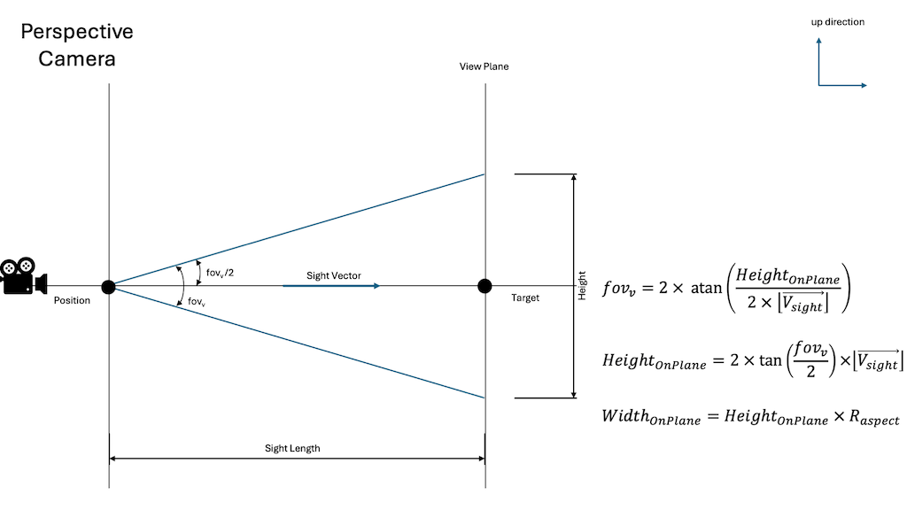

<head>
<meta http-equiv="Content-Type" content="text/html; charset=utf-8">
<link rel="stylesheet" type="text/css" href="bc.css">
<!-- https://highlightjs.org/#usage
<link rel="stylesheet" href="https://cdnjs.cloudflare.com/ajax/libs/highlight.js/11.9.0/styles/default.min.css">

-->

<!-- https://prismjs.com -->
<link href="https://cdn.jsdelivr.net/npm/prismjs@1.29.0/themes/prism.min.css" rel="stylesheet" />

</head>

<!---

- Feedback Requested - Bowerbird: C# Scripting for Revit
  https://forums.autodesk.com/t5/revit-api-forum/feedback-requested-bowerbird-c-scripting-for-revit/td-p/12643568

- Doors traversed on path of travel lines
  https://forums.autodesk.com/t5/revit-api-forum/doors-traversed-on-path-of-travel-lines/td-p/12616109
  % bl 1740 1744 1781 1836 1871 1917 2028
  <ul>
  <li><a href="https://thebuildingcoder.typepad.com/blog/2019/04/whats-new-in-the-revit-2020-api.html">What's New in the Revit 2020 API</a></li>
  <li><a href="https://thebuildingcoder.typepad.com/blog/2019/04/new-revit-2020-sdk-samples.html">New Revit 2020 SDK Samples</a></li>
  <li><a href="https://thebuildingcoder.typepad.com/blog/2019/09/whats-new-in-the-revit-20201-api.html">What's New in the Revit 2020.1 API</a></li>
  <li><a href="https://thebuildingcoder.typepad.com/blog/2020/04/whats-new-in-the-revit-2021-api.html">What's New in the Revit 2021 API</a></li>
  <li><a href="https://thebuildingcoder.typepad.com/blog/2020/10/firerevit-deprecated-api-and-elbow-centre-point.html">FireRevit, Deprecated API and Elbow Centre Point</a></li>
  <li><a href="https://thebuildingcoder.typepad.com/blog/2021/09/view-sheet-from-view-and-select-all-on-level.html">View Sheet from View and Select All on Level</a></li>
  <li><a href="https://thebuildingcoder.typepad.com/blog/2024/02/interactive-bim-notebook-temporary-graphics-and-ai.html">Interactive BIM Notebook, Temporary Graphics and AI</a></li>
  </ul>

- We’re excited to introduce Claude 3, our next generation of vision-enabled AI models - now available on claude.ai.
  https://www.anthropic.com/news/claude-3-family
  https://claude.ai/

- Introducing Devin, the first AI software engineer
  https://www.cognition-labs.com/blog
  March 12th, 2024 | Written by Scott Wu
  Meet Devin, the world’s first fully autonomous AI software engineer.

- generates image, but badly, inattentive, does not follow the detailed prompt: https://imagine.meta.com/

- What is climate change? A really simple guide
  https://www.bbc.com/news/science-environment-24021772

twitter:

 with the #RevitAPI @AutodeskRevit #BIM @DynamoBIM

&ndash; ...

linkedin:

#BIM #DynamoBIM #AutodeskAPS #Revit #API #IFC #SDK #Autodesk #AEC #adsk

the [Revit API discussion forum](http://forums.autodesk.com/t5/revit-api-forum/bd-p/160) thread

-->

### Script on the Fly, Camera Settings and PoT Doors Traversed

#### Bowerbird C&#35; Scripting for Revit

[Christopher Diggins](https://github.com/cdiggins) published
[Bowerbird](https://github.com/ara3d/bowerbird).
It accelerates and simplifies C# tool and plug-in development by dynamically compiling C# source files:
He would appreciate comments on it in
the [Revit API discussion forum](http://forums.autodesk.com/t5/revit-api-forum/bd-p/160)
thread [Feedback Requested &ndash; Bowerbird](https://forums.autodesk.com/t5/revit-api-forum/feedback-requested-bowerbird-c-scripting-for-revit/td-p/12643568),
saying:

> I've released a new open-source project for Revit C# developers called Bowerbird.
It uses the Roslyn C# compiler to allow users to create and edit new commands directly from C# source files,
without having to go through the process of creating and deploying a plug-in, and re-launching Revit.

> It is inspired
by [pyRevit](https://github.com/eirannejad/pyRevit) by [Ehsan Iran-Nejad](https://github.com/eirannejad)
and [Revit.ScriptCS](https://github.com/sridharbaldava/Revit.ScriptCS) by [Sridhar Baldava](https://github.com/sridharbaldava).

> I'd greatly appreciate any feedback or contributions at https://github.com/ara3d/bowerbird/
Thanks in advance!

Many thanks to Christopher for creating and sharing this helpful tool!

#### Doors traversed on path of travel lines

Doors traversed on path of travel lines
https://forums.autodesk.com/t5/revit-api-forum/doors-traversed-on-path-of-travel-lines/td-p/12616109
% bl 1740 1744 1781 1836 1871 1917 2028
<ul>
<li><a href="https://thebuildingcoder.typepad.com/blog/2019/04/whats-new-in-the-revit-2020-api.html">What's New in the Revit 2020 API</a></li>
<li><a href="https://thebuildingcoder.typepad.com/blog/2019/04/new-revit-2020-sdk-samples.html">New Revit 2020 SDK Samples</a></li>
<li><a href="https://thebuildingcoder.typepad.com/blog/2019/09/whats-new-in-the-revit-20201-api.html">What's New in the Revit 2020.1 API</a></li>
<li><a href="https://thebuildingcoder.typepad.com/blog/2020/04/whats-new-in-the-revit-2021-api.html">What's New in the Revit 2021 API</a></li>
<li><a href="https://thebuildingcoder.typepad.com/blog/2020/10/firerevit-deprecated-api-and-elbow-centre-point.html">FireRevit, Deprecated API and Elbow Centre Point</a></li>
<li><a href="https://thebuildingcoder.typepad.com/blog/2021/09/view-sheet-from-view-and-select-all-on-level.html">View Sheet from View and Select All on Level</a></li>
<li><a href="https://thebuildingcoder.typepad.com/blog/2024/02/interactive-bim-notebook-temporary-graphics-and-ai.html">Interactive BIM Notebook, Temporary Graphics and AI</a></li>
</ul>

#### Camera Mapping between APS Viewer and Revit

In 2019, Eason Kang shared a very helpful explanation on how
to [map Forge viewer camera back to Revit](https://aps.autodesk.com/blog/map-forge-viewer-camera-back-revit).

However, some aspects changed, and some were left uncovered back then, as discussed in
the new [Revit API discussion forum](http://forums.autodesk.com/t5/revit-api-forum/bd-p/160)
on [Revit 3D view camera settings](https://forums.autodesk.com/t5/revit-api-forum/revit-3d-view-camera-settings/m-p/12629132).

So, Eason took another deep dive into the topic, researched, tested, organized all the material and published it in two blog posts:

- [From APS viewer to Revit](https://aps.autodesk.com/blog/camera-mapping-between-aps-viewer-and-revit-part-i-restore-viewer-camera-revit)
- [From Revit to APS viewer](https://aps.autodesk.com/blog/camera-mapping-between-aps-viewer-and-revit-part-ii-restore-revit-camera-viewer)

The associated sample code lives in the

- [aps-viewer-revit-camera-sync GitHub repo](https://github.com/yiskang/aps-viewer-revit-camera-sync)

<!--
If you’re interested, here are the old discussions with another customer about doing something similar.
Cf. https://forge.zendesk.com/agent/tickets/14155
-->

 <!-- Pixel Height: 576 Pixel Width: 1,024 -->

Ever so many thanks to Eason for his very careful research and documentation.

#### Claude 3 can See

Claude 3 is now available, an LLM AI model, now vision-enabled and scoring high several intelligence tests:

- [Claude 3 announcement](https://www.anthropic.com/news/claude-3-family)
- [Claude 3 entry point](https://claude.ai/)

#### Devin, an AI software engineer

Another announcment
introduces [Devin, the first AI software engineer](https://www.cognition-labs.com/blog),
a fully autonomous AI software engineer.

#### Meta Imagine Generates Images

[Meta Imagine](https://imagine.meta.com/) generates images,
cf., [Meta launches web-based AI image generator trained on your Instagram pics](https://uk.pcmag.com/ai/150034/meta-launches-web-based-ai-image-generator-ai-updates-across-its-apps).

I briefly tested it to create an image of the real-world scene in front of me and was unable to tweak the prompt to generate a satisfactory result.
My impression was that it very quickly ignored important aspects of my prompt, e.g., specific colour requests, etc., even when I repeated them, so I gave up unsatisfied.

#### An LLM for Decompiling Binary Code

[LLM4Decompile: Decompiling Binary Code with Large Language Models](https://arxiv.org/abs/2403.05286)
[LLM4Decompile GitHub repo](https://github.com/albertan017/LLM4Decompile)

#### A Simple Top-Level Overview of Climate Change

BBC shares a very basic and comprehensive article
explaining [What is climate change? A really simple guide](https://www.bbc.com/news/science-environment-24021772).

<pre><code class="language-csharp">
</code></pre>

<pre><code class="language-python">
</code></pre>

Many thanks to ??? for creating and sharing this powerful toolkit!

