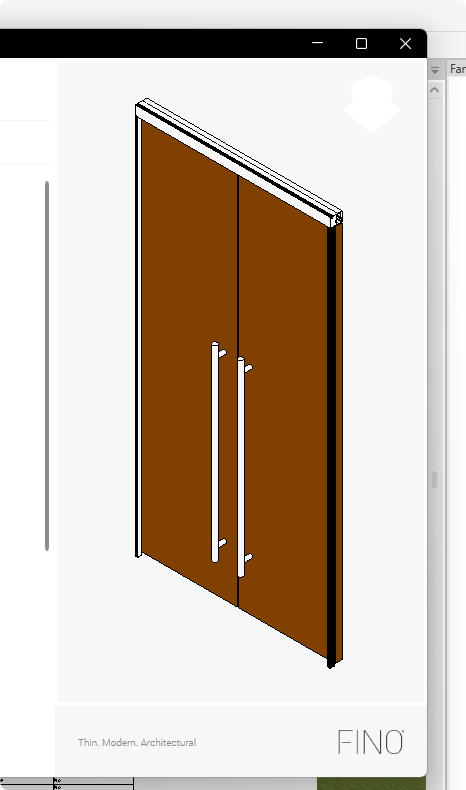
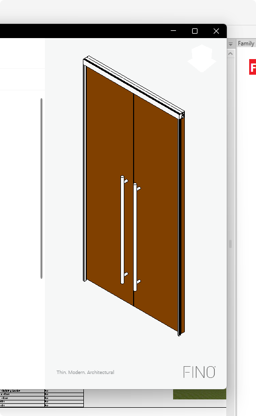

<head>
<meta http-equiv="Content-Type" content="text/html; charset=utf-8">
<link rel="stylesheet" type="text/css" href="bc.css">
<!-- https://highlightjs.org/#usage
<link rel="stylesheet" href="https://cdnjs.cloudflare.com/ajax/libs/highlight.js/11.9.0/styles/default.min.css">

-->

<!-- https://prismjs.com -->
<link href="https://cdn.jsdelivr.net/npm/prismjs@1.29.0/themes/prism.min.css" rel="stylesheet" />

</head>

<!---

- PreviewControl border
  https://forums.autodesk.com/t5/revit-api-forum/previewcontrol-border/td-p/12570113
  /Users/jta/a/doc/revit/tbc/git/a/img/preview_border_hide.png

- change level of piping elements
  https://forums.autodesk.com/t5/revit-api-forum/transferring-elements-from-one-level-to-another-while/m-p/12664814#M77745

twitter:

 @AutodeskRevit with the #RevitAPI #BIM @DynamoBIM

&ndash; ...

linkedin:

#BIM #DynamoBIM #AutodeskAPS #Revit #API #IFC #SDK #Autodesk #AEC #adsk

the [Revit API discussion forum](http://forums.autodesk.com/t5/revit-api-forum/bd-p/160) thread

-->

### Change Pipe Level and Suppress PreviewControl Border

- [Suppressing the `PreviewControl` border](#2)
- [Changing the level of piping elements](#3)

#### Suppressing the PreviewControl Border

Roman [@Nice3point](https://t.me/nice3point) Karpovich, aka Роман Карпович,
raised and solved the question of how to suppress the unwanted
[PreviewControl border](https://forums.autodesk.com/t5/revit-api-forum/previewcontrol-border/td-p/12570113):

**Question:**
Is it possible to disable the PreviewControl border ? This border comes from the Win32 window. Setting User32.WindowStyles by Hwnd handle does not give any results. Except WS_CHILD and similar, no other styles are applied. Is this border added by Revit development team or is it a HwndHost issue ?

 <!-- Pixel Height: 592 Pixel Width: 523 -->

 <!-- Pixel Height: 790 Pixel Width: 466 -->

 <!-- Pixel Height: 852 Pixel Width: 525 -->

Speed_CAD
  Advocate Speed_CAD  in reply to: nice3point
2024-02-19 07:31 PM
Hi,

The only way I could do it when I used it, was to set the Grid margin to -4, but this only works if the grid is set entirely to the window.
Mauricio Jorquera
Tags (0)
Add tags
Report
MESSAGE 3 OF 16
nice3point
  Advocate nice3point  in reply to: Speed_CAD
2024-02-20 01:10 AM
It's not a solution, negative margin just covers other content
Tags (0)
Add tags
Report
MESSAGE 4 OF 16
Speed_CAD
  Advocate Speed_CAD  in reply to: nice3point
2024-02-20 01:21 AM
I don't like the negative margin either, but it was the only way to hide the border. And for it to work, the container (Grid) must cover the entire window.
Mauricio Jorquera
Tags (0)
Add tags
Report
MESSAGE 5 OF 16
nice3point
  Advocate nice3point  in reply to: nice3point
2024-02-20 01:23 AM
@jeremytammikhi Jeremy, can you ask the Revit team where this border comes from?
Tags (0)
Add tags
Report
MESSAGE 6 OF 16
jeremy_tammik
  Autodesk jeremy_tammik  in reply to: nice3point
2024-02-20 01:34 AM

Sure. Thank you for asking. I passed it on to them internally.

Jeremy Tammik,  Developer Advocacy and Support, The Building Coder, Autodesk Developer Network, ADN Open
Tags (0)
Add tags
Report
MESSAGE 7 OF 16
cwaluga
  Advocate cwaluga  in reply to: jeremy_tammik
2024-03-04 11:08 AM
You can use Spy++ to determine the window structure and use WinAPI to remove the borders and some WPF magic to trigger the repaint. It took me hours of experimenting, but it is doable. If I recall correctly, there are multiple levels of controls and you have to figure out which ones carry the borders.

I am off for a while and have no access to the code, but don’t feel discouraged if it doesn’t work the first time. It was really painful to solve this and I wish Autodesk would just remove the borders in an upcoming release. It is hard to make software look good if the underlying API takes you back to the nineties ;-).
Tags (0)
Add tags
Report
MESSAGE 8 OF 16
nice3point
  Advocate nice3point  in reply to: nice3point
2024-03-04 01:12 PM
@cwaluga  perfect) can you share your code?
@jeremy_tammik   any updates from the Revit team?
Tags (0)
Add tags
Report
MESSAGE 9 OF 16
jeremy_tammik
  Autodesk jeremy_tammik  in reply to: nice3point
2024-03-05 12:04 AM
Nope, no updates yet. I added @cwaluga 's comments to my query and reprompted. Thank you for those!

Jeremy Tammik,  Developer Advocacy and Support, The Building Coder, Autodesk Developer Network, ADN Open
Tags (0)
Add tags
Report
MESSAGE 10 OF 16
cwaluga
  Advocate cwaluga  in reply to: nice3point
2024-03-25 04:14 AM
@nice3point @jeremy_tammik
I cannot share the actual code, unfortunately. Our codebase is really massive and closed ;-).
While I cannot find the time to provide a full working example, I can post some code for you to fill the gaps. The important snippet (to be called after previewControl.Loaded AND previewControll.IsVisibleChanged) is the following:

// get preview window host
var previewWndHost = previewControl.Content;
if (previewWndHost is null)
  return;

// get preview view handle
var previewHwnd = (IntPtr)previewWndHost.GetType().GetProperty("Handle").GetValue(previewWndHost, null);
if (previewHwnd == IntPtr.Zero)
  return;

// remove WS_EX_CLIENTEDGE on all child windows
foreach (var hwnd in HwndHelpers.GetAllChildHandles(previewHwnd).Append(previewHwnd))
{
  var style = User32.GetWindowLong(hwnd, Constants.GWL_EXSTYLE).ToInt32() & ~(int)Constants.WS_EX_CLIENTEDGE;
  User32.SetWindowLong(hwnd, Constants.GWL_EXSTYLE, style);
}

// trigger redraw by adding or removing a slight padding at the bottom
// the original padding is stored in the tag, so try to avoid using the
// tag property for anything else if you want this to work.
var p = previewControl.Padding;
if (previewControl.Tag is null)
  previewControl.Tag = p;
if (previewControl.Tag is System.Windows.Thickness t)
{
  p.Bottom = p.Bottom == t.Bottom ? p.Bottom + 1 : t.Bottom;
  previewControl.Padding = p;
}

The IsVisibleChanged handler is required for use in tab controls, since Revit seems to re-create the view in case of visibility changes. I misused the tag to save the previous state and avoid shrinking/growing of the control due to the padding-changes at "reentry". If you find a better solution to trigger the redraw, please let me know. This part is pretty hacky, but I had to move on at some point and got stuck with whatever did the job.

I also use some WinAPI functions which can be easily imported (google, pinvoke). The HwndHelpers function is just syntactic sugar around EnumChildWindows.

public static IList<IntPtr> GetAllChildHandles(IntPtr hwnd)
{
  var childHandles = new List<IntPtr>();
  var gcChildHandles = GCHandle.Alloc(childHandles);

  try
  {
    bool EnumWindow(IntPtr hWnd, IntPtr lParam)
    {
      (GCHandle.FromIntPtr(lParam).Target as List<IntPtr>)?.Add(hWnd);
      return true;
    }

    var childProc = new User32.EnumWindowsProc(EnumWindow);
    User32.EnumChildWindows(hwnd, childProc, GCHandle.ToIntPtr(gcChildHandles));
  }
  finally
  {
    gcChildHandles.Free();
  }

  return childHandles;
}

Tags (0)
Add tags
Report
MESSAGE 11 OF 16
rawava1350
  Community Visitor rawava1350  in reply to: nice3point
2024-03-26 06:07 AM
@cwalugagreat solution
Tags (0)
Add tags
Report
MESSAGE 12 OF 16
nice3point
  Advocate nice3point  in reply to: nice3point
2024-03-26 06:09 AM

@cwaluga  amazing, i completely forgot about the Child when was writing a similar code. Now all borders are gone, in addition, I have solved the redrawing problem, for which you used Padding (it was not working correctly)
Before:
nice3point_0-1711460240466.png
After:
nice3point_0-1711458548335.png

Tags (0)
Add tags
Report
MESSAGE 13 OF 16
nice3point
  Advocate nice3point  in reply to: nice3point
2024-03-26 06:17 AM

Solution:

public void Initialize()
{
    var previewControl = new PreviewControl(_context, view.Id);
    previewControl.Loaded += RemovePreviewControlStyles;
}

private void RemovePreviewControlStyles(object sender, EventArgs args)
{
    var control = (PreviewControl)sender;
    var previewHost = (FrameworkElement)control.Content;
    var previewType = previewHost.GetType();
    var hostField = previewType.GetField("m_hwndHost", BindingFlags.NonPublic | BindingFlags.DeclaredOnly | BindingFlags.Instance)!;
    var handle = (IntPtr)hostField.GetValue(previewHost);

    var childHandles = UnsafeNativeMethods.GetChildHandles(handle);

    UnsafeNativeMethods.RemoveWindowStyles(handle);
    UnsafeNativeMethods.RemoveWindowCaption(handle);
    foreach (var childHandle in childHandles)
    {
        UnsafeNativeMethods.RemoveWindowStyles(childHandle);
    }
}

UnsafeNativeMethods:

/// 

/// Tries to remove styles from selected window handle.
/// 

/// <param name="handle">Window handle.</param>
/// <returns><see langword="true"/> if invocation of native Windows function succeeds.</returns>
public static bool RemoveWindowStyles(IntPtr handle)
{
    if (handle == IntPtr.Zero)
    {
        return false;
    }

    if (!User32.IsWindow(handle))
    {
        return false;
    }

    var cornerResult = ApplyWindowCornerPreference(handle, WindowCornerPreference.DoNotRound);
    if (!cornerResult) return false;

    var windowStyleLong = User32.GetWindowLong(handle, User32.GWL.GWL_EXSTYLE);
    windowStyleLong &= ~(int)User32.WS_EX.CLIENTEDGE;

    var styleResult = SetWindowLong(handle, User32.GWL.GWL_EXSTYLE, windowStyleLong);
    return styleResult.ToInt64() > 0x0;
}

/// 

///     Get the child windows that belong to the specified parent window by passing the handle to each child window.
/// 

/// <param name="hwnd">Window handle.</param>
public static IList<IntPtr> GetChildHandles(IntPtr hwnd)
{
    var handles = new List<IntPtr>();
    var gcHandles = GCHandle.Alloc(handles);

    try
    {
        var callbackPointer = new User32.EnumWindowsProc(EnumWindowCallback);
        User32.EnumChildWindows(hwnd, callbackPointer, GCHandle.ToIntPtr(gcHandles));
    }
    finally
    {
        gcHandles.Free();
    }

    return handles;
}

private static bool EnumWindowCallback(IntPtr hwnd, IntPtr lParam)
{
    var target = GCHandle.FromIntPtr(lParam).Target as List<IntPtr>;
    if (target is null) return false;

    target.Add(hwnd);
    return true;
}

User32:

/// 

///     An application-defined callback function used with the EnumChildWindows function. It receives the child window handles. The WNDENUMPROC type defines a pointer to this callback function. EnumChildProc is a placeholder for the application-defined function name.
/// 

public delegate bool EnumWindowsProc(IntPtr hWnd, IntPtr lParam);

/// 

///     Enumerates the child windows that belong to the specified parent window by passing the handle to each child window, in turn, to an application-defined callback function. EnumChildWindows continues until the last child window is enumerated or the callback function returns FALSE.
/// 

/// <param name="hwnd">The window that you want to get information about.</param>
/// <param name="func">A pointer to an application-defined callback function</param>
/// <param name="lParam">An application-defined value to be passed to the callback function.</param>
/// <returns></returns>
[DllImport(Libraries.User32)]
public static extern bool EnumChildWindows(IntPtr hwnd, EnumWindowsProc func, IntPtr lParam);

I've also disabled edge rounding for Windows 11 as well.
The used methods can be found in the WPF UI repository.
User32: https://github.com/lepoco/wpfui/blob/development/src/Wpf.Ui/Interop/User32.cs
UnsafeNativeMethods: https://github.com/lepoco/wpfui/blob/development/src/Wpf.Ui/Interop/UnsafeNativeMethods.cs
Tags (0)
Add tags
Report
MESSAGE 14 OF 16
nice3point
  Advocate nice3point  in reply to: nice3point
2024-03-26 06:21 AM
@jeremy_tammik problem solved, I think it will be useful to share this on the blog. However, I would like to ask Revit development team to turn this off by default, as it is easier for users to configure the control themselves than to mess with Win API and native code
Tags (0)
Add tags
Report
MESSAGE 15 OF 16
cwaluga
  Advocate cwaluga  in reply to: nice3point
2024-03-26 06:34 AM
@nice3point: Nice, can you please elaborate on which of these lines can get me rid of the padding-trick?
Tags (0)
Add tags
Report
MESSAGE 16 OF 16
nice3point
  Advocate nice3point  in reply to: cwaluga
2024-03-26 06:36 AM

UnsafeNativeMethods.RemoveWindowCaption(handle); where handle is hwndHost
https://github.com/lepoco/wpfui/blob/development/src/Wpf.Ui/Interop/UnsafeNativeMethods.cs#L468

Many thanks to ?? for creating and sharing this helpful tool!

#### Changing Level of Piping Elements

:[Evan Geer](https://evangeer.github.io/) shared
a nice example for changing the level for selected piping elements in his answer
to [transferring elements from one level to another while maintaining their position in space](https://forums.autodesk.com/t5/revit-api-forum/transferring-elements-from-one-level-to-another-while/m-p/12664814)

**Question:**
How to move selected elements to another level while maintaining their position in space?

jeremy_tammik
  Autodesk jeremy_tammik  in reply to: 2lenin-off
2024-03-25 01:31 PM

Welcome to the Revit API. Can you achieve what you want manually in the end user interface? If so, that is a good start. If not, it would be good to check that first, determine the optimal workflow and best practices. Here is the standard approach to address a Revit API programming task:

https://thebuildingcoder.typepad.com/blog/2017/01/virtues-of-reproduction-research-mep-settings-onto...

Possibly, some elements cannot simply be moved to an different level, but need to be recreated from scratch based on the new level.

Jeremy Tammik,  Developer Advocacy and Support, The Building Coder, Autodesk Developer Network, ADN Open
Tags (0)
Add tags
Report
MESSAGE 3 OF 5
EvanGeer
  Participant EvanGeer  in reply to: 2lenin-off
2024-03-25 02:16 PM

There is an older post showing how to do something similar here: https://forums.autodesk.com/t5/revit-api-forum/change-the-level-of-an-element/td-p/3707640

Here is an example command that will change the level of the selected elements. Note that you will need to determine which parameter you want to change for different types of elements, and as @jeremy_tammik  noted, you may not be able to change the level of some elements. The example below is changing the level for selected piping elements.

public Result Execute(ExternalCommandData commandData, ref string message, ElementSet elements)
{
    var doc = commandData.Application.ActiveUIDocument.Document;
    var selectedIds = commandData.Application.ActiveUIDocument.Selection.GetElementIds();

    var selectedElements = selectedIds.Select(x => doc.GetElement(x)).ToList();

    var newLevelName = "L2";
    var newLevel = new FilteredElementCollector(doc)
        .OfClass(typeof(Level))
        .FirstOrDefault(x => x.Name == newLevelName) as Level;

    var levelHostedElements = selectedElements
        .Where(x => x.LevelId != null && x.LevelId != ElementId.InvalidElementId)
        .ToList();

    using (var t = new Transaction(doc, "update level"))
    {
        t.Start();
        foreach (var element in levelHostedElements)
        {
            // NOTE: you will need to select the correct parameter for the element type you are targeting
            var levelParameter = element.get_Parameter(BuiltInParameter.RBS_START_LEVEL_PARAM);
            if (levelParameter?.HasValue == true /*&& offsetParameter?.HasValue == true*/)
            {
                var oldLevel = doc.GetElement(levelParameter.AsElementId()) as Level;

                levelParameter.Set(newLevel.Id);
            }
        }
        t.Commit();
    }
    return Result.Succeeded;
}

Evan Geer
evangeer.com
Tags (0)
Add tags
Report
MESSAGE 4 OF 5
2lenin-off
  Observer 2lenin-off  in reply to: EvanGeer
2024-03-26 06:18 AM
Thanks for the answer, although this is not exactly what I wanted. I wanted to select a level (in dialog window) and transfer all elements from it to the transit level. Elements that were not transferred - display in the dialog box
Tags (0)
Add tags
Report
MESSAGE 5 OF 5
EvanGeer
  Participant EvanGeer  in reply to: 2lenin-off
2024-03-26 07:42 AM

I believe this approach would work, you would just need some handling for parameter/element type match up. This seems like a perfect match for an abstract factory pattern or something similar. You might also save some time using the Revit Lookup tools to identify which parameters match to which types.

It's not ideal, but I do not think that there is a universal solution to changing the level of an element. As far as I understand, the reason for this is that different elements are hosted by and associated with levels in different ways. So Revit's engine under the hood is doing different things to make that work, and the options we have exposed to us in the API therefore differ by type. @jeremy_tammik is the expert in that regard, but this is what I understand to be the case.

Regarding handling moving everything on a given level, that can be accomplished with some changes to my example. Where I have hard-code the level name var newLevelName = "L2"; you could easily replace that with a UI allowing users to select the destination level. Similarly, you could add a UI to allow the user to select a source level, and supply that id to this block of code:

    var levelHostedElements = selectedElements
        .Where(x => x.LevelId == sourceLevel.Id)
        .ToList();

Do you also need help with selection and UI components?
Evan Geer
evangeer.com

**Question:**

**Answer:**

**Response:**

