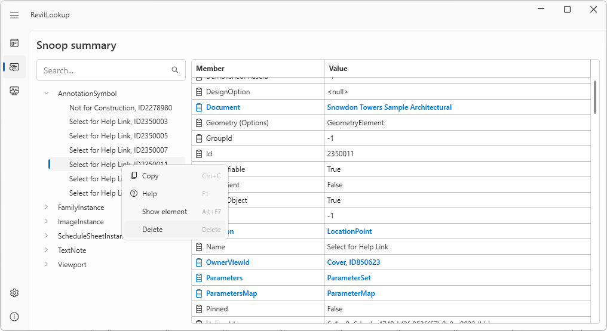
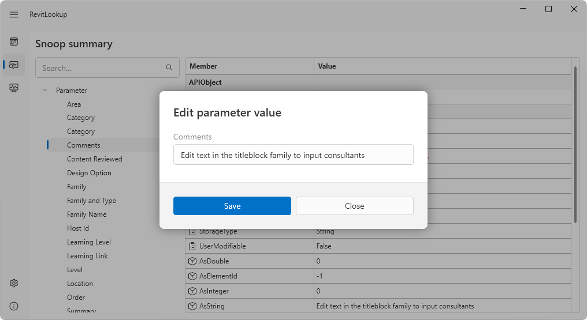
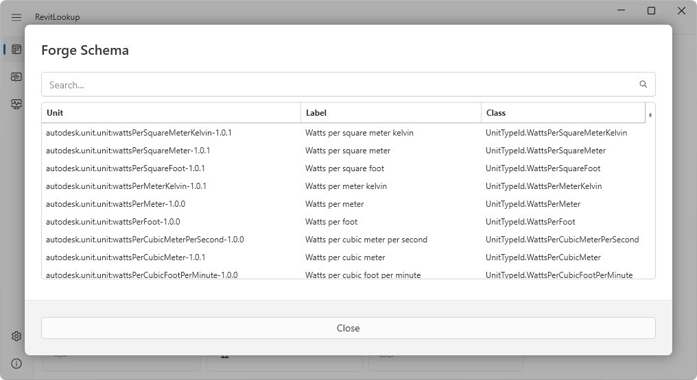

<head>
<meta http-equiv="Content-Type" content="text/html; charset=utf-8">
<link rel="stylesheet" type="text/css" href="bc.css">
<!-- https://highlightjs.org/#usage
<link rel="stylesheet" href="https://cdnjs.cloudflare.com/ajax/libs/highlight.js/11.9.0/styles/default.min.css">

-->

<!-- https://prismjs.com -->
<link href="https://cdn.jsdelivr.net/npm/prismjs@1.29.0/themes/prism.min.css" rel="stylesheet" />

</head>

<!---

- revit 2025
  Yes, yesterday Autodesk shared a YouTube video about the Revit 2025. https://youtu.be/7wD3aMUXquc?si=uXOcIqEgbMCMyrsK
  https://forums.autodesk.com/t5/revit-api-forum/revit-2025-release/td-p/12678437
  > The ProjectInformation change is slower for some reason in Revit 2025 and Revit 2024.
  could report this in jira

- Use Visual Studio 2022 for Macros in Revit 2025
  Revit 2025 - Macro Manager and Visual Studio 2022
  https://forums.autodesk.com/t5/revit-api-forum/revit-2025-macro-manager-and-visual-studio-2022/td-p/12687232

- dependencies and versions
  https://github.com/jeremytammik/RevitLookup/issues/210#issuecomment-2037596450

- revitlookup 2025
  [jeremytammik/RevitLookup] Release 2025.0.0 - 2025.0.0

- Revit developer starter
  https://forums.autodesk.com/t5/revit-api-forum/revit-developer-starter-pack/td-p/12681495
  https://github.com/jeremytammik/RevitLookup/discussions/209
  Revit templates
  Revit toolkit
  Revit extensions
  Revit API
  RevitLookup

- Chinese chipmaker launches 14nm AI processor that's 90% cheaper than GPUs — $140 chip's older node sidesteps US sanctions
  https://www.tomshardware.com/tech-industry/artificial-intelligence/chinese-chipmaker-launches-14nm-ai-processor-thats-90-cheaper-than-gpus

twitter:

Revit 2025, #RevitAPI based on .NET Core, RevitLookup 2025 and a new Revit developer starter kit have been released, PackageReference versioning support and building Revit 2025 macros with Visual Studio 2022 for @AutodeskRevit #BIM @DynamoBIM https://autode.sk/revit2025

Revit 2025 has been released and the new Revit API is now based on .NET Core
&ndash; PackageReference versioning support
&ndash; RevitLookup 2025
&ndash; Revit developer starter kit
&ndash; Revit 2025 macros with Visual Studio 2022
&ndash; Cheap Chinese AI chip...

linkedin:

Revit 2025, #RevitAPI based on .NET Core, RevitLookup 2025 and a new Revit developer starter kit have been released

https://autode.sk/revit2025

- PackageReference versioning support
- RevitLookup 2025
- Revit developer starter kit
- Revit 2025 macros with Visual Studio 2022
- Cheap Chinese AI chips...

#BIM #DynamoBIM #AutodeskAPS #Revit #API #IFC #SDK #Autodesk #AEC #adsk

the [Revit API discussion forum](http://forums.autodesk.com/t5/revit-api-forum/bd-p/160) thread

-->

### Revit 2025 and RevitLookup 2025

Revit 2025 has been released, and the new Revit API is now based on .NET Core:

- [Revit 2025](#2)
- [PackageReference versioning support](#3)
- [RevitLookup 2025](#4)
- [Revit developer starter kit](#5)
- [Revit 2025 macros with Visual Studio 2022](#6)
- [Cheap Chinese AI chip?](#7)

#### Revit 2025

Revit 2025 has been released.

The Factory blog post
on [What’s New in Revit 2025](https://autodeskblog.wpengine.com/aec/2024/04/02/whats-new-in-revit-2025/)
describes the enhancements.

A quick overview is provided by the official nine-minute video
on [What's new in Revit 2025](https://youtu.be/7wD3aMUXquc)
by Autodesk Building Solutions:

> Revit 2025 offers new capabilities and enhancements for site design and toposolids, upgrades for modeling and documenting concrete and steel design, in addition to new features for sustainability and carbon analysis, structural analysis, and MEP analysis and fabrication. There are many community ideas realized in Revit 2025, among them sheet collections which benefit efficiency for everyone documenting in Revit, single element and empty arrays for modeling families, and wall joins which improve the experience of placing and manipulating walls, making it more predictable and less prone to error. There’s also more connectivity to Autodesk Docs, improvements for openBIM workflows and data exchange, and other project management upgrades and schema improvements.

> - [00:00](https://www.youtube.com/watch?v=7wD3aMUXquc&t=0s) Introduction
- [00:42](https://www.youtube.com/watch?v=7wD3aMUXquc&t=42s) Total Carbon Analysis for architects
- [01:27](https://www.youtube.com/watch?v=7wD3aMUXquc&t=87s) For Everyone
- [02:40](https://www.youtube.com/watch?v=7wD3aMUXquc&t=160s) Architecture
- [03:54](https://www.youtube.com/watch?v=7wD3aMUXquc&t=234s) MEP
- [05:24](https://www.youtube.com/watch?v=7wD3aMUXquc&t=324s) Structure
- [08:03](https://www.youtube.com/watch?v=7wD3aMUXquc&t=483s) Model Coordination
- [08:47](https://www.youtube.com/watch?v=7wD3aMUXquc&t=527s) Conclusion

#### PackageReference Versioning Support

As expected, the Revit 2025 API is now based on the more modern .NET Core, replacing the previous .NET 4.8 framework required in the previous version, cf. previous discussions of the topic:

- [.NET 5 and Core](https://thebuildingcoder.typepad.com/blog/2021/01/face-triangulation-lod-net-5-and-core.html#2)
- [.NET Core](https://thebuildingcoder.typepad.com/blog/2023/08/15-years-polygon-areas-and-net-core.html#3)
- [.NET Core Preview and Open Source Add-In Projects](https://thebuildingcoder.typepad.com/blog/2023/11/net-core-preview-and-open-source-add-in-projects.html)
- [.NET Core Migration Webinar](https://thebuildingcoder.typepad.com/blog/2023/12/parameters-and-net-core-webinar.html#2)
- [.NET Core Migration Webinar Recording](https://thebuildingcoder.typepad.com/blog/2024/02/net-core-c4r-views-and-interactive-hot-reload.html#2)

Some illuminating aspects of how to gracefully handle different dependency version requirements are discussed in
the [RevitLookup issue #210](https://github.com/jeremytammik/RevitLookup/issues/210).
The main point is made
by Roman [@Nice3point](https://t.me/nice3point) Karpovich, aka Роман Карпович:

> You can support different versions like this; `&lt;` represents a <code>&lt;</code> symbol in XML:

<pre><code class="language-xml">&lt;PackageReference Include="Microsoft.Extensions.Hosting" Version="8.*" Condition="$(RevitVersion) == '2025'"/&gt;
&lt;PackageReference Include="Microsoft.Extensions.Hosting" Version="7.*" Condition="$(RevitVersion) != '' And $(RevitVersion) &lt; '2025'"/&gt;
</code></pre>

#### RevitLookup 2025

As soon as Revit 2025 was available, Roman immediately published
[RevitLookup 2025](https://github.com/jeremytammik/RevitLookup/releases/tag/2025.0.0) supporting
the new release of Revit as well as sporting other significant enhancements:

- **Action for deleting element**
Now you can delete an element from the project, the action is available both from the left panel and from the table:

 
 <!-- Pixel Height: 555 Pixel Width: 1,016 -->
 

- **Action for editing element parameter value**
Now you can edit the parameter value. String, Double, Int, ElementId supported:

 
 <!-- Pixel Height: 555 Pixel Width: 1,016 -->
 

- **ForgeTypeId class name**
For developer convenience, the Forge Schema dialog now displays the full class, unit and label property names for direct use in code:

 
 <!-- Pixel Height: 555 Pixel Width: 1,016 -->
 

- Add Symbols, Groups Ids to the Forge Schema dialogue
- Add new ForgeTypeId extensions, ToLabel, IsSymbol, etc.
- Add `RevitLinkType.IsLoaded` support by @SergeyNefyodov in [#208](https://github.com/jeremytammik/RevitLookup/pull/208)
- Add `LocationCurve.ElementsAtJoin` support by @SergeyNefyodov in [#205](https://github.com/jeremytammik/RevitLookup/pull/205)
- Add `LocationCurve.JoinType` support by @SergeyNefyodov in [#205](https://github.com/jeremytammik/RevitLookup/pull/205)
- [Full changelog](https://github.com/jeremytammik/RevitLookup/compare/2024.0.13...2025.0.0)
- [RevitLookup versioning](https://github.com/jeremytammik/RevitLookup/wiki/Versions)

Many thanks to Roman for his continuous tremendous work maintaining and improving RevitLookup!

#### Revit Developer Starter Kit

In addition to the new release of RevitLookup, Roman published
a [Revit developer starter](https://forums.autodesk.com/t5/revit-api-forum/revit-developer-starter-pack/td-p/12681495) including

- Revit templates
- Revit toolkit
- Revit extensions
- Revit API
- RevitLookup

For full details, please refer to the [Revit developer starter discussion page](https://github.com/jeremytammik/RevitLookup/discussions/209).

Thanks for this as well, Roman!

#### Revit 2025 Macros with Visual Studio 2022

In case you prefer working with macros instead of a full-fledged add-in,
Luiz Henrique [@ricaun](https://ricaun.com/) Cassettari shared a solution enabling the use of Visual Studio 2022 for Macros in Revit 2025 in
the [Revit API discussion forum](http://forums.autodesk.com/t5/revit-api-forum/bd-p/160) thread
on [Revit 2025 Macro Manager and Visual Studio 2022](https://forums.autodesk.com/t5/revit-api-forum/revit-2025-macro-manager-and-visual-studio-2022/td-p/12687232).

Many thanks for this helpful hint, Ricaun!

#### Cheap Chinese AI Chip?

We may see a much cheaper AI chip based on older technology coming along, according to Tom's Hardware, saying
that [Chinese chipmaker launches 14nm AI processor that's 90% cheaper than GPUs &ndash; $140 chip's older node sidesteps US sanctions](https://www.tomshardware.com/tech-industry/artificial-intelligence/chinese-chipmaker-launches-14nm-ai-processor-thats-90-cheaper-than-gpus).

