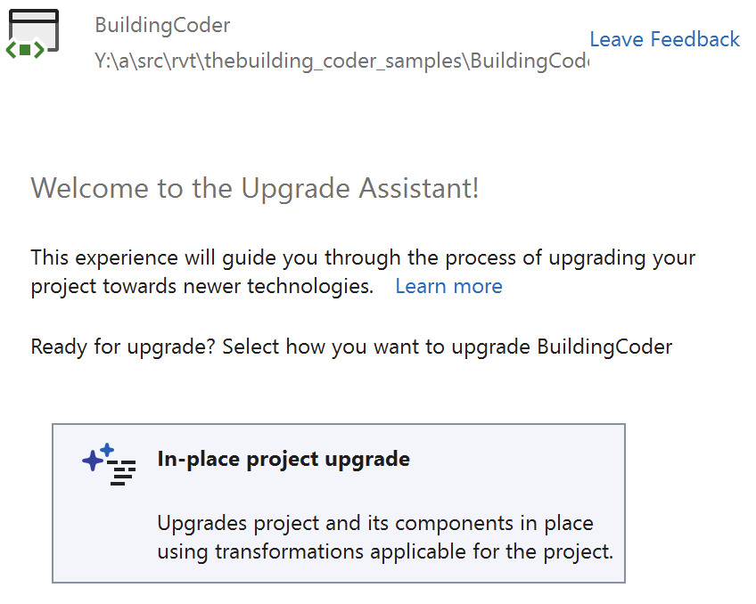
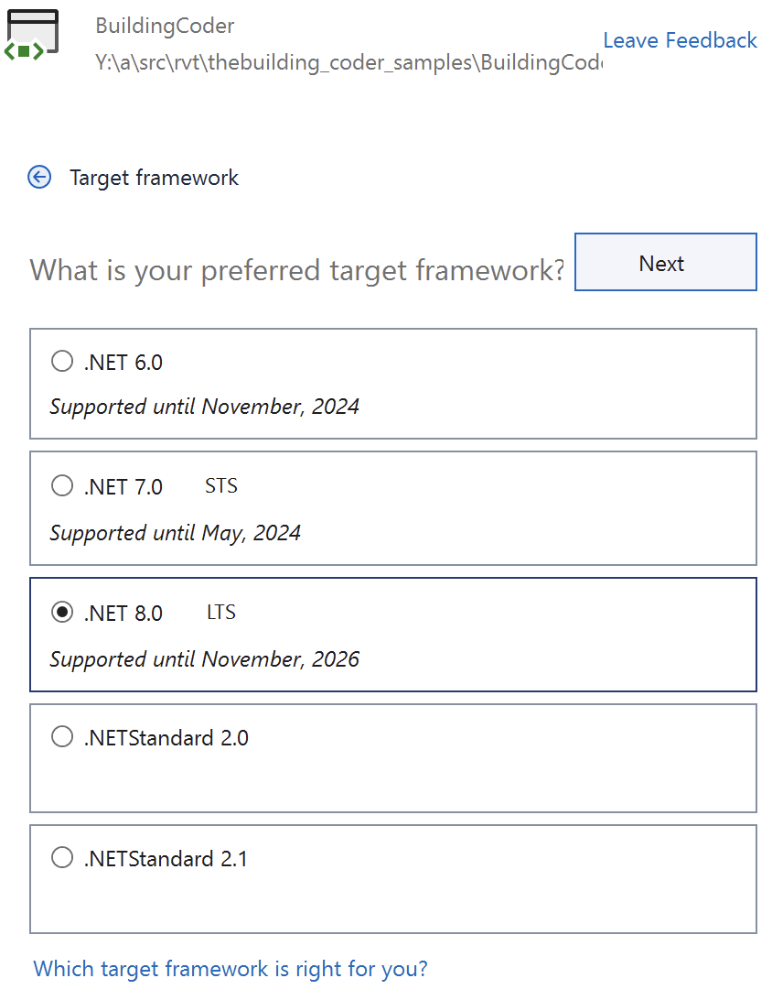
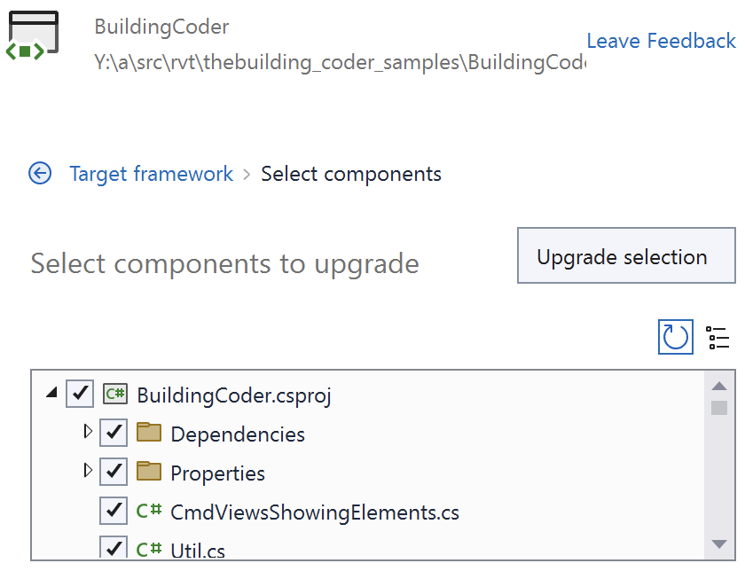
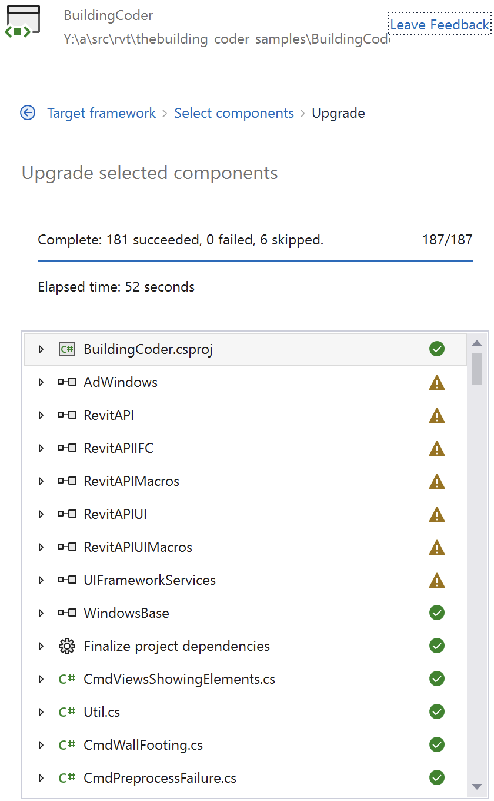

<head>
<meta http-equiv="Content-Type" content="text/html; charset=utf-8">
<link rel="stylesheet" type="text/css" href="bc.css">
<!-- https://highlightjs.org/#usage
<link rel="stylesheet" href="https://cdnjs.cloudflare.com/ajax/libs/highlight.js/11.9.0/styles/default.min.css">

-->

<!-- https://prismjs.com -->
<link href="https://cdn.jsdelivr.net/npm/prismjs@1.29.0/themes/prism.min.css" rel="stylesheet" />

</head>

<!---

install revit 2025
tbc samples zero warnings no deprecated api usage
remove all deprecated api usage
compile with zero warnings
update visual studio 2022 to 17.9.5
upgrade to .net core
https://duckduckgo.com/?q=upgrade+to+.net+core
updated the seven assembly DLL references:

twitter:

Migrating The Building Coder samples to Revit 2025: compilation environment, .NET upgrade assistant, Revit API assemblies, errors and warnings in the #RevitAPI @AutodeskRevit #BIM @DynamoBIM https://autode.sk/tbcsamples2025

I migrated The Building Coder samples to Revit 2025
&ndash; Compilation environment
&ndash; .NET upgrade assistant
&ndash; Revit API assemblies
&ndash; Errors and warnings
&ndash; Conclusion...

linkedin:

Migrating The Building Coder samples to Revit 2025 #RevitAPI:

https://autode.sk/tbcsamples2025

- Compilation environment
- .NET upgrade assistant
- Revit API assemblies
- Errors and warnings
- Conclusion...

#BIM #DynamoBIM #AutodeskAPS #Revit #API #IFC #SDK #Autodesk #AEC #adsk

the [Revit API discussion forum](http://forums.autodesk.com/t5/revit-api-forum/bd-p/160) thread

-->

### The Building Coder Samples 2025

I migrated The Building Coder samples to Revit 2025:

- [Compilation environment](#2)
- [.NET upgrade assistant](#3)
- [Revit API assemblies](#4)
- [Errors and warnings](#5)
- [Conclusion](#6)

#### Compilation Environment

Before starting with the migration per se, I installed Revit 2025 and ensured that my compilation environment is up to date:

- Revit 2025
- Parallels Desktop 19.3.0
- Visual Studio 2022 17.9.5

Next, I recompiled The Building Coder samples for Revit 2024 and eliminated all remaining deprecated API usage to ensure zero errors and zero warnings, creating a final
[release 2024.0.153.1](https://github.com/jeremytammik/the_building_coder_samples/releases/tag/2024.0.153.1) for that.

#### .NET Upgrade Assistant

I used the [.NET Upgrade Assistant](https://learn.microsoft.com/en-us/dotnet/core/porting/upgrade-assistant-overview) to move from the .NET Framework 4.8 to .NET Core 8:

 <!-- Pixel Height: 678 Pixel Width: 848 -->

.NET Upgrade Assistant

 <!-- Pixel Height: 1,092 Pixel Width: 844 -->

Upgrade assistant target

 <!-- Pixel Height: 678 Pixel Width: 848 -->

Upgrade assistant components

 <!-- Pixel Height: 1,360 Pixel Width: 840 -->

Upgrade assistant result

#### Revit API Assemblies

The .NET Upgrade Assistant successfully upgraded almost everything.

However, the seven Revit 2024 API assemblies that we reference in this project cannot be upgraded, since they are hardwired to the .NET Framework 4.8:

- AdWindows
- RevitAPI
- RevitAPIIFC
- RevitAPIMacros
- RevitAPIUl
- RevitAPIUIMacros
- UlFrameworkServices

They need to be manually redefined to use the Revit 2025 API assemblies instead.

#### Errors and Warnings

With the new Revit API assembly references in place, the first compilation attempt
produced [12 errors and 2 warnings](doc/tbc_samples_2025_migr_01.txt).

Most errors and the two warnings are trivial to fix:

- Error CS0104 `TaskDialog` is an ambiguous reference between *System.Windows.Forms.TaskDialog* and *Autodesk.Revit.UI.TaskDialog*
- Warning CS8073 The result of the expression is always `true` since a value of type `Guid` is never equal to `null`  in CmdFamilyParamGuid.cs

The remaining three errors in the module CmdDeleteMacros.cs are due to the removal of document-level macros in Revit 2025 and are equally easily eliminated by commenting out the code section causing them:

- Error CS1503 Argument 1: cannot convert from 'Autodesk.Revit.UI.UIDocument' to 'Autodesk.Revit.UI.UIApplication'
- Error CS1503 Argument 1: cannot convert from 'Autodesk.Revit.DB.Document' to 'Autodesk.Revit.ApplicationServices.Application'
- Error CS1061 `MacroModule` does not contain a definition for `RemoveMacro`

After removing the `TaskDialog` ambiguity, comparison of Parameter.GUID property with null and support for document-level macros, The Building Coder samples compile for Revit 2025 with zero errors and zero warnings.

#### Conclusion

Next, I updated BcSamples.txt with the new binary output path */bin/Debug/net8.0-windows*.

The result is published
as [The Building Coder samples release 2025.0.153.0](https://github.com/jeremytammik/the_building_coder_samples/releases/tag/2025.0.153.0)

The detailed migration steps taken are listed in
the [comparison with the preceding release](https://github.com/jeremytammik/the_building_coder_samples/compare/2024.0.153.1...2025.0.153.0)

I have not tested the result yet, since I am still in the process of installing the Revit SDK samples and setting up the RvtSamples external application that I use to load both the SDK and The Building Coder samples.

Good luck, have fun and much success with your own migrations!

Stay tuned for further news.

