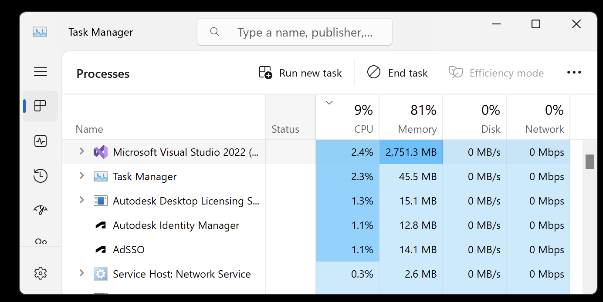

<head>
<meta http-equiv="Content-Type" content="text/html; charset=utf-8">
<link rel="stylesheet" type="text/css" href="bc.css">
<!-- https://highlightjs.org/#usage
<link rel="stylesheet" href="https://cdnjs.cloudflare.com/ajax/libs/highlight.js/11.9.0/styles/default.min.css">

-->

<!-- https://prismjs.com -->
<link href="https://cdn.jsdelivr.net/npm/prismjs@1.29.0/themes/prism.min.css" rel="stylesheet" />

</head>

<!---

- RevitLookup HotFix 2025.0.1
  https://github.com/jeremytammik/RevitLookup/releases/tag/2025.0.1
  Fixed Search Bar crashing Revit  ([issue 214](https://github.com/jeremytammik/RevitLookup/issues/214))
  Improvements
  - Ref parameter type support
  - Add BasePoint.GetSurveyPoint support by @SergeyNefyodov in #212
  - Add BasePoint.GetProjectBasePoint support by @SergeyNefyodov in #212
  - Add InternalOrigin.Get support by @SergeyNefyodov in #212
  - Add ElevationMarker.GetViewId support by @SergeyNefyodov in #213
  - Add CurtainGrid.GetCell support by @SergeyNefyodov in #215
  - Add CurtainGrid.GetPanel support by @SergeyNefyodov in #215
  - Add Panel.GetRefGridLines support by @SergeyNefyodov in #215
  Many thanks to [@SergeyNefyodov](https://github.com/SergeyNefyodov) for contributing and to Roman for maintaining RevitLookup!
  [Full changelog 2025.0.0...2025.0.1](https://github.com/jeremytammik/RevitLookup/compare/2025.0.0...2025.0.1)
  [RevitLookup versions](https://github.com/jeremytammik/RevitLookup/wiki/Versions)

- https://aps.autodesk.com/developer/overview/revit
  SDKs and tools
  Revit .NET SDK
  View documentation and over 100 code samples to start developing with the Revit API. Version 2025 (updated April 2, 2024).

- sync RevitSdkSamples from 2024 to 2025

twitter:

RevitLookup hotfix, Revit 2025 API, SDK download, comparison with previous version, integration, compilation and custom add-in context menus in the #RevitAPI @AutodeskRevit #BIM @DynamoBIM https://autode.sk/revit2025sdk

RevitLookup HotFix 2025.0.1 has been released, and I continue the exploration of the Revit 2025 API
&ndash; Revit 2025 SDK download
&ndash; Comparison with previous SDK
&ndash; Integration into RevitSdkSamples
&ndash; Compiling the Revit 2025 SDK samples
&ndash; Custom add-in context menu...

linkedin:

RevitLookup hotfix, Revit 2025 API, SDK download, comparison with previous version, integration, compilation and custom add-in context menus in the #RevitAPI

https://autode.sk/revit2025sdk

- RevitLookup HotFix 2025.0.1
- Revit 2025 SDK download
- Comparison with previous SDK
- Integration into RevitSdkSamples
- Compiling the Revit 2025 SDK samples
- Custom add-in context menu...

#BIM #DynamoBIM #AutodeskAPS #Revit #API #IFC #SDK #Autodesk #AEC #adsk

the [Revit API discussion forum](http://forums.autodesk.com/t5/revit-api-forum/bd-p/160) thread

-->

### RevitLookup Hotfix and The Revit 2025 SDK

RevitLookup HotFix 2025.0.1 has been released, and I continue the exploration of the Revit 2025 API, installing the Revit 2025 SDK and performing the following steps:

- [RevitLookup hotfix 2025.0.1](#2)
- [Revit 2025 SDK download](#3)
- [Comparison with previous SDK](#4)
- [Integration into RevitSdkSamples](#5)
- [Compiling the Revit 2025 SDK samples](#6)
- [Custom add-in context menu](#7)

#### RevitLookup Hotfix 2025.0.1

[RevitLookup hotfix 2025.0.1](https://github.com/jeremytammik/RevitLookup/releases/tag/2025.0.1) has been released to handle
the [fixed search bar crashing Revit (issue 214)](https://github.com/jeremytammik/RevitLookup/issues/214).

This version includes further improvements:

- Ref parameter type support
- Add BasePoint.GetSurveyPoint support by @SergeyNefyodov in #212
- Add BasePoint.GetProjectBasePoint support by @SergeyNefyodov in #212
- Add InternalOrigin.Get support by @SergeyNefyodov in #212
- Add ElevationMarker.GetViewId support by @SergeyNefyodov in #213
- Add CurtainGrid.GetCell support by @SergeyNefyodov in #215
- Add CurtainGrid.GetPanel support by @SergeyNefyodov in #215
- Add Panel.GetRefGridLines support by @SergeyNefyodov in #215
- [Full changelog 2025.0.0...2025.0.1](https://github.com/jeremytammik/RevitLookup/compare/2025.0.0...2025.0.1)
- [RevitLookup versions](https://github.com/jeremytammik/RevitLookup/wiki/Versions)

Many thanks
to [@SergeyNefyodov](https://github.com/SergeyNefyodov) for contributing and
to Roman [@Nice3point](https://t.me/nice3point) Karpovich, aka Роман Карпович, for maintaining RevitLookup!

#### Revit 2025 SDK Download

The Revit 2025 SDK has been published to the [Revit Developer Centre](https://aps.autodesk.com/developer/overview/revit):

> SDKs and tools &gt; Revit .NET SDK
  &gt; View documentation and over 100 code samples to start developing with the Revit API.
  Version 2025 (updated April 2, 2024).

#### Comparison with Previous SDK

I downloaded the new SDK and compared the directory structure and individual files with the Revit 2024 version, noting the following changes:

Four new SDK samples:

- ContextMenu &ndash; create a customised add-in context menu, [cf. below](#7)
- DisallowEndWrapping &ndash; allow or disallow end wrapping at certain wall locations
- EditSketch &ndash; edit curves in sketches and add dimensions to the sketch using `SketchEditScope`
- NewMacro &ndash; generate, build end execute a Macro by `MacroManager`

Folders Removed:

- REX SDK
- Samples/AnalyticalSupportData_Info
- Samples/CreateTrianglesTopography
- Samples/Site

Modified:

- Macro Samples/GetTimeElapsed &ndash; previously separate samples and directories for CSharp and VBNet

Added:

- Macro Samples/MacroSamples_MEP
- Macro Samples/MacroSamples_RFA
- Macro Samples/MacroSamples_RVT
- Samples/ContextMenu
- Samples/DisallowEndWrapping
- Samples/EditSketch
- Samples/NewMacro

Here are my exact comparison steps and details:

- [Comparison steps and commands](doc/2025_revit_sdk_sample_comparison.txt)
- [Directory differences](doc/2025_dir_diff.txt)
- [File differences](doc/2025_file_diff.txt)

#### Integration into RevitSdkSamples

Before making any changes to my local installation of the SDK samples, I prefer to integrate it into
the [RevitSdkSamples GitHub repository](https://github.com/jeremytammik/RevitSdkSamples) to track and share my modifications.

In order to preserve as much as possible of the Git history from the previous version to the new SDK release, instead of just deleting and overwriting everything, I integrated the new SDK into RevitSdkSamples in two steps, based on the differences detected in the steps described above:

- Delete from RevitSdkSamples all obsolete files that no longer occur in the Revit 2025 SDK
- Copy the Revit 2025 SDK into RevitSdkSamples, overwriting existing files

The result is captured
in [RevitSdkSamples release 2025.0.0](https://github.com/jeremytammik/RevitSdkSamples/releases/tag/2025.0.0).

#### Compiling the Revit 2025 SDK Samples

My first attempt to rebuild the solution [skipped all 201 solutions](doc/sdk_samples_2025_01.txt).

I searched for an explanation and looked
at [how to determine why Visual Studio might be skipping projects when building a solution](https://stackoverflow.com/questions/1319772/how-to-determine-why-visual-studio-might-be-skipping-projects-when-building-a-so).

I ended up selecting the build target `x64` in the Configuration Manager to match the targets listed for each one of the individual solutions.

<!--

Configuration Manager build target

-->

With that setting in place, it reported 'Rebuild started at 9:09 AM...' and did not skip the projects, but it did not seem to do anything else either except endlessly consume more and more memory until
I [cancelled the build after more than 15 minutes](doc/sdk_samples_2025_02.txt):

 <!-- Pixel Height: 678 Pixel Width: 848 -->

Visual Studio memory consumption growing

Next, I removed the `.vs` folder and changed the build output verbosity to detailed in Visual Studio &gt; Tools &gt; Options &gt; Projects and Solutions &gt; Build and Run.

The increased verbosity still gives no information about what is happening, beyond the message saying 'Rebuild started at 9:46 AM...'

Although... the status bar does list one project after another, reporting 'Restored ...csproj in 3.05 s'.
Multiplying 200 projects by 2 seconds each should still complete in a manageable time, though, but I see no hint of progress.

Switching the output to 'Package Manager' shows what is going on...
[Generating MSBuild file, Writing cache file to disk, Persisting dg, Writing assets file to disk etc.](doc/sdk_samples_2025_03.txt)...
half an hour waiting and still going... completed after 34 minutes!

I am probably running a suboptimal setup here...

So, I continued waiting.
After 1 hour and 46 minutes, the compilation completed, partially,
with [177 succeeded, 24 failed, 0 skipped, 30 errors and 5 warnings](doc/sdk_samples_2025_04.txt).

A new record time, slower than all previous versions by a factor of about 25.

Looking at the error list, two errors are caused by code in ExternalResourceDBServer:

- Error CS0246 The type or namespace names `GetLinkPathForOpen` and `LocalLinkSharedCoordinatesSaved` could not be found

I fixed those by commenting out the two offending lines, since the methods referred to are not defined anywhere.

The remaining errors and warnings have to do with external references, such as:

- Error NU1100  Unable to resolve 'System.Data.DataSetExtensions (>= 4.5.0)' for 'net8.0-windows7.0' in Selections
- Error BC30002 Type 'MsExcel.Application' is not defined in `ArchSample` and `FireRating`
- Warning BC40056 Namespace or type specified in the Imports 'Microsoft.Office.Interop.Excel' doesn't contain any public member or cannot be found in `ArchSample` and `FireRating`
- Error NU1100  Unable to resolve 'Microsoft.CSharp (>= 4.7.0)' for 'net8.0-windows7.0' in `UpdateExternallyTaggedBRep`, `BRepBuilderExample`, `ReadonlySharedParameters`, `ExtensibleStorageUtility`
- Error NU1100  Unable to resolve 'Newtonsoft.Json (>= 13.0.1)' for 'net8.0-windows7.0' in `CloudAPISample`
- Error NU1100  Unable to resolve 'System.Data.DataSetExtensions (>= 4.5.0)' for 'net8.0-windows7.0' in `ReadonlySharedParameters`, `ExtensibleStorageUtility`, `ExternalCommandRegistration` and a dozen other projects
- Error NU1100  Unable to resolve 'HtmlTextWriter (>= 2.1.1)' for 'net8.0-windows7.0' in ScheduleToHTML
- Error NU1100  Unable to resolve 'System.Net.Http (>= 4.3.4)' for 'net8.0-windows7.0' in ScheduleToHTML
- Error NU1100  Unable to resolve 'System.Data.OleDb (>= 8.0.0)' for 'net8.0-windows7.0' in RoomSchedule
- Warning MSB3284 Cannot get the file path for type library "00020813-0000-0000-c000-000000000046" version 1.9 in FireRating and ArchSample

Possibly, some of these errors are caused by not installing Microsoft Office in my virtual machine, so I went ahead and installed Microsoft Office.

I noticed this message in the build output window:

- To prevent NuGet from restoring packages during build, open the Visual Studio Options dialog, click on the NuGet Package Manager node and uncheck 'Allow NuGet to download missing packages during build.'

Another possible culprit
explaining [why Visual Studio keeps rebuilding my projects for no good reason](https://michaelscodingspot.com/visual-studio-keeps-rebuilding-projects-no-good-reason/):

> Resource is set to “Copy always”:
Copy always means just what it says, and there’s never a good reason for that.
There is another option to "Copy if newer" instead of “Copy always”.

In the newer SDK-style projects, go to the `.csproj` file and look for

<pre><code class="language-xml">&lt;CopyToOutputDirectory&gt;Always&lt;/CopyToOutputDirectory&gt;
</code></pre>

Change that to

<pre><code class="language-xml">&lt;CopyToOutputDirectory&gt;PreserveNewest&lt;/CopyToOutputDirectory&gt;
</code></pre>

I found and fixed that setting in six projects: CloudAPISample, DockableDialogs, FreeFormElement, GetSetDefaultTypes, InCanvasControlAPI and SinePlotter.

Recompiling again from scratch resulted in [181 succeeded, 20 failed, 23 errors, 5 warnings, in 1 hour and 26 minutes](doc/sdk_samples_2025_06.txt).

Definitely not something I want to repeat on a daily basis.
Maybe my virtual machine running Windows in Parallels on a Mac is slowing things down?

My current SDK installation is captured
in [RevitSdkSamples release 2025.0.1](https://github.com/jeremytammik/RevitSdkSamples/releases/tag/2025.0.1).

#### Custom Add-In Context Menu

As hinted at by the new `ContextMenu` SDK sample mentioned above, the Revit API 2025 enables an add-in to create a custom right-click context menu:

> This sample demonstrates how to create customized context menu for Add-In and how to create different types of menu items: `CommandMenuItem`, `SeparatorItem`, `SubMenuItem`.

[Ricaun](https://ricaun.com/), aka Luiz Henrique Cassettari, shares his take on that functionality in
his [ContextMenuExtension gist](https://gist.github.com/ricaun/ffb897b9ba5b152992cfe20ca6bcfa16) and
a nine-minute video
on [Revit API 2025 RegisterContextMenu](https://youtu.be/1hqGWeYjUcU):

<iframe width="480" height="270" src="https://www.youtube.com/embed/1hqGWeYjUcU?si=92qAe9HEPDd4Kr_X" title="YouTube video player" frameborder="0" allow="accelerometer; autoplay; clipboard-write; encrypted-media; gyroscope; picture-in-picture; web-share" referrerpolicy="strict-origin-when-cross-origin" allowfullscreen></iframe>

Thank you very much, Luiz!

