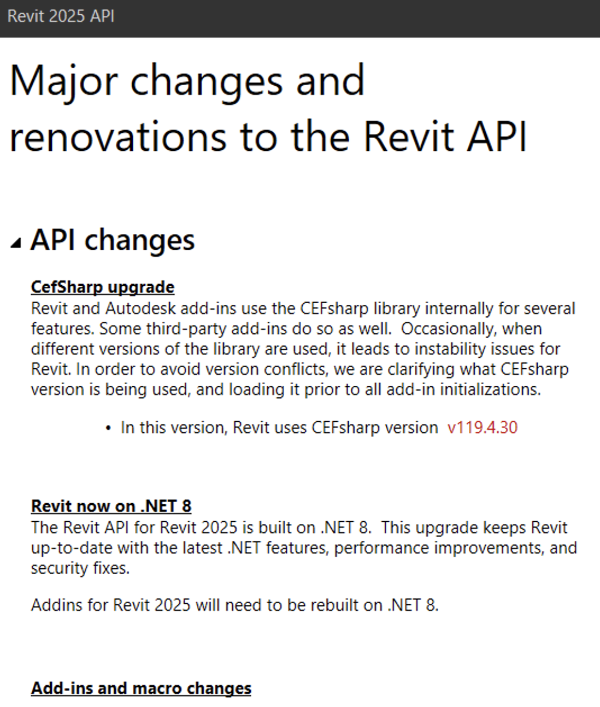

<head>
<meta http-equiv="Content-Type" content="text/html; charset=utf-8">
<link rel="stylesheet" type="text/css" href="bc.css">

</head>

<!---

twitter:

What's New in the Revit 2025 API? Exciting new functionality, migration information, overview of changes and additions, table of contents, full details of all new aspects of the @AutodeskRevit #RevitAPI #BIM @DynamoBIM @AutodeskAPS https://autode.sk/rvt2025api

The Revit 2025 API contains significant enhancements for add-in developers
&ndash; Information sources
&ndash; What's new in previous versions
&ndash; Detailed table of contents
&ndash; API Changes
&ndash; API Additions...

linkedin:

What's New in the Revit 2025 API? Exciting new functionality, migration information, overview of changes and additions, table of contents, full details of all new aspects of the #RevitAPI

https://autode.sk/rvt2025api

- Information sources
- What's new in previous versions
- Detailed table of contents
- API Changes
- API Additions...

#BIM #DynamoBIM #AutodeskAPS #Revit #API #IFC #SDK #Autodesk #AEC #adsk

the [Revit API discussion forum](http://forums.autodesk.com/t5/revit-api-forum/bd-p/160) thread

-->

### What's New in the Revit 2025 API

The Revit 2025 API contains significant changes and enhancements for add-in developers:

- [Information sources](#1)
- [What's new in previous versions](#2)
- [Detailed table of contents](#4)

Top level table of contents:

<ul class="toc">
<li>1. <a href="#4.1">API changes</a></li>
<ul class="toc">
<li>1.1. <a href="#4.1.1">CefSharp upgrade</a></li>
<li>1.2. <a href="#4.1.2">Revit now on .NET 8</a></li>
<li>1.3. <a href="#4.1.3">Add-ins and macro changes</a></li>
<li>1.4. <a href="#4.1.4">Array API changes</a></li>
<li>1.5. <a href="#4.1.5">BRepBuilder API changes</a></li>
<li>1.6. <a href="#4.1.6">Dimension API changes</a></li>
<li>1.7. <a href="#4.1.7">Extensible Storage(Schema) API changes</a></li>
<li>1.8. <a href="#4.1.8">Electrical API changes</a></li>
<li>1.9. <a href="#4.1.9">Link Visibility/Graphic Override API changes</a></li>
<li>1.10. <a href="#4.1.10"> MEP changes</a></li>
<li>1.11. <a href="#4.1.11"> Reinforcement API changes</a></li>
<li>1.12. <a href="#4.1.12"> Slab API changes</a></li>
<li>1.13. <a href="#4.1.13"> Structure API changes</a></li>
<li>1.14. <a href="#4.1.14"> Task Dialog API changes</a></li>
<li>1.15. <a href="#4.1.15"> Toposolid API changes</a></li>
<li>1.16. <a href="#4.1.16"> Obsolete API removal</a></li>
</ul>
<li>2. <a href="#4.2">API additions</a></li>
<ul class="toc">
<li>2.1. <a href="#4.2.1">Add-ins and macros additions</a></li>
<li>2.2. <a href="#4.2.2">Analysis API additions</a></li>
<li>2.3. <a href="#4.2.3">Annotations API additions</a></li>
<li>2.4. <a href="#4.2.4">Array API additions</a></li>
<li>2.5. <a href="#4.2.5">MEP Fabrication API additions</a></li>
<li>2.6. <a href="#4.2.6">DirectShape API additions</a></li>
<li>2.7. <a href="#4.2.7">Dimension API additions</a></li>
<li>2.8. <a href="#4.2.8">Electrical API additions</a></li>
<li>2.9. <a href="#4.2.9">Energy Analysis API additions</a></li>
<li>2.10. <a href="#4.2.10"> IFC API additions</a></li>
<li>2.11. <a href="#4.2.11"> Import Export API additions</a></li>
<li>2.12. <a href="#4.2.12"> PDF Export API additions</a></li>
<li>2.13. <a href="#4.2.13"> Reinforcement API additions</a></li>
<li>2.14. <a href="#4.2.14"> Selection API additions</a></li>
<li>2.15. <a href="#4.2.15"> Sketched Element API additions</a></li>
<li>2.16. <a href="#4.2.16"> Structure API additions</a></li>
<li>2.17. <a href="#4.2.17"> Tag/Keynotes API additions</a></li>
<li>2.18. <a href="#4.2.18"> Toposolid API additions</a></li>
<li>2.19. <a href="#4.2.19"> UI API additions</a></li>
<li>2.20. <a href="#4.2.20"> View API additions</a></li>
<li>2.21. <a href="#4.2.21"> Link Visibility/Graphic Override API additions</a></li>
<li>2.22. <a href="#4.2.22"> RevitServer Enterprise / Revit Cloud Worksharing API additions</a></li>
</ul>
</ul>

####Information Sources

The information below is based on the contents of the *Revit Platform API Changes and Additions.docx* document included with
the Revit 2025 SDK, the software developers kit available from
the [Revit Developer Centre](https://www.autodesk.com/developer-network/platform-technologies/revit).

It is also provided in the section on *What's New* in the Revit 2025 API help file `RevitAPI.chm` included with the SDK:

 <!-- Pixel Height: 1,294 Pixel Width: 1,098 -->

For convenient, easy, and effective web searching, this blog post provides a cleaned-up online HTML version of that information with numbering and table of contents added, as well as the following PDF printout of the original document included in the SDK with table of contents and page numbers added:

- [Revit_Platform_API_Changes_and_Additions_2025.pdf](doc/revit_2025_api_changes_and_additions.pdf)

The *What's New* section and the *Changes and Additions* document provide important information for discovering and exploring the newly added API functionality and for later reference.

If you encounter any issues migrating your existing add-ins between different versions, this is one of the first places to look.

For detailed information on all other aspects of the Revit API, please refer to the rest of the API documentation and samples provided in the SDK.

The most important things to install and keep at hand are:

- The Revit API help file `RevitAPI.chm`
- The Visual Studio solution containing all the SDK samples, `Samples\SDKSamples.sln`

You will regularly need both for research on how to solve specific Revit API programming tasks.

More in-depth official explanations and background information is provided by the
online [Revit API Developers Guide](http://help.autodesk.com/view/RVT/2025/ENU/?guid=Revit_API_Revit_API_Developers_Guide_html) included
in the [Revit 2025 online help](http://help.autodesk.com/view/RVT/2025/ENU).

####What's New in Previous Versions

Here are links to previous discussions of *What's New in the Revit API*:

- [What's New in the Revit 2010 API](http://thebuildingcoder.typepad.com/blog/2013/02/whats-new-in-the-revit-2010-api.html)
- [What's New in the Revit 2011 API](http://thebuildingcoder.typepad.com/blog/2013/02/whats-new-in-the-revit-2011-api.html)
- [What's New in the Revit 2012 API](http://thebuildingcoder.typepad.com/blog/2013/02/whats-new-in-the-revit-2012-api.html)
- [What's New in the Revit 2013 API](http://thebuildingcoder.typepad.com/blog/2013/03/whats-new-in-the-revit-2013-api.html)
- [What's New in the Revit 2014 API](http://thebuildingcoder.typepad.com/blog/2013/04/whats-new-in-the-revit-2014-api.html)
- [What's New in the Revit 2015 API](http://thebuildingcoder.typepad.com/blog/2014/04/whats-new-in-the-revit-2015-api.html)
- [What's New in the Revit 2016 API](http://thebuildingcoder.typepad.com/blog/2015/04/whats-new-in-the-revit-2016-api.html)
- [What's New in the Revit 2017 API](http://thebuildingcoder.typepad.com/blog/2016/04/whats-new-in-the-revit-2017-api.html)
- [What's New in the Revit 2017.1 API](http://thebuildingcoder.typepad.com/blog/2016/11/whats-new-in-the-revit-20171-api.html)
- [What's New in the Revit 2018 API](http://thebuildingcoder.typepad.com/blog/2017/04/whats-new-in-the-revit-2018-api.html)
- [Revit 2018.1 and the Visual Materials API](http://thebuildingcoder.typepad.com/blog/2017/08/revit-20181-and-the-visual-materials-api.html)
- [Revit 2018.1.1 and 2018.1 API Docs Online](http://thebuildingcoder.typepad.com/blog/2017/09/revit-201811-fixes-cropbox-setting.html)
- [Revit 2018.1 Visual Materials API](http://thebuildingcoder.typepad.com/blog/2017/11/modifying-material-visual-appearance.html)
- [What's New in the Revit 2018.2 API](http://thebuildingcoder.typepad.com/blog/2017/12/whats-new-in-the-revit-20182-api.html)
- [What's New in the Revit 2019 API](http://thebuildingcoder.typepad.com/blog/2018/04/whats-new-in-the-revit-2019-api.html)
- [What's New in the Revit 2020 API](https://thebuildingcoder.typepad.com/blog/2019/04/whats-new-in-the-revit-2020-api.html)
- [What's New in the Revit 2020.1 API](https://thebuildingcoder.typepad.com/blog/2019/09/whats-new-in-the-revit-20201-api.html)
- [What's New in the Revit 2021 API](https://thebuildingcoder.typepad.com/blog/2020/04/whats-new-in-the-revit-2021-api.html)
- [What's New in the Revit 2021.1 API](https://thebuildingcoder.typepad.com/blog/2020/08/revit-20211-sdk-and-whats-new.html)
- [What's New in the Revit 2022 API](https://thebuildingcoder.typepad.com/blog/2021/04/whats-new-in-the-revit-2022-api.html)
- [What's New in the Revit 2022.1 API](https://thebuildingcoder.typepad.com/blog/2021/11/whats-new-in-the-revit-20221-api.html)
- [What's New in the Revit 2023 API](https://thebuildingcoder.typepad.com/blog/2022/04/whats-new-in-the-revit-2023-api.html)
- [What's New in the Revit 2024 API](https://thebuildingcoder.typepad.com/blog/2023/04/whats-new-in-the-revit-2024-api.html)

####Detailed Table of Contents

<!-- <h1>Major changes and renovations to the Revit API -->

<ul class="toc">
<li>1. <a href="#4.1">API changes</a></li>
<ul class="toc">
<li>1.1. <a href="#4.1.1">CefSharp upgrade</a></li>
<li>1.2. <a href="#4.1.2">Revit now on .NET 8</a></li>
<li>1.3. <a href="#4.1.3">Add-ins and macro changes</a></li>
<ul class="toc">
<li>1.3.1. <a href="#4.1.3.1">MacroManager API</a></li>
</ul>
<li>1.4. <a href="#4.1.4">Array API changes</a></li>
<li>1.5. <a href="#4.1.5">BRepBuilder API changes</a></li>
<li>1.6. <a href="#4.1.6">Dimension API changes</a></li>
<li>1.7. <a href="#4.1.7">Extensible Storage(Schema) API changes</a></li>
<li>1.8. <a href="#4.1.8">Electrical API changes</a></li>
<ul class="toc">
<li>1.8.1. <a href="#4.1.8.1">Distribution system</a></li>
<li>1.8.2. <a href="#4.1.8.2">Parameter Naming</a></li>
</ul>
<li>1.9. <a href="#4.1.9">Link Visibility/Graphic Override API changes</a></li>
<li>1.10. <a href="#4.1.10"> MEP changes</a></li>
<ul class="toc">
<li>1.10.1. <a href="#4.1.10.1"> Duct Settings</a></li>
</ul>
<li>1.11. <a href="#4.1.11"> Reinforcement API changes</a></li>
<ul class="toc">
<li>1.11.1. <a href="#4.1.11.1"> Rebar</a></li>
</ul>
<li>1.12. <a href="#4.1.12"> Slab API changes</a></li>
<li>1.13. <a href="#4.1.13"> Structure API changes</a></li>
<ul class="toc">
<li>1.13.1. <a href="#4.1.13.1"> Bending details in view</a></li>
<li>1.13.2. <a href="#4.1.13.2"> Analytical Surface</a></li>
</ul>
<li>1.14. <a href="#4.1.14"> Task Dialog API changes</a></li>
<li>1.15. <a href="#4.1.15"> Toposolid API changes</a></li>
<li>1.16. <a href="#4.1.16"> Obsolete API removal</a></li>
<ul class="toc">
<li>1.16.1. <a href="#4.1.16.1"> Classes</a></li>
<li>1.16.2. <a href="#4.1.16.2"> Properties</a></li>
<li>1.16.3. <a href="#4.1.16.3"> Methods</a></li>
<li>1.16.4. <a href="#4.1.16.4"> Enums</a></li>
</ul>
</ul>
<li>2. <a href="#4.2">API additions</a></li>
<ul class="toc">
<li>2.1. <a href="#4.2.1">Add-ins and macros additions</a></li>
<ul class="toc">
<li>2.1.1. <a href="#4.2.1.1">MacroManager API</a></li>
</ul>
<li>2.2. <a href="#4.2.2">Analysis API additions</a></li>
<ul class="toc">
<li>2.2.1. <a href="#4.2.2.1">MEP Analytical networks</a></li>
<li>2.2.2. <a href="#4.2.2.2">MEP Duct/Pipe Pressure Loss calculation</a></li>
<li>2.2.3. <a href="#4.2.2.3">MEP Space Engineering Parameters</a></li>
</ul>
<li>2.3. <a href="#4.2.3">Annotations API additions</a></li>
<li>2.4. <a href="#4.2.4">Array API additions</a></li>
<ul class="toc">
<li>2.4.1. <a href="#4.2.4.1">Linear Array</a></li>
</ul>
<li>2.5. <a href="#4.2.5">MEP Fabrication API additions</a></li>
<li>2.6. <a href="#4.2.6">DirectShape API additions</a></li>
<li>2.7. <a href="#4.2.7">Dimension API additions</a></li>
<li>2.8. <a href="#4.2.8">Electrical API additions</a></li>
<li>2.9. <a href="#4.2.9">Energy Analysis API additions</a></li>
<ul class="toc">
<li>2.9.1. <a href="#4.2.9.1">gbXML export options</a></li>
</ul>
<li>2.10. <a href="#4.2.10"> IFC API additions</a></li>
<ul class="toc">
<li>2.10.1. <a href="#4.2.10.1"> IFC Hybrid Import</a></li>
<li>2.10.2. <a href="#4.2.10.2"> IFC Category Mapping</a></li>
</ul>
<li>2.11. <a href="#4.2.11"> Import Export API additions</a></li>
<li>2.12. <a href="#4.2.12"> PDF Export API additions</a></li>
<li>2.13. <a href="#4.2.13"> Reinforcement API additions</a></li>
<ul class="toc">
<li>2.13.1. <a href="#4.2.13.1"> Rebar</a></li>
<li>2.13.2. <a href="#4.2.13.2"> Rebar splice type options and rules</a></li>
</ul>
<li>2.14. <a href="#4.2.14"> Selection API additions</a></li>
<ul class="toc">
<li>2.14.1. <a href="#4.2.14.1"> UI Application</a></li>
</ul>
<li>2.15. <a href="#4.2.15"> Sketched Element API additions</a></li>
<ul class="toc">
<li>2.15.1. <a href="#4.2.15.1"> Wall APIs</a></li>
</ul>
<li>2.16. <a href="#4.2.16"> Structure API additions</a></li>
<ul class="toc">
<li>2.16.1. <a href="#4.2.16.1"> Analytical Elements</a></li>
<li>2.16.2. <a href="#4.2.16.2"> Analytical Surface</a></li>
<li>2.16.3. <a href="#4.2.16.3"> Bending Details on Drawings</a></li>
<li>2.16.4. <a href="#4.2.16.4"> Radial Array</a></li>
</ul>
<li>2.17. <a href="#4.2.17"> Tag/Keynotes API additions</a></li>
<li>2.18. <a href="#4.2.18"> Toposolid API additions</a></li>
<li>2.19. <a href="#4.2.19"> UI API additions</a></li>
<ul class="toc">
<li>2.19.1. <a href="#4.2.19.1"> Context Menu</a></li>
</ul>
<li>2.20. <a href="#4.2.20"> View API additions</a></li>
<ul class="toc">
<li>2.20.1. <a href="#4.2.20.1"> SheetCollection</a></li>
</ul>
<li>2.21. <a href="#4.2.21"> Link Visibility/Graphic Override API additions</a></li>
<li>2.22. <a href="#4.2.22"> RevitServer Enterprise / Revit Cloud Worksharing API additions</a></li>
</ul>
</ul>

<h1 class="new" style="font-weight: bold">1. API Changes</h1>

<h2 class="new">1.1. CefSharp upgrade</h2>

Revit and Autodesk add-ins use the CEFsharp library internally for several features. Some third-party add-ins do so as well.  Occasionally, when different versions of the library are used, it leads to instability issues for Revit. In order to avoid version conflicts, we are clarifying what CEFsharp version is being used, and loading it prior to all add-in initializations.

- In this version, Revit uses CEFsharp version v119.4.30

<h2 class="new">1.2. Revit now on .NET 8</h2>

The Revit API for Revit 2025 is built on .NET 8.
This upgrade keeps Revit up to date with the latest .NET features, performance improvements, and security fixes.

Addins for Revit 2025 will need to be rebuilt on .NET 8.

<h2 class="new">1.3. Add-ins and macro changes</h2>

<h3 class="new">1.3.1. MacroManager API</h3>

Updated Revit macro tool with modernized UI and code editor that also supports modern .NET API. Following methods were changed.

- Deprecated member(s) &rarr; Replacement members(s)
- MacroManager.AddModule(ModuleSettings moduleSettings) &rarr; MacroManager.AddModule(ModuleSettings moduleSettings, IModuleMaker* maker)
- UIMacroManager.AddModule(ModuleSettings moduleSettings, MacroEnvironment environment) &rarr; UIMacroManager.AddModule(ModuleSettings moduleSettings, MacroEnvironment environment, IModuleMaker* maker)

The following properties were deprecated:

- ModuleSettings.Description
- MacroModule.MacroLevel
- MacroModule.Description
- Macro.Description
- MacroManage.MacroLevel

The following methods were deprecated:

- MacroModule.AddMacro()
- MacroModule.RemoveMacro()
- MacroManager.GetDocumentMacroSecurityOptions()
- MacroManager.SetDocumentMacroSecurityOptions()
- MacroManager.GetMacroManager()
- MacroManager.IsDocLvlMacro()
- UIMacroManager.EditModule()
- UIMacroManager.EditMacro()
- UIMacroManager.StepInto()
- UIMacroManager.GetMacroManager()
- UIMacroManager.GetUIDocumentMacroSecurityOptions()
- UIMacroManager.SetUIDocumentMacroSecurityOptions()

The following enums were deprecated:

- Deprecated values of enum Autodesk.Revit.DB.Macro.MacroLanguageType, only C# is supported.
    - MacroLanguageType.VBNet
    - MacroLanguageType.Python
- Autodesk.Revit.DB.Macros.MacroLevel
- Autodesk.Revit.DB.Macros.DocumentMacroOptions
- UIDocumentMacroOptions

<h2 class="new">1.4. Array API changes</h2>

The valid arrays size differs in project and family documents. The replacement method takes the document as an argument so we get an accurate answer.

- Deprecated member(s) &rarr; Replacement members(s)
- LinearArray.IsValidArraySize() &rarr; LinearArray.IsValidNumberOfMembers()
- RadialArray.IsValidArraySize() &rarr; RadialArray.IsValidNumberOfMembers()

<h2 class="new">1.5. BRepBuilder API changes</h2>

BRepBuilder now accepts HermiteSurface as a permitted support surface type for faces.

Changed behavior:

- BRepBuilder.IsPermittedSurfaceType() will now return true for HermiteSurface.
- BRepBuilderSurfaceGeometry.Create() can now accept a HermiteSurface and use it to create the corresponding BRepBuilderSurfaceGeometry.

<h2 class="new">1.6. Dimension API changes</h2>

After the introduction of LinearDimension class, when filtering for Dimensions, linear dimensions will return as type LinearDimension (child class) instead of Dimension (parent class).

Methods affected:

- typeof(), etc. : If using typeof() or .getType().Equals(), to check if a LinearDimension is Dimension, it will not work due to the nature of the derived classes.

<h2 class="new">1.7. Extensible Storage(Schema) API changes</h2>

Fixed two API(s) for the Extensible Storage feature:

- Document.EraseSchemaAndAllEntities() &ndash; Fixed the API to ensure it removes entities from all parts of a Revit model.
- ExtensibleStorageFilter() &ndash; Fixed the API to ensure it filters all elements associated with extensible storage data based on specific Schema IDs.

<h2 class="new">1.8. Electrical API changes</h2>

<h3 class="new">1.8.1. Distribution system</h3>

The following properties were modified to support high-leg delta and single-phase distribution system.

- Deprecated member(s) &rarr; Replacement members(s)
- AnalyticalPowerSourceData.Voltage &rarr; AnalyticalPowerSourceData.AssignedVoltage
- AnalyticalDistributionNodePropertyData.NumberOfPhases  &rarr; AnalyticalDistributionNodePropertyData.AssignedPhasesNumber &ndash; For analytical power source, bus, transformer, transfer switch, the number of electrical phases is read only in Revit 2025 and assigned through the distribution system. For analytical equipment load, we suggest you use the AnalyticalEquipmentLoadData.PhasesNumber property.
- AnalyticalBusData.Voltage &rarr; AnalyticalBusData.AssignedVoltage
- AnalyticalTransferSwitchData.Voltage &rarr; AnalyticalTransferSwitchData.AssignedVoltage

<h3 class="new">1.8.2. Parameter Naming</h3>

Improved naming for the following electrical parameters to remove ambiguity, improve accuracy, and better adhere with industry terminology.

- Parameter/String Attribute: Text(before) &rarr; Text(after)
- RBS_ELEC_PANEL_TOTALESTLOAD_PARAM: Total Estimated Demand &rarr; Total Demand Apparent Power
- RBS_ELEC_PANEL_TOTALLOAD_PARAM: Total Connected &rarr; Total Connected Apparent Power
- RBS_ELEC_APPARENT_LOAD_PHASEA: Apparent Load Phase A &rarr; Apparent Power Phase A
- RBS_ELEC_APPARENT_LOAD_PHASEB: Apparent Load Phase B &rarr; Apparent Power Phase B
- RBS_ELEC_APPARENT_LOAD_PHASEC: Apparent Load Phase C &rarr; Apparent Power Phase C
- RBS_ELEC_DEMAND_LOAD_PHASEA: Demand Load Phase A &rarr; Demand Apparent Power Phase A
- RBS_ELEC_DEMAND_LOAD_PHASEB: Demand Load Phase B &rarr; Demand Apparent Power Phase B
- RBS_ELEC_DEMAND_LOAD_PHASEC: Demand Load Phase C &rarr; Demand Apparent Power Phase C
- RBS_ELEC_APPARENT_LOAD: Apparent Load &rarr; Apparent Power
- RBS_ELEC_APPARENT_LOAD_PHASE1: Apparent Load Phase 1 &rarr; Apparent Power Phase 1
- RBS_ELEC_APPARENT_LOAD_PHASE2: Apparent Load Phase 2 &rarr; Apparent Power Phase 2
- RBS_ELEC_APPARENT_LOAD_PHASE3: Apparent Load Phase 3 &rarr; Apparent Power Phase 3
- RBS_ELEC_TRUE_LOAD: True Load &rarr; True Power
- RBS_ELEC_TRUE_LOAD_PHASE1: True Load Phase 1 &rarr; True Power Phase 1
- RBS_ELEC_TRUE_LOAD_PHASE2: True Load Phase 2 &rarr; True Power Phase 2
- RBS_ELEC_TRUE_LOAD_PHASE3: True Load Phase 3 &rarr; True Power Phase 3
- RBS_ELEC_TRUE_LOAD_PHASEA: True Load Phase A &rarr; True Power Phase A
- RBS_ELEC_TRUE_LOAD_PHASEB: True Load Phase B &rarr; True Power Phase B
- RBS_ELEC_TRUE_LOAD_PHASEC: True Load Phase C &rarr; True Power Phase C
- RBS_ELEC_DEMANDFACTOR_DEMANDLOAD_PARAM: Estimated Demand Load &rarr; Demand Apparent Power
- RBS_ELEC_DEMANDFACTOR_LOAD_PARAM: Connected Load &rarr; Connected Apparent Power
- RBS_ELEC_PANEL_BRANCH_CIRCUIT_APPARENT_LOAD_PHASEA: Branch Circuit Apparent Load Phase A  &rarr; Branch Circuit Apparent Power Phase A
- RBS_ELEC_PANEL_BRANCH_CIRCUIT_APPARENT_LOAD_PHASEB: Branch Circuit Apparent Load Phase B  &rarr; Branch Circuit Apparent Power Phase B
- RBS_ELEC_PANEL_BRANCH_CIRCUIT_APPARENT_LOAD_PHASEC: Branch Circuit Apparent Load Phase C  &rarr; Branch Circuit Apparent Power Phase C
- RBS_ELEC_PANEL_FEED_THRU_LUGS_APPARENT_LOAD_PHASEA: Feed Through Lugs Apparent Load Phase A &rarr; Feed Through Lugs Apparent Power Phase A
- RBS_ELEC_PANEL_FEED_THRU_LUGS_APPARENT_LOAD_PHASEB: Feed Through Lugs Apparent Load Phase B &rarr; Feed Through Lugs Apparent Power Phase B
- RBS_ELEC_PANEL_FEED_THRU_LUGS_APPARENT_LOAD_PHASEC: Feed Through Lugs Apparent Load Phase C &rarr; Feed Through Lugs Apparent Power Phase C
- RBS_ELEC_PANEL_TOTALESTLOAD_OTHER_PARAM: Other Total Estimated Demand  &rarr; Other Total Demand Apparent Power
- RBS_ELEC_LOADSUMMARY_CONNECTED_LOAD_PARAM: Connected Load (VA) &rarr; Connected Apparent Power
- RBS_ELEC_LOADSUMMARY_DEMAND_LOAD_PARAM: Estimated Demand (VA) &rarr; Demand Apparent Power
- RBS_ELEC_PANEL_TOTALESTLOAD_POWER_PARAM: Power Total Estimated Demand &rarr; Power Total Demand Apparent Power
- RBS_ELEC_PANEL_TOTALESTLOAD_LIGHT_PARAM: Lighting Total Estimated Demand &rarr; Lighting Total Demand Apparent Power
- RBS_ELEC_PANEL_TOTALESTLOAD_HVAC_PARAM: HVAC Total Estimated Demand &rarr; HVAC Total Demand Apparent Power
- RBS_ELEC_PANEL_TOTALLOAD_HVAC_PARAM: HVAC Total Connected &rarr; HVAC Total Connected Apparent Power
- RBS_ELEC_PANEL_TOTALLOAD_LIGHT_PARAM: Lighting Total Connected &rarr; Lighting Total Connected Apparent Power
- RBS_ELEC_PANEL_TOTALLOAD_POWER_PARAM: Power Total Connected &rarr; Power Total Connected Apparent Power
- RBS_ELEC_PANEL_TOTALLOAD_OTHER_PARAM: Other Total Connected &rarr; Other Total Connected Apparent Power

<h2 class="new">1.9. Link Visibility/Graphic Override API changes</h2>

The following methods were modified to support custom settings type.

- Revit.DB.RevitLinkGraphicsSettings.LinkVisibilityType
- Revit.DB.View.SetLinkOverrides(ElementId, RevitLinkGraphicsSettings) &ndash; Supports RevitLinkGraphicsSettings of Custom type.
- Revit.DB.View.GetLinkOverrides(ElementId) &ndash; Removed two validators:
    - AreGraphicsOverridesAllowed()
    - IsLinkOverridesSupported()

<h2 class="new">1.10.  MEP changes</h2>

<h3 class="new">1.10.1.  Duct Settings</h3>

Two new properties DuctSettings.AirDynamicViscosity and DuctPressureDropData.DynamicViscosity were added to clarify the value used in the duct pressure loss calculation. They replaced the deprecated properties that were kinematic viscosity.

- Deprecated members(s)&rarr; Replacement member(s)
- RbsDuctSettingsElem.AirViscosity &rarr; DuctSettings.AirDynamicViscosity
- DuctPressureDropData.Viscosity &rarr; DuctPressureDropData.DynamicViscosity
- DuctFittingAndAccessoryData.AirViscosity &rarr; DuctSettings.AirDynamicViscosity

<h2 class="new">1.11.  Reinforcement API changes</h2>

<h3 class="new">1.11.1.  Rebar</h3>

- Deprecated member(s) &rarr; Replacement member(s)
- RebarConstraintsManager.SetPreferredConstraintForHandle(RebarConstrainedHandle handle, RebarConstraint constraint) &rarr; RebarConstraintsManager.SetPreferredConstraint(RebarConstraint constraint) &ndash; Use the new replacement method to set RebarConstraint as preferred constraint target that avoids issues where one could apply the RebarConstraint bounded to handle 'A' to another handle 'B'.
- RebarConstraintsManager.GetConstraintCandidatesForHandle(RebarConstrainedHandle handle)
  &rarr; RebarConstraintsManager.GetConstraintCandidatesForHandle(Structure.RebarConstrainedHandle, ElementId) and
  RebarConstraintsManager.GetConstraintCandidatesForHandle(Structure.RebarConstrainedHandle, Reference)
  &ndash; For getting the direct neighbors of a rebar host, use Structure.RebarHostData.GetRebarHostDirectNeighbors(Element hostElement);
  for getting all the rebars in a host, use Structure.RebarHostData.GetRebarsInHost()
- Rebar.DistributionType;
  the enum values
  `Uniform` `0` representing uniform distribution and
  `VaryingLength` `1` representing varying length distribution
  &rarr; RebarShapeDrivenAccessor.UseRebarConstraintsToProduceVaryingBars

<h2 class="new">1.12.  Slab API changes</h2>

The following methods were added for adding split line on SlabShapeEditor.

- Deprecated member(s) &rarr; Replacement member(s)
- SlabShapeEditor.DrawPoint &rarr; SlabShapeEditor.AddPoint(XYZ point)
- SlabShapeEditor.DrawSplitline &rarr; SlabShapeEditor.AddSplitLine(SlabShapeVertex startVertex, SlabShapeVertex endVertex)

<h2 class="new">1.13.  Structure API changes</h2>

<h3 class="new">1.13.1.  Bending details in view</h3>

The following parameters were renamed without any changes to their functionality.

- Deprecated member(s) &rarr; Replacement member(s)
- BENDING_DETAIL_SEGMENET_REPESENTATION &rarr; BENDING_DETAIL_SEGMENT_REPRESENTATION
- BENDING_DETAIL_REPESENTATION_FOR_3D_BARS  &rarr; BENDING_DETAIL_REPRESENTATION_FOR_3D_BARS

<h3 class="new">1.13.2.  Analytical Surface</h3>

The following new method was added that allows users to verify if contour is valid for this Analytical Surface.

- Deprecated members(s) &rarr; Replacement member(s)
- AnalyticalSurfaceBase.isCurveLoopValid() &rarr; AnalyticalSurfaceBase.IsOuterContourValid()

<h2 class="new">1.14.  Task Dialog API changes</h2>

Support added so that FooterText property can contain a hyperlink of the form "rvthelptopic:[topic]" to launch Revit's contextual for the topic specified. Previously, the only option was to specify "#" as the hyperlink and set the Dialog Id, making it difficult to share dialogs with same Id, but different context and associated Help.

<h2 class="new">1.15.  Toposolid API changes</h2>

The following parameters were renamed without any changes to their functionality.

- Deprecated member(s) &rarr; Replacement member(s)
- SSE_POINT_ElEVATION_BASE_TYPE &rarr; SSE_POINT_ELEVATION_BASE_TYPE
- SSE_POINT_ElEVATION &rarr; SSE_POINT_ELEVATION
- TOPOSOLID_SUBDIVIDE_HEIGNT &rarr; TOPOSOLID_SUBDIVIDE_HEIGHT

<h2 class="new">1.16.  Obsolete API removal</h2>

The following API members and classes which had previously been marked Deprecated have been removed in this release. Consult the API documentation from prior releases for information on the replacements to use:

<h3 class="new">1.16.1.  Classes</h3>

- DocumentEntryPoint

<h3 class="new">1.16.2.  Properties</h3>

- ViewSchedule.ImageRowHeight
- UIThemeManager.DefaultTheme

<h3 class="new">1.16.3.  Methods</h3>

- FamilyManager.AddParameter(ExternalDefinition, BuiltInParameterGroup, bool)
- FamilyManager.AddParameter(string, BuiltInParameterGroup, Category, bool)
- FamilyManager.ReplaceParameter(FamilyParameter, ExternalDefinition, BuiltInParameterGroup, bool)
- FamilyManager.ReplaceParameter(FamilyParameter, string, BuiltInParameterGroup, bool)
- FamilyManager.IsUserAssignableParameterGroup()
- BindingMap.Insert()
- BindingMap.ReInsert()
- FilterNumericLess.Evaluate(int, int)
- FilterNumericLessOrEqual.Evaluate(int, int)
- FilterNumericGreater.Evaluate(int, int)
- FilterNumericGreaterOrEqual.Evaluate(int, int)
- FilterNumericEquals.Evaluate(int, int)
- ParameterFilterRuleFactory.CreateEqualsRule(ElementId, AString, bool)
- ParameterFilterRuleFactory.CreateNotEqualsRule(ElementId, AString, bool)
- ParameterFilterRuleFactory.CreateGreaterRule(ElementId, AString, bool)
- ParameterFilterRuleFactory.CreateGreaterOrEqualRule(ElementId, AString, bool)
- ParameterFilterRuleFactory.CreateLessRule(ElementId, AString, bool)
- ParameterFilterRuleFactory.CreateLessOrEqualRule(ElementId, AString, bool)
- ParameterFilterRuleFactory.CreateContainsRule(ElementId, AString, bool)
- ParameterFilterRuleFactory.CreateNotContainsRule(ElementId, AString, bool)
- ParameterFilterRuleFactory.CreateBeginsWithRule(ElementId, AString, bool)
- ParameterFilterRuleFactory.CreateNotBeginsWithRule(ElementId, AString, bool)
- ParameterFilterRuleFactory.CreateEndsWithRule(ElementId, AString, bool)
- ParameterFilterRuleFactory.CreateNotEndsWithRule(ElementId, AString, bool)

<h3 class="new">1.16.4.  Enums</h3>

- Autodesk.Revit.DB.Mechanical.OccupancyUnit &ndash; Removed enum value OccupancyUnit.UseDefaultValues
- Autodesk.Revit.DB.BaseLoadOn &ndash; Removed enum value BaseLoadOn.kUseDefaultLoad

<h1 class="new" style="font-weight: bold">2. API Additions</h1>

<h2 class="new">2.1. Add-ins and macros additions</h2>

<h3 class="new">2.1.1. MacroManager API</h3>

The new property:

- MacroModule.ModuleFolder &ndash; Returns the folder of the module.

The new interface:

- IModuleMaker

allows users to create new module project by implementing this interface.

The new event:

- MacroUpdated

is raised after the macro modules are updated.

<h2 class="new">2.2. Analysis API additions</h2>

<h3 class="new">2.2.1. MEP Analytical networks</h3>

The new constructor allows users to traverse both sides of the specified analytical segment. In comparison, the existing constructor MEPNetworkIterator(Document, MEPAnalyticalNode, MEPAnalyticalSegment) only traverses one side of the analytical segment.

- Autodesk.Revit.DB.Analysis.MEPNetworkIterator(Document, MEPAnalyticalSegment)

<h3 class="new">2.2.2. MEP Duct/Pipe Pressure Loss calculation</h3>

Users now have access to Duct/Pipe pressure loss characteristic allowing them to correlate the element and understand the calculation logic.

The new classes:

- Autodesk.Revit.DB.Analysis.CriticalPathCollector &ndash; Provides the calculated flow and pressure drop values of the network critical path, so users can better select their equipment.
- Autodesk.Revit.DB.Analysis.CriticalPathIterator &ndash; Allows users to traverse the analytical segments on the network critical path.

<h3 class="new">2.2.3. MEP Space Engineering Parameters</h3>

Users now have access to building operating day and year schedules allowing them to create and edit schedules that describe the usage of buildings (occupancy, power, lighting) for use in energy analysis.

The new classes:

- Autodesk.Revit.DB.Analysis.BuildingOperatingDaySchedule &ndash; An element that represents the 24 hour operating schedule.
- Autodesk.Revit.DB.Analysis.BuildingOperatingYearSchedule &ndash; An element that represents the 365 day operating schedule.

The new methods:

- BuildingOperatingDaySchedule.Create(Document, Name) &ndash; Allows creation of a new BuildingOperatingDaySchedule with that name and adds it to the document. It returns the newly created BuildingOperatingDaySchedule element, with all usages set to 0.
- BuildingOperatingDaySchedule.GetValueForHour(Hour)
- BuildingOperatingDaySchedule.SetValueForHour(Hour, Usage)
- BuildingOperatingYearSchedule.Create(Document, DaySchedule, Name) &ndash; Allows creation of a new BuildingOperatingYearSchedule with that name and adds it to the document. It returns the newly created BuildingOperatingDaySchedule element, with all usages set to daySchedule.
- BuildingOperatingDaySchedule.GetScheduleForDay(Day)
- BuildingOperatingDaySchedule.SetValueForHour(Day, DaySchedule)

The new properties:

- BuildingOperatingDaySchedule.ScheduleName
- BuildingOperatingYearSchedule.ScheduleName

<h2 class="new">2.3. Annotations API additions</h2>

Exposing the new class to fix different behavior of span direction symbol between UI and API.

The new class:

- Autodesk.Revit.DB.SpanDirectionSymbol

represents an instance of a Span Direction Symbol in Autodesk Revit.

<h2 class="new">2.4. Array API additions</h2>

<h3 class="new">2.4.1. Linear Array</h3>

The new methods:

- LinearArray.GetMinimumSize() &ndash; Allows users to get the minimum size of a linear array based on if the document is a family document.
- LinearArray.GetNumberOfMembersIncludingPlaceholders() &ndash; Allows users to get the number of members in a linear array, including placeholders that are still there in families with small array counts.
- LinearArray.IsValidNumberOfMembers() &ndash; Indicates whether the input count is a valid size for an array based on the document.

<h2 class="new">2.5. MEP Fabrication API additions</h2>

The new methods in the FabricationConfiguration class now provides support to check for bad connections between fabrication parts prior to reloading the configuration.

- CheckConnectionsForAllFabricationParts() &ndash; Allows users to check the connections for all fabrication parts in the current project. It will create reviewable warnings for all bad connections found.
- ValidateConnectionsForAllFabricationParts() &ndash; Allows users to validate all fabrication part connections in the current project. Invalid connections found will be added to the connection validation information class. The validation checks for bad alignments or gaps, incompatible connection types, mismatches of size, mismatches of shapes.
- PostReviewableWarningsForBadConnections() &ndash; Reviewable warnings are created for all entries contained in the connection validation information.
- GetUpdatedStraightsFromValidateConnections() &ndash; Allows users to get the set of element identifiers of fabrication part straights that were previously updated. If no straights were updated, it will return an empty set of element identifiers.

<h2 class="new">2.6. DirectShape API additions</h2>

The new method:

- DirectShapeType.SetShape(IList&lt;GeometryObject&gt;, DirectShapeTargetViewType) &ndash; Allows users to set a custom plan view representation of a DirectShapeType.

<h2 class="new">2.7. Dimension API additions</h2>

Users can now create radial, linear and arc length dimensions via the API in a project document.

The new classes:

- RadialDimension
- ArchLengthDimension
- LinearDimension

The new methods:

- RadialDimension.Create(Document, View, Reference, XYZ origin, bool isDiameterDimension)
- ArcLengthDimension.Create(Document, View, Arc, Reference, Reference firstRef, Reference secondRef)
- LinearDimension.Create(Document, View, Line, IList&lt;Reference&gt;)

<h2 class="new">2.8. Electrical API additions</h2>

Added functionality for high-leg delta and single-phase distribution system. User can now create and modify high-leg delta distribution system and single-phase load in electrical analytical distribution system, and get the per phase current on each node.

The new classes:

- Autodesk.Revit.DB.Electrical.ElectricalPerPhaseData &ndash; Represents per phase values including current and load.
- Autodesk.Revit.DB.Electrical.AnalyticalPowerDistributableNodeData &ndash; Represents the data and parameters of a power distributable node.
- Autodesk.Revit.DB.Electrical.AnalyticalTransformerData &ndash; Represents the data and parameters of analytical transformer node.

The new properties:

- Electrical.DistributionSysType.HighLegPhase &ndash; Represents the high-leg phase in the 3 phase 4 wires delta distribution system.
- AnalyticalPowerSourceData.ApparentPowerRating &ndash; Represents the apparent power rating value of the analytical power source.
- AnalyticalDistributionNodePropertyData.ConnectedPhases &ndash; Represents the electrical connected phases of the electrical analytical node to its upstream node.
- AnalyticalEquipmentLoadData.PhasesNumber &ndash; Represents the number of electrical phases of the analytical equipment load.
- AnalyticalEquipmentLoadData.PowerFactorState &ndash; Represents the PowerFactorState type of the analytical equipment load.
- AreaBasedLoadData.ConnectedPhases &ndash; Represents the electrical connected phases of the area based load to its upstream node.
- AreaBasedLoadData.PhasesNumber &ndash; Allows users to set the number of electrical phases of the area based load.
- AreaBasedLoadData.PowerFactorState &ndash; Represents the power factor state of the area based load.
- AreaBasedLoadType.PowerFactorState &ndash; Represents the power factor state of the area based load type.

The new enums:

- Autodesk.Revit.DB.Electrical.ElectricalPhaseLine &ndash; Defines the electrical phase.
- Autodesk.Revit.DB.Electrical.ElectricalConnectedPhases &ndash; Defines the electrical connected phases of an electrical analytical node.

<h2 class="new">2.9. Energy Analysis API additions</h2>

<h3 class="new">2.9.1. gbXML export options</h3>

We now provide support for legacy export of gbXML based on a conceptual energy analytical model from a conceptual mass model from add-ins/add-ons.

The new methods:

- GetMassIds() &ndash; Allows users to get a list of masses to use as shading surfaces in the exported gbXML.
- GetMassZoneIds() &ndash; Allows users to get a list of mass zones to analyze in the exported gbXML.

The new constructor:

- GBXMLExportOptions(massZoneIds, massIds) &ndash; Allows users to construct a new instance of the options used to export a mass model to gbXML.

The new property:

- IsConceptual &ndash; Indicates if the exported gbXML is based on a conceptual energy analytical model from a conceptual mass model.

<h2 class="new">2.10.  IFC API additions</h2>

<h3 class="new">2.10.1.  IFC Hybrid Import</h3>

- IFCHybridImport.UpdateElements() &ndash; The new method allows users to update elements previously imported via a Hybrid IFC Link operation.
- IFCHybridImport.GetIFCStepIdToElementIdMap() &ndash; The new method allows users to retrieve the association between the original IFC STEP identifiers and the created or updated Elements.

<h3 class="new">2.10.2.  IFC Category Mapping</h3>

Added functionality that allows user to control the way how Revit categories are mapped to IFC Classes during IFC Export. User can now create, retrieve and modify IFC category mapping templates.

The new classes:

- Autodesk.Revit.DB.IFCCategoryTemplate &ndash; Represents an element that contains IFC category mapping template stored in a Revit document.
- Autodesk.Revit.DB.ExportIFCCategoryKey &ndash; Represents a Revit category item stored in a template.
- Autodesk.Revit.DB.ExportIFCCategoryInfo &ndash; Represents the mapped IFC information stored in the template.

The new enum:

-  CustomSubCategoryId &ndash; Represents pseudo sub-categories that can appear in a mapping template

has the following values:

- None &ndash; Represents the default value for most Revit categories and subcategories.
- InteriorWall &ndash; Represents the custom id for interior walls.
- ExteriorWall &ndash; Represents the custom id for exterior walls.
- FoundationWall &ndash; Represents the custom id for foundation walls.
- RetainingWall &ndash; Represents the custom id for retaining walls.
- Coreshaft &ndash; Represents the custom id for cores/shafts.
- Soffit &ndash; Represents the custom id for soffits.

<h2 class="new">2.11.  Import Export API additions</h2>

The new functionality provides support for importing, linking and exporting files of STEP format.

The new class:

- STEPImportOptions

represents the options for STEP formats.

The new methods, uses the new class STEPImportOptions:

- Document.Import(String, STEPImportOptions, View)
- Document.Link(String, STEPImportOptions, View)
- Document.Export(String, String, STEPExportOptions)

<h2 class="new">2.12.  PDF Export API additions</h2>

Document export for PDF now allows using a separate Revit Worker to create the PDF in the background, leaving the main Revit process free for other work. FileExporting and FileExported events are triggered at the start and end of the export job respectively. There are new API calls for PDFExportOptions, FileExportedEventArgs, and FileExportingEventArgs. Third party Addins may interfere with the PDF generation using this feature if they change the appearance of Elements in a way that is not serialized.

The new method:

- PDFExportOptions.SetExportInBackground() &ndash; When set to true, Document.Export launches a new process to export the PDF that leaves Revit unblocked. Changes to the document made after the export has started are not accounted for in the PDF.

The classes FileExportingEventArgs and FileExportedEventArgsBoth have a new member:

- BackgroundOperation &ndash; The value is true if a background process was requested for the background operation that raised the event.

<h2 class="new">2.13.  Reinforcement API additions</h2>

<h3 class="new">2.13.1.  Rebar</h3>

Users now have the ability to create and modify rebar constraints to surfaces.

The new enum:

- RebarConstraintsStatus

represents the status of the constraints.

The new value for RebarConstraintType enum:

- ToSurface

represents handle is constrained to a surface.

The new methods:

- RebarConstraint.CreateConstraintToSurface() &ndash; Allows users to create a constraint of ToSurface type for a given RebarConstrainedHandle.
- RebarConstraint.GetSurfaceForConstraintToSurface() &ndash; Allows users to retrieve the surface for a constraint of ToSurface type.
- RebarConstraint.IsValidSurfaceToConstraintHandleTo() &ndash; Allows users to check if the surface can be used to create a constraint to it for a given RebarConstrainedhandle.
- RebarConstraint.IsToSurface() &ndash; Returns true if the RebarConstraintType of the RebarConstraint is ToSurface, false otherwise.
- RebarConstraint.GetRebarConstrainedHandle() &ndash; Allows users to get the RebarConstrainedHandle for which this constraint is.
- RebarConstraint.FlipSideForClearBarSpacingZeroDistanceConstraint() &ndash; This method in RebarConstriant is applied for bar-on-bar constraint.  It flips the side on which a RebarConstrainedHandle constrained using clear bar distance with zero offset connects to another Rebar target handle.
- RebarConstrainedHandle.IsEqual() &ndash; Returns true if the objects are equal, false otherwise.
- RebarConstraintsManager.SetPreferredConstraintsToSurfaceForHandles() &ndash; For ShapeDriven rebar it will set a preferred 'ToSurface' RebarConstraint for each input handle. The surface that will be used by the constraint is the current surface that is used to compute the position of the handle. This function applies only for shape driven Rebar, and will throw exception for free form rebar.
- RebarConstraintsManager.SetPreferredConstraint() &ndash; Allows users to set the RebarConstraint as preferred constraint for its RebarConstrainedHandle.
- RebarConstraintsManager.GetAutomaticConstraintCandidatesForHandle() &ndash; For shape driven rebar returns all possible automatic RebarConstraints that could be used for a specified RebarConstrainedHandle. For free form rebar it returns an empty list.

<h3 class="new">2.13.2.  Rebar splice type options and rules</h3>

Added functionality for splicing the rebar. Users can now splice a rebar, remove the splice (keeping the bars separated), unify into one bar, modify the data related to splice and modify the constraints of the spliced bars seeing as splice chain.

The new classes:

- Autodesk.Revit.DB.Structure.RebarSpliceTypeUtils &ndash; Utility class for dealing with rebar splice type operations.
- Autodesk.Revit.DB.Structure.RebarSpliceOptions
- Autodesk.Revit.DB.Structure.RebarSpliceGeometry &ndash; This class consists of a vector and a point which will be projected to the nearest rebar curve.
- Autodesk.Revit.DB.Structure.RebarSpliceRules
- Autodesk.Revit.DB.Structure.RebarSplice &ndash; A class that can used to access the data between two connected rebars.
- Autodesk.Revit.DB.Structure.RebarSpliceByRulesResult
- Autodesk.Revit.DB.Structure.RebarSpliceUtils

The new methods:

- RebarBarType.GetLapLength()
- RebarBarType.SetLapLength()
- RebarBarType.GetAutoCalculatedLapLength()
- RebarBarType.SetAutoCalculatedLapLength()
- RebarBarType.GetStaggerLength)
- RebarBarType.SetStaggerLength()
- RebarBarType.GetAutoCalculatedStaggerLength()
- RebarBarType.SetAutoCalculatedStaggerLength()
- Rebar.GetRebarSplice()
- Rebar.RemoveSplice()
- Rebar.GetLapLength()
- Rebar.GetSpliceStaggerLength()
- RebarConstrainedHandle.GetHandleSurface()
- RebarConstrainedHandle.Move()
- RebarConstrainedHandle.CanSetBehavior()
- RebarConstrainedHandle.GetPossibleHandleBehaviors()
- RebarHostData.GetRebarHostDirectNeighbors() &ndash; Returns the first level of neighbors for the provided host that can host reinforcement, i.e. elements that are joined directly to the provided host element and not the neighbors of the joined elements.

The new properties:

- RebarSpliceOptions.SpliceTypeId
- RebarSpliceOptions.SplicePosition
- Rebar.CanHaveVaryingLengthBars
- Rebar.HasVariableLengthBars
- RebarShapeDrivenAccessor.UseRebarConstraintsToProduceVaryingBars
- RebarConstrainedHandle.HandleBehavior

The new enums:

-  RebarSplicePosition &ndash; Describes the position of the splice. It has the following values:
    - End1 &ndash; Lap is towards the start of the splice chain.
    - Middle &ndash; Lap goes into both directions.
    - End2 &ndash; Lap is towards the end of the splice chain.
- RebarSpliceShiftOption &ndash; Describes the way bars are shifted in the splice relation. It has the following values:
    - BarPlane &ndash; Represents the bar plane is shifted so that the spliced rebars are not clashing.
    - None &ndash; The bars are not shifted at all.
- RebarSpliceByRulesRunOutPosition &ndash; Describes the run-out position. It has the following values:
    - Start &ndash; Represents the rest will remain at the start of the bar.
    - End &ndash; Represents the rest will remain at the end of the bar
- RebarSpliceError &ndash; Represents the states for splicing a Rebar. It has the following values:
    - Success
    - Unknown &ndash; Represents there is an unexpected error.
    - InvalidRebar &ndash; Represents free form rebars or shape driven rebars that are multiplanar or having shape whose definition is RebarShapeDefinitionByArc or rebars part of a group that cannot be spliced.
    - InvalidLineOrLinePlaneNormal &ndash; Represents the line length is zero or the line direction is parallel with the line plane normal.
    - LineDoesNotIntersectRebarBoundingBox &ndash; Represents the line doesn't intersect the rebar bounding box.
    - SpliceGeometryOnHookOrFillet &ndash; Represents if the splice geometry is on a hook or a fillet, the rebar can't be spliced with it.
    - TooSmallSegments &ndash; Represents one of the resulting segments is too small to apply the lap.
    - SpliceGeometryDoesNotIntersectAllTheBarsInTheSet &ndash; Represents a plane obtained from splice geometry doesn't intersect all the bars in the set.
    - SpliceGeometryAlmostParallelToBarSegment &ndash; Represents the plane formed by splice geometry is almost parallel to bar segment plane.
- RebarSpliceByRulesError &ndash; Represents the states for splicing a Rebar by rules. It has the following values:
    - Success
    - Unknown &ndash; Represents there is an unexpected error.
    - InvalidRebar &ndash; Represents free form rebars or shape driven rebars that are multiplanar or having shape whose definition is RebarShapeDefinitionByArc or rebars part of a group that cannot be spliced.
    - TooBigHook &ndash; Represents the hook lengths exceed the maximum length.
    - TooSmallRunOut &ndash; Represents the run-out is below minimum length, or the lap can't be applied to it.
    - MaximumLengthBiggerThanBarLength &ndash; Represents the maximum length exceeds the bar length.
    - TooBigArc &ndash; Represents the arc segment exceeds the maximum length.
    - CantSpliceAllTheBarsInSet &ndash; Represents  some bars in the varying set are not intersected by the resulting splice geometries.
    - LapLengthBiggerThanMaximumBarLength &ndash; Represents the lap length is greater than the maximum length.
    - InvalidCombinationOfMaximumMinimumBarLengthAndLapLength &ndash; Represents the combination of the maximum bar length, minimum bar length and lap length is invalid.
- RebarHandleBehavior &ndash; Represents different behaviors that can be applied to a RebarConstrainedHandle. It has the following values:
    - Default &ndash; Represents the default behavior of a RebarConstrainedHandle.
    - SpliceMainEndOnEnd1Position
    - SpliceMainEndOnMiddlePosition &ndash; Represents the behavior can be set to a StartOfBar or EndOfBar RebarConstrainedHandle of a bar that is part of splice. On the connected bar there is a ToOtherRebar constraint whose target is the current rebar. The RebarConstrainedHandle's plane in the same position as the splice plane for Middle.
    - SpliceMainEndOnEnd2Position &ndash; Represents the behavior can be set to a StartOfBar or EndOfBar RebarConstrainedHandle of a bar that is part of splice. On the connected bar there is a ToOtherRebar constraint whose target is the current rebar. The RebarConstrainedHandle's plane in the same position as the splice plane for Middle
    - SpliceConnectedEndOnEnd1Position &ndash; Represents  the behavior can be set to a StartOfBar or EndOfBar RebarConstrainedHandle of a bar that is part of splice. On this RebarConstrainedHandle is a ToOtherRebar constraint whose target is the other bar involved in splice. The RebarConstrainedHandle's plane in the same position as the splice plane for End1.
    - SpliceConnectedEndOnMiddlePosition &ndash; Represents the behavior can be set to a StartOfBar or EndOfBar RebarConstrainedHandle of a bar that is part of splice. On this RebarConstrainedHandle is a ToOtherRebar constraint whose target is the other bar involved in splice. The RebarConstrainedHandle's plane in the same position as the splice plane for Middle
    - SpliceConnectedEndOnEnd2Position &ndash; Represents  the behavior can be set to a StartOfBar or EndOfBar RebarConstrainedHandle of a bar that is part of splice. On this RebarConstrainedHandle is a ToOtherRebar constraint whose target is the other bar involved in splice. RebarConstrainedHandle's plane in the same position as the splice plane for End2
    - SpliceRebarPlaneOnSpliceSetExtent &ndash; Represents the behavior can be set to a RebarPlane RebarConstrainedHandle of a bar that is part of splice
    - SpliceOutOfPlaneExtentOnSpliceSetExtent &ndash; Represents the behavior can be set to a OutOfPlaneExtent RebarConstrainedHandle of a bar that is part of splice.
    - SpliceEdge &ndash; Represents the behavior can be set to an edge segment that is connected to the other rebar of splice.

<h2 class="new">2.14.  Selection API additions</h2>

<h3 class="new">2.14.1.  UI Application</h3>

The new enum:

- ThemeType &ndash; Represents the application frame theme type. It has the following values:
    - CanvasTheme &ndash; Indicates that the ThemeChanged event is triggered by canvas theme change.
    - UITheme &ndash; Indicates that the ThemeChanged event is triggered by the global UI theme change.

The new read-only property for ThemeChangedEventArgs:

- ThemeChangedType &ndash; Returns ThemeType enum that indicates the kind of change triggered the current event.

<h2 class="new">2.15.  Sketched Element API additions</h2>

<h3 class="new">2.15.1.  Wall APIs</h3>

The new methods now allow users to selectively enable or disable end wrapping for a specific wall end when the wall's end wrap is activated in the Wall Type dialog.

- Revit.DB.Wall.GetWrappingLocationAsReferences(int locationIndex) &ndash; Allows users to get an array of references to faces at the location.
- Revit.DB.Wall.GetWrappingLocationAsCurveParameter(int locationIndex) &ndash; Allows users to get the non-normalized (actual) curve parameter of the location.
- Revit.DB.Wall.GetValidWrappingLocationIndices()
- Revit.DB.Wall.AllowWrappingAtLocation(int locationIndex)
- Revit.DB.Wall.DisallowWrappingAtLocation(int locationIndex)
- Revit.DB.Wall.IsWrappingAtLocationAllowed(int locationIndex)

<h2 class="new">2.16.  Structure API additions</h2>

<h3 class="new">2.16.1.  Analytical Elements</h3>

The new methods:

- AnalyticalElement.IsValidTransform() &ndash; Allows users to check whether the value set for Local Coordinate System is valid for an Analytical Element.
- AnalyticalElement.SetTransform() &ndash; Allows users to set the transform of Analytical Element Local Coordinate System.

<h3 class="new">2.16.2.  Analytical Surface</h3>

The new method:

- AnalyticalSurfaceBase.IsOuterContourValid() &ndash; Allows users to verify if contour is valid for this Analytical Surface.

<h3 class="new">2.16.3.  Bending Details on Drawings</h3>

Added new functionality for enhancing bending details. These include the ability to create and customize the size of schematic bending detail boxes, set specific tag types for bending details, adjust the position and rotation of tags relative to the bending detail, customize the tag alignment option, and add multiple hosts for the schematic bending detail. This update offers greater flexibility and precision in the representation and annotation of bending details in Revit models.

The new methods:

- RebarBendingDetail.AddHosts()
- RebarBendingDetail.GetHosts()
- RebarBendingDetail.RemoveHosts()
- RebarBendingDetail.SetTagRelativePosition()
- RebarBendingDetail.SetTagRelativeRotation()
- RebarBendingDetail.GetTagRelativePosition()
- RebarBendingDetail.GetTagRelativeRotation()
- RebarBendingDetail.IsSchematicBendingDetail()
- RebarBendingDetail.IsRealisticBendingDetail()
- RebarBendingDetail.ResetTagRelativePosition()
- RebarBendingDetail.ResetAnnotationPositions()

The new properties:

- RebarBendingDetailType.SchematicHeight &ndash; Represents  the height of the box where the schematic Bending Detail will be represented.
- RebarBendingDetailType.SchematicWidth &ndash; Represents the width of the box where the schematic Bending Detail will be represented.
- RebarBendingDetailType.TagTypeId &ndash; Represents the Id of the tag type which is used in the Bending Detail representation.
- RebarBendingDetailType.DisplayMode &ndash; Represents the display mode for the bending detail.

The new enum:

- Autodesk.Revit.DB.Structure.BendingDetailDisplayMode

represents the mode in which the Bending Detail will be represented.

<h3 class="new">2.16.4.  Radial Array</h3>

The new methods:

- RadialArray.GetMinimumSize() &ndash; Allows users to get the minimum size of a radial array based on if the document is a family document.
- RadialArray.GetNumberOfMembersIncludingPlaceholders() &ndash; Allows users to get the number of members in a radial array, including placeholders that are still there in families with small array counts.
- RadialArray.IsValidNumberOfMembers() &ndash; Indicates whether the input count is a valid size for an array based on the document.

<h2 class="new">2.17.  Tag/Keynotes API additions</h2>

We now provide functionality to align multiple text, tags and keynotes with new contextual alignment tools in the ribbon.

The new class:

- Autodesk.Revit.DB.AnnotationMultipleAlignmentUtils

allows users to align annotation elements to one another. Currently supports TextNotes, Tags and Keynotes.

The new methods:

- AnnotationMultipleAlignmentUtils.ElementSupportsMultiAlign() &ndash; allows users to check whether the element type can be aligned using the multiple allignment commands.
- AnnotationMultipleAlignmentUtils.GetAnnotationOutlineWithoutLeaders() &ndash; allows users to get the four corners of the annotations bounding box, not including leaders. Outline calculations include leader/border offsets wherever applicable. (Eg. in the case of TextNotes).
- AnnotationMultipleAlignmentUtils.MoveWithAnchoredLeaders() &ndash; allows users to move the given element to the position specified by the input moveVec, while keeping the leader end points anchored.

<h2 class="new">2.18.  Toposolid API additions</h2>

Added functionality for Toposolid smooth shading.

The new methods:

- Toposolid.ExcavateBy() &ndash; Allows users to excavate toposolid by a given element.
- Toposolid.RemoveExcavationBy() &ndash; Allows users to remove the excavation between the given element and the toposolid.
- Toposolid.CanBeExcavatedBy() &ndash; Allows users to check if the given element can be used to excavate the toposolid.
- Toposolid.SetSmoothedSurface() &ndash; Allows users to set the smoothed surface setting of toposolid category in the given document.
- Toposolid.IsSmoothedSurfaceEnabled() &ndash; Allows users to check if smoothed surface setting of toposolid category is enabled in the given document.
- Toposolid.GetIntersectingElementData()
- ToposolidType.SetContourSetting() &ndash; Allows users to set the contour setting for the current toposolid type by copying from an existing contour setting object.
- ContourSetting.IsItemEnabled()
- ContourSettingItem.GetContourSettingItemType()
- FaceToposolid.Create()
- FaceToposolid.UpdateToFace() &ndash; Allows users to reset the face toposolid to its defining face.
- FaceToposolid.GetReferencedFaces()
- FaceToposolid.SetReferencedFaces()

The new classes:

- Autodesk.Revit.DB.IntersectingElementData &ndash; Stores information of an element that intersects with another element.
- Autodesk.Revit.DB.FaceToposolid &ndash; represents a face-based Toposolid within the Autodesk Revit project.

The new enum:

- Autodesk.Revit.DB.IntersectionType &ndash; It has the following values.
    - Cut
    - Excavate
- Autodesk.Revit.DB.ContourSettingItemType &ndash; Represents the type of contour setting item. It has the following values:
    - Single
    - UnboudedRange
    - BoundedRange.

The new properties:

- IntersectingElementData.IntersectionType
- IntersectingElementData.IntersectingElementId
- IntersectingElementData.IntersectedElementId
- IntersectingElementData.IntersectionVolume

<h2 class="new">2.19.  UI API additions</h2>

<h3 class="new">2.19.1.  Context Menu</h3>

We now provide functionality to create context menu from an add-in.

The new Interface:

- Revit.UI.IContextMenuCreator &ndash; The interface users need to implement to build context menu.

The new Constructor:

- Revit.UI.ContextMenu() &ndash; Allows users to create a new instance of Context Menu.
- Revit.UI.CommandMenuItem(name , className, assemblyName ) &ndash; Allows users to create a new instance of command menu item with name, external command class name and external application assembly name.
- Revit.UI.SubMenuItem(name , ContextMenu) &ndash; Allows users to create a new instance of flyout menu with name and sub menu instance.
- Revit.UI.Separator() &ndash; Allows users to create a new instance of separator menu item.

The new methods:

- ContextMenu.AddItem() &ndash; Allows users to add a specific type of MenuItem object to context menu.
- CommandMenuItem.SetAvailabilityClassName() &ndash; Allows users to set availabilityClassName of CommandMenuItem.
- CommandMenuItem.SetToolTip() &ndash; Allows users to set tooltip of CommandMenuItem.
- IContextMenuCreator.BuildContextMenu() &ndash; Allows users to add menu items to the passed in ContextMenu object.
- UIControlledApplication.RegisterContextMenu() &ndash; Allow user to add new context menu creators with application name.

<h2 class="new">2.20.  View API additions</h2>

<h3 class="new">2.20.1.  SheetCollection</h3>

The new class:

- Autodesk.Revit.DB.SheetCollection &ndash; Represents a sheet collection in Autodesk Revit.

The new methods:

- Autodesk.Revit.DB.SheetCollection.Create(document, name) &ndash; Allows users to create a new instance of sheet collection with a specified name and adds it to the document. It returns the newly created sheet collection element.
- Autodesk.Revit.DB.SheetCollection.Create(document) &ndash; Allows users to create a new instance of sheet collection with an auto-generated name and adds it to the document. It returns the newly created sheet collection element.

The new property:

- Autodesk.Revit.DB.ViewSheet.SheetCollectionId &ndash; Represents the Id of the sheet collection this sheet is associated with.

<h2 class="new">2.21.  Link Visibility/Graphic Override API additions</h2>

The new functionality allows Revit Link Visibility/Graphic Overrides, for the 'Custom' option.

The new methods in class Autodesk.Revit.DB.RevitLinkGraphicsSettings:

- RevitLinkGraphicsSettings.IsViewRangeSupported(View) &ndash; Allows users to check if the input view supports view range settings for RevitLinkGraphicsSettings graphic overrides.
- RevitLinkGraphicsSettings.GetPhaseId()
- RevitLinkGraphicsSettings.GetPhaseType()
- RevitLinkGraphicsSettings.SetPhase(LinkVisibility, ElementId) &ndash; Allows users to configure phase and phase type of RevitLinkGraphicsSettings. Accepts LinkVisibility and ElementId of the phase from the linked document or ElementId.InvalidElementId.
- RevitLinkGraphicsSettings.GetPhaseFilterId()
- RevitLinkGraphicsSettings.GetPhaseFilterType()
- RevitLinkGraphicsSettings.SetPhaseFilter(LinkVisibility, ElementId) &ndash; Allows users to configure phase filter and phase filter type of RevitLinkGraphicsSettings. Accepts LinkVisibility and ElementId of the phase filter from the linked document or ElementId.InvalidElementId.
- RevitLinkGraphicsSettings.GetViewDetailLevel()
- RevitLinkGraphicsSettings.GetViewDetailLevelType()
- RevitLinkGraphicsSettings.SetViewDetailLevel(LinkVisibility, ViewDetailLevel) &ndash; Allows users to configure detail level and detail level type of RevitLinkGraphicsSettings. Accepts LinkVisibility and ViewDetailLevel types.
- RevitLinkGraphicsSettings.GetDiscipline()
- RevitLinkGraphicsSettings.GetDisciplineType()
- RevitLinkGraphicsSettings.SetDiscipline(LinkVisibility, ViewDiscipline) &ndash; Allows users to configure discipline and discipline type of RevitLinkGraphicsSettings. Accepts LinkVisibility and ViewDiscipline types.

The new properties in Autodesk.Revit.DB.RevitLinkGraphicsSettings:

- RevitLinkGraphicsSettings.ViewFilterType
- RevitLinkGraphicsSettings.ViewRange
- RevitLinkGraphicsSettings.ColorFill
- RevitLinkGraphicsSettings.ObjectStyles
- RevitLinkGraphicsSettings.NestedLinks

<h2 class="new">2.22.  RevitServer Enterprise / Revit Cloud Worksharing API additions</h2>

The following events have been supported for file-based worksharing since 2021. We now support them in RevitServer Enterprise/Revit Cloud Worksharing.

- DocumentReloadingLatest &ndash; Subscribe to the DocumentReloadingLatestEventArgs event to be notified when Revit is just about to reload latest changes from a central model.
- DocumentReloadedLatest &ndash; Subscribe to the DocumentReloadedLatestEventArgs event to be notified immediately after Revit has finished reloading a document with central model.

