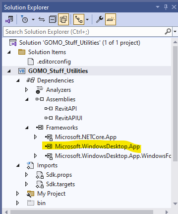
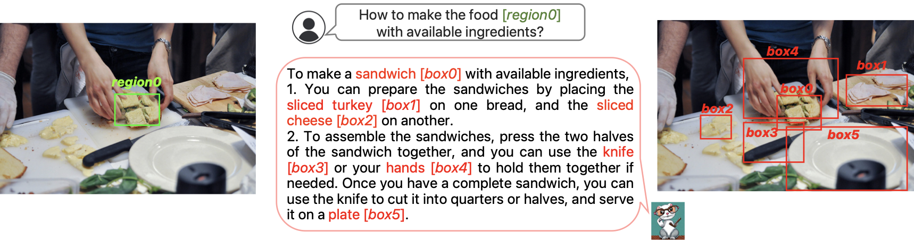

<head>
<meta http-equiv="Content-Type" content="text/html; charset=utf-8">
<link rel="stylesheet" type="text/css" href="bc.css">
<!-- https://highlightjs.org/#usage
<link rel="stylesheet" href="https://cdnjs.cloudflare.com/ajax/libs/highlight.js/11.9.0/styles/default.min.css">

-->

<!-- https://prismjs.com -->
<link href="https://cdn.jsdelivr.net/npm/prismjs@1.29.0/themes/prism.min.css" rel="stylesheet" />

</head>

<!---

- VB projects in Revit 2025 API
  https://forums.autodesk.com/t5/revit-api-forum/vb-project-solution-framework-upgrade-to-sdk-for-revit-2025/m-p/12723698

- Prompt library https://docs.anthropic.com/claude/prompt-library

- GPT-4 can exploit zero-day security vulnerabilities all by itself
  https://www.techspot.com/news/102701-gpt-4-can-exploit-zero-day-security-vulnerabilities.html

- An AI took on a human pilot in a DARPA-sponsored dogfight
  https://www.defenseone.com/technology/2024/04/man-vs-machine-ai-agents-take-human-pilot-dogfight/395930/

- integration of generative 3D (and 2d to 3d creation) in the Spline UI
  https://spline.design/ai-generate

- successful AI-conic coffee blend
  https://apnews.com/article/artificial-intelligence-finland-coffee-blend-0cd12d5ae15a6d0e928c4cb4d7635b09
  no human intervention required

- Meta AI released, and
  answered
  https://forums.autodesk.com/t5/revit-api-forum/binding-different-lists-to-different-rows-in-datagrid/td-p/12722925
  summarised
  https://forums.autodesk.com/t5/revit-api-forum/structural-framing-cut-by-reference-plane/m-p/12260041/highlight/false#M74290

- AI tools:
  ChatGPT
  Gemini + https://notebooklm.google/
  Claude
  Meta AI

- The State of Generative AI, 2024
  https://www.thealgorithmicbridge.com/p/the-state-of-generative-ai-2024

- Ferret: Refer and Ground Anything Anywhere at Any Granularity
  https://arxiv.org/abs/2310.07704
  The Ferret multimodal LLM understands spatial referring of any shape or granularity within an image and accurately grounds open-vocabulary descriptions, e.g.:
  /Users/jta/a/doc/revit/tbc/git/a/img/ferret_mllm.png

- Pankesh Bamotra
  https://chat.openai.com
  Now you can use ChatGPT 3.5 without logging in.
  Likely to collect more data

- Models All The Way Down
  https://knowingmachines.org/models-all-the-way
  by Christo Buschek & Jer Thorp
  Timo Gmeiner on slack
  nice visualizations - makes a boring dataset bias examination much more engaging!
  Content is great! I love the look and feel as well.
  Loved it, this part is probably my favorite:
  > Here we find an important truth about LAION-5B:
  It contains less about how humans see the world than it does about how search engines see the world. It is a dataset that is powerfully shaped by commercial logics.

- ScrapeGraphAI: You Only Scrape Once
  https://github.com/VinciGit00/Scrapegraph-ai

- video conferencing: jitsi meet
  https://jitsi.org/
  More secure, more flexible, and completely free video conferencing

- World Happiness Report 2024
  https://worldhappiness.report/ed/2024/

twitter:

News on advances in LLMs, AI, Claude, ChatGPT, Gemini, Meta AI, 3D genAI, web scraping, spatial referring, digital twins and migrating VB.NET to .NET Code 8 for the @AutodeskRevit #RevitAPI #BIM @DynamoBIM https://autode.sk/netcore8vb

Revit 2025 API migration of VB.NET add-ins to .NET Core 8 and advances in LLMs and AI, Claude, ChatGPT, Gemini, Meta AI, 3D genAI, web scraping, spatial referring, digital twins...

linkedin:

News on advances in LLMs, AI, Claude, ChatGPT, Gemini, Meta AI, 3D genAI, web scraping, spatial referring, digital twins and migrating VB.NET to .NET Code 8 for the #RevitAPI

https://autode.sk/netcore8vb

#BIM #DynamoBIM #AutodeskAPS #Revit #API #IFC #SDK #Autodesk #AEC #adsk

the [Revit API discussion forum](http://forums.autodesk.com/t5/revit-api-forum/bd-p/160) thread

-->

### Migrating VB to .NET Core 8 and AI News

There is so much news on advances in LLMs and AI; I list a few items that caught my attention.
First, however, we round off the Revit 2025 API migration with some observations on VB.NET add-ins:

- [Migrating VB add-in to Revit 2025](#2)
- [GenAI and LLM updates](#3)
- [Jitsi Meet video conferencing](#4)
- [World Happiness Report 2024](#5)

#### Migrating VB Add-In to Revit 2025

Gary Orr and
Richard [RPThomas108](https://forums.autodesk.com/t5/user/viewprofilepage/user-id/1035859) Thomas
discovered and shared their insights
on [VB projects in Revit 2025 API](https://forums.autodesk.com/t5/revit-api-forum/vb-project-solution-framework-upgrade-to-sdk-for-revit-2025/m-p/12723698):

**Question:**
I've read all of the posts regarding upgrading, I have applied everything that my limited experience allows me to understand (Been doing this for years, but on a limited basis as writing code isn't even in my job description these days and I can barely decipher all of the C# examples since I'm not bilingual and my native language is VB).

So far I have managed, through days of trial and error, to port one of my solutions (with 3 Projects) and have slowly whittled away the errors and warnings. My WinForms dialogs were a real bear but I finally managed to delete enough tags in the VBproj files to get them working (creating a new WinForms solution and project from scratch and doing some comparisons helped with that as it didn't have all the extra gobbledygook in it).

Finally upgraded successfully with one exception:

- Warning MSB3277 Found conflicts between different versions of "WindowsBase" that could not be resolved.

I've updated to all of the latest (which I'm beginning to believe might be my issue).
I'm working in
Visual Studio Community 2022 Version 17.9.6
with
dotnet SDK 8.0.204.

I get this warning on both the ported/upgraded solution/projects as well as the solution/project that I started from scratch.

Has anyone seen this warning or know a solution for resolving the conflict between the Revit API references and the newer native .NET references?

**Answer:**
First, congratulations on making progress, and sorry the migration is causing such a hassle for you.

Warnings can be ignored.
They do no harm.
Of course, it is nicer to eliminate them.

Actually, the very warning MSB3277 that you mention is also listed in
the [official Revit API .NET 8 migration guide](https://thebuildingcoder.typepad.com/blog/2024/04/migrating-from-net-48-to-net-core-8.html):

> Common Issues...
Here are some common issues you may encounter when upgrading to .NET 8:

> - Build Warning MSB3277
When building code that references RevitAPI or RevitUIAPI, you will see the build warning MSB3277.
To fix this, add a reference to the Windows Desktop framework: &lt;FrameworkReference Include="Microsoft.WindowsDesktop.App"/&gt;

**Response:**
I did see that reference, but it doesn't say where to put it or what container node it required (I had correctly assumed that I could use the vbproj file, since it's the same xml as the csproj file) and tried adding it to the (a) `<PropertyGroup> `node at which VS completely wigged out and said that an invalid call forced VS to unload the project...
I then spent a day following link after link in the MS documents trying to figure it out as well...

I had also tried using the `Add Reference` function to see if I could load it that way, but I couldn't find it as an available loadable reference.

So, with your prompting I tried again...
This time I used VS intellicode to help me work it out:
Create a node, check to see if that node contained the `<FrameworkReference>` property, repeat until I found the correct one.
I think this little additional piece of information would go a long way in helping people like me:

<pre><code>  &lt;ItemGroup&gt;
    &lt;FrameworkReference Include="Microsoft.WindowsDesktop.App" /&gt;
  &lt;/ItemGroup&gt;
</code></pre>

Now I have these references:

 <!-- Pixel Height: 431 Pixel Width: 359 -->

... along with a warning-free build.

Now perhaps I'll tackle the big toolset...

Adding another note to this...

I'm not sure what the upgrade process does differently from one project to the next but, whatever it is it isn't consistent.

On the next project, the framework references came in differently; the `FrameworkReference` tag that the previous project required caused a warning and I had errors due to a missing reference that had been automatically added to the other projects when I set the target to windows using

<pre><code>&lt;TargetFramework&gt;net8.0-windows&lt;/TargetFramework&gt;</code></pre>

So I had to do this to make it all come together:

<pre><code>&lt;ItemGroup&gt;
   &lt;!-- &lt;FrameworkReference Include="Microsoft.WindowsDesktop.App" /&gt; --&gt;
   &lt;FrameworkReference Include="Microsoft.WindowsDesktop.App.WindowsForms" /&gt;
 &lt;/ItemGroup&gt;
</code></pre>

**Answer:**
Also found this works:

<pre><code>  &lt;UseWindowsForms&gt;true&lt;/UseWindowsForms&gt;</code></pre>

This just highlights the way things have gone a bit backwards i.e. System.Drawing 4.0 instead of 8.0???
So, you add additional things to the point it basically becomes .NetFramework again anyway.
Yet they still can't open Revit on their mac or their phone and were never aiming to.

Think they should have got rid of application macros not the document ones.
Document macros offered the ability to transmit functionality across offices on a project specific level, i.e., with the project files, not as some separate things such as dynamo script etc.
Application macros are just another way of doing the same thing as VS or pyRevit or half a dozen other things similar.

**Response:**
`UseWindowsForms` was the first tag I used (thanks to a lot of reading in the API help and the posts made here by some people that, unlike myself, actually know what they're doing)...

But... it didn't do the complete job.
I had to delete extra lines/tags and add a few additional lines/tags...
and scratch my head, and cuss, and try deleting some more and try adding others...
then cuss some more...
then scratch my head some more...
But I do now have everything compiling properly for two solutions with a total of four projects...

Each project ended up requiring a slightly different combination to get them working...
I only have two more solutions to go, yay.

**Answer:**
Yes, certain things are fixed into the Frameworks, aren't they (more than there was with .NetFramework), so you have to review those already included reference versions and if you've referenced them separately historically then you have to take those out.
In this example there was newer references used in the Revit API DLLs due to options they compiled those with.
So, the baseline references used in .NET 8 were older in version than the ones included with windows desktop option.
So, in a lot of cases, it may be easier starting over with the project file references and adding references back as you see the related missing references errors for those.

So, as an example:
Microsoft.NetCore.App
contains
Microsoft.VisualBasic 10.0.0.0
but
Microsoft.WindowsDesktop.App
contains
Microsoft.VisualBasic 10.1.0.0

So, if you don't include the desktop option but include a reference that does i.e. RevitAPI.dll it tells you it is going to ignore 10.1.0.0 (since that is not added in your project). This would be a problem I suspect if you used a call from 10.0.0.0 that didn't exist anymore in 10.1.0.0 (since Revit is likely to be loading 10.1.0.0 not 10.0.0.0, first come first served).

So, isn't really VB specific that is just one of the affected assemblies that is part of Microsoft.NetCore.App but there are similar warnings for System.Drawing etc. You only encounter them if you use them in code so different projects will have same problem with different things.

**Response:**
Good advice on the start a project from scratch note.
Creating a project(s) from scratch (in a solution(s) created from scratch) for the different types of projects I had to deal with (WinForms project, WPF project, Console App, standalone executable [the last two not related to the Revit API, just noting them], etc) was one of the methods that helped me find what was actually required and what might be able to be safely removed.
I would recommend that for anyone making the transition from Framework to SDK.

I also found a few repeated tags that were added to `<PropertyGroup>` nodes by the upgrade tool whose removal helped greatly:

<pre><code>&lt;!--&lt;OutputType&gt;Library&lt;/OutputType&gt;--&gt;
 &lt;!--&lt;MyType&gt;Windows&lt;/MyType&gt;--&gt;
 &lt;!--&lt;ImportWindowsDesktopTargets&gt;true&lt;/ImportWindowsDesktopTargets&gt;--&gt;
 &lt;!--&lt;GenerateAssemblyInfo&gt;false&lt;/GenerateAssemblyInfo&gt;--&gt;
</code></pre>

The `GenerateAssemblyInfo` and `ImportWindowsDesktopTargets` seemed like they would belong yet they were causing issues that seemed contra-indicative to what they would seem to be adding to the whole...

Oh well, if it was easy it wouldn't be any fun right?

#### GenAI and LLM Updates

Recent weeks have seen updates to several of the main publicly accessible LLMs, each one claiming to be measurably superior to all its predecessors, e.g., Claude, ChatGPT, Gemini, Meta AI.
I have tried them all out briefly with satisfactory results.

Now you can now use [ChatGPT 3.5](https://chat.openai.com) without logging in.
Possibly to collect more data?

I used Meta AI effectively to answer the Revit API discussion forum thread
on [binding different lists to different rows in DataGrid](https://forums.autodesk.com/t5/revit-api-forum/binding-different-lists-to-different-rows-in-datagrid/td-p/12722925),
and summarise another,
on [structural framing cut by reference plane](https://forums.autodesk.com/t5/revit-api-forum/structural-framing-cut-by-reference-plane/m-p/12260041)

For a nice collection of LLM prompts, you can check out the [Anthropic Prompt Library](https://docs.anthropic.com/claude/prompt-library) for Claude.

Alberto Romero of The Algorithmic Bridge provides an interesting report
on [The State of Generative AI, 2024](https://www.thealgorithmicbridge.com/p/the-state-of-generative-ai-2024).

[Models All The Way Down](https://knowingmachines.org/models-all-the-way) by Christo Buschek and Jer Thorp
presents an in-depth analysis of the sources used to generate the huge amount of material required to train an LLM, presented in a novel and engaging fashion with lots of visualisation and animation, making an otherwise possibly boring dataset bias examination much more engaging.
In particular, it examines the ubiquitous LAION-5B dataset:

> ... an important truth about LAION-5B:
It contains less about how humans see the world than it does about how search engines see the world.
It is a dataset that is powerfully shaped by commercial logics.

Here are some of the interesting capabilities exhibited by LLMs:

- [GPT-4 can exploit zero-day security vulnerabilities all by itself](https://www.techspot.com/news/102701-gpt-4-can-exploit-zero-day-security-vulnerabilities.html)
- [An AI took on a human pilot in a DARPA-sponsored dogfight](https://www.defenseone.com/technology/2024/04/man-vs-machine-ai-agents-take-human-pilot-dogfight/395930/)
- A Finnish company released the [AI-conic coffee blend](https://apnews.com/article/artificial-intelligence-finland-coffee-blend-0cd12d5ae15a6d0e928c4cb4d7635b09) designed and marketed by AI with hardly any human intervention required
- [Spline AI 3D Generation](https://spline.design/ai-generate) integrates generative 3D (and 2d to 3d creation) in the UI, enabling creation of 3D objects from text prompts and images
- [ScrapeGraphAI](https://github.com/VinciGit00/Scrapegraph-ai) implements a web scraping python library that uses LLM and direct graph logic to create scraping pipelines for websites, documents and XML files
- The Ferret multimodal LLM understands spatial referring of any shape or granularity within an image and accurately grounds open-vocabulary descriptions, documented
in [Ferret: Refer and Ground Anything Anywhere at Any Granularity](https://arxiv.org/abs/2310.07704),
for example like this:

 <!-- Pixel Height: 452 Pixel Width: 1,718 -->

[Reid Hoffman engages with his AI digital twin](https://www.linkedin.com/posts/reidhoffman_can-talking-with-an-ai-generated-version-activity-7188916775692947456-Dw6q?utm_source=share&utm_medium=member_desktop),
spending 15 minutes or so exploring:

> Can talking with an AI-generated version of myself lead to a deeper awareness of how I think?
That's what I wanted to find out as I continue to explore the latest AI technologies in hands-on ways.

#### Jitsi Meet Video Conferencing

Moving off the AI topic, I discovered a secure, flexible, and free video conferencing platform,
[Jitsi meet](https://jitsi.org/),
based on the Jitsi set of open-source projects that allows you to easily build and deploy secure video conferencing solutions.

#### World Happiness Report 2024

And finally, for the more important aspects of life, the [World Happiness Report 2024](https://worldhappiness.report/ed/2024/)
focuses on the happiness of people at different stages of life:

> Happiness research shows a nuanced picture that is changing over time...
We encourage you to explore the 2024 report for the latest findings on the happiness of the world’s young, the old, and everyone in between.

