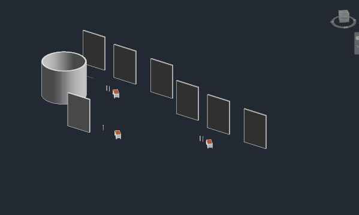

<head>
<meta http-equiv="Content-Type" content="text/html; charset=utf-8">
<link rel="stylesheet" type="text/css" href="bc.css">
<!-- https://highlightjs.org/#usage
<link rel="stylesheet" href="https://cdnjs.cloudflare.com/ajax/libs/highlight.js/11.9.0/styles/default.min.css">

-->

<!-- https://prismjs.com -->
<link href="https://cdn.jsdelivr.net/npm/prismjs@1.29.0/themes/prism.min.css" rel="stylesheet" />

</head>

<!---

- highlight elements from a linked document
  https://forums.autodesk.com/t5/revit-api-forum/highlight-elements-from-a-linked-document/td-p/12768033

twitter:

 the @AutodeskRevit #RevitAPI #BIM @DynamoBIM

linkedin:

#BIM #DynamoBIM #AutodeskAPS #Revit #API #IFC #SDK #Autodesk #AEC #adsk

the [Revit API discussion forum](http://forums.autodesk.com/t5/revit-api-forum/bd-p/160) thread

-->

### Highlight Linked Element

#### Highlight Linked Element

Lately, Moustafa Khalil has very kindly provided a huge amount of helpful support in
the [Revit API discussion forum](http://forums.autodesk.com/t5/revit-api-forum/bd-p/160).

He now took a step further, sharing hiw research and explanation on how
to [highlight elements from a linked document](https://forums.autodesk.com/t5/revit-api-forum/highlight-elements-from-a-linked-document/td-p/12768033),
a frequently raised topic, saying:

The past 2 days I was scratching my head of how to highlight an element from a linked document.
I tried many API statements and I also found many existing posts requesting the same:

https://forums.autodesk.com/t5/revit-api-forum/how-to-select-linked-element-by-element-id/m-p/824563...
https://forums.autodesk.com/t5/revit-api-forum/highlight-and-tag-linked-elements/m-p/5294217
https://forums.autodesk.com/t5/revit-api-forum/how-to-highlight-element-in-linked-model-by-api/m-p/9...
https://forums.autodesk.com/t5/revit-api-forum/high-light-link-element/m-p/11111305
https://forums.autodesk.com/t5/revit-api-forum/can-t-select-elements-in-a-linked-model/m-p/12681983
https://forums.autodesk.com/t5/revit-ideas/highlight-element-selection-in-linked-files/idi-p/7619701

This has been a [wish in the Revit Idea Station](https://forums.autodesk.com/t5/revit-ideas/highlight-element-selection-in-linked-files/idi-p/7619701) since 2017,
which was some how disappointing.
The good news, after some readings over the Revit API Doc, it seems this wish have been granted since Revit 2023.

A new Selection function called SetReferences has been added, allowing elements to be highlighted via set of references. We don't (at least for me) often use references to highlight elements, but rather to set hosts, like placing hosted families or extracting element IDs from a ReferenceIntersector or when selecting by picking.

So, if we provide the SetReferences function with references from a linked document, will it work? In theory, yes, it should work. However, some extra work is required to capture such element references. Firstly, we need to understand that this function operates on the currently active document. This means that the references we provide must be in a format that the current document can recognize to highlight them in the current view.

Let's attempt to highlight a face from an element in a linked document in the following steps:
Click on a point over one of the faces in a linked document.
Then, pass this reference to SetReferences, and it will highlight the face from the linked document.
Similarly, if you press Tab to cycle through line, face, and object, once you reach the object, select it to get the object reference.

<pre><code>var linkedFaceReference = UiDoc.Selection.PickObject(
  Autodesk.Revit.UI.Selection.ObjectType.PointOnElement
);
UiDoc.Selection.SetReferences([linkedFaceReference]);
</code></pre>

Now, this only happens when a user interacts with the UI. But what if I have an element ID from a linked document that I want to highlight? The real question then becomes, how can I extract a reference from an ElementId that belongs to a linked document?

This is achievable, but not directly from the ElementId; we need to work with the element itself. First, we need to get the element from the linked document, then create a reference for this element. However, we can't use this reference as it's only meaningful to the linked document, not the current one. Therefore, we must convert this reference to the current document using CreateLinkReference and RevitLinkInstance. It might sound confusing, but I've included the code below to demonstrate how it functions clearly. So if you have the linked ElementId, you can directly start from line 10, without the need for selection.

See the example code below for easy reference.

 <!-- Pixel Height: 358 Pixel Width: 599 -->

<pre><code>var pickedReference = UiDoc.Selection.PickObject(
  Autodesk.Revit.UI.Selection.ObjectType.PointOnElement
);

// get Revit link Instance and its document
var linkedRvtInstance = Doc.GetElement(pickedReference) as RevitLinkInstance;
var linkedDoc = linkedRvtInstance.GetLinkDocument();

//get the Linked element from the linked document
var linkedElement = linkedDoc.GetElement(pickedReference.LinkedElementId);

// now create a reference from this element [ this is a reference inside the linked document]
var reference = new Reference(linkedElement);

// convert the reference to be readable from the current document
reference = reference.CreateLinkReference(linkedRvtInstance);

// now the linked element is highlighted
UiDoc.Selection.SetReferences([reference]);
</code></pre>

Many thanks to Moustafa for this in-depth research and documentation, and for all his great support in the discussion forum!

