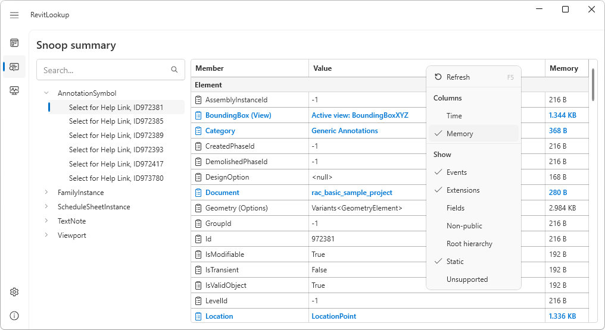

<head>
<meta http-equiv="Content-Type" content="text/html; charset=utf-8">
<link rel="stylesheet" type="text/css" href="bc.css">
<!-- https://highlightjs.org/#usage
<link rel="stylesheet" href="https://cdnjs.cloudflare.com/ajax/libs/highlight.js/11.9.0/styles/default.min.css">

-->

<!-- https://prismjs.com -->
<link href="https://cdn.jsdelivr.net/npm/prismjs@1.29.0/themes/prism.min.css" rel="stylesheet" />

</head>

<!---

twitter:

 the @AutodeskRevit #RevitAPI #BIM @DynamoBIM

...

linkedin:

#BIM #DynamoBIM #AutodeskAPS #Revit #API #IFC #SDK #Autodesk #AEC #adsk

the [Revit API discussion forum](http://forums.autodesk.com/t5/revit-api-forum/bd-p/160) thread

-->

### RevitLookup 2025.0.3

A quick heads-up on the new release of RevitLookup covering numerous new classes and properties, and two unrelated notes:

- [RevitLookup 2025.0.3](#2)
- [RevitLookup 2025.0.4](#3)
- [`Outline` versus `BoundingBox`](#4)
- [Linking Revit files in BIM360 Docs](#5)

#### RevitLookup 2025.0.3

Roman [@Nice3point](https://t.me/nice3point) Karpovich, aka Роман Карпович,
published [RevitLookup release 2025.0.3](https://github.com/jeremytammik/RevitLookup/releases/tag/2025.0.3),
integrating extensive work
by [Sergey Nefyodov](https://github.com/SergeyNefyodov) to expand coverage to numerous new classes, properties and contexts.

Sergey packaged his enhancements in pull requests
[227 (`ConnectorManager`)](https://github.com/jeremytammik/RevitLookup/pull/227),
[228 (`Wire`)](https://github.com/jeremytammik/RevitLookup/pull/228),
[229 (`IndependentTag`)](https://github.com/jeremytammik/RevitLookup/pull/229),
[230 (`CurveElement`)](https://github.com/jeremytammik/RevitLookup/pull/230),
[231 (`TableView`)](https://github.com/jeremytammik/RevitLookup/pull/231),
[232 (`DatumPlane`)](https://github.com/jeremytammik/RevitLookup/pull/232)
and [233 (extensions)](https://github.com/jeremytammik/RevitLookup/pull/233).

Specific improvement include:

- Memory diagnoser

 <!-- Pixel Height: 555 Pixel Width: 1,016 -->

    - The `Memory` column shows the size of allocated **managed memory**.
    - Native ETW and allocations in C++ code are not included to avoid severe performance degradation.
- Different method overload variations now displayed in a `Variants` collection

 <!-- Pixel Height: 555 Pixel Width: 1,016 -->

    - Previously: `GeometryElement`
    - Now: `Variants<GeometryElement>`
- ConnectorManager class support
    - Added `ConnectorManager.Lookup`
- Wire class support
    - Added `Wire.GetVertex`
- IndependentTag class support
    - Added `IndependentTag.CanLeaderEndConditionBeAssigned`
    - Added `IndependentTag.GetLeaderElbow`
    - Added `IndependentTag.GetLeaderEnd`
    - Added `IndependentTag.HasLeaderElbow`
    - Added `IndependentTag.IsLeaderVisible`
- CurveElement class support
    - Added `CurveElement.GetAdjoinedCurveElements`
    - Added `CurveElement.HasTangentLocks`
    - Added `CurveElement.GetTangentLock`
    - Added `CurveElement.HasTangentJoin`
    - Added `CurveElement.IsAdjoinedCurveElement`
- TableView class support
    - Added `TableView.GetAvailableParameters`
    - Added `TableView.GetCalculatedValueName`
    - Added `TableView.GetCalculatedValueText`
    - Added `TableView.IsValidSectionType`
    - Added `TableView.GetCellText`
- DatumPlane class support
    - Added `DatumPlane.CanBeVisibleInView`
    - Added `DatumPlane.GetPropagationViews`
    - Added `DatumPlane.CanBeVisibleInView`
    - Added `DatumPlane.GetPropagationViews`
    - Added `DatumPlane.GetDatumExtentTypeInView`
    - Added `DatumPlane.HasBubbleInView`
    - Added `DatumPlane.IsBubbleVisibleInView`
    - Added `DatumPlane.GetCurvesInView`
    - Added `DatumPlane.GetLeader`
- Extensions:
    - Added Family class extension `FamilySizeTableManager.GetFamilySizeTableManager`
    - Added FamilyInstance class extension `AdaptiveComponentInstanceUtils.GetInstancePlacementPointElementRefIds`
    - Added FamilyInstance class extension `AdaptiveComponentInstanceUtils.IsAdaptiveComponentInstance`
    - Added Solid class extension `SolidUtils.SplitVolumes`
    - Added Solid class extension `SolidUtils.IsValidForTessellation`
- [Full changelog 2025.0.2...2025.0.3](https://github.com/jeremytammik/RevitLookup/compare/2025.0.2...2025.0.3)
- [RevitLookup versioning](https://github.com/jeremytammik/RevitLookup/wiki/Versions)

#### RevitLookup 2025.0.4

https://github.com/SergeyNefyodov

https://github.com/jeremytammik/RevitLookup/pull/236

https://github.com/jeremytammik/RevitLookup/pull/235

https://github.com/jeremytammik/RevitLookup/compare/2025.0.3...2025.0.4

https://github.com/jeremytammik/RevitLookup/wiki/Versions

A new Release focused on improving core functionalities and robustness of the product.

## Improvements

- Introducing a preview feature for **Family Size Table**, making it easier to manage and visualize family sizes by @SergeyNefyodov in https://github.com/jeremytammik/RevitLookup/pull/236

 <!-- Pixel Height: 555 Pixel Width: 1,016 -->

To access it:
  - Enable **Show Extensions** in the view menu
  - Select any **FamilyInstance**
  - Navigate to the **Symbol**
  - Navigate to the **Family** (or just search for Family class objects in the **Snoop database** command)
  - Navigate to the **GetFamilySizeTableManager** method
  - Navigate to the **GetSizeTable** method
  - Right-click on one of the tables and select the **Show table** command

  _Note: Family size table is currently in read-only mode_

- Added new context menu item for selecting elements without showing
- Added new fresh, intuitive icons to the context menu for a more user-friendly interface.
- Refined labels, class names, and exception messages

## Bugs

- Resolved an issue where the delete action was not displayed in the context menu for ElementType classes
- Fixed the context menu display issue for Element classes, broken in previous release
- Fixed the order of descriptors to prevent missing extensions and context menu items in some classes, broken in previous release by @SergeyNefyodov in https://github.com/jeremytammik/RevitLookup/pull/235

Full changelog: https://github.com/jeremytammik/RevitLookup/compare/2025.0.3...2025.0.4
RevitLookup versioning: https://github.com/jeremytammik/RevitLookup/wiki/Versions

Many thanks to Roman and Sergey for their impressive implementation and maintenance work!

#### Outline Versus BoundingBox

Some interesting aspects of different kinds of bounding boxes and their uses in intersection filters are discussed in the thread
on [`Outline` vs `BoundingBoxXYZ` in Revit API](https://forums.autodesk.com/t5/revit-api-forum/outline-vs-boundingboxxyz-in-revit-api/m-p/12670522).

#### Linking Revit Files in BIM360 Docs

Several users asked whether it is possible to link Revit projects directly in ACC and BIM360 Docs.
Luckily, Eason Kang has covered that topic extensively in his article
on [BIM360 Docs: Setting up external references between files (Upload Linked Files)](https://aps.autodesk.com/blog/bim360-docs-setting-external-references-between-files-upload-linked-files).

