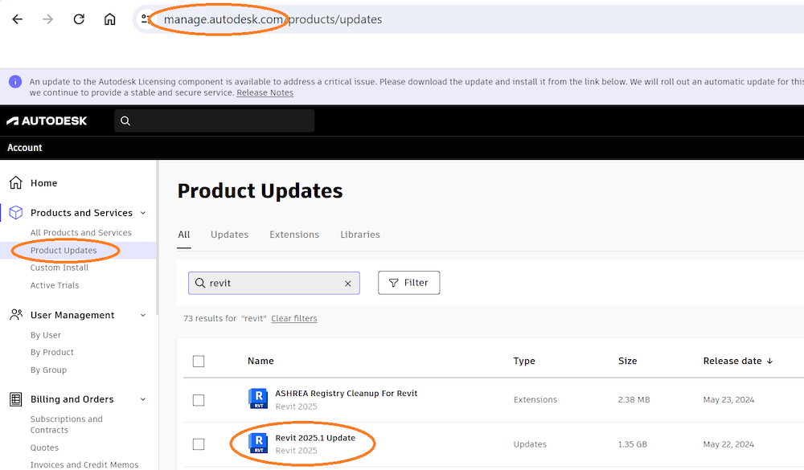

<head>
<meta http-equiv="Content-Type" content="text/html; charset=utf-8">
<link rel="stylesheet" type="text/css" href="bc.css">
<!-- https://highlightjs.org/#usage
<link rel="stylesheet" href="https://cdnjs.cloudflare.com/ajax/libs/highlight.js/11.9.0/styles/default.min.css">

-->

<!-- https://prismjs.com -->
<link href="https://cdn.jsdelivr.net/npm/prismjs@1.29.0/themes/prism.min.css" rel="stylesheet" />

</head>

<!---

- Placing detail group in legend view without access to UI (Design Automation)
  https://forums.autodesk.com/t5/revit-api-forum/placing-detail-group-in-legend-view-without-access-to-ui-design/m-p/12795399

- implement RAG in 10 lines
  https://x.com/Yampeleg/status/1793698848616960393
  retrieval augmented generation:
  https://fastai.github.io/lm-hackers/lm-hackers.html#retrieval-augmented-generation

twitter:

Update release Revit 2025.1, the hacker's guide to LLM and an LLM retrieval augmented generation in 10 lines of code and placing a detail group in ASP Design Automation, lacking the UI in the @AutodeskRevit #RevitAPI #BIM @DynamoBIM https://autode.sk/revit_2025_1

The first update release of Revit 2025, placing a detail group in ASP Design Automation, lacking the UI, the hacker's guide to LLM and an LLM retrieval augmented generation in 10 lines of code...

linkedin:

Update release Revit 2025.1, the hacker's guide to LLM and an LLM retrieval augmented generation in 10 lines of code and placing a detail group in ASP Design Automation, lacking the UI in the #RevitAPI

https://autode.sk/revit_2025_1

#BIM #DynamoBIM #AutodeskAPS #Revit #API #IFC #SDK #Autodesk #AEC #adsk

the [Revit API discussion forum](http://forums.autodesk.com/t5/revit-api-forum/bd-p/160) thread

-->

### Revit 2025.1 and Handling Lack of UI in DA

A quick heads-up on the first update release of Revit 2025, a solution for placing a detail group in ASP Design Automation, lacking the UI, and an LLM retrieval augmented generation in 10 lines of code:

- [Revit 2025.1](#2)
    - [Software included](#2.1)
    - [Enhancements](#2.2)
    - [Issues resolved](#2.3)
    - [Revit 2025.1 SDK](#2.4)
- [Placing detail group without UI access](#3)
- [Hacker's guide to LLM and 10-Line RAG](#4)

#### Revit 2025.1

The Revit 2025.1 update release was made available on May 22, 2024, via Autodesk Access or from the Autodesk subscription site.

The official [Revit 2025.1 update release notes](https://help.autodesk.com/view/RVT/2025/ENU/?guid=RevitReleaseNotes_2025updates_2025_1_html) list
the following details:

#### Software Included

- Core Package Component for Revit 2025 - version 25.1.0.44
- Core-RVT Package Component for Revit 2025 - version 25.1.0.44
- ATF for Revit 2025 - version 25.1.0.44
- Core Package Component Cloud for Revit 2025 - version 25.1.0.44
- Dynamo Core for Revit 2025 - version 25.1.0.44
- TwinMotion Package Component for Revit 2025 - version 25.1.0.44
- Unit Schemas for Revit 2025 - version 25.1.0.44
- Generative Design For Revit - version 25.3.21.0
- Personal Accelerator for Revit 2025 - version 24.4.21.0

#### Enhancements

- Coordination Model
    - Added a tooltip for the truncated model name for the selected model in the Coordination Model Changes dialog.
    - Fixed an issue that could occur when using the unload and reload options for Coordination Model Changes.
- Export PDF
    - Improved the message for cancelling background PDF export.
    - Provided an error message when "Coordination Model Changes" mode is turned on during background PDF export.
    - Resolved the issue of the default 3D view not being correctly exported to PDF in the background when its orientation was changed but unsaved.
    - Improved the performance of background PDF export - for example, in one model where exporting 16 views previously took 34 minutes, it now takes 3 minutes.
- Family Editor
    - Simplified the Additional Settings ribbon menu by removing the dividing lines.
- IFC
    - Improved performance of some elongated elements export to IFC 4.
- Macros
    - Updated the Revit SDK MacroSample to .NET 8.
- Pressure Loss Calculations
    - Fixed an issue that caused a graphic override to not be applied to analytical segments for duct and pipe fittings.
- Reinforcement
    - Dimensions on bars in area and path reinforcement are maintained after removing the path or area system.
- Site
    - Sub-divisions share the Cut line settings as toposolid.
    - Improved the wording in the Generate Toposolid from Toposurface dialog.
    - Improved the link topography to be more stable with hosted elements and Boolean results when reloading links.
- Slab
    - Added a confirmation for the Reset Shape command when resetting to the original shape.
- Truss
    - Enabled the scheduling of shared parameters defined in the structural truss family.
- User Interface
    - Improved several rename dialogs to make them wider by default and resizable to fit long names.

#### Issues Resolved

- General
    - Addressed potential security vulnerabilities.
- Annotation
    - Resolved the issue that edit boundary command is grayed out when editing the filled region.
- API
    - Fixed an API issue where GetAllInstalledRevitProducts does not properly return the correct Revit 2025 version.
    - Fixed an issue which prevented ASP.Net Core from being used in Revit addins.
    - Fixed issue that could occur when the Windows region was set to Thai/Thailand.
- Assembly
    - Resolved the issue that customers cannot adjust text leader in assembly view.
- Coordination Model
    - Fixed an issue for parameters created under “Other” group when editing families from a Revit model.
    - Fixed an issue regarding the positioning of local coordination models linked by shared coordinates.
    - Fixed an issue that could occur when changing the path type of a local coordination model.
- Copy-Cut-Paste
    - Improved stability when trying to insert 2D elements into a Drafting View.
- Dynamo for Revit
    - Fixed an issue where Remember nodes would be removed from old Dynamo graphs when opened in Revit.
- Dynamo Player
    - Fixed an issue with numeric display in Generative Design in some languages.
- Energy Model
    - Improved stability when regenerating the energy analytical model while another user is borrowing it.
    - Improved stability when running an energy analysis.
    - Improved stability when generating an energy analytical model when system time is set to a time zone close to the international date line.
- Export DWG/DXF
    - Fixed an issue where solid hatches would get the wrong index color when exported to DWG.
- Export PDF
    - Resolved the issue where elements from closed worksets were exported to PDF in the background.
    - Resolved the issue where the value of keynote tag from a linked Revit model was missing in the background export result.
    - Resolved the issue where file size increases after cancelling background PDF export.
    - Resolved the issue that grid heads in linked model was not exported correctly after running background PDF export.
- File Open/Save
    - Fixed an issue that a pasted local path can't be navigated in File Open and Import/Link RVT dialog.
    - Improved stability when opening Revit Server models from different site of host without Revit Server Accelerator.
- Fill Patterns
    - Fixed an issue where Solid fills on model objects that have a transparent override were not exported to DWG when the far clip of the view was active.
- Keyboard Shortcuts
    - Restored two keyboard shortcuts (EOH and VOH) that can be used for element and category halftone overrides.
- Location
    - Improved stability of the Location dialog.
- MEP Connectors
    - Fixed an issue that caused disconnection errors when a family containing adjustable connectors is modified.
- Part Elements
    - Improved stability when editing intersecting named references for dividing parts.
    - Fixed an API issue where PartUtils.FindMergeableClusters would return invalid clusters.
- Plan Regions
    - Resolved the issue where applying a plan region affected the graphics of elements outside its boundary.
- Precast
    - Improved the behavior of Precast CAM export to take into account moved and removed bars in rebar sets.
- Pressure Loss Calculations
    - Fixed an issue that led the background worker process into an endless flow and pressure loss calculation.
    - Fixed an issue that prevented network-based duct flow calculations when the flow was set on the source equipment.
- Reinforcement
    - Fixed an issue where a multi-rebar annotation would get an incorrect orientation when referencing rebar sets that are slightly rotated with respect to the view.
    - Improved stability when editing new rebar shape families in a project.
    - Improved the behavior when dimensioning rebar to allow picking the end reference for rebar shapes with multiple segments in any view orientation.
- Revit Cloud Model (workshared)
    - Fixed an issue where the Save File dialog is shown after synchronizing with a Revit Server model.
    - Fixed an issue where Revit would become unresponsive during service disruptions with Revit Cloud Worksharing.
- Revit Home
    - Fixed an auto-refresh issue with the new Revit Home when there was a change in accounts and projects.
    - Fixed the issue that Revit Home is not updating when there are changes for folders and files in ACC and BIM360.
- Selection
    - Fixed the issue of Select Multiple button status not updating correctly when working with roof.
- Site
    - Fixed an issue regarding workset edit for link topography.
    - Fixed an issue when partial sketch lines constrained by walls.
- Solar Analysis
    - Updated the message that displays when trying to do a solar analysis in a perspective view.
- Startup/Shutdown
    - Improved stability when exiting Revit.
    - Improved stability during Revit shutdown for cases that could have previously triggered an error report after close.
- Tags
    - Fixed an issue where multi-leader keynote tags would incorrectly show "varies" when some leaders where hidden.
- User Interface
    - Improved the stability when working with UI theme.
    - Resolved an issue with the Options Bar user interface when using modification tools.

#### Revit 2025.1 SDK

The Revit SDK was also updated.
The updated version is available from
the [APS Revit developer page](https://aps.autodesk.com/developer/overview/revit).
One small change in the documentation right up front says:

> Major changes and renovations to the Revit 2025.1 API

> API additions

> AspNetCore

> Revit now has a framework reference to Microsoft.AspNetCore.App, so that addins can use AspNetCore.

Furthermore, note the API-related issues listed above, some of them not under the API heading:

- Updated the Revit SDK MacroSample to .NET 8
- Fixed an API issue where GetAllInstalledRevitProducts does not properly return the correct Revit 2025 version
- Fixed an issue which prevented ASP.Net Core from being used in Revit addins
- Fixed issue that could occur when the Windows region was set to Thai/Thailand
- Fixed an API issue where PartUtils.FindMergeableClusters would return invalid clusters,
  cf. the [Revit API discussion forum](http://forums.autodesk.com/t5/revit-api-forum/bd-p/160) thread
  reporting that [PartUtils.FindMergeableClusters finds clusters which are not valid for merge](https://forums.autodesk.com/t5/revit-api-forum/partutils-findmergeableclusters-finds-clusters-which-are-not/m-p/12402263)

 <!-- Pixel Height: 585 Pixel Width: 1,000 -->

#### Placing Detail Group Without UI Access

Luiz Henrique [@ricaun](https://ricaun.com/) Cassettari provided a nice workaround to
enable [placing detail group in legend view without access to UI, e.g., for Design Automation](https://forums.autodesk.com/t5/revit-api-forum/placing-detail-group-in-legend-view-without-access-to-ui-design/m-p/12795399):

**Question:** I would like to *place a detail group in legend view without access to UI  for Design Automation*:
in Design Automation for Revit, I want to place detail groups onto a legend view. The approach would typically be:

- [change active view](https://www.revitapidocs.com/2017/b6adb74b-39af-9213-c37b-f54db76b75a3.htm)
- [call PlaceGroup()](https://www.revitapidocs.com/2019/586d4f2e-0985-2d0b-dbb7-ea6d2f704336.htm)

However, in Design Automation, I don't have access to the UI and therefore cannot set `UIDocument.Activeview`.
Is there an alternative method for placing detail groups which takes in a `View` as an argument?
Or are there ways to change the `ActiveView` in Design Automation?

Ricaun provided non-UI-dependent code that places both model and detail groups.
It just lacks the possibility to control the target view.

However, this can be worked around by letting Revit place the detail group in any old view,
then copy and paste to the desired target view and delete the intermediate element.

Here is a 30-minute video testing [placement of a detail group in both Revit on the Windows desktop and Revit for Design Automation](https://youtu.be/oSCvXGx4SaM):

<iframe width="480" height="270" src="https://www.youtube.com/embed/oSCvXGx4SaM?si=MU_SFS--lr4zLW15" title="YouTube video player" frameborder="0" allow="accelerometer; autoplay; clipboard-write; encrypted-media; gyroscope; picture-in-picture; web-share" referrerpolicy="strict-origin-when-cross-origin" allowfullscreen></iframe>

Going even further, ricaun
implemented [`RevitTestPlaceGroup.Tests`, a unit test project for the PlaceGroup problem](https://github.com/ricaun-io/RevitTestPlaceGroup.Tests) and
shows it running in another 36-minute video
on [creating `PlaceGroupDetail` unit test for Revit API](https://youtu.be/VhaFv_UaHGU):

<iframe width="480" height="270" src="https://www.youtube.com/embed/VhaFv_UaHGU?si=Gj1VWrgOh3ajtSsa" title="YouTube video player" frameborder="0" allow="accelerometer; autoplay; clipboard-write; encrypted-media; gyroscope; picture-in-picture; web-share" referrerpolicy="strict-origin-when-cross-origin" allowfullscreen></iframe>

Ever so many thanks to ricaun for the very helpful work and excellent documentation!

#### Hacker's Guide to LLM and 10-Line RAG

[A hacker’s guide to language models](https://fastai.github.io/lm-hackers/lm-hackers.html) provides
a nice introduction to the topic and includes subjects like
implementing [retrieval augmented generation](https://fastai.github.io/lm-hackers/lm-hackers.html#retrieval-augmented-generation)
e.g., [how to implement RAG in 10 lines](https://x.com/Yampeleg/status/1793698848616960393).

