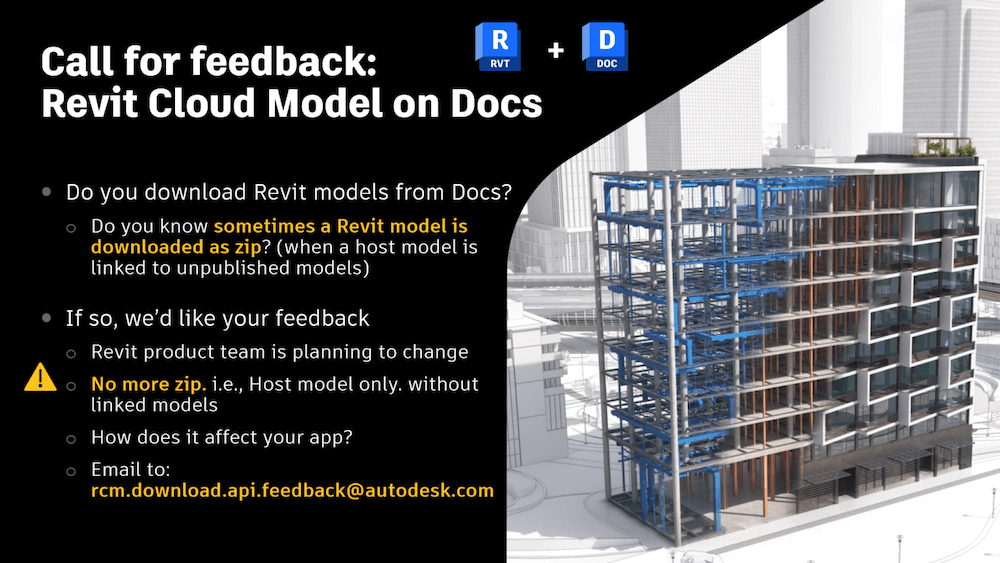
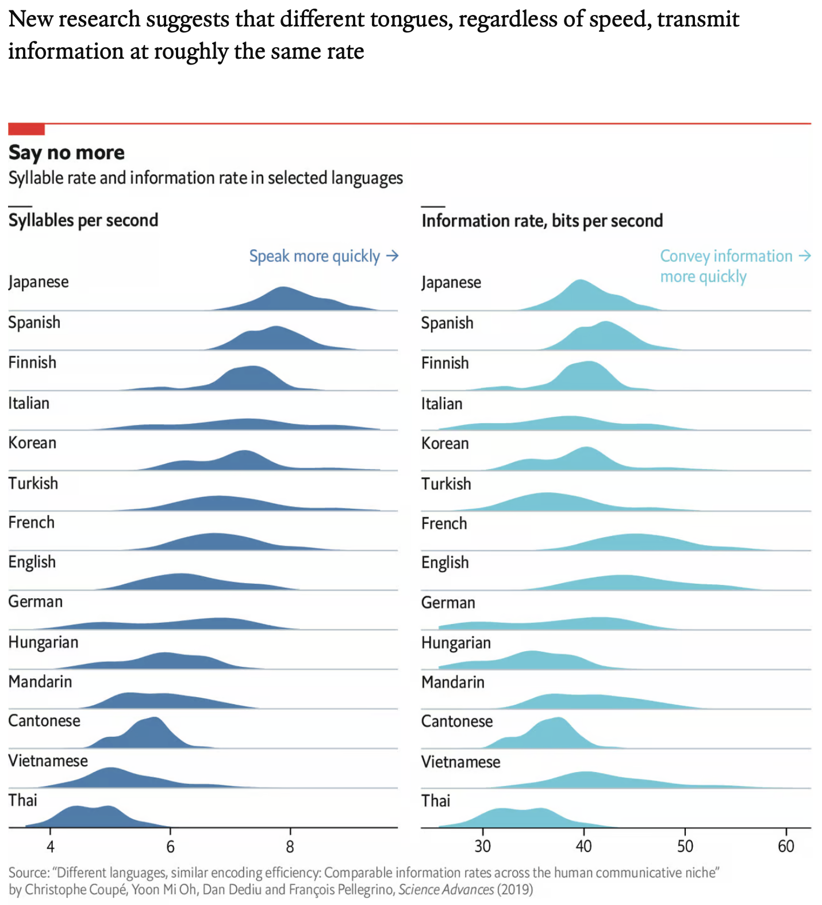

<head>
<meta http-equiv="Content-Type" content="text/html; charset=utf-8">
<link rel="stylesheet" type="text/css" href="bc.css">
<!-- https://highlightjs.org/#usage
<link rel="stylesheet" href="https://cdnjs.cloudflare.com/ajax/libs/highlight.js/11.9.0/styles/default.min.css">

-->

<!-- https://prismjs.com -->
<link href="https://cdn.jsdelivr.net/npm/prismjs@1.29.0/themes/prism.min.css" rel="stylesheet" />

</head>

<!---

- remove ribbon panel and ribbon button
  https://chuongmep.com/posts/2024-04-19-reload-ribbon-revit.html#remove-panel
  find ribbon tabs and or panels and delete
  https://forums.autodesk.com/t5/revit-api-forum/find-ribbon-tabs-and-or-panels-and-delete/m-p/12793159#M79071

- Open-Endedness is Essential for Artificial Superhuman Intelligence
  https://arxiv.org/abs/2406.04268

- accurate forecasts, finally?
  No physics? No problem. AI weather forecasting is already making huge strides.
  New model that predicts global weather can run on a single desktop computer.
  https://arstechnica.com/ai/2024/06/as-a-potentially-historic-hurricane-season-looms-can-ai-forecast-models-help/

- bilinguals get dementia on average four years later than monolinguals
  https://www.economist.com/books-and-arts/2020/02/29/the-advantages-of-speaking-a-second-language
  /Users/jta/a/doc/revit/tbc/git/a/doc/bilingual.txt

- language speed and information density
  Different languages, similar encoding efficiency: Comparable information rates across the human communicative niche
  https://www.science.org/doi/10.1126/sciadv.aaw2594
  /Users/jta/a/doc/revit/tbc/git/a/img/language_speed_information.png

- Stockholm Wood City by Atrium Ljungberg
  https://www.al.se/en/sickla
  Stockholm Wood City will be built in Sickla, an area in the south of the Swedish capital.
  Construction on the 250,000 square-metre site will begin in 2025.
  When complete, ten years later, it will contain 2,000 homes and 7,000 offices, along with restaurants and shops.
  The 12bn-krona ($1.4bn) project is led by Atrium Ljungberg, a Swedish urban development company.

- General Purpose Interfaces
  https://modemworks.com/research/general-purpose-interfaces/
  > The emergence of AI agents lets us reimagine the ways we interact with our digital devices
  ... explore the next phase of user interface design, as enabled by AI
  ... principles for designing a single interface that can replace many

- AI headphones let wearer listen to a single person in a crowd, by looking at them just once
  https://www.washington.edu/news/2024/05/23/ai-headphones-noise-cancelling-target-speech-hearing/

- EU directive on the energy performance of buildings
  Directive (EU) 2024/1275 of the European Parliament and of the Council
  of 24 April 2024
  on the energy performance of buildings
  https://eur-lex.europa.eu/legal-content/EN/TXT/?uri=CELEX:32024L1275
  The European Union has formally adopted and published a recast directive on energy performance for buildings. What’s changing?
  - New buildings must be net-zero by 2030
  - Existing buildings must be renovated to meet energy performance requirements
  - Building performance data to become more accessible, with improved funding
  - New incentives to deploy digital solutions, including building modeling and simulation
  Article 7
  New buildings
  1. Member States shall ensure that new buildings are zero-emission buildings in accordance with Article 11:
  (a) from 1 January 2028, new buildings owned by public bodies; and
  (b) from 1 January 2030, all new buildings;
  Article 8 Existing buildings
  Article 10 Solar energy in buildings

- llama3v open source multi-modal LLM
  https://huggingface.co/mustafaaljadery/llama3v
  Comparable performance to GPT4-V, Gemini Ultra, Claude Opus with a 100x smaller model
  SOTA open source VLM for Llama3 8B
  RAG in 10 lines

twitter:

Feedback on no Zips downloading RCM from Docs, EU AEC energy directive, wooden buildings, spoken human language speed and information density, AI news and removing ribbon panels and buttons in the @AutodeskRevit #RevitAPI #BIM @DynamoBIM https://autode.sk/nozipsfromdocs

A call for feedback on a planned change downloading a RCM from Docs, a tricky solution to remove ribbon panels and buttons, and a bunch of news bites that I found interesting on sustainability, language and AI discoveries; new EU AEC energy ruling, ecological wooden buildings in Scandinavia, spoken human language speed and information density, AI uses as a hearing aid enhancement, weather forecasting, interface assistant, AI open-source and future directions...

linkedin:

Feedback on no Zips downloading RCM from Docs, EU AEC energy directive, wooden buildings, spoken human language speed and information density, AI news and removing ribbon panels and buttons in the #RevitAPI

https://autode.sk/nozipsfromdocs

- No zips downloading RCM from Docs?
- Removing ribbon panel and button
- EU building energy performance directive
- Stockholm wood city
- Bilinguals get dementia later
- Language speed and information density
- Ai headphones target single person
- Accurate AI weather forecast
- General purpose interfaces
- Llama3V open source multi-modal LLM
- Open-endedness for superhuman AI...

#BIM #DynamoBIM #AutodeskAPS #Revit #API #IFC #SDK #Autodesk #AEC #adsk

the [Revit API discussion forum](http://forums.autodesk.com/t5/revit-api-forum/bd-p/160) thread

-->

### Removing Docs Zip Files, Panels and Buttons

A call for feedback on a planned change downloading a RCM from Docs, a tricky solution to remove ribbon panels and buttons, and a bunch of news bites that I found interesting on sustainability, language and AI discoveries; new EU AEC energy ruling, ecological wooden buildings in Scandinavia, spoken human language speed and information density, AI uses as a hearing aid enhancement, weather forecasting, interface assistant, AI open-source and future directions:

- [No zips downloading RCM from Docs?](#2)
- [Removing ribbon panel and button](#3)
- [EU building energy performance directive](#4)
- [Stockholm wood city](#5)
- [Bilinguals get dementia later](#6)
- [Language speed and information density](#7)
- [Ai headphones target single person](#8)
- [Accurate AI weather forecast](#9)
- [General purpose interfaces](#10)
- [Llama3V open source multi-modal LLM](#11)
- [Open-endedness for superhuman AI](#12)

#### No Zips Downloading RCM from Docs?

This  is a reposting of
the [call for feedback: No more ZIP files when downloading Revit Cloud Models from Docs](https://aps.autodesk.com/blog/call-feedback-no-more-zip-files-when-downloading-revit-cloud-models-docs):

Does your application download Revit models from Autodesk/BIM 360 Docs, aka Revit Cloud Model or RCM?
If so, you are probably aware that the model is sometimes downloaded as ZIP.
This happens when a host model is linked to unpublished models.
It often causes confusion to both customers and application developers.

The Revit team is planning to change this behaviour and eliminate the ZIP.
Then, when downloading a host model, linked models will not be included.

For developers, the process of downloading a source file itself does not change.
However, this change might affect your application, depending on what it does.
Therefore, we would like to understand your use cases to avoid any possible disruption.

If you think this change might affect your application, are willing to share your use case scenarios and give us feedback, please contact us through:

<a href="mailto:rcm.download.api.feedback@autodesk.com?subject=RCM download API feedback">email to `rcm.download.api.feedback@autodesk.com` with the subject `RCM download API feedback`</a>

For more information about the current behaviour downloading a Revit model from Autodesk BIM 360 Docs, please refer to the article
on [why is a Revit model sometimes downloaded as ZIP from BIM 360 or ACC?](https://www.autodesk.com/support/technical/article/caas/sfdcarticles/sfdcarticles/Why-a-RVT-model-is-sometimes-downloaded-as-ZIP-from-BIM-360.html)

The following blog posts on how to handle RCM zip or composite models in APS list potential use cases which might affect your application:

- [BIM360 Docs: Setting up external references between files (Upload Linked Files)](https://aps.autodesk.com/blog/bim360-docs-setting-external-references-between-files-upload-linked-files)
- [Make composite Revit design work with Design Automation API for Revit](https://aps.autodesk.com/blog/make-composite-revit-design-work-design-automation-api-revit)
- [Revit Cloud Worksharing - fast extraction of Revit zip files with partials](https://aps.autodesk.com/blog/revit-cloud-worksharing-fast-extraction-revit-zip-files-partials)

We are looking forward to hearing from you.
Thank you!

#### Removing Ribbon Panel and Button

[Chuong Ho](https://chuongmep.com/) provided a solution to
the [Revit API discussion forum](http://forums.autodesk.com/t5/revit-api-forum/bd-p/160) thread
on how to [find ribbon tabs and or panels and delete](https://forums.autodesk.com/t5/revit-api-forum/find-ribbon-tabs-and-or-panels-and-delete/m-p/12793159) in
his comprehensive article on
[how to remove panel ribbon without restart Revit](https://chuongmep.com/posts/2024-04-19-reload-ribbon-revit.html#remove-panel):

**Question:**
Is there an option in Revit 2025 to dynamically delete "PushButtonData" from the "RibbonPanel", or maybe hide it so that a new button can link to a new DLL?
Also, is it possible to create a "PushButtonData" from a DLL located in the resources of another DLL?
Is it generally required that at the time of creation or registration in the panel (before it is clicked and called), the DLL meets all the conditions (class name, location, etc.), or can it already be solved at the time of the call?

**Answer:**
This article explains, and points out how to resolve an issue with Private Dictionary to store RibbonItemDictionary;
you need do some tricks to remove panel:

- [How to remove panel ribbon without restart Revit](https://chuongmep.com/posts/2024-04-19-reload-ribbon-revit.html#remove-panel)

**Response:**
Incredible job! Thank you very much! Added to bookmarks.

Can we get the name of the button, its description, or some kind of indicator after clicking it?

For example, I created one class MyCommand : IExternalCommand and registered it for several "PushButtonData" ("MyButtonOne", "MyButtonTwo").
After clicking on the button both times through the debugger, I will get to the same Execute() method of the MyCommand class.
In this case, is it possible to determine which of the buttons called this method?
Any way at all, even the most perverted...

**Answer:**
You can do it with some step like this:

- Add assembly reference `AdWindows.dll`
- Add the event tracking user click on the button at `IExternalApplication` below
- Call the action from external command matching the id returned from the event clicked

<pre><code class="language-cs">using AW = Autodesk.Windows;

Autodesk.Windows.ComponentManager.UIElementActivated
  += RibbonUtils.ComponentManagerOnUIElementActivated;

public static void ComponentManagerOnUIElementActivated(
  object sender,
  AW.UIElementActivatedEventArgs e)
{
  try
  {
    var id = e.Item.Id;
    // match with id string contents here and save
    // after that match with all commands in your plugin
  }
</code></pre>

**Response:**
Thank you so much for the prompt response!
I think this is exactly what I need!

Many thanks to Chuong Ho for the comprehensive solution.

#### EU Building Energy Performance Directive

Some notes on the new EU ruling on the energy performance of buildings,
[Directive EU 2024/1275 of the European Parliament and of the Council](https://eur-lex.europa.eu/legal-content/EN/TXT/?uri=CELEX:32024L1275) of 24 April 2024:

The European Union has formally adopted and published a directive on energy performance for buildings:

- New buildings must be net-zero by 2030
- Existing buildings must be renovated to meet energy performance requirements
- Building performance data to become more accessible, with improved funding
- New incentives to deploy digital solutions, including building modeling and simulation

Article 7, New buildings, states that member states shall ensure that new buildings are zero-emission buildings in accordance with Article 11
(a) from 1 January 2028, new buildings owned by public bodies; and
(b) from 1 January 2030, all new buildings.

Article 8 discusses existing buildings, Article 10, solar energy in buildings.

It will be interesting to see how these rulings pan out.

#### Stockholm Wood City

In Scandinavia, wood is taking off in AEC.
For example, look at
the [Stockholm Wood City](https://www.al.se/en/sickla) by Atrium Ljungberg:

> Stockholm Wood City will be built in Sickla, an area in the south of the Swedish capital.
Construction on the 250,000 square-metre site will begin in 2025.
When complete, ten years later, it will contain 2,000 homes and 7,000 offices, along with restaurants and shops.
The 12bn-krona ($1.4bn) project...

#### Bilinguals Get Dementia Later

Personally, I am interested in human spoken languages as well as programming, and was happy to read
about some [advantages of speaking a second language](https://www.economist.com/books-and-arts/2020/02/29/the-advantages-of-speaking-a-second-language):

> Most notably, they have shown that bilinguals get dementia on average four years later than monolinguals, and that they have an edge in “executive control” &ndash; a basket of abilities that aid people doing complex tasks, including focusing attention, ignoring irrelevant information and updating working memory.

#### Language Speed And Information Density

Another recent investigation looks at language speed and information density and discovers
the [different languages have similar encoding efficiency: comparable information rates across the human communicative niche](https://www.science.org/doi/10.1126/sciadv.aaw2594).

#### Ai Headphones Target Single Person

As an elegant lead over from languages to AI,
new [AI headphones let wearer listen to a single person in a crowd, by looking at them just once](https://www.washington.edu/news/2024/05/23/ai-headphones-noise-cancelling-target-speech-hearing/).

#### Accurate AI Weather Forecast

AI may help provide
more [accurate weather forecasts](https://arstechnica.com/ai/2024/06/as-a-potentially-historic-hurricane-season-looms-can-ai-forecast-models-help/):

> No physics? No problem.
AI weather forecasting is already making huge strides.
New model that predicts global weather can run on a single desktop computer.

#### General Purpose Interfaces

How to simplify the ever-growing complexity facing us in everyday life and the growing number of devices we use?
Maybe [general purpose interfaces](https://modemworks.com/research/general-purpose-interfaces/) can help:

> The emergence of AI agents lets us reimagine the ways we interact with our digital devices
... explore the next phase of user interface design, as enabled by AI
... principles for designing a single interface that can replace many

#### Llama3V Open Source Multi-Modal LLM

Many large popular AI tools are proprietary,
That need not be.
The [llama3v open source multi-modal LLM](https://huggingface.co/mustafaaljadery/llama3v) provides:

- Comparable performance to GPT4-V, Gemini Ultra and Claude Opus
- Its model is 100x smaller
- SOTA open source VLM for Llama3 8B
- RAG in 10 lines of code

#### Open-Endedness for Superhuman AI

Finally, for a couple of thoughts on the tricky topic of where AI research might head in the coming years, a paper
explaining how [open-endedness is essential for artificial superhuman intelligence](https://arxiv.org/abs/2406.04268).

So, let's end here, with an open end.
