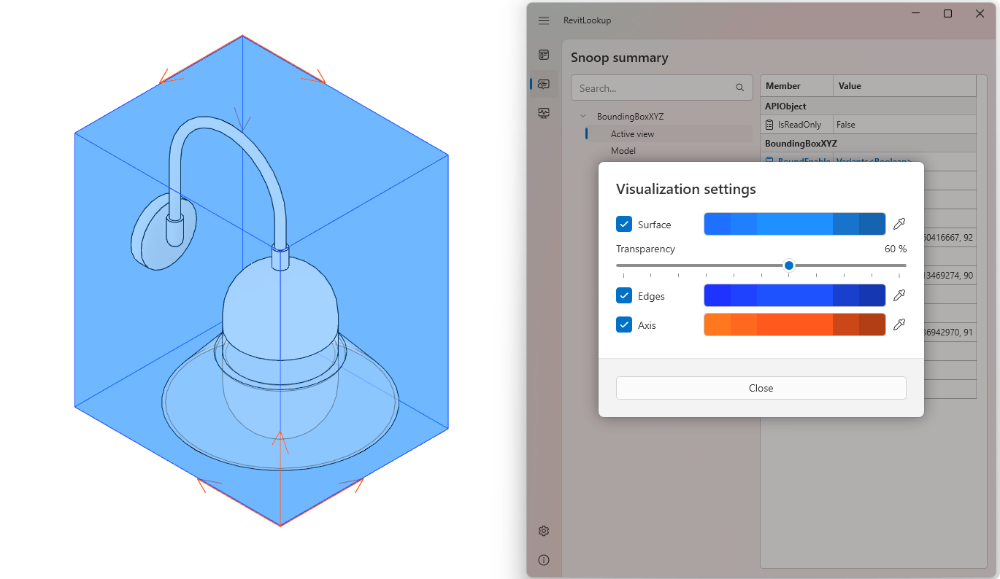

<head>
<meta http-equiv="Content-Type" content="text/html; charset=utf-8">
<link rel="stylesheet" type="text/css" href="bc.css">
<!-- https://highlightjs.org/#usage
<link rel="stylesheet" href="https://cdnjs.cloudflare.com/ajax/libs/highlight.js/11.9.0/styles/default.min.css">

-->

<!-- https://prismjs.com -->
<link href="https://cdn.jsdelivr.net/npm/prismjs@1.29.0/themes/prism.min.css" rel="stylesheet" />

</head>

<!---

- revitlookup
  https://www.linkedin.com/feed/update/urn:li:activity:7206337441664749569?utm_source=share&utm_medium=member_desktop
  Roman Karpovich
  Revit Geometry Visualization
  Introducing the new Geometry Visualization feature in RevitLookup! Now you can visualize various geometry objects directly within the interface. Enhance your BIM workflow with this powerful tool!
  https://lnkd.in/dgZk9q7T

- revitlookup
  2025.0.5
  2025.0.6
  2025.0.7
  Visualization setting: Solid scale feature #251
  https://github.com/jeremytammik/RevitLookup/issues/251#issuecomment-2159217724

twitter:

RevitLookup earns 1000 GitHub stars and implementes BIM element geometry visualization and Wiki for the @AutodeskRevit #RevitAPI #BIM @DynamoBIM https://autode.sk/lookupgeometry

New RevitLookup BIM element geometry visualization, and 1000 GitHub stars
&ndash; Versions 2025.0.5, 2025.0.6 and 2025.0.7
&ndash; Wiki...

linkedin:

RevitLookup earns 1000 GitHub stars and implementes BIM element geometry visualization and Wiki for the #RevitAPI

https://autode.sk/lookupgeometry

- Versions 2025.0.5, 2025.0.6 and 2025.0.7

#BIM #DynamoBIM #AutodeskAPS #Revit #API #IFC #SDK #Autodesk #AEC #adsk

the [Revit API discussion forum](http://forums.autodesk.com/t5/revit-api-forum/bd-p/160) thread

-->

### RevitLookup Geometry Visualisation

A small step for Roman, a giant leap for the Revit add-in developer community:

- [1000 stars on GitHub](#2)
- [RevitLookup Geometry Visualization](#3)
- [RevitLookup 2025.0.5](#4)
- [RevitLookup 2025.0.6](#5)
- [RevitLookup 2025.0.7](#6)
- [Versions and Visualisation Wiki](#7)

RevitLookup has been rewarded 1000 well-earned stars on GitHub.
To celebrate,
Roman [@Nice3point](https://t.me/nice3point) Karpovich, aka Роман Карпович,
presents a huge new chunk of RevitLookup functionality enabling Revit BIM element geometry visualization.

#### 1000 Stars and Geometry Visualisation

We are proud to share that RevitLookup has achieved 1000 stars on GitHub!
This milestone is a testament to its value and the dedication of our community.
Thank you for helping us reach this landmark!

<a href="https://star-history.com/#jeremytammik/RevitLookup&Date">
    <picture>
        <source media="(prefers-color-scheme: dark)" srcset="https://api.star-history.com/svg?repos=jeremytammik/RevitLookup&type=Date" />
        <source media="(prefers-color-scheme: light)" srcset="https://api.star-history.com/svg?repos=jeremytammik/RevitLookup&type=Date" />
        
    </picture>
</a>

To celebrate it, we are excited to introduce a major new feature in this release that will transform your interaction with models, offering a deeper understanding of the geometric objects that constitute your models:

#### RevitLookup Geometry Visualization

> Introducing the new Geometry Visualization feature in RevitLookup!
Now you can visualize various geometry objects directly within the interface.
Enhance your BIM workflow with this powerful tool!

It is built using the Revit API `DirectContext3D` functionality and described in
the [wiki documentation of RevitLookup Geometry Visualization](https://github.com/jeremytammik/RevitLookup/wiki/Visualization).
It was mainly implemented in release 2025.0.5, with further enhancements following in 2025.0.6 and 2025.0.7.

Please feel free to submit your feedback, wishes and suggestions regarding visualization in
the [comments on pull request 245](https://github.com/jeremytammik/RevitLookup/pull/245).

#### RevitLookup 2025.0.5

[RevitLookup 2025.0.5](https://github.com/jeremytammik/RevitLookup/releases/edit/2025.0.6) includes
comprehensive geometry visualization capabilities, enabling users to visualize various geometry objects directly within the RevitLookup interface.

In Revit, geometry is at the core of every model.
Whether you are dealing with simple shapes or intricate structures, having the ability to visualize geometric elements can significantly improve your workflow, analysis and understanding of the BIM.

To illustrate the power of these visualization capabilities, here are samples of the geometric objects you can now explore directly within RevitLookup:

Mesh:

Face:

Solid:

Curve:

Edge:

BoundingBox:

XYZ:

For detailed documentation, check
the [wiki documentation of RevitLookup Geometry Visualization](https://github.com/jeremytammik/RevitLookup/wiki/Visualization).

Feel free to leave comments and suggestions regarding visualization in
the [pill request 245](https://github.com/jeremytammik/RevitLookup/pull/245).
Your input help improve this tool for everyone in the Revit community.

Other improvements include:

- **BoundingBoxXYZ** class support
    - Added `Bounds` method support
    - Added `MinEnabled` method support
    - Added `MaxEnabled` method support
    - Added `BoundEnabled` method support
- Added **Edit parameter** icon
- Added **Select** context menu action for Reference type
- Added **Export family size table** for FamilySizeTableManager type by @SergeyNefyodov in https://github.com/jeremytammik/RevitLookup/pull/244

Added new extensions:

- Application: GetFormulaFunctions &ndash; Gets list of function names supported by formula engine
- Application: GetFormulaOperators &ndash; Gets list of operator names supported by formula engine
- BoundingBoxXYZ: Centroid &ndash; Gets the bounding box center point
- BoundingBoxXYZ: Vertices &ndash; Gets list of bounding box vertices
- BoundingBoxXYZ: Volume &ndash; Evaluate bounding box volume
- BoundingBoxXYZ: SurfaceArea &ndash; Evaluate bounding box surface area
- Document: GetAllGlobalParameters &ndash; Returns all global parameters available in the given document
- Document: GetLightGroupManager &ndash; Gets a light group manager object from the given document
- Document: GetTemporaryGraphicsManager &ndash; Gets a TemporaryGraphicsManager reference of the document
- Document: GetAnalyticalToPhysicalAssociationManager &ndash; Gets a AnalyticalToPhysicalAssociationManager for this document
- Document: GetFamilySizeTableManager &ndash; Gets a FamilySizeTableManager from a Family
- UIApplication: CurrentTheme &ndash; Gets a current theme
- UIApplication: CurrentCanvasTheme &ndash; Gets a current canvas theme
- UIApplication: FollowSystemColorTheme &ndash; Indicate if the overall theme follows operating system color theme
- View: GetSpatialFieldManager &ndash; Retrieves manager object for the given view

Hope everyone enjoys the new release.
Thanks!

Made with love by [@Nice3point](https://t.me/nice3point).

#### RevitLookup 2025.0.6

[RevitLookup 2025.0.6](https://github.com/jeremytammik/RevitLookup/releases/edit/2025.0.6) implements:

- [Visualization dark theme support](https://github.com/jeremytammik/RevitLookup/issues/250)
- [Full changelog](https://github.com/jeremytammik/RevitLookup/compare/2025.0.5...2025.0.6)

#### RevitLookup 2025.0.7

[RevitLookup 2025.0.7](https://github.com/jeremytammik/RevitLookup/releases/edit/2025.0.7) implements
solid scaling, theme synchronisation with Revit and other improvements:

Solid scaling:

Visualisation now supports scaling a solid, relative to its centre.
Exploring small objects is now even easier, cf.,
[issue 251](https://github.com/jeremytammik/RevitLookup/issues/251):

Theme synchronisation with Revit:

Starting with Revit 2024, you can choose to automatically change the RevitLookup theme.
Fans of darker colors will no longer have to dig through the settings every time:

Other improvements:

- Improved arrow position for vertical edges on visualization
- Multithreading visualization support. Changing settings now does not affect rendering. Previously there were artifacts due to fast settings changes

New `Element` extensions:

- GetCuttingSolids &ndash; Gets all the solids which cut the input element
- GetSolidsBeingCut &ndash; Get all the solids which are cut by the input element
- IsAllowedForSolidCut &ndash; Validates that the element is eligible for a solid-solid cut
- IsElementFromAppropriateContext &ndash; Validates that the element is from an appropriate document

#### Versions and Visualisation Wiki

- [RevitLookup versioning](https://github.com/jeremytammik/RevitLookup/wiki/Versions)
- [RevitLookup visualization](https://github.com/jeremytammik/RevitLookup/wiki/Visualization)

