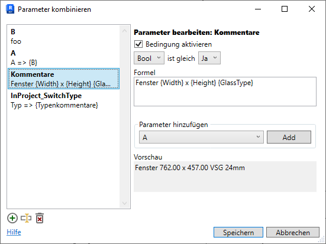
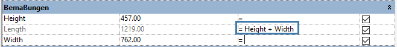

<head>
<meta http-equiv="Content-Type" content="text/html; charset=utf-8">
<link rel="stylesheet" type="text/css" href="bc.css">
<!-- https://highlightjs.org/#usage
<link rel="stylesheet" href="https://cdnjs.cloudflare.com/ajax/libs/highlight.js/11.9.0/styles/default.min.css">

-->

<!-- https://prismjs.com -->
<link href="https://cdn.jsdelivr.net/npm/prismjs@1.29.0/themes/prism.min.css" rel="stylesheet" />

</head>

<!---

twitter:

Embedded browser plans for the move from CefSharp to WebView2 are maturing further, and what to use for stable parameter identification in a formula in the @AutodeskRevit #RevitAPI #BIM @DynamoBIM https://autode.sk/stable_param_id

Embedded browser plans are maturing further, and what to use for stable parameter identification
&ndash; Move from CefSharp to WebView2
&ndash; Stable parameter identifier for use in formula
&ndash; CrowdStrike outage
&ndash; Ai models trained on AI-generated data collapse
&ndash; Open source AI is the path forward...

linkedin:

Embedded browser plans for the move from CefSharp to WebView2 are maturing further, and what to use for stable parameter identification in a formula in the #RevitAPI

https://autode.sk/stable_param_id

- Move from CefSharp to WebView2
- Stable parameter identifier for use in formula
- CrowdStrike outage
- Ai models trained on AI-generated data collapse
- Open source AI is the path forward...

#BIM #DynamoBIM #AutodeskAPS #Revit #API #IFC #SDK #Autodesk #AEC #adsk

the [Revit API discussion forum](http://forums.autodesk.com/t5/revit-api-forum/bd-p/160) thread

-->

### Stable Parameter Identifier and WebView2 Plans

Embedded browser plans are maturing further, and what to use for stable parameter identification:

- [Move from CefSharp to WebView2](#2)
- [Stable parameter identifier for use in formula](#3)
- [CrowdStrike outage](#4)
- [Ai models trained on AI-generated data collapse](#5)
- [Open source AI is the path forward](#6)

#### Move from CefSharp to WebView2

The heads-up on thoughts that we shared in the beginning of July
on [CefSharp versus WebView2 embedded browser](https://thebuildingcoder.typepad.com/blog/2024/07/material-assets-chromium-and-sorting-schedules.html#3) is
stabilising to the extent that the development team has decided to announce a plan to migrate CefSharp to WebView2 in the next major release:

> Revit is removing all CefSharp binaries from its distribution package starting in the next major release.
Revit add-ins can keep using CefSharp as a standard 3rd party component.
To do so CefSharp, please ensure your add-in will deliver CefSharp binaries with your add-in.
However, it is recommended to use WebView2 as an alternative to avoid potential issues from different CefSharp release versions in one Revit session.

#### Stable Parameter Identifier for Use in Formula

A long question with a short answer
specifying [what is the internal identifier of a parameter, which is also used in formulas](https://forums.autodesk.com/t5/revit-api-forum/what-is-the-internal-identifier-of-a-parameter-which-is-also/m-p/12907626/):

**Question:**
I am developing an addin in which I can define my own formulas in the family editor, similar to the family type dialog.

 <!-- Pixel Height: 413 Pixel Width: 551 -->

Let's assume the formula is:

<pre><code class="language-cs">Window {Width} x {Height} {GlassType}</code></pre>

I don't want to save this internally because if I rename a parameter, it will no longer match the formula.
Or, if I start Revit in another language &ndash; for example German &ndash; the width and height parameters are no longer found.
I would like to save it as follows instead:

<pre><code class="language-cs">Window {GUID} x {GUID} {GUID}</code></pre>

What GUID can I use here?
The most obvious is the ID of `InternalDefinition`.
However, there have been several changes here in the last versions of Revit:

- Revit 2020 Id: 4111
- Revit 2021 Id: 4111
- Revit 2022 GetTypeId: autodesk.parameter.aec.revit.family:4111-1.0.0
- Revit 2023 GetTypeId: revit.local.family:5da7dc0b7e9c4288adb7f24b3b6923d80000100f-1.0.0
- Revit 2025 GetTypeId: revit.local.family:5da7dc0b7e9c4288adb7f24b3b6923d80000100f-1.0.0

How are formulas saved internally by Revit?
I suspect that the parameter names are replaced by a unique identifier.
But which one?

 <!-- Pixel Height: 79 Pixel Width: 658 -->

**Answer:**
I think [`InternalDefinition.Id`](https://www.revitapidocs.com/2024/6b71158a-443a-7220-8934-5e86271984ee.htm) is the proper stable id.
`GetTypeId` is the Forge Parameter Schema typeId, and it changed in the past few versions, whereas `Id` remained unchanged.

#### CrowdStrike Outage

If you are interested in some technical background details on the recent CrowdStrike outage, two informative videos by Dave's Garage explain what happened quite well and reinforce the importance of input validation:

- [CrowdStrike IT outage](https://youtu.be/wAzEJxOo1ts)
- [CrowdStrike update latest news, lessons learned](https://youtu.be/ZHrayP-Y71Q)

#### Ai Models Trained on AI-Generated Data Collapse

What we all intuitively knew has now been scientifically corroborated &ndash;
[AI models collapse when trained on recursively generated data](https://www.nature.com/articles/s41586-024-07566-y):

> generative artificial intelligence (AI) such as large language models (LLMs) is here to stay and will substantially change the ecosystem of online text and images ... consider what may happen to GPT-{n} once LLMs contribute much of the text ... indiscriminate use of model-generated content in training causes irreversible defects in the resulting models, in which tails of the original content distribution disappear. We refer to this effect as ‘model collapse’ and show that it can occur in LLMs as well as in variational autoencoders (VAEs) and Gaussian mixture models (GMMs)...

#### Open Source AI Is the Path Forward

Mark Zuckerberg, founder and CEO of Meta, reiterates and clarifies their vision
that [open-source AI is the path forward](https://about.fb.com/news/2024/07/open-source-ai-is-the-path-forward/).

