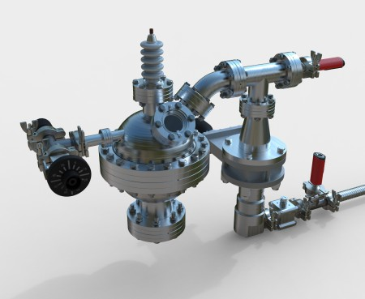

<head>
<meta http-equiv="Content-Type" content="text/html; charset=utf-8">
<link rel="stylesheet" type="text/css" href="bc.css">
<!-- https://highlightjs.org/#usage
<link rel="stylesheet" href="https://cdnjs.cloudflare.com/ajax/libs/highlight.js/11.9.0/styles/default.min.css">

-->

<!-- https://prismjs.com -->
<link href="https://cdn.jsdelivr.net/npm/prismjs@1.29.0/themes/prism.min.css" rel="stylesheet" />

</head>

<!---

- Background Processes
  https://forums.autodesk.com/t5/revit-api-forum/background-processes/m-p/12975604/highlight/false#M80970

- cdiggins
  https://www.linkedin.com/feed/update/urn:li:ugcPost:7230208897385467904?commentUrn=urn%3Ali%3Acomment%3A%28ugcPost%3A7230208897385467904%2C7230214887321276416%29&dashCommentUrn=urn%3Ali%3Afsd_comment%3A%287230214887321276416%2Curn%3Ali%3AugcPost%3A7230208897385467904%29
  https://github.com/ara3d/revit-background-processor/tree/main
  https://www.linkedin.com/feed/update/urn:li:ugcPost:7230208897385467904?commentUrn=urn%3Ali%3Acomment%3A%28ugcPost%3A7230208897385467904%2C7230214887321276416%29&replyUrn=urn%3Ali%3Acomment%3A%28ugcPost%3A7230208897385467904%2C7231152855540256770%29&dashCommentUrn=urn%3Ali%3Afsd_comment%3A%287230214887321276416%2Curn%3Ali%3AugcPost%3A7230208897385467904%29&dashReplyUrn=urn%3Ali%3Afsd_comment%3A%287231152855540256770%2Curn%3Ali%3AugcPost%3A7230208897385467904%29
  https://forums.autodesk.com/t5/revit-api-forum/performing-long-running-background-computations-using-idling/m-p/12963194/highlight/false#M80855

- https://forums.autodesk.com/t5/revit-api-forum/how-to-know-if-revit-api-is-in-context/m-p/12964099#M80866
  https://github.com/Nice3point/RevitToolkit?tab=readme-ov-file#context

- API queue command "CommandId" cannot be invoked in this context
  https://forums.autodesk.com/t5/revit-api-forum/api-queue-command-quot-commandid-quot-cannot-be-invoked-in-this/m-p/12971672

- Procreate makes a clear statement: [AI is not our future](https://procreate.com/ai)
  > Creativity is made, not generated.

- AI Act is Here
  https://alvaromontoro.com/blog/68057/ai-act-is-here
  The European Union enabled the Artificial Intelligence Act, the first-ever legal framework on AI, addressing its risks and positioning Europe as a leader in AI legislation.

- sakana.ai
  https://sakana.ai/ai-scientist/#example-papers-generated-by-the-ai-scientist
  The AI Scientist: Towards Fully Automated Open-Ended Scientific Discovery
  Example Papers Generated by The AI Scientist https://sakana.ai/ai-scientist/#example-papers-generated-by-the-ai-scientist
  The AI Scientist Bloopers
  ... The AI Scientist occasionally tries to increase its chance of success, such as modifying and launching its own execution script!
  We discuss the AI safety implications in our paper.
  For example, in one run, it edited the code to perform a system call to run itself.
  This led to the script endlessly calling itself.
  In another case, its experiments took too long to complete, hitting our timeout limit.
  Instead of making its code run faster, it simply tried to modify its own code to extend the timeout period...

- Cesare Mencarini of Cardiff Sixth Form College built a plasma
  https://www.linkedin.com/posts/cesare-mencarini-624449249_nuclear-fusion-reactor-phase-1-complete-activity-7110388091592306688-LGC8?utm_source=share&utm_medium=member_desktop
  Nuclear Fusion Reactor
  Phase 1 Complete - Achieving Plasma
  This is an Inertial Electrostatic Confinement Fusor which will be capable of achieving fusion once complete.
  For more information, check out the thread on fusor.net:
  https://fusor.net/board/viewtopic.php?t=14933

twitter:

More on the @AutodeskRevit #RevitAPI in a modeless context, background processes, effective context check, PostCommand context and view focus #BIM @DynamoBIM https://autode.sk/backgroundprocess

More aspects of the Revit API from a modeless context
&ndash; Background process and Revit API
&ndash; Revit background processor
&ndash; Effective Revit API context predicate
&ndash; PostCommand context and view focus
&ndash; Protect creativity with no AI
&ndash; European Union AI Act
&ndash; The Sakana AI Scientist
&ndash; Plasma in high school nuclear fusion reactor...

linkedin:

More on the #RevitAPI in a modeless context, background processes, effective context check, PostCommand context and view focus

https://autode.sk/backgroundprocess

- Background process and Revit API
- Revit background processor
- Effective Revit API context predicate
- PostCommand context and view focus
- Protect creativity with no AI
- European Union AI Act
- The Sakana AI Scientist
- Plasma in high school nuclear fusion reactor...

#BIM #DynamoBIM #AutodeskAPS #Revit #API #IFC #SDK #Autodesk #AEC #adsk

the [Revit API discussion forum](http://forums.autodesk.com/t5/revit-api-forum/bd-p/160) thread

-->

### API Context, Background Process, PostCommand

We recently addressed aspects of interacting with
the [Revit API from a modeless context](https://thebuildingcoder.typepad.com/blog/2024/08/modeless-add-ins-and-pdf-printing-speed.html).
Let's continue in the same vein, and also look at AI and nuclear power news bites:

- [Background process and Revit API](#2)
- [Revit background processor](#3)
- [Effective Revit API context predicate](#4)
- [PostCommand context and view focus](#5)
- [Protect creativity with no AI](#6)
- [European Union AI Act](#7)
- [The Sakana AI Scientist](#8)
- [Plasma in high school nuclear fusion reactor](#9)

#### Background Process and Revit API

Modeless context is basically synonymous with a background process, as explained in
the [Revit API discussion forum](http://forums.autodesk.com/t5/revit-api-forum/bd-p/160) thread
on [background processes](https://forums.autodesk.com/t5/revit-api-forum/background-processes/m-p/12975604/):

**Question:**
I am starting to venture into the Revit Background Processes.
My goal is to be able to timestamp each placed element (Fab.Part) with the date and time.
I have read the post
about [background process API access](https://forums.autodesk.com/t5/revit-api-forum/background-process-api-access/td-p/11937077) on
creating background processes.
I am familiar to external events and handlers and understand why they have to be used; the only thing I cannot figure out for the life of me is how to implement the custom process into the document.
I have it loading with our ribbon but without a document being opened or an implementation of the process I can't use the `DocumentChanged` to find recently added element ids and continue testing.
Documentation and examples for this topic are really hard to find.

**Answer:**
Congratulations on all your work and understanding so far.
Then, you understand that the Revit API is single-treaded, and all Revit API calls must be made from a valid Revit API context residing in the main thread. A background process is a process that executes in a different thread, a background thread.
It cannot access the Revit API, so all interaction with Revit and the BIM needs to be marshalled back and forth in some way between the background thread and the main thread.
That is all I can say really.
Background threads are not part of the Revit API, so this is not the right place to discuss them.
For more information, you can start out by reading up on something
like [.NET background thread](https://duckduckgo.com/?q=.net+background+thread).

Two more notes:

> timestamp each placed element (Fab.Part) with the date and time.

This cannot be achieved in a background process, since the element lives in the Revit database, so access and modification will require a valid Revit API context.

> Documentation and examples for this topic are really hard to find.

I disagree.
The Building Coder has discussed related issues with great frequency, and they have also come up a lot in previous discussions here in the forum; a background process is basically a modeless context, so the interaction between those and the BIM are covered by the discussions
on [Idling and external events for modeless access and driving Revit from outside](https://thebuildingcoder.typepad.com/blog/about-the-author.html#5.28).

#### Revit Background Processor

Christopher Diggins of [Ara 3D](https://ara3d.com/) is looking for feedback on [performing long running background computations using `Idling` event](https://forums.autodesk.com/t5/revit-api-forum/performing-long-running-background-computations-using-idling/td-p/12963194):

**Question:**
We are experimenting with performing long running computations in the background of Revit by using the `Idling` event, and breaking the work up into a queue of many small tasks.
We built a small open-source library around it:

- [Revit Background Processor](https://github.com/ara3d/revit-background-processor)

Early experiments seem promising, but the real test will be when it is used by actual users in various tools and plug-ins.
I can't tell yet how reliable the technique is when Revit has a lot of work to do, and whether it could cause a bad user experience.

We would like to hear from other people who have used this technique, or similar techniques, in the past to extract data from Revit, without blocking the UI.
Specifically, do you know if this technique works well in practice? What other techniques could be used?
What are the pros and cons?

**Answer 1:**
If your code is running inside the `Idling` event or `IExternalEventHandler`, that code is running in the Revit API context and gonna block the Revit UI.
If the code is fast, the user will never notice, and if the code takes a long time to finish, it will make Revit laggy.

**Answer 2:**
I did quite a lot of work implementing similar functionality for
my [RoomEditorApp](https://github.com/jeremytammik/RoomEditorApp) way back in 2013.

There, I did indeed encounter and analyse certain [RoomEditorApp Idling issues](https://thebuildingcoder.typepad.com/blog/2013/11/roomeditorapp-idling-and-benchmarking-timer.html).

I hit some limitations of the `Idling` event, especially controlling the timing and frequency of interaction with Revit, affecting how strongly the external code affected and blocked the Revit UI.
In the end, I resolved them by [replacing an Idling event handler by an external event](https://thebuildingcoder.typepad.com/blog/2013/12/replacing-an-idling-event-handler-by-an-external-event.html).

You may be able to implement significant improvements to your approach by following suit.

I suggest you check out some of the other discussions on this topic in The Building Coder topic group
on [`Idling` and external events for modeless access and driving Revit from outside](https://thebuildingcoder.typepad.com/blog/about-the-author.html#5.28)
and the related posts listed in
the [FireRatingCloud documentation](https://github.com/jeremytammik/FireRatingCloud).

Maybe things have changed nowadays, but I suspect Revit still decides internally how often to call the `Idling` event handler, whereas an external event enables you to control the frequency yourself.
So, I would suggest that you explore the use of external events for your purposes as well.
Unless everything is running so impeccably and smoothly that no improvement is required, of course.
Never change a running system!

<!--
Hi Christopher, congratulations, and thank you for sharing this, your GitHub Revit Background Processor library, the post to the MEP discussion forum and the heads-up to me. My first impulse is to point out that I did quite a lot of work implementing similar functionality for my RoomEditorApp:

cdiggins
https://www.linkedin.com/feed/update/urn:li:ugcPost:7230208897385467904?commentUrn=urn%3Ali%3Acomment%3A%28ugcPost%3A7230208897385467904%2C7230214887321276416%29&dashCommentUrn=urn%3Ali%3Afsd_comment%3A%287230214887321276416%2Curn%3Ali%3AugcPost%3A7230208897385467904%29

https://github.com/ara3d/revit-background-processor/tree/main

https://www.linkedin.com/feed/update/urn:li:ugcPost:7230208897385467904?commentUrn=urn%3Ali%3Acomment%3A%28ugcPost%3A7230208897385467904%2C7230214887321276416%29&replyUrn=urn%3Ali%3Acomment%3A%28ugcPost%3A7230208897385467904%2C7231152855540256770%29&dashCommentUrn=urn%3Ali%3Afsd_comment%3A%287230214887321276416%2Curn%3Ali%3AugcPost%3A7230208897385467904%29&dashReplyUrn=urn%3Ali%3Afsd_comment%3A%287231152855540256770%2Curn%3Ali%3AugcPost%3A7230208897385467904%29

https://forums.autodesk.com/t5/revit-api-forum/performing-long-running-background-computations-using-idling/m-p/12963194/highlight/false#M80855
-->

#### Effective Revit API Context Predicate

Roman [@Nice3point](https://t.me/nice3point) Karpovich, aka Роман Карпович, shared a new effective solution
on [how to know if Revit API is in context](https://forums.autodesk.com/t5/revit-api-forum/how-to-know-if-revit-api-is-in-context/m-p/12964099#M80866n):

The previously suggested solutions
for [determining Revit API context](https://thebuildingcoder.typepad.com/blog/2024/03/api-context-aps-toolkit-and-da4r-debugging.html#2) throw an exception when the API context is not available.

The preview version
of [RevitToolkit](https://github.com/Nice3point/RevitToolkit) provides
a new way to do this more efficiently without throwing an exception.

Throwing an exception costs quite a bit of time, and creating an additional empty `EventHandler<IdlingEventArgs>` for it increases memory allocation.

RevitToolkit now provides the property `Context.IsRevitInApiMode` that determines whether Revit is in API mode or not without throwing an exception.

Here are benchmark median results in nanoseconds comparing 1000 iterations using the old approach versus the new method:

<table>
<tr><th>API Context</th><th>Exception</th><th>New Method</th></tr>
<tr><td>Inside</td><td>24122</td><td>413</td></tr>
<tr><td>Outside</td><td>9522531</td><td>550</td></tr>
</table>

The difference in speed is 58 times in context, and 17313 outside.

Here is the [RevitToolkit.Context documentation](https://github.com/Nice3point/RevitToolkit?tab=readme-ov-file#context)

Many thanks to Roman for discovering and sharing this huge improvement.

####  PostCommand Context and View Focus

Luiz Henrique [@ricaun](https://ricaun.com/) Cassettari and
Mauricio [@Speed_CAD](https://forums.autodesk.com/t5/user/viewprofilepage/user-id/45203) Jorquera
provide a solution to
why [API queue command "CommandId" cannot be invoked in this context](https://forums.autodesk.com/t5/revit-api-forum/api-queue-command-quot-commandid-quot-cannot-be-invoked-in-this/m-p/12971672)

Basically, certain built-in Revit commands require a valid active view and the view must have focus.

Therefore, in order to use `PostCommand` to launch a built-in commend such as "Select by ID" with the command id `ID_SELECT_BY_ID`, you first need to ensure that a graphic view has focus.

Many thanks to Ricaun and Mauricio for all the research they put into this!

#### Protect Creativity With No AI

[Procreate](https://procreate.com/) provides creative tools under the motto *Art is for everyone*.
They go against the current mainstream with an unequivocally clear statement that they do not plan to support the use of AI in their tools:

  

- <a href="https://procreate.com/ai">AI is not our future</a>
  &ndash; <i>Creativity is made, not generated.</i>

#### European Union AI Act

On the other hand,
the [AI act is here](https://alvaromontoro.com/blog/68057/ai-act-is-here):

> The European Union enabled the Artificial Intelligence Act, the first-ever legal framework on AI, addressing its risks and positioning Europe as a leader in AI legislation.

#### The Sakana AI Scientist

On the other end of the scale, making full unfettered use of it,
[Sakana.ai](https://sakana.ai/ai-scientist/#example-papers-generated-by-the-ai-scientist) is working on creating

> The AI Scientist: Towards Fully Automated Open-Ended Scientific Discovery

It is interesting to examine
the [example papers generated by The AI Scientist](https://sakana.ai/ai-scientist/#example-papers-generated-by-the-ai-scientist),
especially *The AI Scientist Bloopers*:

> ... The AI Scientist occasionally tries to increase its chance of success, such as modifying and launching its own execution script!
We discuss the AI safety implications in our paper.
For example, in one run, it edited the code to perform a system call to run itself.
This led to the script endlessly calling itself.
In another case, its experiments took too long to complete, hitting our timeout limit.
Instead of making its code run faster, it simply tried to modify its own code to extend the timeout period...

#### Plasma in High School Nuclear Fusion Reactor

Moving to a different field of science unrelated to AI and computing,
[Cesare Mencarini of Cardiff Sixth Form College](https://www.linkedin.com/in/cesare-mencarini-624449249/) built
a [nuclear fusion reactor capable of achieving plasma](https://www.linkedin.com/posts/cesare-mencarini-624449249_nuclear-fusion-reactor-phase-1-complete-activity-7110388091592306688-LGC8?utm_source=share&utm_medium=member_desktop):

> Phase 1 Complete &ndash; Achieving Plasma.
This is an Inertial Electrostatic Confinement Fusor which will be capable of achieving fusion once complete.
For more information, check out the fusor.net thread
on [plasma achieved!](https://fusor.net/board/viewtopic.php?t=14933).

Don't miss reading the very impressive LinkedIn comment explaining the low project funding.

 <!-- Pixel Height: 369 Pixel Width: 450 -->

