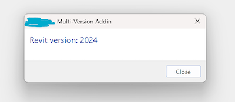
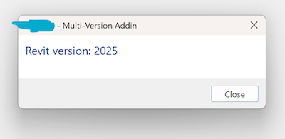
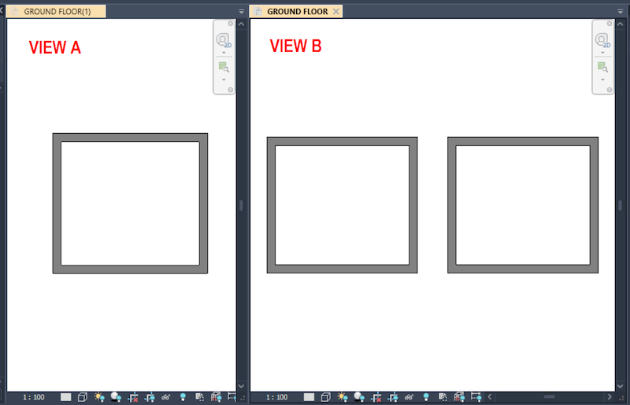
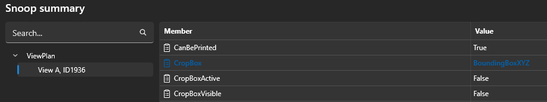

<head>
<meta http-equiv="Content-Type" content="text/html; charset=utf-8">
<link rel="stylesheet" type="text/css" href="bc.css">
<!-- https://highlightjs.org/#usage
<link rel="stylesheet" href="https://cdnjs.cloudflare.com/ajax/libs/highlight.js/11.9.0/styles/default.min.css">

-->

<!-- https://prismjs.com -->
<link href="https://cdn.jsdelivr.net/npm/prismjs@1.29.0/themes/prism.min.css" rel="stylesheet" />

</style>

</head>

<!---

twitter:

 the @AutodeskRevit #RevitAPI #BIM @DynamoBIM

&ndash; ...

linkedin:

#BIM #DynamoBIM #AutodeskAPS #Revit #API #IFC #SDK #Autodesk #AEC #adsk

the [Revit API discussion forum](http://forums.autodesk.com/t5/revit-api-forum/bd-p/160) thread

-->

### Multi-Version Add-In Code Base

#### Multi-Version Add-In Code Base

Managing an add-in code base to support multiple releases of the Revit API is a recurring and constantly evolving issue.
In 2021, we discussed how to implement
a [multi-version Revit add-in](https://thebuildingcoder.typepad.com/blog/2021/10/dll-as-resource-and-multi-version-add-ins.html#4),
and in 2023 [managing multiple Revit API versions](https://thebuildingcoder.typepad.com/blog/2023/11/net-core-preview-and-open-source-add-in-projects.html#8)

The issue was raised again half a year ago in preparation of the non-trivial migration for Revit 2025 from .NET 4.8 to .NET core, in a quest for
an [optimal add-in code base approach to target multiple Revit releases](https://forums.autodesk.com/t5/revit-api-forum/optimal-add-in-code-base-approach-to-target-multiple-revit/m-p/12982599).

That query recently received some updated answers and solutions from
Roman [@Nice3point](https://t.me/nice3point) Karpovich, aka Роман Карпович,
and Nathan [@SamBerk](https://forums.autodesk.com/t5/user/viewprofilepage/user-id/3671855) Berkowitz.

Roman points out that [RevitTemplates](https://github.com/Nice3point/RevitTemplates) provides
a [step-by step guide for Revit multiversion templates](https://github.com/Nice3point/RevitTemplates/wiki/Step%E2%80%90by%E2%80%90step-Guide):

> You will be able to create a project in a few steps without spending hours setting up a solution from scratch. Try it.

Sam's simpler approach provides less coverage, saying:

I found that the *simplest* solution to maintain the same code base for 2025 and earlier is to put the `TargetFramework` in a condition.
Here is step by step:

 - Create a dotnet 8 class library project
 - Reference the Revit 2025 API DLL's RevitAPI.dll and RevitAPIUI.dll, set `Copy Local` to `No`
 - Create configurations `2024Debug` and `2025Debug` (or release)
 - Edit the project file and put the `TargetFramework` and the `Reference` in a condition:

 <PropertyGroup Condition="'$(Configuration)' == '2024Debug'">
   <TargetFramework>net481</TargetFramework>
 </PropertyGroup>
 <PropertyGroup Condition="'$(Configuration)' == '2025Debug'">
   <TargetFramework>net8.0</TargetFramework>
 </PropertyGroup>

 <ItemGroup>
    <Reference Include="RevitAPI" Condition="'$(Configuration)' == '2024Debug'">
     <HintPath>..\..\..\..\..\..\..\..\Program Files\Autodesk\Revit 2024\RevitAPI.dll</HintPath>
     <Private>False</Private>
   </Reference>
   <Reference Include="RevitAPIUI" Condition="'$(Configuration)' == '2024Debug'">
     <HintPath>..\..\..\..\..\..\..\..\Program Files\Autodesk\Revit 2024\RevitAPIUI.dll</HintPath>
     <Private>False</Private>
   </Reference>
   <Reference Include="RevitAPI" Condition="'$(Configuration)' == '2025Debug'">
     <HintPath>..\..\..\..\..\..\..\..\Program Files\Autodesk\Revit 2025\RevitAPI.dll</HintPath>
     <Private>False</Private>
   </Reference>
   <Reference Include="RevitAPIUI" Condition="'$(Configuration)' == '2025Debug'">
     <HintPath>..\..\..\..\..\..\..\..\Program Files\Autodesk\Revit 2025\RevitAPIUI.dll</HintPath>
     <Private>False</Private>
   </Reference>
 </ItemGroup>

 Create an App.cs file and implement IExternalApplication

<pre><code class="language-cs">public class App : IExternalApplication
{
  public Result OnStartup( UIControlledApplication a )
  {
    TaskDialog.Show( "Multi-Version Addin",
      $"Revit version: {a.ControlledApplication.VersionNumber}");

    return Result.Succeeded;
  }

  public Result OnShutdown( UIControlledApplication a )
  {
    return Result.Succeeded;
  }
}</code></pre>

Create an output folder for both versions ('c:\...\output\2024' and 'c:\...\output\2025')
Add a .addin file to your project for both versions (MyAddin2024.addin and MyAddin2025.addin)

<?xml version="1.0" encoding="utf-8"?>
<RevitAddIns>
  <AddIn Type="Application">
    <Name>MyAddin</Name>
    <Assembly>C:\...\output\2024\MyAddin.dll</Assembly> (or 2025)
    <FullClassName>MyAddin.App</FullClassName>
    <ClientId>{client id}</ClientId>
    <VendorId>{vendor id}</VendorId>
    <VendorDescription>{vendor description}</VendorDescription>
  </AddIn>
</RevitAddIns>

 Post-build events:

      echo Configuration: $(Configuration)
      if $(Configuration) == 2024Debug goto 2024
      if $(Configuration) == 2025Debug goto 2025

      :2024
      echo Copying results to 2024
      copy "$(ProjectDir)MyAddin2024.addin" "$(AppData)\Autodesk\REVIT\Addins\2024"
      copy "$(ProjectDir)bin\$(Configuration)\net481\*.dll" "C:\...\output\2024"
      goto exit

      :2024
      echo Copying results to 2024
      copy "$(ProjectDir)MyAddin2025.addin" "$(AppData)\Autodesk\REVIT\Addins\2025"
      copy "$(ProjectDir)bin\$(Configuration)\net8.0\*.dll" "C:\...\output\2025"
      goto exit

      :exit

Build both configurations
Open Revit 2024:

  

Open Revit 2025:

  

For debugging, add to the project file:

  <PropertyGroup Condition="'$(Configuration)' == '2024Debug'">
    <StartProgram>C:\Program Files\Autodesk\Revit 2024\Revit.exe</StartProgram>
    <StartAction>Program</StartAction>
  </PropertyGroup>

  <PropertyGroup Condition="'$(Configuration)' == '2025Debug'">
    <StartProgram>C:\Program Files\Autodesk\Revit 2025\Revit.exe</StartProgram>
    <StartAction>Program</StartAction>
  </PropertyGroup>

Thank you all!

an [optimal add-in code base approach to target multiple Revit releases](https://forums.autodesk.com/t5/revit-api-forum/optimal-add-in-code-base-approach-to-target-multiple-revit/m-p/12982599#M81063)

#### UIView Zoom Corner Element Visibility

Fabio Loretti [@floretti](https://forums.autodesk.com/t5/user/viewprofilepage/user-id/5076730) Oliveira

[select all UI visible family instances](https://forums.autodesk.com/t5/revit-api-forum/select-all-quot-ui-visible-quot-instances/td-p/12995081)

**Question:**
One of my users came up with an interesting question of whether or not it's possible to create a "Select All Instances > Visible in View" command taking into consideration the view's zoom level, meaning that everything outside the user's field of view is "not visible" and it wouldn't be part of the selection.

I've tried to find references in the API and online articles on the below topics and ran some UI tests and compared values via the Revit Lookup but no success.

- Active view zoom level
- Active view window size
- Bounding boxes XYZ and UV and whether they change under different zoom levels

**Answer:**
Well, the first thing to try out is
the [filtered element collector taking a view element id](https://www.revitapidocs.com/2024/6359776d-915e-f8a2-4147-b31024671ee1.htm).

The description says, *Constructs a new FilteredElementCollector that will search and filter the visible elements in a view*, which exactly matches your query. I would be surprised if the two exactly matching descriptions really mean exactly the same thing, but who knows, you may be in luck.

**Response:**
Unfortunately, that overload of the FilteredElementCollector doesn't do what I'm after.
The definition of "visible" to the API is different to the definition of what a user considers visible.
The example below shows what I mean.

View B shows 8x wall elements.
If I decrease the size of a view/window or simply zoom in or pan I won't be able to see all the 8x walls anymore like shown on View A.
Regardless of whether or not I use the `FilteredElementCollector` and pass the view Id as a 2nd parameter or use the UI command *Select All Instances* &gt; *Visible in View*, Revit will select all 8x wall instances.

  

**Answer:**
Yup, that is what I thought.
Does the article
on [retrieving elements visible in view](https://thebuildingcoder.typepad.com/blog/2017/05/retrieving-elements-visible-in-view.html) help?

**Response:**
I tested that approach and these are the results.

This is View A showing all 8x wall instances and its `ViewPlan.CropBox` values underneath as recommended by the article:

  

I then panned across View A so only 4x wall instances are shown in the UI and again the `ViewPlan.CropBox` values underneath.

  

Notice that the values didn't change; based on that, I do not expect the outcome to be different if I turn this into code. I noticed that the API has two Boolean properties to indicate whether the `CropBox` is either active and visible; in my case, neither of them are true.
Based on that, my assumption is that the recommended approach in the article you shared can only work via the cropbox use and not by zooming in/out and panning across a view.

  

**Answer:**
OK, I see that the crop box approach does not help in this case.
Searching the forum, I found these two specific solutions for other situations:

- [How to list only elements that are "Visible" in a view](https://forums.autodesk.com/t5/revit-api-forum/how-to-list-only-elements-that-are-quot-visible-quot-in-a-view/m-p/10663861)
- [Selection filter for only what is visible from camera](https://forums.autodesk.com/t5/revit-api-forum/selection-filter-for-only-what-is-visible-from-camera/m-p/12534209)

In your case, maybe
the [`UIView`](https://www.revitapidocs.com/2024/2a070256-00f0-5cab-1412-bee5bbfcfc5e.htm) can help:

The `View` element is part of the document and lives in the database.
It maybe does not know how it is currently being "looked at".
The `UIView` may know that and provides the current zoom corners from which you can determine wihether an element is currently within them or not.
However, for non-planar views, you will have some intersting calculations to perform.

I used the `UIView` to implement
a [tooltip that detects which elements are visible under the cursor](https://thebuildingcoder.typepad.com/blog/2012/10/uiview-windows-coordinates-referenceintersector-and-my-own-tooltip.html).
It also uses the `ReferenceIntersector`, like one of the solutions I pointed out above.

**Response:**
Amazing, thanks Jeremy.
The `GetZoomCorners` method is exactly what I need.
Much appreciated.
:-)

Just giving back, here is the solution I implemented.

Note this only works with family instances and it won't work with system families:

<pre><code class="language-cs">// Get active view's zoom
var zoomCorners = new List<XYZ>();

var openUIviews = uidoc.GetOpenUIViews();
foreach (var uiView in openUIviews)
{
  if(uiView.ViewId == doc.ActiveView.Id) zoomCorners = uiView.GetZoomCorners().ToList();
}

// Get selection and expand it
var selIds = uidoc.Selection.GetElementIds();
var finalSelectionIds = new List<ElementId>();

foreach (ElementId id in selIds)
{
  Outline viewExtents = new Outline(new XYZ(zoomCorners.First().X, zoomCorners.First().Y, -1000),
                    new XYZ(zoomCorners.Last().X, zoomCorners.Last().Y, 1000));
  var filter = new BoundingBoxIntersectsFilter(viewExtents);

  var famInst = doc.GetElement(id) as FamilyInstance;
  var allFamInst = new FilteredElementCollector(doc, doc.ActiveView.Id)
            .WherePasses(filter)
            .OfClass(typeof(FamilyInstance))
            .Cast<FamilyInstance>()
            .Where(x => x.Symbol.Family.Name.Equals(famInst.Symbol.Family.Name)) // family
            .Where(x => x.Name.Equals(famInst.Name)); // family type

  foreach (FamilyInstance item in allFamInst)
  {
    finalSelectionIds.Add(item.Id);
  }
}

uidoc.Selection.SetElementIds(finalSelectionIds);

