<head>
<meta http-equiv="Content-Type" content="text/html; charset=utf-8">
<link rel="stylesheet" type="text/css" href="bc.css">
<!-- https://highlightjs.org/#usage
<link rel="stylesheet" href="https://cdnjs.cloudflare.com/ajax/libs/highlight.js/11.9.0/styles/default.min.css">

-->

<!-- https://prismjs.com -->
<link href="https://cdn.jsdelivr.net/npm/prismjs@1.29.0/themes/prism.min.css" rel="stylesheet" />

</head>

<!---

- Get BendRadius center of Cable Tray Fittings
  https://forums.autodesk.com/t5/revit-api-forum/get-bendradius-center-of-cable-tray-fittings/m-p/12757167

- mep tee identification and analysis
  Revit Tpiece geometric analysis
  https://forums.autodesk.com/t5/revit-api-forum/revit-tpiece-geometric-analysis/m-p/12995868

twitter:

A quick dive into the geometric analysis of various MEP fittings to determine cable tray bend radius and  tee branch identification in the  @AutodeskRevit #RevitAPI #BIM @DynamoBIM https://autode.sk/cabletraybend

A quick dive into the geometric analysis of various MEP fittings
&ndash; Cable tray bend radius
&ndash; Tee branch identification...

linkedin:

A quick dive into the geometric analysis of various MEP fittings to determine cable tray bend radius and  tee branch identification in the  #RevitAPI

https://autode.sk/cabletraybend

- Cable tray bend radius
- Tee branch identification...

#BIM #DynamoBIM #AutodeskAPS #Revit #API #IFC #SDK #Autodesk #AEC #adsk

the [Revit API discussion forum](http://forums.autodesk.com/t5/revit-api-forum/bd-p/160) thread

-->

### MEP Cable Tray Bend and Tee Analysis

A quick dive into the geometric analysis of various MEP fittings:

- [Cable tray bend radius](#2)
    - [Using the sagitta formula](#2.1)
    - [Using the insertion point](#2.2)
- [Tee branch identification](#3)

#### Cable Tray Bend Radius

[Pierre Navarra](https://fr.linkedin.com/in/pierre-navarra-62032a107) of [Sona-Architecture](http://www.sona-architecture.com)
solved how
to [get `BendRadius` center of cable tray fittings](https://forums.autodesk.com/t5/revit-api-forum/get-bendradius-center-of-cable-tray-fittings/m-p/12757167)
with lots of valuable help from Moustafa Khalil from [SharpBIM coding](https://sharpbim.hashnode.dev/) and Mohamed Arshad K:

**Question:**
I need to get the length of a cable tray fitting.
I could get length between connector A and B but this is not a correct method.
I'd like to get length of an arc between passing by A and B with center of BendRadius...
But how to get the center with API?

  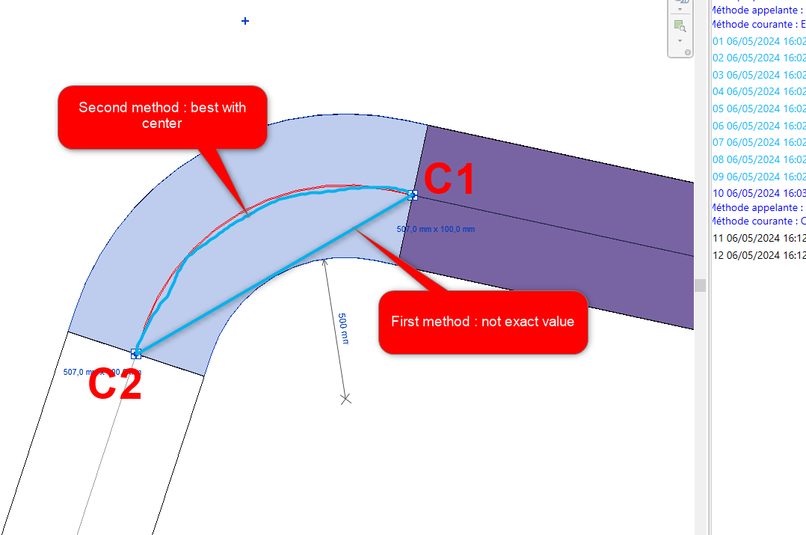 <!-- Pixel Height: 675 Pixel Width: 993 -->
   
  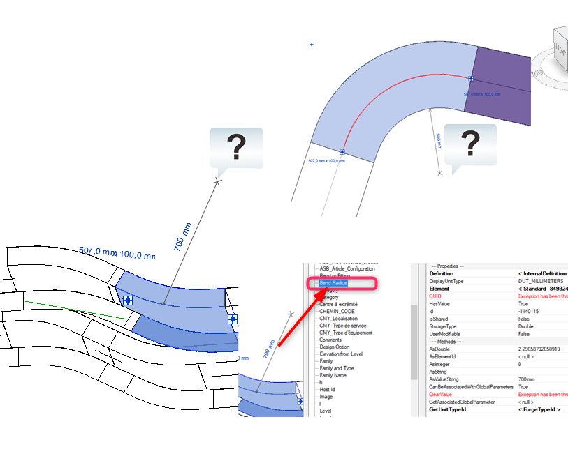 <!-- Pixel Height: 675 Pixel Width: 993 -->

**Answer:**
This may be somewhat tricky due to the fact that every content creator is free to set up the elbow fitting family definition as she pleases. So, it is hard to know what parameters are available and what they might mean. My off-hand suggestion to approach this would be the following:

- Determine the two connector origins and orientations for C1 and C2
- They will give you the two connection points P1 and P2, and the connection orientation vectors Z1 and Z2 pointing into the fitting at C1 and C2
- From these four points and vectors, you can calculate an arc that implements a fillet between the two neighbouring conduit straight line segments

That is the best approximation I can think of offhand. If you have the bend width, radius, straight line extensions at the two ends of the bend, and/or other additional data, you can improve the calculation taking those into account.

**Response:**
Indeed, I think the idea would be to find the center of a circle from the two connectors. I'd need to get the vectors at these points and take the perpendicular to these vectors. Then I could find their intersection and draw an arc between the two connectors.
But how do I get the vectors? By using the Transform object and then BasisXYZ?

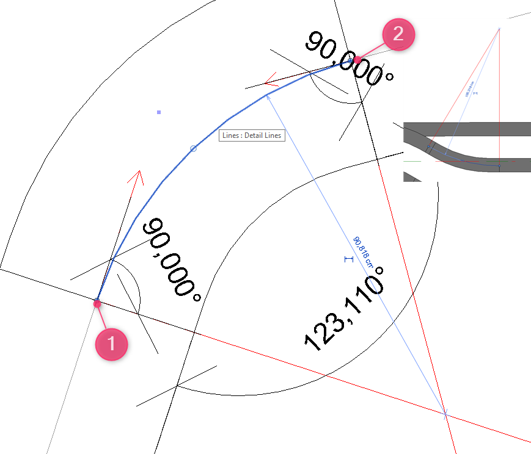 <!-- Pixel Height: 675 Pixel Width: 993 -->

**Answer:**
Yes, exactly.
In the [`Connector` `CoordinateSystem` property](https://www.revitapidocs.com/2024/cb6d725d-654a-f6f3-fed0-96cc618a42f1.htm),
the coordinate system origin is the location of the connector and the Z-axis is normal to the connector, and thus also to the fitting face hosting it, and thus also collinear with the neighbouring conduit location line.

**Response:**
I found this [post from Cyril Poupin in Python](https://voltadynabim.blogspot.com/2022/06/dynamo-python-courbe-d-raccord-en-arc.html) with the following code:

<pre><code class="language-py">  pair_sys_origin = [[con.CoordinateSystem, con.Origin] for con in conSet]
  pta = pair_sys_origin[0][1].ToPoint()
  ptb = pair_sys_origin[1][1].ToPoint()
  vector = pair_sys_origin[0][0].BasisZ.Negate().ToVector()
  arc = DS.Arc.ByStartPointEndPointStartTangent(pta, ptb, vector)
  return arc, arc.Length</code></pre>

I tried to translate it in C#, but the Dynamo API provides a function called `ByStartPointEndPointStartTangent`, and I must create my own .... mmm ... this is a geometric problem.

<pre><code class="language-cs">// méthode à partir de deux connecteurs
if (connectors.Size == 2)
{
  // Transforme le Set en liste
  var castConnectors = connectors.Cast&lt;Connector&gt;();
  List&lt;Connector&gt; connectorList = castConnectors.ToList();
  // get first point
  Transform transformPtA = connectorList[0].CoordinateSystem;
  XYZ originPtA = transformPtA.Origin;

  // get Vector from this point
  XYZ vector = transformPtA.BasisZ.Negate();
  // get second point
  Transform transformPtB = connectorList[1].CoordinateSystem;
  XYZ originPtB = transformPtB.Origin;

  // Get arc from those points
  Arc arc = Arc.Create(originPtA, originPtB, vector);

  length = arc.Length;
}</code></pre>

**Answer:**
I think there is no direct way to get it.
You need to identify the two connectors for which you want to determine the outer radius.
From these 2 connectors, extract the origin points.
These points are crucial for finding the center point of the arc.
Getting the center point can be achieved by drawing a perpendicular line to the cable tray curve direction and projecting the second point onto this line, by which we can locate the center.
Next, draw an arc connecting the two points with the radius.
The radius can be measured by getting the distance between any of the connectors to the center point we evaluated.
This approach will establish the centerline connection between the two MEP curves.
Finally, by using the `CreateOffset` function with a distance equal to half the cable tray width, we can achieve our desired outcome.

Below is sample code that summarizes the process; you need to take care of the angles needed to draw the arc.
The start angle has to be less than the end angle.
Another thing I noticed in most of MEP Fittings, especially the elbow kind, the path that is used to sweep the profile, is composed of two lines and one arc.
The two lines give a smooth connection when used.
So, you need also to take care of such things in order to get an accurate result.

I wrote the sample below for the 90 degrees case.
I think in the other angle cases, you need to take care of the projection of the second point.
Probably, you need to create another perpendicular line and find the intersection between the two lines.

<pre><code class="language-cs">// assuming you already have the two connectors.
// we get the curves lines from its owner.
var horizontalLine = ((LocationCurve)connectorA.Owner.Location).Curve as Line;
var verticalLine = ((LocationCurve)connectorB.Owner.Location).Curve as Line;

// catch the distance and location of the 2 connectors and the distance between
var originA = connectorA.Origin;
var originB = connectorB.Origin;
var diagonalDistance = originA.DistanceTo(originB);

// get the sketchplan used to draw such cable trays
var sketchPlan = SketchPlane.Create(Doc, ((MEPCurve)connectorA.Owner).ReferenceLevel.Id).GetPlane();

// now we need draw a perpendicular line to any of the mep curves.
var perDirection = horizontalLine.Direction.CrossProduct(sketchPlan.Normal);
var perpL1 = Line.CreateBound(originA - perDirection * diagonalDistance, originA + perDirection * diagonalDistance);

// then project the second point over this perpendicular curve to get the center point
var centerPoint = perpL1.Project(originB).XYZPoint;

// arc requires 2 angles start and end
double angleX = sketchPlan.XVec.AngleTo((originA - centerPoint).Normalize());
double angleY = sketchPlan.XVec.AngleTo((originB - centerPoint).Normalize());

// draw the arc <= this is in the zero position "sketchplan origin point"
Curve arc = Arc.Create(sketchPlan, originB.DistanceTo(centerPoint), angleX, angleY);

// move the arc to the center point
arc = arc.CreateTransformed(Transform.CreateTranslation(centerPoint));

// create the offset needed to get the outer Radius
arc = arc.CreateOffset(((MEPCurve)connectorA.Owner).Width / 2, sketchPlan.Normal);
</code></pre>

Pipe elbow fittings often have a straight segment on each side before the arc begins, for connecting them to the neighbour parts.
Do the conduit elbows always connect immediately to the arc, with no straight segment before and after?

**Response:**
I determined the center of my arc.
However, I'm stuck on creating the arc.
My bend doesn't always go in the right direction and it doesn't go between my two connector points...

<pre><code class="language-cs">//Transforme le Set en liste
var castConnectors = connectors.Cast&lt;Connector&gt;();
List&lt;Connector&gt; connectorList = castConnectors.ToList();

Connector connectorA = connectorList[0];
Connector connectorB = connectorList[1];

#region connectorA_Perpendicular
//get Transform
Transform transformPtA = connectorA.CoordinateSystem;
//get origin
XYZ originPtA = transformPtA.Origin;
//get direction
XYZ directionA = (connectorA.Owner.Location as LocationPoint).Point;
//set line between origin and direction of owner
Line lineA = Line.CreateBound(originPtA, directionA);

//get perpendicular
XYZ normalA = lineA.Direction.Normalize();
XYZ dirA = new XYZ(0, 0, 1);
XYZ crossA = normalA.CrossProduct(dirA);
XYZ endA = originPtA + crossA.Multiply(4);
XYZ endAMirror = originPtA + crossA.Multiply(-4);
Line linePerpendicularA = Line.CreateBound(endA, endAMirror);

#endregion

#region connectorB_Perpendicular
//get Transform
Transform transformPtB = connectorB.CoordinateSystem;
//get origin
XYZ originPtB = transformPtB.Origin;
//get direction
XYZ directionB = (connectorB.Owner.Location as LocationPoint).Point;
//set line between origin and direction of owner
Line lineB = Line.CreateBound(originPtB, directionB);

//get perpendicular
XYZ normalB = lineB.Direction.Normalize();
XYZ dirB = new XYZ(0, 0, 1);
XYZ crossB = normalB.CrossProduct(dirB);
XYZ endB = originPtB + crossB.Multiply(4);
XYZ endBMirror = originPtB + crossB.Multiply(-4);
Line linePerpendicularB = Line.CreateBound(endB, endBMirror);

#endregion

//get intersection between perpendiculars
XYZ centerOfArc = null;
IntersectionResultArray intersectionResults = new IntersectionResultArray();
SetComparisonResult setCR = linePerpendicularA.Intersect(linePerpendicularB, out intersectionResults);

if (setCR == SetComparisonResult.Overlap)
{
    if (intersectionResults != null && intersectionResults.Size == 1)
    {
        //there is one point interesction
        IntersectionResult iResult = intersectionResults.get_Item(0);
        centerOfArc = iResult.XYZPoint;
        _geometries.Add(Point.Create(centerOfArc));
    }
}

if (centerOfArc != null)
{
    //Set arc from point A and B
    double radius = centerOfArc.DistanceTo(originPtA);

    XYZ xAxis = new XYZ(1, 0, 0);   // The x axis to define the arc plane. Must be normalized
    XYZ yAxis = new XYZ(0, 1, 0);   // The y axis to define the arc plane. Must be normalized
    Arc arc = Arc.Create(centerOfArc, radius, 0, Math.PI / 2.0, xAxis, yAxis);
    _geometries.Add(arc);
}</code></pre>

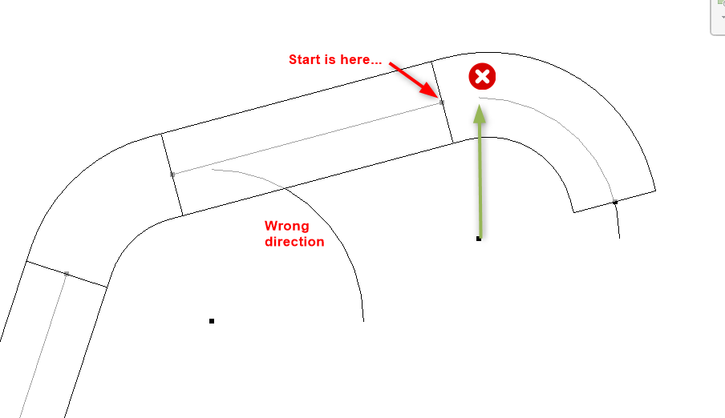 <!-- Pixel Height: 675 Pixel Width: 993 -->

And what about Cable Tray Fittings which are vertical or visible in section like this?

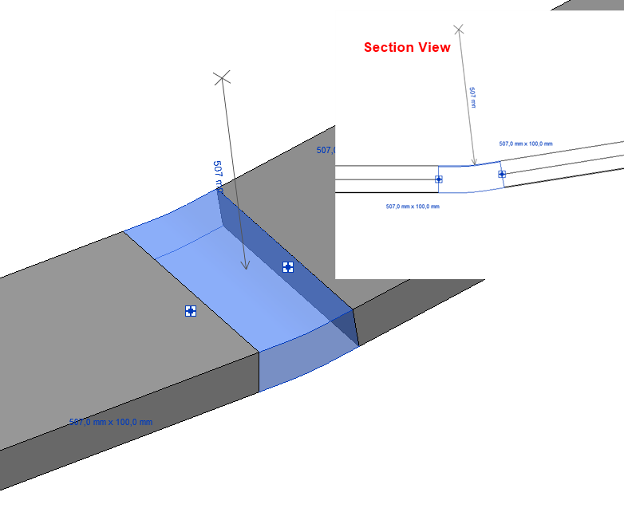 <!-- Pixel Height: 675 Pixel Width: 993 -->

**Answer:**
I found a new approach to get the center curve of the duct and use the Revit API library to create an Arc to represent it:

<pre><code class="language-cs">  ElementId id = uidoc.Selection.PickObject(
    Autodesk.Revit.UI.Selection.ObjectType.Element).ElementId;

  FamilyInstance inst = doc.GetElement(id) as FamilyInstance;

  Options opt = new Options();
  opt.ComputeReferences = true;
  opt.DetailLevel = ViewDetailLevel.Coarse;

  GeometryElement geoElement = inst.get_Geometry(opt);

  using (Transaction createArc = new Transaction(doc, "Create Arc"))
  {
    createArc.Start();

    foreach (GeometryInstance geoInst in geoElement)
    {
      if(geoInst != null)
      {
        foreach (GeometryObject obj in geoInst.GetInstanceGeometry())
        {
          if (obj is Arc)
          {
            doc.Create.NewModelCurve(obj as Curve,
              SketchPlane.Create(
                doc,
                Plane.CreateByNormalAndOrigin((obj as Arc).Normal,
                (obj as Arc).GetEndPoint(0))));
          }
        }
      }
    }
    createArc.Commit();
  }</code></pre>

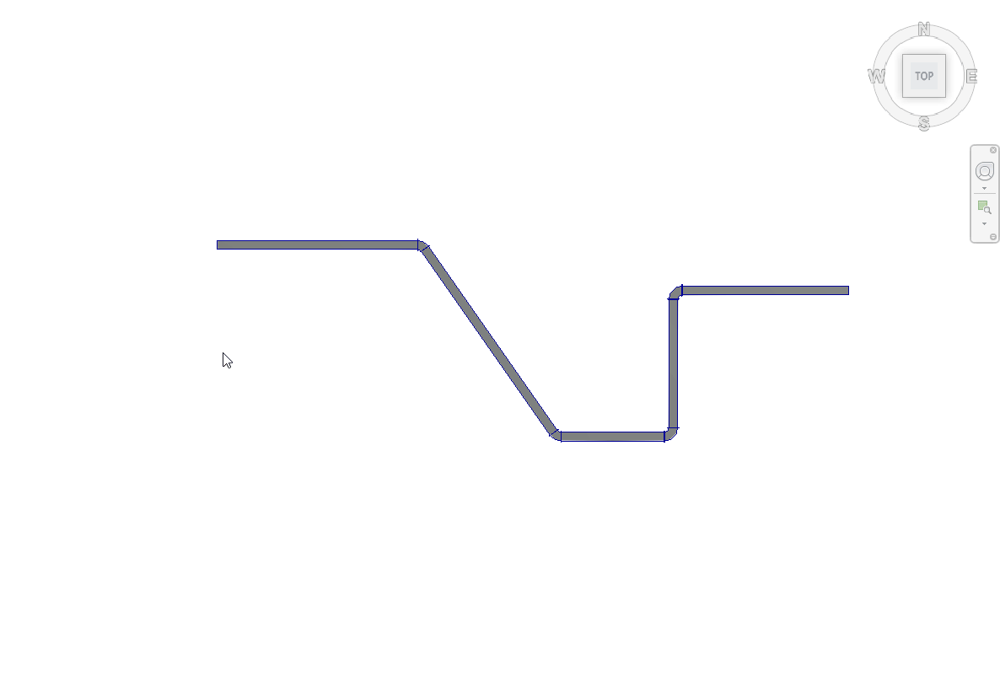 <!-- Pixel Height: 675 Pixel Width: 993 -->

**Response:**
YouHou!!! It works!!
So yes, depending on the level of view detail, the instances returned by `GetInstanceGeometry` are not the same.
Secret is changing the `ViewDetailLevel` to `Coarse`!
The good surprise is that `Arc` and `Line` have an `ApproximateLength` property, so I don't have to run a transaction.

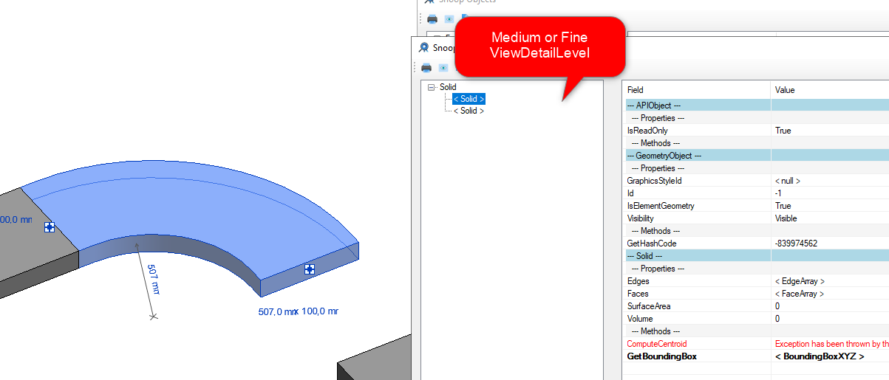 <!-- Pixel Height: 675 Pixel Width: 993 -->
 
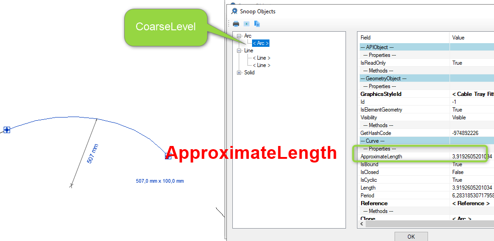 <!-- Pixel Height: 675 Pixel Width: 993 -->
 
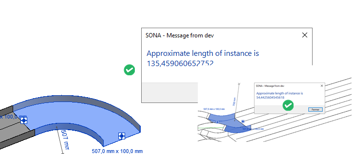 <!-- Pixel Height: 675 Pixel Width: 993 -->

The code looks like this:

<pre><code class="language-cs">  Options opt = new Options();
  opt.ComputeReferences = true;
  opt.DetailLevel = ViewDetailLevel.Coarse;

  foreach (ElementId elemId in _uidoc.Selection.GetElementIds())
  {
    // normalement, un seul
    Element element = _uidoc.Document.GetElement(elemId);

    if (element.GetType() == typeof(FamilyInstance))
    {
      double approximateLength = 0;
      FamilyInstance famInst = element as FamilyInstance;

      GeometryElement geoElement = famInst.get_Geometry(opt);

      foreach (GeometryInstance geoInst in geoElement)
      {
        if (geoInst != null)
        {
          foreach(GeometryObject geoObj in geoInst.GetInstanceGeometry())
          {
            if (geoObj is Arc)
            {
              Arc arc = geoObj as Arc;
              approximateLength += arc.ApproximateLength;
            }
            if (geoObj is Line)
            {
              Line line = geoObj as Line;
              approximateLength += line.ApproximateLength;
            }
          }
        }
      }
      TaskDialog.Show("Message from dev",
        "Approximate length of instance is "
        + UnitUtils.ConvertFromInternalUnits(
          approximateLength,
          UnitTypeId.Centimeters));

    }
  }</code></pre>

Thanks to all for your help, and to Mariyan for his [tutos about vectors](https://youtu.be/FrFSPTRO9wY)!

#### Using the Sagitta Formula

[Cyril Poupin](https://forums.autodesk.com/t5/user/viewprofilepage/user-id/5889003) adds:

This discussion inspired me to dive back into this problem;
here's a solution using the [sagitta formula](https://en.wikipedia.org/wiki/Sagitta_(geometry)) (without using the ProtoGeometry API):

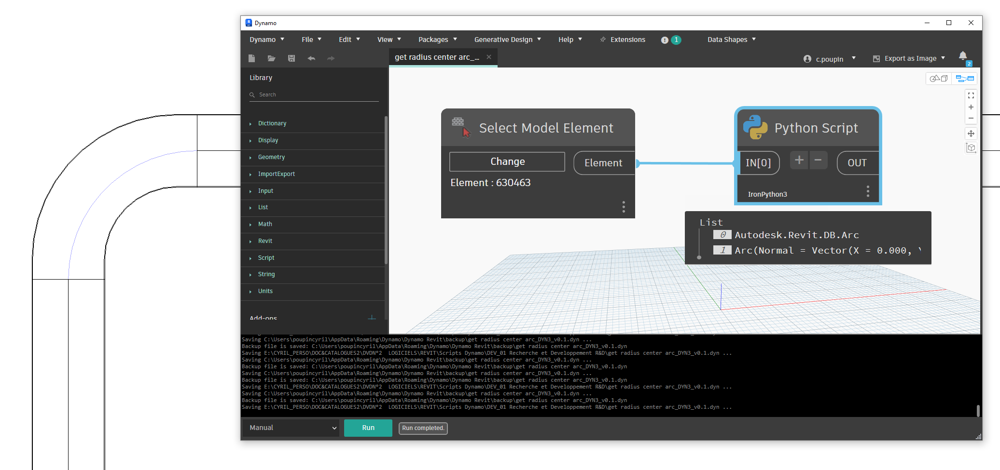 <!-- Pixel Height: 675 Pixel Width: 993 -->

The Python code is for IronPython3, but easily transposable to C#:

<pre><code class="language-cs">import clr
import sys
import System
from System import Math

#import Revit API
clr.AddReference('RevitAPI')
import Autodesk
from Autodesk.Revit.DB import *
import Autodesk.Revit.DB as DB

clr.AddReference('RevitNodes')
import Revit
clr.ImportExtensions(Revit.GeometryConversion)

#import transactionManager and DocumentManager (RevitServices is specific to Dynamo)
clr.AddReference('RevitServices')
import RevitServices
from RevitServices.Persistence import DocumentManager
doc = DocumentManager.Instance.CurrentDBDocument

def get_curve_fitting2(elem):
    """
    return the arc geometry
    """
    if hasattr(elem, "MEPModel"):
        conSet = elem.MEPModel.ConnectorManager.Connectors
        if conSet.Size == 2:
            pair_sys_origin = [[con.CoordinateSystem, con.Origin] for con in conSet]
            ptA = pair_sys_origin[0][1]
            ptB = pair_sys_origin[1][1]
            normalA = pair_sys_origin[0][0].BasisX
            normalB = pair_sys_origin[1][0].BasisX
            # create Unbound lines
            lineBoundA = Line.CreateUnbound(ptA, normalA)
            lineBoundB = Line.CreateUnbound(ptB, normalB)
            # compute intersection -> center
            out_IntersectionResultArray = clr.Reference[IntersectionResultArray]()
            result = lineBoundA.Intersect(lineBoundB, out_IntersectionResultArray)
            if result == SetComparisonResult.Overlap:
                center = out_IntersectionResultArray.Value[0].XYZPoint
                radius = ptA.DistanceTo(center)
                # compute the chord and the middle of chord
                chord = Line.CreateBound(ptA, ptB)
                mid_chord = (ptA + ptB) / 2.0
                distance = ptA.DistanceTo(ptB)
                # compute sagitta
                sagitta = radius - Math.Sqrt(radius**2 - (distance / 2)**2)
                # translate the middle point on the chord with sagitta
                vector_sagitta = (mid_chord  - center).Normalize().Multiply(sagitta)
                pointOnArc = mid_chord + vector_sagitta
                return  Arc.Create(ptA, ptB, pointOnArc)
    return None

fitting = UnwrapElement(IN[0])
db_Arc = get_curve_fitting2(fitting)
ds_Arc_for_check = db_Arc.ToProtoType()
OUT = db_Arc, ds_Arc_for_check</code></pre>

Many thanks to Cyril for this addition!

#### Using the Insertion Point

Rather belatedly, a (so far) final contribution to this topic from
Roman [@Nice3point](https://t.me/nice3point) Karpovich, aka Роман Карпович,
sharing a solution from Vadim Muratov:

> The arc centre of any elbow will always coincide with the inset point of the family, so you can get the insert point, the origin for the connectors and the angle between the connectors; from here you can draw the arc.
To get the length, it is enough to know the radius of the arc and the angle between the connectors:
nice3point_0-1726481428723.png

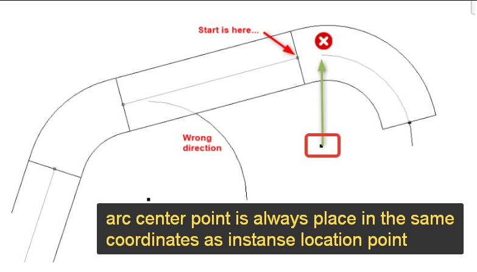

> This way, you can solve the problem much simpler, and without a massive code size.

Many thanks to Roman for this simple and efficient solution!

#### MEP Tee Branch Identification

Andrej Licanin of [bimexperts](https://bimexperts.com/) brought up a question and shared his MEP tee fitting identification and analysis solution in
the [Revit API discussion forum](http://forums.autodesk.com/t5/revit-api-forum/bd-p/160) thread
on [Revit Tpiece geometric analysis](https://forums.autodesk.com/t5/revit-api-forum/revit-tpiece-geometric-analysis/m-p/12995868):

**Question:**
I'm trying to make a function that will read a t-piece and return a coefficient based on a table from DIN 1988-300:

   <!-- Pixel Height: 675 Pixel Width: 993 -->

I get T pieces by collecting family instances and checking their part type in the `MEPModel` field.
After that, I retrieve their connectors and obtain the flow values, but I can't determine the coefficients based on just that.
I would need some way to identify which connector is going straight and which one is branching off.
I thought the angle property could help me here, but no luck &ndash; in the families I'm looking at, they are all 0.
Any idea how to tackle this problem?
How could I determine which connector is coming from the side of a t piece?

**Answer:**
You can look at the [connector coordinate system](https://www.revitapidocs.com/2024/cb6d725d-654a-f6f3-fed0-96cc618a42f1.htm).
Its Z axis points in the connector direction, so you can use that to determine the relative connector angles.

**Response:**
Thanks Jeremy, it works:

  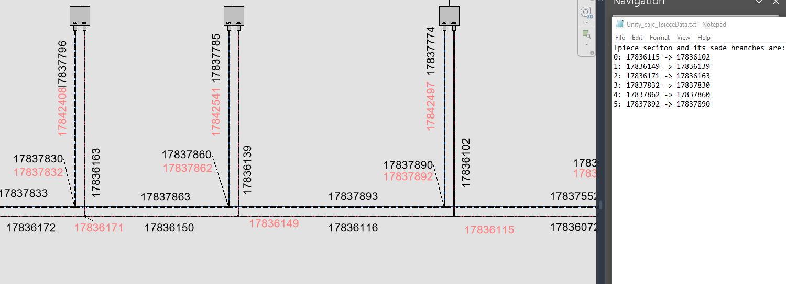 <!-- Pixel Height: 544 Pixel Width: 1,500 -->

Here is the code for the function:

<pre><code class="language-cs">  public static Element AnalyzeTee2(
    Element element,
    Document doc)
  {
    Element elementAtAngle = null;

    // Check if the element is a FamilyInstance

    if (!PipeNetworkSplitter.isSplitter(element))
    {
      return null;
    }

    List&lt;Connector&gt; tpieceConnectors = getConnectors(element);

    Connector connector1 = tpieceConnectors[0];
    Connector connector2 = tpieceConnectors[1];
    Connector connector3 = tpieceConnectors[2];

    XYZ zVector1 = connector1.CoordinateSystem.BasisZ;
    XYZ zVector2 = connector2.CoordinateSystem.BasisZ;
    XYZ zVector3 = connector3.CoordinateSystem.BasisZ;

    if (AreVectorsParallel(zVector1,zVector2))
      elementAtAngle = getConnectingConnector(connector3).Owner;
    if (AreVectorsParallel(zVector2,zVector3))
      elementAtAngle = getConnectingConnector(connector1).Owner;
    if (AreVectorsParallel(zVector1,zVector3))
      elementAtAngle = getConnectingConnector(connector2).Owner;

    return elementAtAngle;
  }

  public static bool AreVectorsParallel(
    XYZ vector1,
    XYZ vector2,
    double tolerance = 1e-6)
  {
    // Compute the cross product of the two vectors
    XYZ crossProduct = vector1.CrossProduct(vector2);

    // Check if the cross product is close
    // to zero vector within the given tolerance
    return crossProduct.IsAlmostEqualTo(XYZ.Zero, tolerance);
  }</code></pre>

Many thanks to Andrej for sharing this solution.
