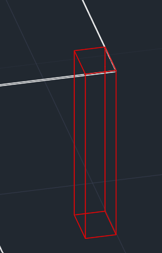
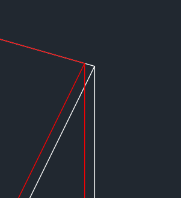
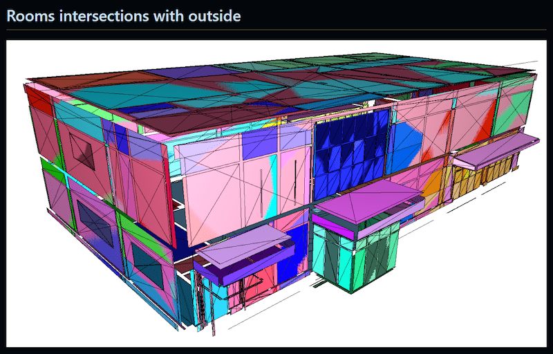

<head>
<meta http-equiv="Content-Type" content="text/html; charset=utf-8">
<link rel="stylesheet" type="text/css" href="bc.css">
<!-- https://highlightjs.org/#usage
<link rel="stylesheet" href="https://cdnjs.cloudflare.com/ajax/libs/highlight.js/11.9.0/styles/default.min.css">

-->

<!-- https://prismjs.com -->
<link href="https://cdn.jsdelivr.net/npm/prismjs@1.29.0/themes/prism.min.css" rel="stylesheet" />

</head>

<!---

- perform boolean in CGAL:
  https://forums.autodesk.com/t5/revit-api-forum/how-to-execute-booleanoperations-on-revit-solid-by-autocad/m-p/13005223

- OpenCascade for Boolean operations
  https://forums.autodesk.com/t5/revit-api-forum/boolean-operation-fail/m-p/12839281#M79543
  - OpenCascade for Boolean operations
  https://forums.autodesk.com/t5/revit-api-forum/boolean-operation-fail/m-p/12713966#M78244
  - https://forums.autodesk.com/t5/revit-api-forum/how-to-create-offset-solid-geometry-for-fittings-pipe-duct/m-p/12226377
  OpenCascade?
  https://forums.autodesk.com/t5/revit-api-forum/boolean-operation-fail/m-p/11648684/highlight/true#M68255
  - https://forums.autodesk.com/t5/revit-api-forum/boolean-operation-fail/m-p/7531968
  jira REVIT-122714 [Boolean Operation Fail - case 13578517]
  sfdc 13578517
  - voids
  Generate generic voids from wall profile
  https://forums.autodesk.com/t5/revit-api-forum/generate-generic-voids-from-wall-profile/m-p/8928031
  Here are some void-related discussions by The Building Coder:
  Beam Maker Using a Void Extrusion to Cut -- http://thebuildingcoder.typepad.com/blog/2010/07/beam-maker-using-a-void-extrusion-to-cut.html
  Boolean Operations and InstanceVoidCutUtils -- http://thebuildingcoder.typepad.com/blog/2011/06/boolean-operations-and-instancevoidcututils.html
  Transaction Group Regeneration for InstanceVoidCutUtils -- http://thebuildingcoder.typepad.com/blog/2014/04/instancevoidcututils-and-need-for-regeneration.html
  Voids in the Family Editor -- https://thebuildingcoder.typepad.com/blog/2014/10/brussels-hackathon-and-determining-pipe-wall-thick...
  Provision for Voids -- https://thebuildingcoder.typepad.com/blog/2017/03/wta-mech-and-ttt-for-provision-for-voids.html

twitter:

How to handle problems with solid Boolean operations in the @AutodeskRevit #RevitAPI? @open_cascade versus CGAL for #BIM @DynamoBIM https://autode.sk/booleanops

How to handle problems with solid Boolean operations?
&ndash; Revit Booleans and OpenCascade
&ndash; CGAL solid Booleans...

linkedin:

How to handle problems with solid Boolean operations in the #RevitAPI?

https://autode.sk/booleanops

- Revit Booleans and OpenCascade
- CGAL solid Booleans...

#BIM #DynamoBIM #AutodeskAPS #Revit #API #IFC #SDK #Autodesk #AEC #adsk

the [Revit API discussion forum](http://forums.autodesk.com/t5/revit-api-forum/bd-p/160) thread

-->

### Solid Boolean Operation Alternatives

A recurring topic in
the [Revit API discussion forum](http://forums.autodesk.com/t5/revit-api-forum/bd-p/160) concerns
problems with solid Boolean operations:

- [Revit Booleans and OpenCascade](#2)
- [CGAL solid Booleans](#3)

#### Revit Booleans and OpenCascade

The question came up once again recently in the query
on [`BooleanOperationsUtils` `ExecuteBooleanOperation` `InvalidOperationException` cause](https://forums.autodesk.com/t5/revit-api-forum/booleanoperationsutils-executebooleanoperation/m-p/12971195):

**Question:**
`BooleanOperationsUtils.ExecuteBooleanOperation`: When I use this method, I often get an `InvalidOperationException`.
I would like to know if there are specific criteria for causing that error.
For example, it occurs when elements intersect at an angle below a certain angle, etc.
I hope there are rules for this or some documentation I can refer to.

**Answer:**
Sorry about that.
It has been mentioned before that `ExecuteBooleanOperation` can run into issues.
Unfortunately, afaik, there is no list of the exact criteria which might cause a problem.
Various ways of handling the situation and some possible workarounds have been discussed here in the past.
You can search
the [Revit API discussion forum](http://forums.autodesk.com/t5/revit-api-forum/bd-p/160)
for [ExecuteBooleanOperation](https://forums.autodesk.com/t5/forums/searchpage/tab/message?advanced=false&allow_punctuation=false&filter=location&location=forum-board:160&q=ExecuteBooleanOperation) or
just [Boolean](https://forums.autodesk.com/t5/forums/searchpage/tab/message?filter=location&q=Boolean&noSynonym=false&location=forum-board:160&collapse_discussion=true) to
find some of them.

In Revit, one also encounters situations like this:

Red object to subtract from white object

Zoom to the corner

The development team are aware of these issues.
[Boolean operation fail](https://forums.autodesk.com/t5/revit-api-forum/boolean-operation-fail/m-p/12839281) is
an exhaustive and long-ongoing discussion of the topic including a suggestion
by Tommy [@tommy.stromhaug](https://forums.autodesk.com/t5/user/viewprofilepage/user-id/4635064) Strømhaug
for a non-trivial workaround using [OpenCascade](https://dev.opencascade.org/).

#### CGAL Solid Booleans

Andrey [@ankofl](https://forums.autodesk.com/t5/user/viewprofilepage/user-id/11836042) Kolesov
recently shared a solution using
the [Computational Geometry Algorithms Library CGAL](https://en.wikipedia.org/wiki/CGAL) and
the [OFF file format](https://en.wikipedia.org/wiki/OFF_(file_format)) to
perform Boolean operations on solids, presented in
the [Revit API discussion forum](http://forums.autodesk.com/t5/revit-api-forum/bd-p/160) thread
on [how to execute Boolean operations on Revit solid by AutoCAD](https://forums.autodesk.com/t5/revit-api-forum/how-to-execute-booleanoperations-on-revit-solid-by-autocad/m-p/13005223):

After extensive discussion and in-depth research on transferring the solids to AutoCAD, OpenCascade, or some other library (check out the discussion threads mentioned above for that), Andrey opted for a different solution, saying:

Well, it seems I'm finally close to a solution that suits me:

Create `.off` file from Revit solid:

<pre><code class="language-cs">public static bool WriteOff(
  this Solid solid,
  out List&lt;string&gt; listString)
  {
    listString = ["OFF"];

    if(solid.CreateMesh(out var listVectors, out var listTri))
    {
      listString.Add($"{listVectors.Count} {listTri.Count} 0");
      listString.Add($"");

      foreach (var p in listVectors)
      {
        listString.Add(p.Write());
      }

      foreach (var v in listTri)
      {
        listString.Add($"3  {v.iA} {v.iB} {v.iC}");
      }

      return true;
    }
    return false;
  }</code></pre>

And this:

<pre><code class="language-cs">public static bool CreateMesh(
  this Solid solid,
  out List&lt;XYZ&gt; listVectors,
  out List&lt;Tri&gt; listTri)
  {
    double k = UnitUtils.ConvertFromInternalUnits(1, UnitTypeId.Meters);
    listVectors = [];
    listTri = [];

    bool allPlanar = true;

    int indV = 0;
    foreach (Face face in solid.Faces)
    {
      if (face is PlanarFace pFace)
      {
        Mesh mesh = pFace.Triangulate();
        for (int tN = 0; tN &lt; mesh.NumTriangles; tN++)
        {
          var tri = mesh.get_Triangle(tN);

          var pT = new int[3];

          for (int vN = 0; vN &lt; 3; vN++)
          {
            var p = tri.get_Vertex(vN) * k;

            if (p.Contain(listVectors, out XYZ pF, out int index))
            {
              pT[vN] = index;
            }
            else
            {
              pT[vN] = indV;
              listVectors.Add(p);
              indV++;
            }
          }

          listTri.Add(new(pT[2], pT[1], pT[0]));
        }
      }
      else
      {
        allPlanar = false;
      }
    }

    return allPlanar;
  }</code></pre>

Load `.off` file

<pre><code class="language-cs">#pragma once

bool load_from(const char* path, Mesh& output) {
  output.clear();
  std::ifstream input;
  input.open(path);
  if (!input) {
      return false;
  }
  else if (!(input &gt;&gt; output)) {
      return false;
  }

  input.close();
  return true;
}</code>></pre>

Execute Boolean

<pre><code class="language-cs">#pragma once

bool boolean_simple(Mesh m1, Mesh m2, b_t type, Mesh& out) {
  out.clear();
  int code = 0;
  if (!CGAL::is_triangle_mesh(m1)) {
    PMP::triangulate_faces(m1);
  }
  if (!CGAL::is_triangle_mesh(m2)) {
    PMP::triangulate_faces(m2);
  }
  if (type == b_t::join) {
    if (!PMP::corefine_and_compute_union(m1, m2, out)){
      std::cout &lt;&lt; "fail_join ";
      return false;
    }
  }
  else if (type == b_t::inter) {
    if (!PMP::corefine_and_compute_intersection(m1, m2, out)){
      std::cout &lt;&lt; "fail_inter ";
      return false;
    }
  }
  else if (type == b_t::dif) {
    if (!PMP::corefine_and_compute_difference(m1, m2, out)) {
      std::cout &lt;&lt; "fail_dif ";
      return false;
    }
  }
  else {
    throw;
  }
  return true;
}</code></pre>

Save `.off` file:

<pre><code class="language-cs">#pragma once
#include &lt;CGAL/Polygon_mesh_processing/IO/polygon_mesh_io.h&gt;

bool save_to(const std::string path, Mesh input) {
  if (!CGAL::is_valid_polygon_mesh(input)) {
    return false;
  }
  try {
    if (CGAL::IO::write_polygon_mesh(path + ".off", input,
      CGAL::parameters::stream_precision(17)))
    {
      return true;
    }
    else {
      return false;
    }
  }
  catch (const std::exception& e) {
    std::cout &lt;&lt; "save_to: exception!" &lt;&lt; std::endl;
  }
  return false;
}</code></pre>

Then you can upload the `.off` file back to Revit, or do other manipulations with it. However, as far as I know, API Revit does not allow you to create a full-fledged Solid object, but only a triangular grid, i.e. you can upload the grid obtained through CGAL to Revit for viewing, but you will not be able to perform further operations on solid with it, but only view its geometry through DirectShape.

Currently, my main task is creating an energy model of a building and calculating heat loss, the energy required to maintain the internal temperature in rooms at a given temperature outside, taking into account the thermal resistance to heat transfer of building structures.
I implemented the intersection of 3D surfaces in 2D and converting the result back to 3D to determine the intersection of indoor surfaces with outdoor space:

Many thanks to Andrey for sharing this solution that will hopefully help many others struggling with problematic solid Boolean operations.

Looking at the history of [CGAL](https://en.wikipedia.org/wiki/CGAL), I see that it also includes the very powerful [LEDA Library of Efficient Data types and Algorithms](https://en.wikipedia.org/wiki/Library_of_Efficient_Data_types_and_Algorithms) that I looked into myself a long time ago, before it was merged into CGAL. LEDA is very impressive in itself, so CGAL must be quite something.

