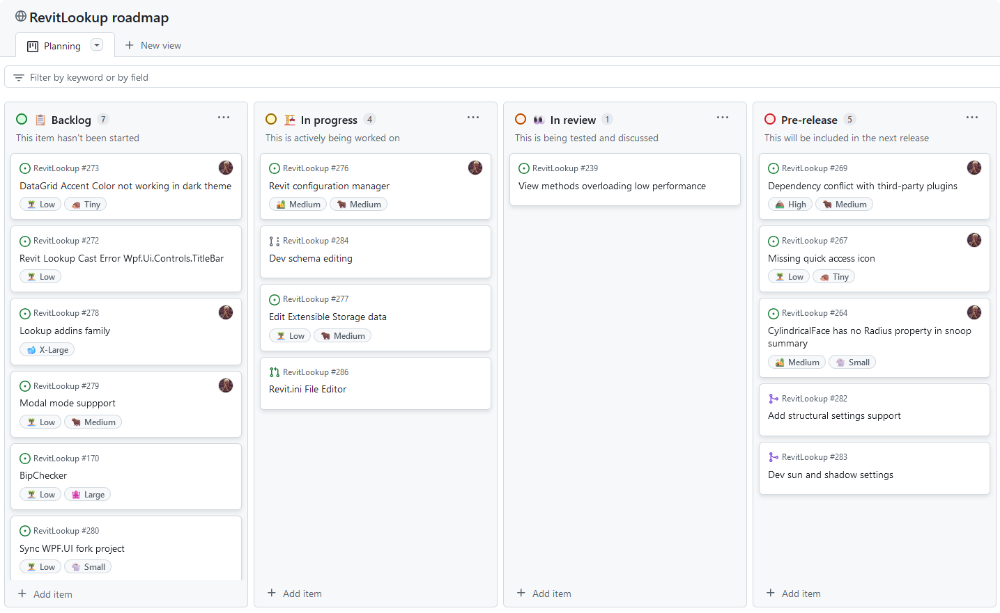

<head>
<meta http-equiv="Content-Type" content="text/html; charset=utf-8">
<link rel="stylesheet" type="text/css" href="bc.css">
<!-- https://highlightjs.org/#usage
<link rel="stylesheet" href="https://cdnjs.cloudflare.com/ajax/libs/highlight.js/11.9.0/styles/default.min.css">

-->

<!-- https://prismjs.com -->
<link href="https://cdn.jsdelivr.net/npm/prismjs@1.29.0/themes/prism.min.css" rel="stylesheet" />

</head>

<!---

- RevitLookup 2025.0.10
  https://github.com/jeremytammik/RevitLookup/releases/tag/2025.0.10
  - [Fixed placeholder for the Dark theme](https://github.com/jeremytammik/RevitLookup/issues/291)
  - Fixed the Revit.ini editor filter button name
  - Fixed the Revit.ini editor filter placeholder
  - [Disabled the Visual.Enter() method](https://github.com/jeremytammik/RevitLookup/issues/292)
  - [Suppressed GenericHost startup messages](https://github.com/jeremytammik/RevitLookup/pull/294) by @Nefarion
  - [Full changelog](https://github.com/jeremytammik/RevitLookup/compare/2025.0.9...2025.0.10)
  - [RevitLookup versioning](https://github.com/jeremytammik/RevitLookup/wiki/Versions)

- LLM is influencing human academic language
  The Impact of Large Language Models in Academia: from Writing to Speaking
  https://www.alphaxiv.org/abs/2409.13686
  Less scientifically precise, a similar topic os also raised in the El Pais article on
  Excessive use of words like ‘commendable’ and ‘meticulous’ suggests ChatGPT has been used in thousands of scientific studies
  https://english.elpais.com/science-tech/2024-04-25/excessive-use-of-words-like-commendable-and-meticulous-suggest-chatgpt-has-been-used-in-thousands-of-scientific-studies.html

twitter:

RevitLookup updates 2025.0.9 and 2025.0.10 with Revit.ini file editor, static dependency conflict analyser, public RevitLookup roadmap and numeros other improvements @AutodeskRevit #RevitAPI #BIM @DynamoBIM https://autode.sk/revitlookup2025_0_10

New versions of RevitLookup are available, and AI influence observable
&ndash; RevitLookup 2025.0.9
&ndash; Revit.ini file editor
&ndash; Dependency conflict static analyzer
&ndash; Public RevitLookup roadmap
&ndash; Other improvements
&ndash; RevitLookup 2025.0.10
&ndash; LLMs influence academic language...

linkedin:

RevitLookup updates 2025.0.9 and 2025.0.10 with Revit.ini file editor, static dependency conflict analyser, public RevitLookup roadmap and numeros other improvements for the #RevitAPI

https://autode.sk/revitlookup2025_0_10

- RevitLookup 2025.0.9
- Revit.ini file editor
- Dependency conflict static analyzer
- Public RevitLookup roadmap
- Other improvements
- RevitLookup 2025.0.10
- LLMs influence academic language...

#BIM #DynamoBIM #AutodeskAPS #Revit #API #IFC #SDK #Autodesk #AEC #adsk

the [Revit API discussion forum](http://forums.autodesk.com/t5/revit-api-forum/bd-p/160) thread

-->

### RevitLookup 2025.0.9

A new version of RevitLookup is available, and AI influence observable:

- [RevitLookup 2025.0.9](#2)
    - [Revit.ini file editor](#2.1)
    - [Dependency conflict static analyzer](#2.2)
    - [Public RevitLookup roadmap](#2.3)
    - [Other improvements](#2.4)
- [RevitLookup 2025.0.10](#2.5)
- [LLMs influence academic language](#3)

#### RevitLookup 2025.0.9

Roman [@Nice3point](https://t.me/nice3point) Karpovich, aka Роман Карпович,
published [RevitLookup](https://github.com/jeremytammik/RevitLookup)
[release 2025.0.9](https://github.com/jeremytammik/RevitLookup/releases/tag/2025.0.9)
with important enhancements by himself,
[RichardPinka](https://github.com/RichardPinka) and [SergeyNefyodov](https://github.com/SergeyNefyodov):

- [Revit.ini file editor](#2.1)
- [Dependency conflict static analyzer](#2.2)
- [Public RevitLookup roadmap](#2.3)

#### Revit.ini File Editor

The **Revit.ini** file is a key configuration file in Revit that stores settings related to user preferences, system behavior, and project defaults.

The **Revit.ini File Editor** provides a simple and efficient way to manage these settings without the need for manual editing.
With this tool, users can quickly adjust Revit’s configurations to match project needs or personal preferences, making it an essential utility for both professionals and teams working with Revit.

This is our first public version, and we are excited for you to try it out for yourself!
Make sure to file issues you encounter on our GitHub so we can continue to improve it.
For more details, please refer to the:

- [Revit.ini file editor documentation](https://github.com/jeremytammik/RevitLookup/wiki/Revit.ini-File-Editor)

#### Dependency Conflict Static Analyzer

Some users experience issues launching RevitLookup, often caused by conflicts with third-party plugins, cf., [issue 269](https://github.com/jeremytammik/RevitLookup/issues/269).

To help resolve these issues, we introduced new dependency reporting tools that allow you to analyze, identify and upgrade problematic plugins causing crashes:

- [Download DependenciesReport tool](https://github.com/jeremytammik/RevitLookup/issues/269#issuecomment-2323309590)

Many thanks to @RichardPinka for testing tools in the discussion of [issue 281](https://github.com/jeremytammik/RevitLookup/issues/281).

#### Public RevitLookup Roadmap

Curious about what’s next?
Keep up to date on the latest developments for RevitLookup and share your feedback.

Check out the [Public RevitLookup Roadmap](https://github.com/users/jeremytammik/projects/1) to see what’s coming up in future releases.

#### Other Improvements

**New extensions** by @SergeyNefyodov; type, name and short description:

<!--
https://www.linkedin.com/in/sergei-nefedov/
Sergei Nefedov
atomatiq
Belgrade
-->

- Pipe   &ndash; [HasOpenConnector](https://github.com/jeremytammik/RevitLookup/pull/261) &ndash; Checks if there is open piping connector for the pipe
- Family &ndash; [FamilyCanConvertToFaceHostBased](https://github.com/jeremytammik/RevitLookup/pull/263) &ndash; Indicates whether the family can be converted to face host based
- Family &ndash; [GetProfileSymbols](https://github.com/jeremytammik/RevitLookup/pull/263) &ndash; Gets the profile Family Symbols
- Document &ndash; [GetLightFamily](https://github.com/jeremytammik/RevitLookup/pull/266) &ndash; Creates a light family object from the family document
- LightFamily &ndash; [GetLightTypeName](https://github.com/jeremytammik/RevitLookup/pull/266) &ndash; Return the name for the light type
- LightFamily &ndash; [GetLightType](https://github.com/jeremytammik/RevitLookup/pull/266) &ndash; Return a LightType object for the light type
- Application &ndash; [GetMacroManager](https://github.com/jeremytammik/RevitLookup/pull/268) &ndash; Gets the Macro manager from the application
- Document &ndash; [GetMacroManager](https://github.com/jeremytammik/RevitLookup/pull/268) &ndash; Gets the Macro manager from the document

**New API support:**

- [**CylindricalFace** class support](https://github.com/jeremytammik/RevitLookup/issues/264):
    - Radius property support
- [**StructuralSettings** class support](https://github.com/jeremytammik/RevitLookup/pull/282) by @SergeyNefyodov:
    - GetStructuralSettings method support
- [**StructuralSettings** class support](https://github.com/jeremytammik/RevitLookup/pull/283) by @SergeyNefyodov:
    - GetActiveSunAndShadowSettings method support
    - GetSunrise method support
    - GetSunset method support
    - GetSunset method support
    - IsTimeIntervalValid method support
    - IsAfterStartDateAndTime method support
    - IsBeforeEndDateAndTime method support
- [**RevisionNumberingSequence** class support](https://github.com/jeremytammik/RevitLookup/pull/289) by @SergeyNefyodov:
    - GetAllRevisionNumberingSequences method support
- [**AnalyticalLinkType** class support](https://github.com/jeremytammik/RevitLookup/pull/288) by @SergeyNefyodov:
    - IsValidAnalyticalFixityState method support
- [**AreaVolumeSettings** class support](https://github.com/jeremytammik/RevitLookup/pull/287) by @SergeyNefyodov:
    - GetAreaVolumeSettings method support
    - GetSpatialElementBoundaryLocation method support

**New default settings:**

- `Show Static` members enabled by default
- `Show Events` enabled by default
- `Show Extensions` enabled by default

**Bugs:**

- [Fixed missing quick access icon](https://github.com/jeremytammik/RevitLookup/issues/267)
- [Fixed DataGrid accent color](https://github.com/jeremytammik/RevitLookup/issues/273)

**Miscellaneous:**

- Updated **Contributing** guide
- Added new GitHub **issue templates**
- [Full changelog](https://github.com/jeremytammik/RevitLookup/compare/2025.0.8...2025.0.9)
- [RevitLookup versioning](https://github.com/jeremytammik/RevitLookup/wiki/Versions)

#### RevitLookup 2025.0.10

Shortly after, Roman went on to publish [RevitLookup 2025.0.10](https://github.com/jeremytammik/RevitLookup/releases/tag/2025.0.10):

- [Fixed placeholder for the dark theme](https://github.com/jeremytammik/RevitLookup/issues/291)
- Fixed the Revit.ini editor filter button name
- Fixed the Revit.ini editor filter placeholder
- [Disabled the `Visual.Enter` method](https://github.com/jeremytammik/RevitLookup/issues/292)
- [Suppressed `GenericHost` startup messages](https://github.com/jeremytammik/RevitLookup/pull/294) by @Nefarion
- [Full changelog](https://github.com/jeremytammik/RevitLookup/compare/2025.0.9...2025.0.10)
- [RevitLookup versioning](https://github.com/jeremytammik/RevitLookup/wiki/Versions)

#### LLMs Influence Academic Language

In a different vein, looking at AI-related news, according to scientific studies, LLMs are already influencing human academic language,
cf., [The Impact of Large Language Models in Academia: from Writing to Speaking](https://www.alphaxiv.org/abs/2409.13686).
Less scientifically rigorous, similar results are also raised in the El Pais article stating
that [excessive use of words like ‘commendable’ and ‘meticulous’ suggests ChatGPT has been used in thousands of scientific studies](https://english.elpais.com/science-tech/2024-04-25/excessive-use-of-words-like-commendable-and-meticulous-suggest-chatgpt-has-been-used-in-thousands-of-scientific-studies.html).

