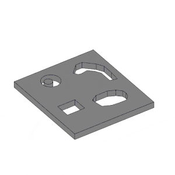

<head>
<meta http-equiv="Content-Type" content="text/html; charset=utf-8">
<link rel="stylesheet" type="text/css" href="bc.css">
<!-- https://highlightjs.org/#usage
<link rel="stylesheet" href="https://cdnjs.cloudflare.com/ajax/libs/highlight.js/11.9.0/styles/default.min.css">

-->

<!-- https://prismjs.com -->
<link href="https://cdn.jsdelivr.net/npm/prismjs@1.29.0/themes/prism.min.css" rel="stylesheet" />

</head>

<!---

- ricaun full sample to use brepbuilder to build open shell
  https://forums.autodesk.com/t5/revit-api-forum/creating-solid-with-one-planarface-using-brepbuilder-based-on/m-p/13031540#M81609
  Creating Solid with one PlanarFace using BRepBuilder based on slab sketch
  https://ricaun.com/

twitter:

 @AutodeskRevit #RevitAPI #BIM @DynamoBIM

&ndash; ...

linkedin:

#BIM #DynamoBIM #AutodeskAPS #Revit #API #IFC #SDK #Autodesk #AEC #adsk

the [Revit API discussion forum](http://forums.autodesk.com/t5/revit-api-forum/bd-p/160) thread

-->

### Solid from Face

#### Create DirectShape Solid from Planar Face

Luiz Henrique [@ricaun](https://ricaun.com/) Cassettari shared a nice sample demonstrating how
to [create a solid from a PlanarFace using BRepBuilder based on slab sketch](https://forums.autodesk.com/t5/revit-api-forum/creating-solid-with-one-planarface-using-brepbuilder-based-on/m-p/13031540#M81609):

**Question:**
I need to create a Solid with a single `PlanarFace` using `BRepBuilder`.
The `PlanarFace` edges are based on a curves from sketch of a slab.

**Answer:**
To start with, you can Look at the [BRepBuilderExample Revit SDK sample](https://thebuildingcoder.typepad.com/blog/2017/05/revit-2017-and-2018-sdk-samples.html#4.4).
It includes a creation of a non-planar face, with no solid.
The [BRepBuilder class API documentation](https://www.revitapidocs.com/2024/94c1fef4-2933-ce67-9c2d-361cbf8a42b4.htm) demonstrates in detail the creation of faces, edges, coedges, including arcs.
Additional background information is provided by The Building Coder discussing [BRepBuilder organisation](https://thebuildingcoder.typepad.com/blog/2023/06/brepbuilder-and-toposurface-interior.html#2).

BRepBuilder can still be tricky to work with.
In your case, you need to set the target `BRepType` in the constructor to `BRepType.OpenShell` to allow the builder to return a solid without a volume.
Sometimes, the orientation matters; especially in `BRepType.Solid` and `BRepType.Void`, you need to make sure all edges is registered in the correct orientation.

Here is a full sample to copy a Face to Solid.

 <!-- Pixel Height: 300 Pixel Width: 300 -->

<pre><code class="language-cs">using Autodesk.Revit.Attributes;
using Autodesk.Revit.DB;
using Autodesk.Revit.UI;
using System;

namespace RevitAddin.Forum.Revit.Commands
{
  [Transaction(TransactionMode.Manual)]
  public class CommandFaceToSolid : IExternalCommand
  {
    public Result Execute(
      ExternalCommandData commandData,
      ref string message,
      ElementSet elementSet)
    {
      UIApplication uiapp = commandData.Application;
      Document document = uiapp.ActiveUIDocument.Document;

      try
      {
        var faceReference = uiapp.ActiveUIDocument.Selection.PickObject(
          Autodesk.Revit.UI.Selection.ObjectType.Face);
        var element = document.GetElement(faceReference);
        var face = element.GetGeometryObjectFromReference(faceReference)
         as Face;

        var solid = CreateSolidFromFace(face);
        var normal = face.ComputeNormal(new UV(0.5, 0.5));

        using (Transaction transaction = new Transaction(document))
        {
          transaction.Start("Create Solid");
          var ds = DirectShape.CreateElement(document,
            new ElementId(BuiltInCategory.OST_GenericModel));
          ds.SetName(ds.Category.Name);
          ds.SetShape(new[] { solid });
          ds.Location.Move(normal);
          transaction.Commit();
        }
      }
      catch (Exception ex)
      {
        Console.WriteLine(ex);
      }

      return Result.Succeeded;
    }

    private Solid CreateSolidFromFace(Face face)
    {
      var surface = face.GetSurface();
      var brepBuilder = new BRepBuilder(BRepType.OpenShell);
      var faceIsReversed = !face.OrientationMatchesSurfaceOrientation;
      BRepBuilderGeometryId faceId = brepBuilder.AddFace(
        BRepBuilderSurfaceGeometry.Create(surface, null), faceIsReversed);
      foreach (CurveLoop curveLoop in face.GetEdgesAsCurveLoops())
      {
        BRepBuilderGeometryId loopId = brepBuilder.AddLoop(faceId);
        foreach (Curve curve in curveLoop)
        {
          var edge = BRepBuilderEdgeGeometry.Create(curve);
          BRepBuilderGeometryId edgeId = brepBuilder.AddEdge(edge);
          brepBuilder.AddCoEdge(loopId, edgeId, false);
        }
        brepBuilder.FinishLoop(loopId);
      }
      brepBuilder.SetFaceMaterialId(faceId, face.MaterialElementId);
      brepBuilder.FinishFace(faceId);
      brepBuilder.Finish();

      return brepBuilder.GetResult();
    }
  }
}</code></pre>

Many thanks to Ricaun for the nice sample and explanation.

