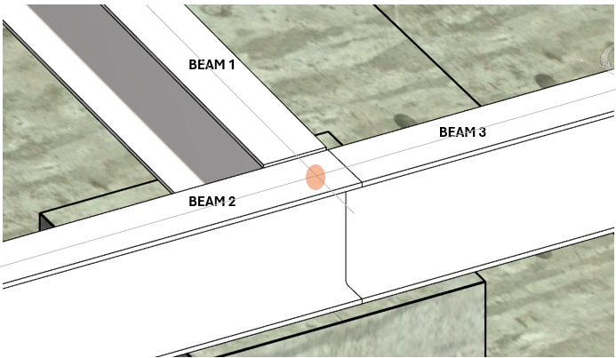

<head>
<meta http-equiv="Content-Type" content="text/html; charset=utf-8">
<link rel="stylesheet" type="text/css" href="bc.css">
<!-- https://highlightjs.org/#usage
<link rel="stylesheet" href="https://cdnjs.cloudflare.com/ajax/libs/highlight.js/11.9.0/styles/default.min.css">

-->

<!-- https://prismjs.com -->
<link href="https://cdn.jsdelivr.net/npm/prismjs@1.29.0/themes/prism.min.css" rel="stylesheet" />

</head>

<!---

- ricaun full sample to use brepbuilder to build open shell
  https://forums.autodesk.com/t5/revit-api-forum/creating-solid-with-one-planarface-using-brepbuilder-based-on/m-p/13031540#M81609
  Creating Solid with one PlanarFace using BRepBuilder based on slab sketch
  https://ricaun.com/

- Join between 3 beams
  https://forums.autodesk.com/t5/revit-api-forum/join-between-3-beams/m-p/13029976

twitter:

Creating a DirectShape open shell, a solid extrusion from a face and defining a precise join between three structural beams in the @AutodeskRevit #RevitAPI #BIM @DynamoBIM https://autode.sk/solidfromface

Creating an open shell, a solid extrusion from a face and defining a precise join between structural beams
&ndash; DirectShape solid from planar face
&ndash; Join between three beams...

linkedin:

Creating a DirectShape open shell, a solid extrusion from a face and defining a precise join between three structural beams in the #RevitAPI

https://autode.sk/solidfromface

- DirectShape solid from planar face
- Join between three beams...

#BIM #DynamoBIM #AutodeskAPS #Revit #API #IFC #SDK #Autodesk #AEC #adsk

the [Revit API discussion forum](http://forums.autodesk.com/t5/revit-api-forum/bd-p/160) thread

-->

### Join Beams and Solid from Face

Let's look at creating an open shell, a solid extrusion from a face and defining a precise join between structural beams:

- [`DirectShape` solid from planar face](#2)
- [Join between three beams](#3)

#### DirectShape Solid from Planar Face

Luiz Henrique [@ricaun](https://ricaun.com/) Cassettari explains how to create a DirectShape with only an open shell, with zero volume.
He also shared a nice sample demonstrating how
to [create a solid from a PlanarFace using BRepBuilder based on slab sketch](https://forums.autodesk.com/t5/revit-api-forum/creating-solid-with-one-planarface-using-brepbuilder-based-on/m-p/13031540#M81609):

**Question:**
I need to create a Solid with a single `PlanarFace` using `BRepBuilder`.
The `PlanarFace` edges are based on a curves from sketch of a slab.

**Answer:**
To start with, you can Look at the [BRepBuilderExample Revit SDK sample](https://thebuildingcoder.typepad.com/blog/2017/05/revit-2017-and-2018-sdk-samples.html#4.4).
It includes a creation of a non-planar face, with no solid.
The [BRepBuilder class API documentation](https://www.revitapidocs.com/2024/94c1fef4-2933-ce67-9c2d-361cbf8a42b4.htm) demonstrates in detail the creation of faces, edges, coedges, including arcs.
Additional background information is provided by The Building Coder discussing [BRepBuilder organisation](https://thebuildingcoder.typepad.com/blog/2023/06/brepbuilder-and-toposurface-interior.html#2).

BRepBuilder can still be tricky to work with.
In your case, to create an open shell, you need to set the target `BRepType` in the constructor to `BRepType.OpenShell` to allow the builder to return a solid without a volume.
Then, the code you share should work.
Sometimes, the orientation matters; especially in `BRepType.Solid` and `BRepType.Void`, you need to make sure all edges is registered in the correct orientation.

Finally, here is a full sample to create a solid from a planar face:

 <!-- Pixel Height: 300 Pixel Width: 300 -->
<a href="img/ricaun_facetosolid.gif">
Click for animation
</a>
<!-- https://thebuildingcoder.typepad.com/img/ricaun_facetosolid.gif -->

<pre><code class="language-cs">using Autodesk.Revit.Attributes;
using Autodesk.Revit.DB;
using Autodesk.Revit.UI;
using System;

namespace RevitAddin.Forum.Revit.Commands
{
  [Transaction(TransactionMode.Manual)]
  public class CommandFaceToSolid : IExternalCommand
  {
    public Result Execute(
      ExternalCommandData commandData,
      ref string message,
      ElementSet elementSet)
    {
      UIApplication uiapp = commandData.Application;
      Document document = uiapp.ActiveUIDocument.Document;

      try
      {
        var faceReference = uiapp.ActiveUIDocument.Selection.PickObject(
          Autodesk.Revit.UI.Selection.ObjectType.Face);
        var element = document.GetElement(faceReference);
        var face = element.GetGeometryObjectFromReference(faceReference)
         as Face;

        var solid = CreateSolidFromFace(face);
        var normal = face.ComputeNormal(new UV(0.5, 0.5));

        using (Transaction transaction = new Transaction(document))
        {
          transaction.Start("Create Solid");
          var ds = DirectShape.CreateElement(document,
            new ElementId(BuiltInCategory.OST_GenericModel));
          ds.SetName(ds.Category.Name);
          ds.SetShape(new[] { solid });
          ds.Location.Move(normal);
          transaction.Commit();
        }
      }
      catch (Exception ex)
      {
        Console.WriteLine(ex);
      }

      return Result.Succeeded;
    }

    private Solid CreateSolidFromFace(Face face)
    {
      var surface = face.GetSurface();
      var brepBuilder = new BRepBuilder(BRepType.OpenShell);
      var faceIsReversed = !face.OrientationMatchesSurfaceOrientation;
      BRepBuilderGeometryId faceId = brepBuilder.AddFace(
        BRepBuilderSurfaceGeometry.Create(surface, null), faceIsReversed);
      foreach (CurveLoop curveLoop in face.GetEdgesAsCurveLoops())
      {
        BRepBuilderGeometryId loopId = brepBuilder.AddLoop(faceId);
        foreach (Curve curve in curveLoop)
        {
          var edge = BRepBuilderEdgeGeometry.Create(curve);
          BRepBuilderGeometryId edgeId = brepBuilder.AddEdge(edge);
          brepBuilder.AddCoEdge(loopId, edgeId, false);
        }
        brepBuilder.FinishLoop(loopId);
      }
      brepBuilder.SetFaceMaterialId(faceId, face.MaterialElementId);
      brepBuilder.FinishFace(faceId);
      brepBuilder.Finish();

      return brepBuilder.GetResult();
    }
  }
}</code></pre>

Many thanks to Ricaun for the nice sample and explanation.

#### Join Between Three Beams

Dayanand Rakte raised and solved another issue, to apply
a [join between 3 beams](https://forums.autodesk.com/t5/revit-api-forum/join-between-3-beams/m-p/13029976):

**Question:** I am struggling with join/connection between 3 beams.
The current result looks like this:

 <!-- Pixel Height: 376 Pixel Width: 693 -->

The point highlighted with orange color is the endpoint location of Beam2 and Beam1, and the same point is start point location for Beam3.
I want to connect these beams to achieve the following expected outcome:

 <!-- Pixel Height: 403 Pixel Width: 634 -->

It will be ok if there is no join between these three beams, but they should be place as expected.
I tried the following approaches:

- First: I have not used JoinGeometry API and directly placed beams as per their location.
  In this approach I am getting random results, any of the the beam is extending which I don't have control.
- Second: I used the join geometry API as shown below.
  It generates the situation in the first image.

<pre><code class="language-cs">private void JoinGeometryBeam1ToBeam2Beam3(
  Document activeDoc,
  FamilyInstance Beam1)
{
  XYZ minPt = primaryBeam.get_BoundingBox(activeDoc.ActiveView).Min;
  XYZ maxPt = primaryBeam.get_BoundingBox(activeDoc.ActiveView).Max;
  Outline outLine = new Outline(minPt, maxPt);
  outLine.Scale(1.5);
  BoundingBoxIntersectsFilter filter = new BoundingBoxIntersectsFilter(outLine);
  List&lt;FamilyInstance&gt; connectedBeams
    = new FilteredElementCollector(activeDoc)
      .WherePasses(filter)
      .OfCategory(BuiltInCategory.OST_StructuralFraming)
      .OfClass(typeof(FamilyInstance))
      .Cast&lt;FamilyInstance&gt;()
      .ToList();

  foreach (FamilyInstance beam in connectedBeams)
  {
    JoinGeometryUtils.JoinGeometry(this.ActiveDoc, beam, Beam1);
  }
}</code></pre>

How can the desired result be achieved?

**Solution:**
It is working for me now.
I disallowed join for Beam2 and Beam3 and Beam1 kept as it is.
To disallow the join, I use the following API call:

<pre><code class="language-cs">StructuralFramingUtils.DisallowJoinAtEnd(girderInstance, 0);</code></pre>

I make sure that Beam2 and Beam3 are inserted before Beam1.
Then, the join between 3 beams works as expected.

Many thanks to Dayanand Rakte for sharing this solution.

