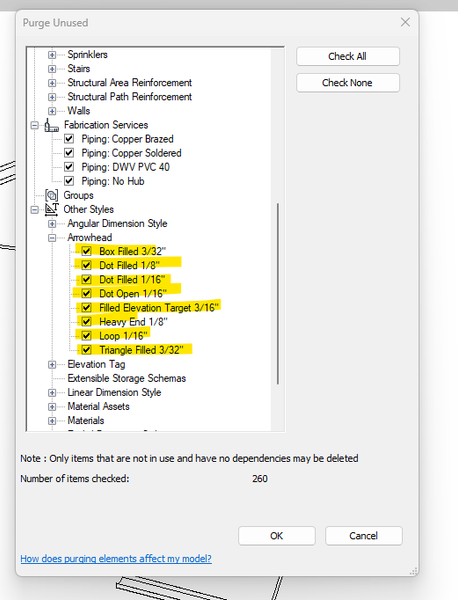

<head>
<meta http-equiv="Content-Type" content="text/html; charset=utf-8">
<link rel="stylesheet" type="text/css" href="bc.css">
<!-- https://highlightjs.org/#usage
<link rel="stylesheet" href="https://cdnjs.cloudflare.com/ajax/libs/highlight.js/11.9.0/styles/default.min.css">

-->

<!-- https://prismjs.com -->
<link href="https://cdn.jsdelivr.net/npm/prismjs@1.29.0/themes/prism.min.css" rel="stylesheet" />

</head>

<!---

- approach and effective filtering for unknown class
  Deleting unpurgeable viewport types through API
  https://forums.autodesk.com/t5/revit-api-forum/deleting-unpurgeable-viewport-types-through-api/m-p/12741221

- cannot delete specific type due to protected usage
  Is it possible to delete Arrowhead types?
  https://forums.autodesk.com/t5/revit-api-forum/is-it-possible-to-delete-arrowhead-types/td-p/13025122

twitter:

 the @AutodeskRevit #RevitAPI #BIM @DynamoBIM

&ndash; ...

linkedin:

#BIM #DynamoBIM #AutodeskAPS #Revit #API #IFC #SDK #Autodesk #AEC #adsk

the [Revit API discussion forum](http://forums.autodesk.com/t5/revit-api-forum/bd-p/160) thread

<a href="img/.gif">
Click for animation
</a>

-->

### Filter for Anonymous Type

#### Parameter Filter for Type Name

Sometimes, the BIM element that you need to access is hard to identify and filter out.
Some elements are not simply identifiable by category or class.
[Sean Page](https://forums.autodesk.com/t5/user/viewprofilepage/user-id/3064449) shares
an interesting approach and an effective approach to filter for such an element in the thread
on [deleting unpurgeable viewport types through API](https://forums.autodesk.com/t5/revit-api-forum/deleting-unpurgeable-viewport-types-through-api/m-p/12741221):

**Question:** When you copy views (including schedules) from one project to another, it brings in the default viewport type of that project.
That viewport type becomes unpurgeable.
So if you do this with enough files, you get a whole bunch of unpurgeable viewport types in your project.

We have a few of these unpurgeable viewport types in our template and I'm looking for a way to clean this up without being forced to recreate the template, which would take me weeks.

Anyone any ideas on how I could achieve this through the API (if possible at all)?

**Answer:**
Here is what I use to get Viewport Types.
It uses a parameter filter to return all element types whose SYMBOL_FAMILY_NAME_PARAM equals "Viewport".
It may not be super language stable, but it works great for me:

<pre><code class="language-cs">  FilterRule rule
    = ParameterFilterRuleFactory.CreateEqualsRule(
      new ElementId( (Int64)
        BuiltInParameter.SYMBOL_FAMILY_NAME_PARAM),
      "Viewport");

  ElementParameterFilter filter = new ElementParameterFilter(rule);
  IList&lt;ElementType&gt; viewportTypes;

  using( FilteredElementCollector fec
    = new FilteredElementCollector(doc)
      .OfClass( typeof(ElementType) )
      .WherePasses(filter) )
  {
    viewportTypes = fec.Cast&lt;ElementType&gt;().ToList();
  }
  return viewportTypes;</code></pre>

Many thanks to Sean for the nice and effective solution.

#### Cannot Delete Type in Use

A very similar filter comes up in the discussion
[is it possible to delete Arrowhead types?](https://forums.autodesk.com/t5/revit-api-forum/is-it-possible-to-delete-arrowhead-types/td-p/13025122), but using post-processing on the `FamilyName` property instead of the more efficient parameter filter:

**Question:** This code throws and exception and crashes:

<pre><code class="language-cs">var arrowHeads = new FilteredElementCollector(doc)
  .WhereElementIsElementType()
  .Cast&lt;ElementType&gt;()
    .Where(t => t.FamilyName == "Arrowhead")
    .ToList();

using (Transaction trans = new Transaction(doc,
  "Remove Arrowhead"))
{
  trans.Start();
  foreach (var arrowHead in arrowHeads)
  {
    doc.Delete(arrowHead.Id);
  }
  trans.Commit();
}</code></pre>

It throws an `Autodesk.Revit.Exceptions.InternalException` saying *An internal error has occurred* and then terminates Revit.

**Answer:**
Maybe the type is in use.
You can't delete system types, only purge them, cf.:

- [Purge Unused via API](https://forums.autodesk.com/t5/revit-api-forum/purge-unused-via-the-api/td-p/6431564)
- [Purge and PostCommand](https://thebuildingcoder.typepad.com/blog/2017/11/purge-and-detecting-an-empty-view.html#2)
- [Purge Unused with eTransmit](https://thebuildingcoder.typepad.com/blog/2022/03/purge-unused-and-the-autodesk-camel.html)

 <!-- Pixel Height: 600 Pixel Width: 458 -->

You can determine whether the Arrowhead type is deletable or not by using the [`CanBeDeleted` property](https://www.revitapidocs.com/2015/5efe8253-d555-00c2-8db6-9114e328fcc7.htm).
This will help prevent Revit from crashing.

**Response:**
`CanBeDeleted` returns true for all elements.

**Answer:**
Try to use `IFailurePreProcessor` to handle Revit based errors.
If a serious error occurs, you can skip the process without crashing Revit.

I tested deleting all arrowhead types and was able to remove all except "Arrow Open 90 Degree 1.25mm".
Each attempt to delete this specific arrowhead type causes an exception and crash.
Could you please verify if the same arrowhead type is causing the issue on your end?

**Response:**
Yes. It is.

**Answer:**
The "Arrow Open 90 Degree 1.25mm" arrowhead type is being used by a component.
Upon reviewing the journal file, I discovered that that it is internally utilised by `StairsPathType`, `setArrowheadTypeId`.
This explains why Revit throws an exception when attempting to delete it.

Many thanks to [Mohamed Arshad](https://forums.autodesk.com/t5/user/viewprofilepage/user-id/8461394)
and [Naveen Kumar Thalaivirichan](https://forums.autodesk.com/t5/user/viewprofilepage/user-id/5661631)
for this clarification.

