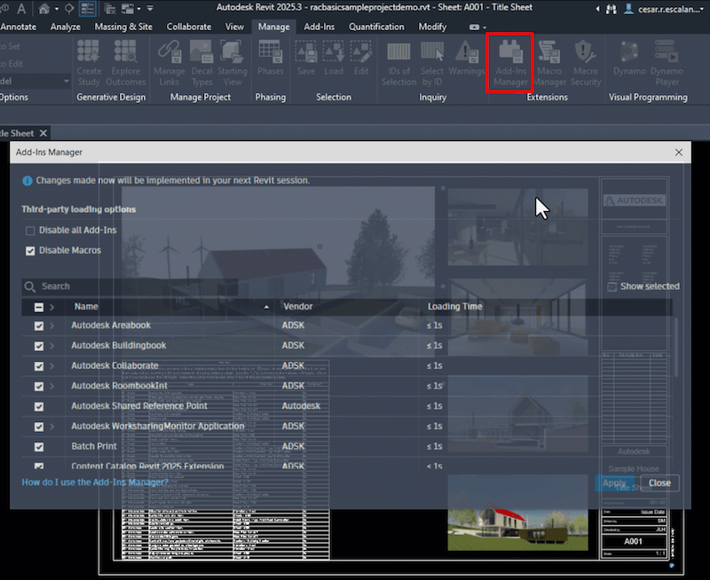

<head>
<meta http-equiv="Content-Type" content="text/html; charset=utf-8">
<link rel="stylesheet" type="text/css" href="bc.css">
<!-- https://highlightjs.org/#usage
<link rel="stylesheet" href="https://cdnjs.cloudflare.com/ajax/libs/highlight.js/11.9.0/styles/default.min.css">

-->

<!-- https://prismjs.com -->
<link href="https://cdn.jsdelivr.net/npm/prismjs@1.29.0/themes/prism.min.css" rel="stylesheet" />

</head>

<!---

- Revit 2025.3
  updated App Manager
  REVIT_2025_3_SDK.msi
  updated SDK page
  https://aps.autodesk.com/developer/overview/revit
  check if the product is out before blogging about it
  https://www.autodesk.com/blogs/aec/2024/10/15/autodesk-revit-2025-3/
  What’s New and Improved in Revit 2025.3

- #AU2024 #Revit API Wish 1 &ndash; turn off annotations for all links in a view
  https://boostyourbim.wordpress.com/2024/10/16/au2024-revit-api-wish-1/

- #AU2024 Wish 2 &ndash; select objects by picking subcategory
  https://boostyourbim.wordpress.com/2024/10/16/au2024-wish-2/

- https://autodesk.slack.com/archives/C016D5HE66T/p1729611101222799
  [Introducing computer use, a new Claude 3.5 Sonnet, and Claude 3.5 Haiku](https://www.anthropic.com/news/3-5-models-and-computer-use)
  two-minute video
  on [Claude | Computer use for automating operations](https://youtu.be/ODaHJzOyVCQ)
  BUILD WITH CLAUDE documentation
  on [computer use (beta)](https://docs.anthropic.com/en/docs/build-with-claude/computer-use)

twitter:

 the @AutodeskRevit #RevitAPI #BIM @DynamoBIM https://thebuildingcoder.typepad.com/blog/2024/10/determine-rvt-version-and-add-data-from-exe.html

&ndash; ...

linkedin:

#BIM #DynamoBIM #AutodeskAPS #Revit #API #IFC #SDK #Autodesk #AEC #adsk

the [Revit API discussion forum](http://forums.autodesk.com/t5/revit-api-forum/bd-p/160) thread

<a href="img/.gif">
Click for animation
</a>

-->

### Revit 2025.3 and AU Wishes

AU is over and Revit 2025.3 has been released:

- [Revit 2025.3](#2)
- [Revit 2025.3 SDK](#3)
- [Boost Your BIM AU API wishes](#4)
- [Claude computer use does stuff](#5)

#### Revit 2025.3

Revit 2025.3 has been released.
An overview of the new features is provided by The Factory
in [what’s new and improved in Revit 2025.3](https://www.autodesk.com/blogs/aec/2024/10/15/autodesk-revit-2025-3/).
Highlights at a glance:

- Productivity enhancements for documentation production
- Performance and user experience improvements, including your UI readability feedback
- Export ceiling grids to IFC
- Modernized UI for load cases and combinations
- Rebar group sets when exporting to IFC
- Duplicate layers for system families
- Add-in manager
- Background PDF export initialization dialog
- In-context spell check
- New updates for Autodesk Insight, including direct data exchange for more automation in AIA2030 reporting
- Recenter room reference lines and room tags

Of special interest to users and developers alike, the updated Add-In Manager enables you to identify all installed add-ins for each version of Revit, simply enable or disable individual add-ins before opening Revit and provides more visibility on critical insights like the load time of each add-in so that you can make easy and informed decisions about which add-ins may be reducing the time for you to get to work in Revit:

#### Revit 2025.3 SDK

<!-- REVIT_2025_3_SDK.msi -->

The Revit SDK has been updated for Revit 2025.3, and the new version is available from
the [Revit developer page](https://aps.autodesk.com/developer/overview/revit).

I compared the Revit 2025 SDK with the new version and created [a list of differing files](doc/2025_3_file_diff.txt).
Note the following new files:

- ./Samples/AnalysisVisualizationFramework/DistanceToSurfaces/CS/
    - Command.cs
    - DistanceToSurfaces.addin
    - DistanceToSurfaces.csproj
    - ReadMe_DistanceToSurfaces.rtf
- ./Samples/ExternalResourceServer/ExternalResourceDBServer/CS/
    - ServerInterfaceExtensionsForRevitLinks.cs
- ./Samples/Massing/DividedSurfaceByIntersects/CS/
    - Command.cs
    - DividedSurfaceByIntersects.addin
    - DividedSurfaceByIntersects.csproj
    - Properties/AssemblyInfo.cs
    - ReadMe_DividedSurfaceByIntersects.rtf
- ./Structural Analysis SDK/Examples/Concrete/CodeCheckingConcreteExample/
    - Concrete/InternalForcesSurface.cs
    - Main/Calculation/SurfaceSection.cs
    - Main/ResultSurfaceElement.cs
    - Server/ServerResultsSurface.cs
    - Utility/ResultInPointSurface.cs

So, we seem to have gained a new external command or two and some other enhancements.

#### Boost Your BIM AU API Wishes

Once again, Harry Mattison of [Boost Your BIM](https://x.com/BoostYourBIM) fulfilled several AU API wishes that yoou might weant to check out:

1. [Turn off annotations for all links in a view](https://boostyourbim.wordpress.com/2024/10/16/au2024-revit-api-wish-1/)
2. [Select objects by picking subcategory](https://boostyourbim.wordpress.com/2024/10/16/au2024-wish-2/)

Many thanks to Harry for sharing these and once again proving that a lot can be achieved with the Revit API.

#### Claude Computer Use Does Stuff

Anthropic announced
[computer use, a new Claude 3.5 Sonnet, and Claude 3.5 Haiku](https://www.anthropic.com/news/3-5-models-and-computer-use).

To understand what this can mean, watch the two-minute video
on [Claude computer use for automating operations](https://youtu.be/ODaHJzOyVCQ):

<iframe width="480" height="270" src="https://www.youtube.com/embed/ODaHJzOyVCQ?si=xCV1TQmyech5AxRp" title="Claude computer use for automating operations" frameborder="0" allow="accelerometer; autoplay; clipboard-write; encrypted-media; gyroscope; picture-in-picture; web-share" referrerpolicy="strict-origin-when-cross-origin" allowfullscreen></iframe>

It is already generating quite a stir in social media and
the [Internet in general](https://duckduckgo.com/?q=claude+computer+use).

For more details, check out the Claude documentation
on [computer use (beta)](https://docs.anthropic.com/en/docs/build-with-claude/computer-use).

